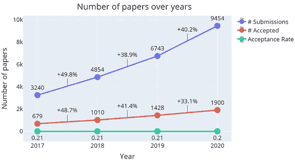
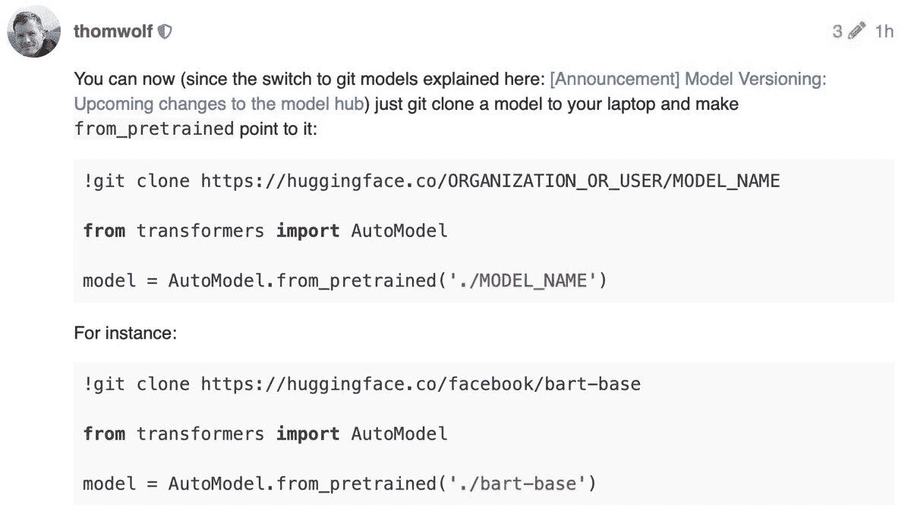

# NLP 密码| 11.15.20

> 原文：<https://pub.towardsai.net/the-nlp-cypher-11-15-20-82ab3d8cc4?source=collection_archive---------1----------------------->

医学的

## 自然语言处理每周时事通讯

## 消亡的语言

欢迎回来！有很多事情要谈。在接下来的几周里，我们有几个会议:EMNLP 2020 将于明天开始，然后我们将于 12 月 6 日开始举办每个人都喜欢的 NeurIPS。

此外，本周我们更新了 NLP 数据库，增加了 25 个新的数据集。亮点包括俄罗斯强力胶和中国线索基准！😎

很难走在 NLP 研究曲线的前面？也许这就是为什么…

神经突

说到 EMNLP 和 NeurIPS。《论文文摘》从这些会议中收集了一些论文，并附上了它们的代码链接。👀

 [## NeurIPS 2020 论文及代码/数据

### 如果你不想错过任何有趣的学术论文，欢迎你注册我们的免费每日论文文摘…

www.paperdigest.org](https://www.paperdigest.org/2020/11/neurips-2020-papers-with-code-data/)  [## 带代码/数据的 EMNLP 2020 论文

### 如果你不想错过任何有趣的学术论文，欢迎你注册我们的免费每日论文文摘…

www.paperdigest.org](https://www.paperdigest.org/2020/11/emnlp-2020-papers-with-code-data/) 

**em NLP 的销售人员**

 [## EMNLP 2020 上的 Salesforce 研究

### 今年是第 24 届自然语言处理中的经验方法年会。

博客.爱因斯坦. ai](https://blog.einstein.ai/salesforce-research-at-emnlp-2020/) 

**斯坦福大学 EMNLP**

 [## 斯坦福人工智能实验室论文和 EMNLP 2020 讲座

### 自然语言处理经验方法会议(EMNLP) 2020 将于 11 月举办…

ai.stanford.edu](https://ai.stanford.edu/blog/emnlp-2020/) 

PyTorch 开发者日会议也在进行:你可以在他们的脸书页面上看到他们的演示:

 [## 登录脸书|脸书

### 登录脸书，开始与你的朋友、家人和你认识的人分享和联系。

www.facebook.com](https://www.facebook.com/1620822758218702/videos/1001102260293556) 

## Dev 仇杀

在前一周的时事通讯中，我们强调了开发者和 YouTube-dl repo 在 Github 上酝酿的皇室之战。长话短说，许多开发者对音乐行业取消 DMCA 的通知不太满意。好吧，现在似乎有人泄露了 GitHub 的源代码(企业版)作为 GitHub 的 DMCA 回购 lol 的承诺。(看起来源代码是 GitHub 开发者在提交之前意外泄露的，所以不是黑客攻击。)

🥶🥶🥶

> “在对官方 GitHub DMCA 库的一次可疑提交中，一个不知名的人上传了机密源代码，利用 GitHub 应用程序中的一个错误冒充 Nat Friedman。”

 [## GitHub 源代码泄露

### 微软对开源到底是怎么想的？使用的代码托管服务的完整源代码…

resynth1943.net](https://resynth1943.net/articles/github-source-code-leak/) 

**👁黑暗之网的故事👁在托尔大陆的某个地方，隐藏着一个纯净形态的 GitHub。总共有大约 8 个回购(到目前为止)。巧合的是，youtube-dl 源代码就在那里:😭(不建议参观 Tor Land)。**

[洋葱](http://githidep2hynhdmutuv7n2tei4iie2c7lyqz5fes3r5zzoxe5dshtxyd.onion/)

哦，在其他新闻中，有一个 ICLR 2021 数据转储与论文评论评级:

 [## iclr2021 _ 回顾 _ 分数

### iclr2021 _ review _ 反驳标题，url，avg_rating，评级神经网络如何外推:从前馈到图形神经…

docs.google.com](https://docs.google.com/spreadsheets/d/1MLlgV82_4K1FJGSjUKm2R8cw5msn4xmrhtnS9FLAS6k/edit#gid=189496698) 

# 盗版:命名实体歧义消除

 [## 盗版:用自我监督的命名实体歧义消除来追踪尾巴

### 命名实体消歧是将知识库中的“字符串”映射到“事物”的过程。你很可能…

ai.stanford.edu](http://ai.stanford.edu/blog/bootleg/) 

"一辆林肯平均每英里耗油多少？"为了让你的智能人工智能模型理解这个问题，它需要精通 NED。为什么？所以不会把汽车和美国总统搞混😁。上面博客中讨论的主要话题，围绕着你的模型对实体的尾部分布了解多少的重要性，因为文本中的大多数实体都是在尾部发现的(很少)，而且经常是看不见的。

> “在[维基数据](https://www.wikidata.org/wiki/Wikidata:Main_Page)，只有 13%的实体拥有维基百科页面作为文本信息的来源。”

作者提出了一个新的模型 **Bootleg** ，它从独特的实体嵌入、类型嵌入和关系嵌入的组合中获得了令人敬畏的性能。它的 SOTA 性能令人印象深刻，博客包含一个基准表，供您检查其性能。此外，Bootleg 可以将实体知识转移到非 NED 任务，从而提高性能。

**GitHub**

 [## 危险搜索/盗版

### Bootleg 是一个自我监督的命名实体消歧(NED)系统，旨在改善实体的消歧

github.com](https://github.com/HazyResearch/bootleg) 

**论文**:[https://arxiv.org/pdf/2010.10363.pdf](https://arxiv.org/pdf/2010.10363.pdf)

# 德塞弗语言

随着时间的推移，信息最终会丢失。这包括那些在我们破译它们的语法之前就已经失传的语言。麻省理工学院 CSAIL 和公司现在正在使用机器学习来复活这些语言。

 [## 使用机器学习翻译失传的语言

### 最近的研究表明，大多数曾经存在过的语言已经不再使用了。数十名死者…

news.mit.edu](https://news.mit.edu/2020/translating-lost-languages-using-machine-learning-1021) 

[**论文**](http://people.csail.mit.edu/j_luo/assets/publications/DecipherUnsegmented.pdf)

# **用于共指消解的 BERT 和 span BERT**

老掉牙但很好。

 [## mandarjoshi90/coref

### 这个存储库包含论文的代码和模型，用于共指解决的 BERT:基线和分析…

github.com](https://github.com/mandarjoshi90/coref) 

# 软件更新

**AllenNLP**

 [## allenai/allennlp 版本 1.2.1

### 向 ModelTestCase.set_up_model 添加了一个可选的种子参数，该参数为 random、numpy 和 torch 设置随机种子…

github.com](https://github.com/allenai/allennlp/releases/tag/v1.2.1) 

**深巴甫洛夫**

 [## DeepPavlov 库 0.13.0 版本

### 最近，我们与您分享了我们在 2020 年第 4 季度和 2021 年的目标。在邮件中，您可以找到我们对…的指导和计划

medium.com](https://medium.com/deeppavlov/deeppavlov-library-0-13-0-release-dcd89a62c2ca) 

**抱紧脸**

现在，您可以直接在 Python 代码中克隆 HF 预训练模型😎

 [## [公告]模型版本控制:即将到来的对模型中心的变更

### 更新:迁移现已完成。TL；下周早些时候，我们将迁移存储在 huggingface.co 上的模型

discuss.huggingface.co](https://discuss.huggingface.co/t/announcement-model-versioning-upcoming-changes-to-the-model-hub/1914) 

**现在……来自约翰·卡马克的短暂清晰时刻…**

解密的

# 回购密码👨‍💻

## 一组最近发布的回购文件引起了我们的关注👁

## BugRepo

> Repo 维护一个错误报告数据集集合，用于重复错误识别、错误定位、错误分类、错误修复时间估计和错误信息挖掘。

 [## logpai/bugrepo

### BugRepo 维护了一个 bug 报告的集合，这些报告是公开的，用于研究目的。错误报告是一个主要的…

github.com](https://github.com/logpai/bugrepo) 

## 伯特流

> 研究表明，将句子嵌入分布转换为平滑高斯分布提高了 BERT 在语义文本相似性任务上的性能。

 [## 李博涵/伯特流

### 这是以下论文的 TensorFlow 实现:关于来自预训练语言模型的句子嵌入…

github.com](https://github.com/bohanli/BERT-flow) 

## 远程竞技场:高效变压器的基准

> 该项目旨在建立基准任务/数据集，以系统的方式评估基于变压器的模型。

 [## 谷歌研究/远程竞技场

### 远程竞技场是对高效变压器模型进行系统评估的努力。该项目旨在…

github.com](https://github.com/google-research/long-range-arena) 

## CommonCrawl 域名

> 从普通爬行抓取的域名语料库，并手动注释以添加单词边界(例如，“普通爬行”到“普通爬行”)。

 [## Google-research-datasets/common-crawl-域名

### 从普通爬行和手动注释的域名语料库添加单词边界(例如“普通爬行”到…

github.com](https://github.com/google-research-datasets/common-crawl-domain-names) 

## 为什么需要十亿字？

 [## 纽约大学-MLL/预训练-学习曲线

### 当你需要数十亿字的预训练数据时，这是论文的存储库。我们使用 jiant1 作为我们的优势…

github.com](https://github.com/nyu-mll/pretraining-learning-curves) 

# 本周数据集:复杂顺序问题回答(CSQA)

# 这是什么？

复杂的顺序问答结合了两个任务:通过对现实大小的数百万个实体进行复杂的推理来回答事实问题，以及通过一系列连贯的问答配对来学习交谈。答案需要逻辑、定量和比较推理以及它们的组合。

# 它在哪里？

 [## 复杂的顺序问题回答:对学习交谈超过链接的问题回答…

### 当与聊天机器人交谈时，人类通常会问许多问题，其中很大一部分可能是…

amritasaha1812.github.io](https://amritasaha1812.github.io/CSQA/) 

> 每周日，我们都会对来自世界各地研究人员的 NLP 新闻和代码进行一次每周综述。
> 
> *如需完整报道，请关注我们的推特:*[*@ Quantum _ Stat*](http://twitter.com/Quantum_Stat)

[量子统计](https://quantumstat.com)