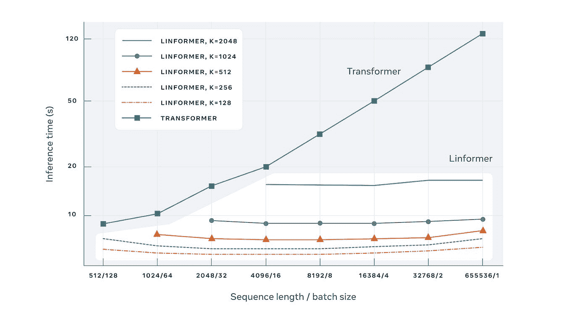
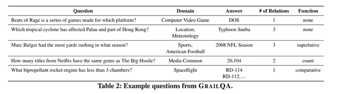

# NLP 密码| 11.22.20

> 原文：<https://pub.towardsai.net/the-nlp-cypher-11-22-20-eea5c8e22826?source=collection_archive---------1----------------------->

波提切利

## 自然语言处理每周时事通讯

## 终极比率规则

欢迎回来！EMNLP 发生在本周👀。成吨的研究出来了，这份时事通讯不会公正地对待世界各地的机构进行的所有伟大的研究。但是首先…

我们将在本周发布对[大坏 NLP 数据库](https://datasets.quantumstat.com/)的更新，也将在感恩节后发布对[超级骗子 NLP 回购](https://notebooks.quantumstat.com/)的大更新。这些更新将通过我们的电子邮件 NL 发送，如果感兴趣，您可以在我们的[主页](https://quantumstat.com)上注册。

一如既往，如果你喜欢这本书，请给它一个👏👏与你的敌人分享。😁

好了，知识图表时间:再一次，迈克尔·高尔金发布了他的令人难以置信的详细综述时事通讯🔥🔥。在 2019 年知识增强语言模型的强劲开局之后，它们似乎继续成为今年的热门。下面是完整博客文章的目录和链接(*警告*其广泛和令人敬畏):

## 总有机碳

1.  [KG-增强语言模型:Empower your Transformer](https://mgalkin.medium.com/knowledge-graphs-in-nlp-emnlp-2020-2f98ec527738#c2ae)
    1.1[自动编码器](https://mgalkin.medium.com/knowledge-graphs-in-nlp-emnlp-2020-2f98ec527738#8811)
    1.2 [自回归](https://mgalkin.medium.com/knowledge-graphs-in-nlp-emnlp-2020-2f98ec527738#a1eb)
2.  [自然语言生成:Datasetlandia 中的新成员](https://mgalkin.medium.com/knowledge-graphs-in-nlp-emnlp-2020-2f98ec527738#f684)
3.  [实体链接:海量多语言](https://mgalkin.medium.com/knowledge-graphs-in-nlp-emnlp-2020-2f98ec527738#f291)
4.  [关系提取:OpenIE 6 和神经提取器](https://mgalkin.medium.com/knowledge-graphs-in-nlp-emnlp-2020-2f98ec527738#39e3)
5.  [KG 表征学习:时间 KGC 和 FB15K-237 的继承者](https://mgalkin.medium.com/knowledge-graphs-in-nlp-emnlp-2020-2f98ec527738#2204)
6.  [ConvAI + KGs:在 OpenDialKG 的肩膀上](https://mgalkin.medium.com/knowledge-graphs-in-nlp-emnlp-2020-2f98ec527738#9128)
7.  [包装完毕](https://mgalkin.medium.com/knowledge-graphs-in-nlp-emnlp-2020-2f98ec527738#c02e)

 [## NLP @ EMNLP 2020 中的知识图表

### NLP 中 KG 相关研究指南，11 月版。

mgalkin.medium.com](https://mgalkin.medium.com/knowledge-graphs-in-nlp-emnlp-2020-2f98ec527738) 

# EMNLP 的高性能 NLP(幻灯片)

谷歌和大学的幻灯片。的研究，该研究探索了缩放 NLP 模型以处理大量文本、成本以及软件和硬件考虑的当前状态。本教程讨论了当前和未来可能的方向，以攻击这些关键领域，提高自然语言处理的效率。

# 图表健身房

最近在 PyTorch Geometric 上发布了一个很棒的库。它允许数据加载的简单配置，并且可以为并行的各种 GNN 配置容易地初始化。如果你觉得几何本身太吓人，这是一个很好的开始库。😎

 [## snap-斯坦福/GraphGym

### GraphGym 是一个设计和评估图形神经网络(GNN)的平台。1.高度模块化的 GNN 管道…

github.com](https://github.com/snap-stanford/GraphGym) 

**论文**:【https://arxiv.org/pdf/2011.08843.pdf】T2

# 凯伯特

这个家伙允许你通过使用 BERT 嵌入从文本中提取关键词和关键短语。这非常简单，进行推理只需要 3 行代码。它相当不错，我在 arXiv 的摘要上测试过，我可能会用它来索引我读过的论文。✌

 [## 马尔滕格尔/凯伯特

### KeyBERT 是一种简单易用的关键字提取技术，它利用 BERT 嵌入来创建关键字和…

github.com](https://github.com/MaartenGr/KeyBERT) 

# 林 former

Linformer 是 FacebookAI(今年夏天推出)的“第一个理论上证明的线性时间转换器”。在坚果壳中，计算量随着输入长度的增加而线性增长，这与典型的转换器不同。👇

这对从业者来说是一个好消息，因为这将允许人们在生产中真正缩放模型，尤其是如果你必须在短时间内进行数百万次计算。显然 FB 已经在生产中运行了。

 [## 脸书如何使用超高效的人工智能模型来检测仇恨言论

### 构建可以分析复杂文本的人工智能不足以保护人们免受有害内容的影响。我们需要能够……

ai.facebook.com](https://ai.facebook.com/blog/how-facebook-uses-super-efficient-ai-models-to-detect-hate-speech?utm_source=hootsuite&utm_medium=&utm_term=&utm_content=&utm_campaign=) 

# 合法搜索引擎

> judyrecords 是互联网上美国法院案件的最大搜索引擎。

虽然搜索引擎拥有庞大的目录，但并不是所有的法院文件都可以在网上获得，因为有些文件只能在特定的法院亲自索取。仍然是一个了不起的壮举。API 什么时候出来？😁

 [## 司法记录

### 编辑描述

www.judyrecords.com](https://www.judyrecords.com/) 

# 播客搜索引擎

对跟踪播客感兴趣:这里有一个 API，允许你通过人、地点或主题搜索播客和剧集的元数据。这个 API 是免费的，只要你每月保持在 2500 个请求以内。

 [## 播客 API:播客搜索和目录 API

### 对于 Listen API，我们有一个透明而简单的定价模型。您可以从免费计划开始，无需输入您的…

www.listennotes.com](https://www.listennotes.com/api/) 

# 表格变压器

这是一篇非常棒的中型文章，重点介绍了如何在表格数据的 transformers 库之上包装多模态 transformers 库！目前该库支持 3 种模型:BERT、DistilBERT 和 RoBERTa。对于训练，你可以使用变形金刚库中的训练器类。

**文档**:[https://multimodal-toolkit . readthedocs . io/en/latest/modules/model . html # module-multimodal _ transformers . model . tabular _ transformers](https://multimodal-toolkit.readthedocs.io/en/latest/modules/model.html#module-multimodal_transformers.model.tabular_transformers)

**博客**:

 [## 如何用 HuggingFace Transformers 合并表格数据

### [Colab] [Github]

medium.com](https://medium.com/georgian-impact-blog/how-to-incorporate-tabular-data-with-huggingface-transformers-b70ac45fcfb4) 

# youtube-dl 回归

Devs 打了一场漂亮的仗。它回来了？

**GitHub 对恢复 youtube-dl 回购的解释:**

 [## 为开发者挺身而出:youtube-dl 回来了 GitHub 博客

### 今天我们恢复了附加信息 youtube-dl，一个在 GitHub 上很受欢迎的项目，在我们收到关于这个项目的…

github.blog](https://github.blog/2020-11-16-standing-up-for-developers-youtube-dl-is-back/) 

# 开放信息抽取技术的系统比较

在 EMNLP 的这篇论文中，作者评估了当前用于进行开放信息提取(OIE)的深度学习系统。也就是说，从文本中自动提取三元组，这样就可以从句子中获得主谓宾。他们为 OIE 探索了不同的训练方案，并比较了现有的 OIE 模型。如果你是这个领域的新手，这是一篇很好的介绍性文章。

**论文**:[https://www.aclweb.org/anthology/2020.emnlp-main.690.pdf](https://www.aclweb.org/anthology/2020.emnlp-main.690.pdf)

# 回购密码👨‍💻

## 一组最近发布的回购文件引起了我们的关注👁

## 诊断

> 该库包含一组模块，可用于分析神经网络的激活，重点是 NLP 架构，如 LSTMs 和变压器

 [## 机器思考/诊断

### 论文:https://arxiv.org/abs/2011.06819 演示:文档:https://diagnnose . readthedocs . io 这个库包含一个…

github.com](https://github.com/i-machine-think/diagnnose) 

## NLPGym

> NLPGym 是一个在 RL 和 NLP 应用之间架起桥梁的工具包。这旨在促进自然语言处理任务上的 DRL 应用的研究和基准测试。

 [## Raj CSCW/NLP-健身房

### NLPGym 是一个在 RL 和 NLP 应用之间架起桥梁的工具包。这旨在促进研究和…

github.com](https://github.com/rajcscw/nlp-gym) 

## 俄语科技文本中的实体识别和关系抽取

> 俄罗斯信息提取任务的数据集和模型

 [## IIS-研究团队/ner-RC-俄语

### 在 GitHub 上创建一个帐户，为 IIS-research-team/ner-RC-Russian 的发展做出贡献。

github.com](https://github.com/iis-research-team/ner-rc-russian) 

## WikiAsp

> WikiAsp 是百科领域中一个多领域、基于方面的摘要数据集。在这项任务中，模型被要求将维基百科文章中引用的参考文献总结成基于方面的摘要。

 [## neulab/wikiasp

### 这个存储库包含了来自论文“WikiAsp:一个用于多领域基于方面的摘要的数据集”的数据集…

github.com](https://github.com/neulab/wikiasp) 

# 本周数据集:GrailQA

## 这是什么？

用于知识库问答(KBQA)的数据集包含 64，331 个众包问题，涉及多达 4 种关系和函数，如计数、比较和最高级。该数据集涵盖了 Freebase Commons 中的所有 86 个域。

## 样品

## 它在哪里？

 [## 强概化问答数据集

### 强概化问答数据集是一种新的大规模、高质量的问答数据集

dki-lab.github.io](https://dki-lab.github.io/GrailQA/) 

**论文**:【https://arxiv.org/pdf/2011.07743.pdf】T2

> 每周日，我们都会对来自世界各地研究人员的 NLP 新闻和代码进行一次每周综述。
> 
> 如需完整报道，请关注我们的推特: [@Quantum_Stat](http://twitter.com/Quantum_Stat)

[量子统计](https://quantumstat.com)