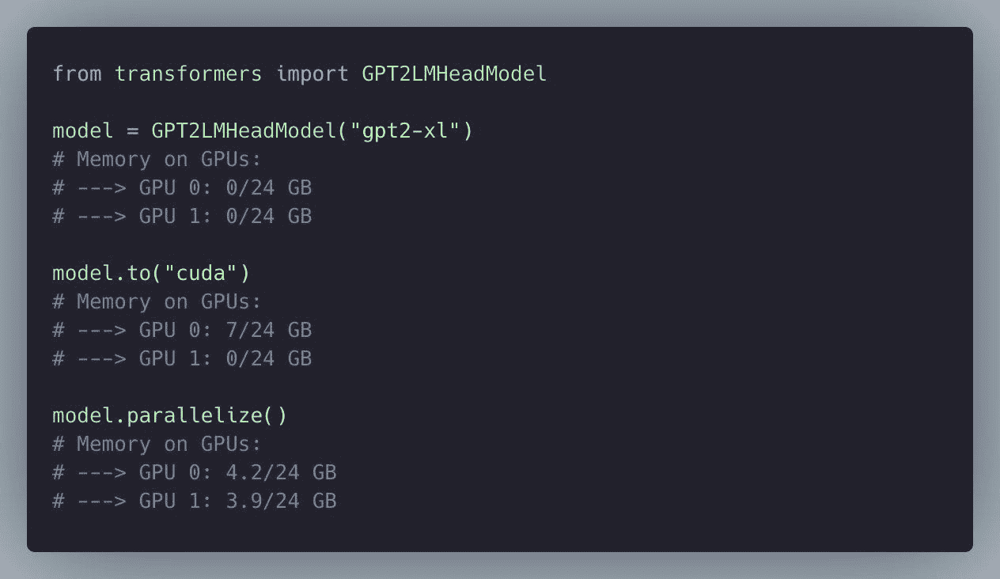
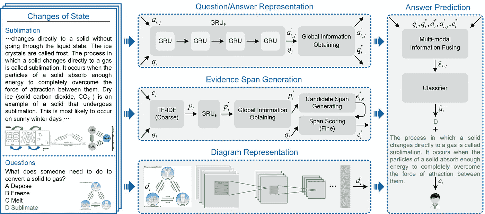
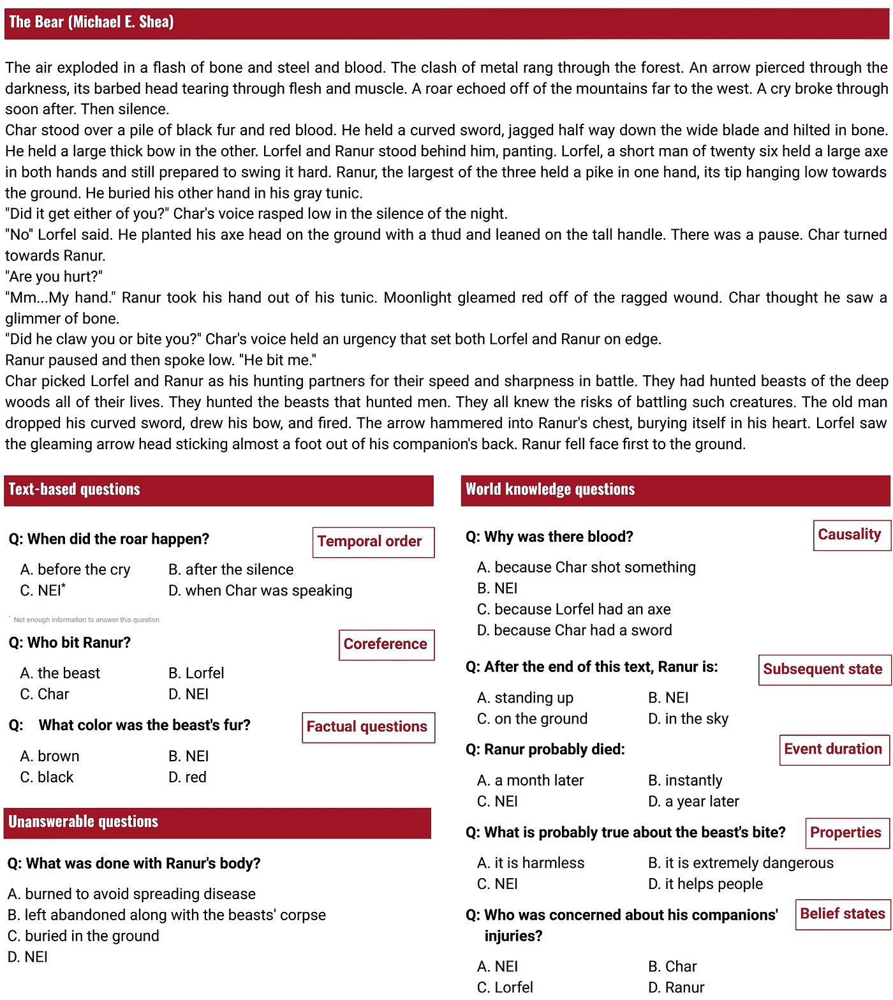

# NLP 密码| 11.29.20

> 原文：<https://pub.towardsai.net/the-nlp-cypher-11-29-20-1a82e2749e2f?source=collection_archive---------3----------------------->

在 [@vboykis](https://twitter.com/vboykis) 的推特上找到的

## 自然语言处理每周时事通讯

## 上帝之手

H ey，欢迎回来，刚度假回来。庆祝感恩节快乐。鉴于假期休息，这是一个缓慢的一周，所以时事通讯会比平时短一点，但这并不意味着我们不能讨论外星人的巨石…

如果你还没听说，在犹他州的一个国家公园里，发现了一块未知的巨石。目前，没有人知道它是从哪里来的。

👽

没多久就有人洗劫了它😭。

👽

## 软件更新

法国南部（French Southern Territories 的缩写）

 [## 发布 tensor flow 2 . 4 . 0-rc3 tensor flow/tensor flow

### tf.distribute 引入了对 Keras 模型异步训练的实验性支持。

github.com](https://github.com/tensorflow/tensorflow/releases/tag/v2.4.0-rc3) 

&

您现在可以在 Transformers 库上并行化模型了！

顺便说一下，本周早些时候，我们向[大坏 NLP 数据库](https://datasets.quantumstat.com/)添加了 50 个新数据集:亮点包括 IndoNLU 基准测试和来自 EMNLP 的几个数据集，感谢 Ulrich Schä fer 和 Neea Rusch 的贡献！

附:如果你喜欢今天的文章，请不要犹豫，给一个👏👏！谢谢大家！

# GNN 图书

嘿，想要一个关于图形神经网络的精彩介绍吗？发现了威廉·哈密顿的“图形表示学习”书的出版前版本。

它写得非常好，用优雅的简单性说明了机器学习中这个新兴的话题。

**目录**

*   第一章:引言和动机[【草稿。2020 年 9 月更新。】](https://www.cs.mcgill.ca/~wlh/grl_book/files/GRL_Book-Chapter_1-Intro.pdf)
*   第 2 章:背景和传统方法[【草案。2020 年 9 月更新。]](https://www.cs.mcgill.ca/~wlh/grl_book/files/GRL_Book-Chapter_2-Background.pdf)

**第一部分:节点嵌入**

*   第三章:邻域重建方法[【草稿。2020 年 9 月更新。】](https://www.cs.mcgill.ca/~wlh/grl_book/files/GRL_Book-Chapter_3-Node_Embeddings.pdf)
*   第 4 章:多关系数据和知识图[【草稿。2020 年 9 月更新。】](https://www.cs.mcgill.ca/~wlh/grl_book/files/GRL_Book-Chapter_4-Knowledge_Graphs.pdf)

**第二部分:图形神经网络**

*   第五章:图形神经网络模型[【草案】。2020 年 9 月更新。]](https://www.cs.mcgill.ca/~wlh/grl_book/files/GRL_Book-Chapter_5-GNNs.pdf)
*   第六章:实践中的图形神经网络。2020 年 9 月更新。]
*   第七章:理论动机[【草稿。2020 年 9 月更新。]](https://www.cs.mcgill.ca/~wlh/grl_book/files/GRL_Book-Chapter_7-GNN_Theory.pdf)

**第三部分:生成图模型**

*   第八章:传统图形生成方法[【草稿】。2020 年 9 月更新。]](https://www.cs.mcgill.ca/~wlh/grl_book/files/GRL_Book-Chapter_8-Traditional_Graph_Generation.pdf)
*   第九章:深度生成模型[【草稿。2020 年 9 月更新。】](https://www.cs.mcgill.ca/~wlh/grl_book/files/GRL_Book-Chapter_9-Deep_Graph_Generation.pdf)

 [## 图形表示学习手册

### 在过去的七年里，图形表示学习领域以令人难以置信的(有时甚至是笨拙的)速度发展

www.cs.mcgill.ca](https://www.cs.mcgill.ca/~wlh/grl_book/) 

PDF [图形表示学习](https://www.cs.mcgill.ca/~wlh/grl_book/files/GRL_Book.pdf)

# 语言解释

语言能帮助我们更好地训练模型吗？

> “同样，我们可以采用输入 x，并提取特征(例如，某些单词的存在)来训练模型，我们可以使用解释来提供附加特征。”

在斯坦福人工智能的一篇新博客文章中，他们讨论了为什么通过语言教授模型知识如此困难的问题，以及从 NLP 角度(即他们讨论了今年早些时候的 ExpBERT 论文)和计算机视觉角度(即他们的视觉感知论文)的可能解决方案

 [## 从语言解释中学习

### 假设你是一个机器学习从业者，你想解决一些分类问题，比如分类…

ai.stanford.edu](http://ai.stanford.edu/blog/learning-from-language/) 

**ExpBERT 在博客中讨论的 GitHub**:

 [## MurtyShikhar/ExpBERT

### 这个库包含代码、脚本、数据和检查点，用于运行以下论文中的实验

github.com](https://github.com/MurtyShikhar/ExpBERT) 

# 数据加载器 PyTorch

来自 PaperSpace 的有趣的博客文章讨论了 PyTorch 中的 DataLoader 类。如果您对使用预先存在的数据集感兴趣，或者甚至对在数字或文本数据上使用您自己的自定义数据集感兴趣，他们在 PyTorch 中总结了这个方便的类。目录:

*   处理数据集
*   PyTorch 中的数据加载
*   深入查看 MNIST 数据集
*   转换和重新调整数据
*   在 PyTorch 中创建自定义数据集

**博客**:

 [## PyTorch | Paperspace 博客中的 DataLoader 类的完整指南

### 在这篇文章中，我们将处理机器学习和深度学习领域最具挑战性的问题之一…

blog.paperspace.com](https://blog.paperspace.com/dataloaders-abstractions-pytorch/) 

# 回购密码👨‍💻

## 一组最近发布的回购文件引起了我们的关注👁

## 神经声学

> 一个使用转换器为带有不同口音的英语语音数据建模的库。

 [## 巴特尔兹/神经声学距离

### 与论文相关的代码:模拟英语语音变化的神经表征。git 克隆…

github.com](https://github.com/Bartelds/neural-acoustic-distance) 

[**演讲口音档案**](http://accent.gmu.edu/)

## **RELVM**

> **Repo 用于在实体和实体出现的上下文(即句子)对上训练潜在变量生成模型。他们的模型可用于执行提及级别和配对级别的分类。**

** [## BenevolentAI/RELVM

### 这个知识库包含了论文“学习生物医学关系的信息表示……

github.com](https://github.com/BenevolentAI/RELVM) 

[**纸**](https://arxiv.org/pdf/2011.09658.pdf)

## GLGE 基准

> 一个新的自然语言生成(NLG)基准，由 8 个语言生成任务组成，包括抽象文本摘要(CNN/DailyMail，Gigaword，XSUM，MSNews)，答案感知问题生成(SQuAD 1.1，MSQG)，对话式问题回答(CoQA)，个性化对话(Personachat)。

 [## 微软/通用电气

### 这个库包含关于通用语言生成评估基准 GLGE 的信息，它由…

github.com](https://github.com/microsoft/glge) 

此外，

> 微软强调了一个新的预训练语言模型，称为 ProphetNet，用于序列到序列学习，具有一个新的自我监督目标，称为未来 n-gram 预测。

 [## 微软/预言网

### 这个报告提供了代码，以重现 ProphetNet 中的实验:预测未来的 N-gram 为…

github.com](https://github.com/microsoft/ProphetNet) 

## OpenTQA

> OPENTQA 是教科书问答任务的开放框架。教科书式的问题回答(TQA)是在一个由大量文章和图表组成的多模态背景下，回答一个图表/非图表问题。

 [## 保持微笑-001/opentqa

### OPENTQA 是一个开放的教科书问题回答框架。

github.com](https://github.com/keep-smile-001/opentqa) 

# 本周数据集:人工智能问答(鹌鹑)

## 这是什么？

QuAIL 包含 15K 多项选择题，文本长度为 300-350 个标记，跨越 4 个领域(新闻、用户故事、小说、博客)。

## 样品

## 它在哪里？

 [## 文本-机器-实验室/鹌鹑

### 这个库包含鹌鹑阅读理解数据集的主要数据和挑战数据。鹌鹑含有 15K…

github.com](https://github.com/text-machine-lab/quail/) 

神话；传奇

> 每周日，我们都会对来自世界各地研究人员的 NLP 新闻和代码进行一次每周综述。
> 
> 如需完整报道，请关注我们的 Twitter: [@Quantum_Stat](http://twitter.com/Quantum_Stat)

[量子统计](https://quantumstat.com)**