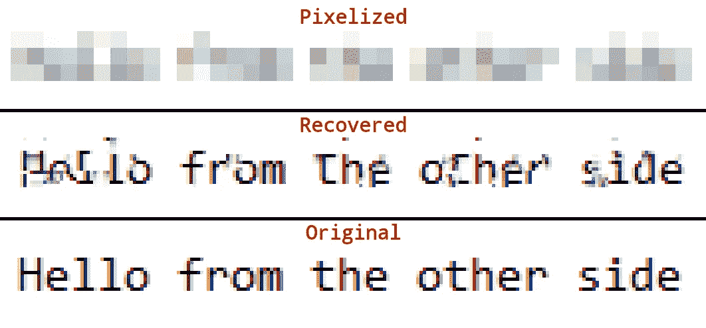
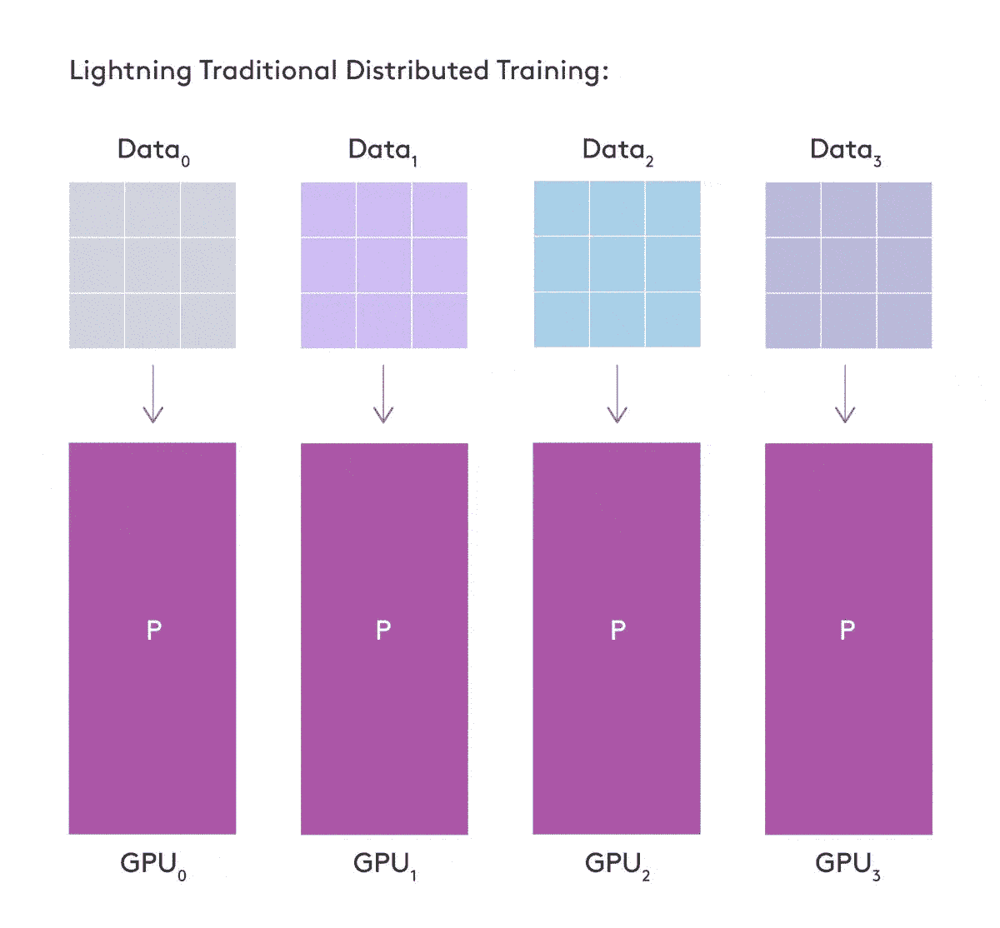
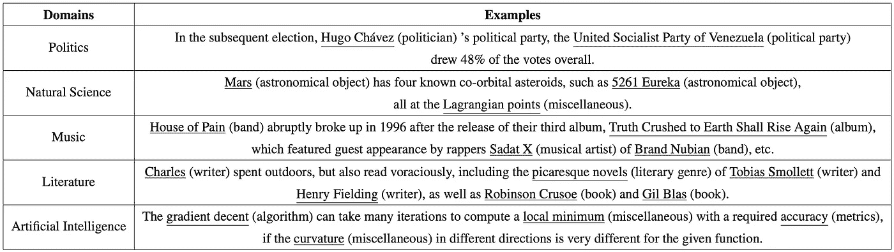

# NLP 密码| 12.13.20

> 原文：<https://pub.towardsai.net/the-nlp-cypher-12-13-20-96758e9cd84b?source=collection_archive---------1----------------------->

士兵在山峡中，与风暴| Vernet

## 自然语言处理每周时事通讯

## 神经炎后遗症

嘿，欢迎回来！一周又一周的会议(NeurIPS)过去了，许多事情已经慢慢进入 NLP 管道。

首先，GPT-3 纸赢得了一个奖杯:

此外，如果您需要赶上进度，这里有一个在 NeurIPS 上找到的以 NLP 为中心的论文列表:

 [## NeurIPS 2020:自然语言处理(NLP)和对话式人工智能的关键研究论文

### 以下是 NeurIPS 2020 上介绍的最有趣的 NLP 和对话式 AI 研究论文。

www.topbots.com](https://www.topbots.com/neurips-2020-nlp-research-papers/) 

## 模糊的秘密

这是 Depix，一个从像素化截图中恢复密码的库。如果你使用像素化来保护敏感信息，你需要一种新的方法。图书馆已经在 GitHub 上积累了 10K 之星😭😭。此外，beurtschipper 的个人资料照片获得了本周头像提名。顺便说一句，这是很棒的工作！(另外，它要求像素化的图像是用线性盒式过滤器创建的)

**GitHub** :

 [## beurtschipper/Depix

### Depix 是一个从像素化的截图中恢复密码的工具。这种实现适用于像素化图像…

github.com](https://github.com/beurtschipper/Depix) 

## 340 密码就此终结

如果你喜欢密码，(除了 NLP 密码😁)十二宫杀手的 340 密码本周被解密👀。作为背景，十二宫杀手是一个冷血的连环杀手，在 60 年代末至 70 年代初横行加利福尼亚，因向当局发送加密信息而闻名。他的第一个密码很早就被解密了，但是臭名昭著的 340 密码一直是个谜(准确的说是 51 年)。迄今...12 月 5 日，被破译的十二宫杀手信息被一小群公民送到了联邦调查局。想知道他们是如何破解的，请看这个:

解密的

# PyTorch 闪电|分片训练

你现在可以通过给你的闪电训练器增加一面旗帜来节省大量的内存。PyTorch Lightning 现在在其库中为那些希望在多个 GPU 上共享培训工作的人提供了这一功能。它们包括一个易于使用的用于训练语言模型的样本(顺便说一句，从 NVIDIAs NeMo library，你可以在[超级骗子 NLP Repo](https://notebooks.quantumstat.com/) 上找到几个笔记本😁)在 WikiText 数据集上。

 [## 介绍 PyTorch 闪电碎片:火车 SOTA 模型，一半的内存

### Lightning 1.1 揭示了分片训练-在多个 GPU 上训练深度学习模型，节省了 50%以上的内存，而没有…

seannaren.medium.com](https://seannaren.medium.com/introducing-pytorch-lightning-sharded-train-sota-models-with-half-the-memory-7bcc8b4484f2) 

如果您想要 Lightning 的技术内容和更多模型并行性:

 [## 多 GPU 培训- PyTorch Lightning 1.1.0 文档

### 为了在不改变代码的情况下在 CPU/GPU/TPU 上进行训练，我们需要建立一些好习惯:)删除任何对。cuda()…

py torch-lightning . readthedocs . io](https://pytorch-lightning.readthedocs.io/en/stable/multi_gpu.html#model-parallelism-beta) 

# 斜坡和期望的故事

在阅读 NeurIPS merch 时发现了这个伟大的资源。它包括视频和幻灯片，都是关于机器学习的数学知识。

1.  概述[视频](https://youtu.be/k42AKAlGQAA)
2.  整合简介[视频](https://youtu.be/Z14sGSf_QSA) [幻灯片](https://mml-book.github.io/neurips2020/02-integration.pdf)
3.  数值积分[视频](https://youtu.be/VTu4dJIIidU)幻灯片
4.  蒙特卡罗积分[视频](https://youtu.be/SErqkJqO2fI) [幻灯片](https://mml-book.github.io/neurips2020/04-monte-carlo.pdf)
5.  标准化流程[视频](https://youtu.be/7TOvhz93G9o) [幻灯片](https://mml-book.github.io/neurips2020/05-normalizing-flows.pdf)
6.  时间序列中的推论[视频](https://youtu.be/N4AgbWrJHc4) [幻灯片](https://mml-book.github.io/neurips2020/06-time-series.pdf)
7.  反向传播和自动微分[视频](https://youtu.be/ZUpEm8iJUbE)幻灯片[幻灯片](https://mml-book.github.io/neurips2020/07-autodiff.pdf)
8.  向前向后算法[视频](https://youtu.be/ujIbJp9uxRk) [幻灯片](https://mml-book.github.io/neurips2020/08-forward-backward.pdf)
9.  隐函数定理[视频](https://youtu.be/3gcGvsbkijk) [幻灯片](https://mml-book.github.io/neurips2020/09-implicit-diff.pdf)
10.  邻接[视频](https://youtu.be/jgcQHLKh55c)幻灯片[的方法](https://mml-book.github.io/neurips2020/10-adjoint.pdf)
11.  拉格朗日法[视频](https://youtu.be/rTFWxoa3u-8)幻灯片[幻灯片](https://mml-book.github.io/neurips2020/11-lagrange.pdf)
12.  随机梯度估计器[视频](https://youtu.be/7wdIu2dNpY8) [幻灯片](https://mml-book.github.io/neurips2020/12-stochastic-gradient.pdf)

 [## 去而复返:斜坡和期望的故事

### 《机器学习的数学》一书的配套网页。版权所有 2020 年由马克彼得戴森罗斯，奥尔多…

mml-book.github.io](https://mml-book.github.io/slopes-expectations.html) 

# MPNet

一个新的微软预训练模型 MPNet，来自 NeurIPS，结合了屏蔽语言建模(又名 BERT 风格)MLM 和置换语言建模 PLM(又名 XLNET 风格)的优点。他们的 GitHub 还包括用于预训练和下游任务的脚本，如 SQuAD 和 Glue benchmark。他们的博客文章提供了一些关于培训目标和基准相对于其他模型的优缺点的背景。(在 HF 的模型轮毂上也可以找到)

 [## MPNet 结合了屏蔽和置换语言建模的优势，用于语言理解…

### 预训练语言模型一直是自然语言处理领域的研究热点。这些模型，如伯特…

www.microsoft.com](https://www.microsoft.com/en-us/research/blog/mpnet-combines-strengths-of-masked-and-permuted-language-modeling-for-language-understanding/?OCID=msr_blog_MPNet_NeurIPS_tw) 

# 图形挖掘| NeurIPS

16 个视频讲座，来自 NeurIPS 的 Google w/r/t 图形挖掘🔥🔥

> 他们强调了基于图的学习和图算法在广泛领域的应用，如检测欺诈和滥用、查询聚类和重复检测、图像和多模态数据分析、尊重隐私的数据挖掘和推荐以及干扰下的实验设计。

 [## 图形挖掘@ NeurIPS

### 谷歌的图形挖掘团队很高兴能够出席 2020 年 NeurIPS 大会。请在星期天加入我们…

gm-neurips-2020.github.io](https://gm-neurips-2020.github.io/) 

# 回购密码👨‍💻

## 一组最近发布的回购文件引起了我们的关注👁

## CTRLSum

> CTRLSum 是一个通用的可控摘要系统，用于在给定关键字或前缀形式的控制标记的情况下处理文本摘要。

您还可以生成现成的文本，它们还包括培训/评估脚本。

 [## 销售力量/控制-总和

### 这是 PyTorch 实现的论文:CTRLsum:走向通用可控的文本摘要

github.com](https://github.com/salesforce/ctrl-sum) 

## 局部变化

> 使用转换器通过服务条款(ToS)数据集进行主题变化检测。

这个回购中描述的“话题改变”是在段落层面，而不是句子层面。

 [## 丹林格/话题变化

### Dennis Aumiller*、Satya Almasian*、Sebastian Lackner 和 Michael Gertz *此存储库包含…

github.com](https://github.com/dennlinger/TopicalChange) 

## UBAR

针对目标导向对话任务的 GPT-2 培训报告。在报告中提到的论文中，它在 MultiWoz 2.0 数据集上针对响应生成、策略优化(act 和响应生成)、端到端建模(信念状态、act 和响应生成)和对话状态跟踪进行了基准测试。

 [## 托尼内莫/UBAR-穆蒂沃兹

### 这是 AAAI 2021 论文“UBAR:实现完全端到端的面向任务的对话系统…

github.com](https://github.com/TonyNemo/UBAR-MultiWOZ) 

## 知识图增强的关系抽取

> 通过联合训练关系提取和知识图链接预测任务来提高关系提取模型的性能。

培训脚本包括:

 [## gstoica27/JRRELP

### 知识图增强的关系提取乔治·斯托伊察、埃马努埃尔·安东尼奥斯·普拉塔尼奥斯和巴纳巴斯·波佐斯·奈瑞普斯…

github.com](https://github.com/gstoica27/JRRELP) 

# 本周数据集:克罗斯纳

一个命名实体识别(NER)数据集，涵盖五个不同的领域(政治、自然科学、音乐、文学和人工智能)。

# 样品

# 它在哪里？

 [## zliucr/CrossNER

### 克罗斯纳:评估跨域命名实体识别(在 AAAI-2021 年接受)[PDF]克罗斯纳是一个完全标记…

github.com](https://github.com/zliucr/CrossNER) 

> 每周日，我们都会对来自世界各地研究人员的 NLP 新闻和代码进行一次每周综述。
> 
> 如需完整报道，请关注我们的 Twitter: [@Quantum_Stat](http://twitter.com/Quantum_Stat)

[量子统计](https://quantumstat.com)