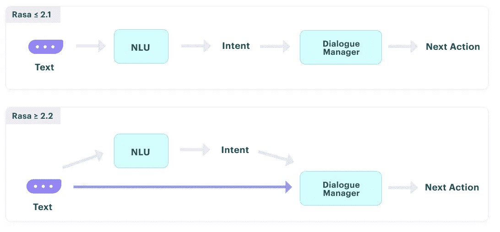

# NLP 密码| 12.20.20

> 原文：<https://pub.towardsai.net/the-nlp-cypher-12-20-20-cfc4b197517c?source=collection_archive---------4----------------------->

## [自然语言处理](https://towardsai.net/p/category/nlp)

## 知识图表，不明飞行物和新的语音模型…哦，改变你的密码！

欢迎回来参加下一周的 NLP 密码游戏。是时候回顾一些奇怪的事情了，也许，甚至是控制一些珠宝。过去一周，美国多家机构遭到大规模黑客攻击，导致每个人都在更新自己的迈克菲防火墙，在这之后，安全领域有很多话题可谈。如果你是一个菜鸟制作工程师，现在又对拥有合适的 opsec 心存疑虑，为什么不从阅读 GitHub 的一个简单的 markdown 文件开始呢。

(仅供参考，如有疑问，请安装 QubesOS🙈)

 [## 哈希邦/书

### 本文档的目标是概述有权访问生产系统的人员必须遵循的严格流程。它…

github.com](https://github.com/hashbang/book/blob/master/content/docs/security/Production_Engineering.md) 

和往常一样，如果你喜欢这个简讯，给它一个👏👏与你的敌人分享。😎

# NeurIPS &知识图表

迈克尔·高尔金带着他的图表新闻综述回来了🔥。大约 5%的会议论文都是图表，所以有很多要讨论。

**他的 TOC:**

1.  [查询嵌入:超越 Query2Box](https://medium.com/swlh/machine-learning-on-knowledge-graphs-neurips-2020-6ef2da78f529#285b)
2.  [KG 嵌入:NAS，📦相对🔮，元学习](https://medium.com/swlh/machine-learning-on-knowledge-graphs-neurips-2020-6ef2da78f529#af2a)
3.  [SPARQL 和组合泛化](https://medium.com/swlh/machine-learning-on-knowledge-graphs-neurips-2020-6ef2da78f529#9c7b)
4.  [标杆管理:OGB、GraphGYM、KeOps](https://medium.com/swlh/machine-learning-on-knowledge-graphs-neurips-2020-6ef2da78f529#b476)
5.  [包装完毕](https://medium.com/swlh/machine-learning-on-knowledge-graphs-neurips-2020-6ef2da78f529#f901)

**博客**:

 [## 知识图谱上的机器学习@ NeurIPS 2020

### NLP 中 KG 相关研究指南，12 月版

medium.com](https://medium.com/swlh/machine-learning-on-knowledge-graphs-neurips-2020-6ef2da78f529) 

## **对于一个企业来说，采取 w/r/t 知识图表的力量**:

 [## 知识图表将如何改变数据管理和业务——创新者

### 11 月下旬，美国联邦药品管理局批准艾的推荐关节炎药物 Baricitnib 作为…

创新者新闻](https://theinnovator.news/how-knowledge-graphs-will-transform-data-management-and-business/) 

# 训练数据提取攻击👀

最近发表了一篇新论文(作者来自每一个主要的大型技术公司)，展示了如何攻击像 GPT-2 这样的语言模型，并通过查询模型一字不差地提取信息，如个人身份信息。🥶!提取的信息来自基于互联网信息搜集的模型训练数据。这是一个大问题，尤其是当您在私有自定义数据集上训练语言模型时。本文讨论了原因和可能的解决方法。

[**论文**](https://arxiv.org/pdf/2012.07805.pdf)

# 给我预定一些数据

看起来 Booking.com 想要一个新的推荐引擎，他们提供了超过 100 万个匿名酒店预订的数据集，让你参与进来。如果你想有机会使用真实世界的数据，这很酷。

以下是训练数据集架构:

**user_id** —用户 id
**入住** —预订入住日期
**退房** —预订退房日期
**affiliate_id** —预订者来自的加盟渠道的匿名 ID(如直营、一些第三方推荐、付费搜索引擎等)。)
**device _ class**—desktop/mobile
**Booker _ Country**—进行预订的国家(匿名)
**hotel_country** —酒店所在国家(匿名)
**city_id** —酒店所在城市的 city_id(匿名)
**utrip_id** —用户行程的唯一标识(一组

> “除了每次旅行的最终预订的 **city_id** 被隐藏并且需要预测之外，eval 数据集类似于火车集。”

 [## 首页| Booking.com WSDM 挑战赛

### ACM WSDM 网络之旅 2021 挑战赛关注多目的地旅行规划问题。本次挑战的目标是…

www.bookingchallenge.com](https://www.bookingchallenge.com/) 

# 不明飞行物文件倾倒在 Archive.org

如果你想开始你的外星人研究，有一个跨越几十年和几个国家的 UFO 文件的不错的转储。显然，内容所有者和媒体出版商之间存在一些版权纠纷，最终导致第三方在野外获得一份拷贝，并将文件上传到 archive.org😭。无论如何，这是一个很好的数据源来尝试你最新的 OCR 算法，或者如果你有兴趣搜索反重力推进技术。

👽:

 [## UFO 文件

### 这很可能是世界上最大的公开的 UFO 文件的收集，从尽可能多的…

that1archive.neocities.org](https://that1archive.neocities.org/subfolder1/ufo-files.html) 

# 空军零号港口

显然，美国空军决定将 DeepMind 的 Zero 移植到 U-2“龙女”间谍飞机的导航/传感器系统上。他们称之为阿图，灵感来自星球大战中的 R2-D2😭。最近，他们进行了首次模拟飞行，展示了人工智能的能力。任务是让阿图在地面上对敌人的导弹发射器进行侦察，而飞行员则寻找空中威胁。

DARPA 就像:

**文章**:

 [## 下面是空军的“大新闻”——汇报

### 近两周以来，空军助理部长(采办、技术和后勤)威尔·罗珀一直在…

thedebrief.org](https://thedebrief.org/here-goes-the-air-forces-big-news/) 

# GitHub 搜索索引更新

GitHub 会将你的回购从代码搜索索引中删除，如果它已经超过一年没有活动的话。那么，你如何保持“活跃”呢？

> “存储库的最近活动意味着它已经提交或者已经出现在搜索结果中。”

 [## 更改代码搜索索引- GitHub Changelog

### 从今天开始，GitHub 代码搜索将只索引在去年有最近活动的存储库…

github.blog](https://github.blog/changelog/2020-12-17-changes-to-code-search-indexing/) 

# 摆脱意图

Alan Nichol 对对话式人工智能和他的 RASA 平台的最新状态发表了意见，这些平台的目标是消除意图，这对于对话式人工智能实现库兹韦尔级别的健壮性是至关重要的。他们目前正在尝试使用二端学习作为 intents 的替代方案。

在 RASA 2.2 及更高版本中，意图将是可选的。

**博客**:

 [## 我们离摆脱意图更近了一步

### 一年前，我写道，是我们摆脱意图的时候了，这似乎触动了许多人的神经…

blog.rasa.com](https://blog.rasa.com/were-a-step-closer-to-getting-rid-of-intents/) 

# 来自博览会的语音转换器、数据集和 WMT20 模型检查点

## XLSR-53:多语言自我监督语音转换器

多语言预培训 wav2vec 2.0 型号

 [## pytorch/fairseq

### wav2vec 2.0 学习未标记数据上的语音表示，如 wav2vec 2.0:一个框架…

github.com](https://github.com/pytorch/fairseq/tree/master/examples/wav2vec) 

## 多语言图书馆数据库

 [## facebookresearch/wav2letter

### 多语言 LibriSpeech (MLS)数据集是一个适用于语音研究的大型多语言语料库。数据集是…

github.com](https://github.com/facebookresearch/wav2letter/tree/master/recipes/mls) 

## WMT 模特出来了

脸书·费尔的 WMT 20 种新闻翻译任务提交模式

 [## pytorch/fairseq

### 用 Python 写的脸书人工智能研究序列对序列工具包。- pytorch/fairseq

github.com](https://github.com/pytorch/fairseq/tree/master/examples/wmt20?utm_source=hootsuite&utm_medium=&utm_term=&utm_content=&utm_campaign=) 

# 回购密码👨‍💻

## 一组最近发布的回购引起了我们的注意👁

## 电的

> 电动是基于能源的模型的 ELECTRA 版本。此外，它能够比语言模型更好地重新排列语音识别 n 最佳列表，并且比屏蔽语言模型快得多。

新的电动模型可在 ELECTRA repo 中找到:

 [## 谷歌研究/electra

### ELECTRA 是一种自我监督的语言表示学习方法。它可以用来预训练变压器…

github.com](https://github.com/google-research/electra) 

## 帕辛卢

> ParsiNLU 是一套全面的波斯语高级 NLP 任务。这套软件包含 6 个不同的关键 NLP 任务--阅读理解、多项选择问答、文本推理、情感分析、查询释义和机器翻译。

 [## persiannlp/parsinlu

### ParsiNLU 是一套全面的波斯语高级 NLP 任务。这套衣服包含 6 个不同的关键自然语言处理…

github.com](https://github.com/persiannlp/parsinlu) 

## 差异修剪

> 在 GLUE 基准测试中，使用差异修剪进行微调的模型可以匹配完全微调基线的性能，而每个任务只需修改预调整模型参数的 0.5%。

 [## dguo98/DiffPruning

### 虽然任务特定的预训练网络微调已导致重大的经验进步，在自然语言处理，大规模的…

github.com](https://github.com/dguo98/DiffPruning) 

## 计划总和

PlanSum，一个利用内容规划的摘要模型

 [## rktamplayo/PlanSum

### AAAI2021]具有内容规划的无监督意见摘要这种 PyTorch 代码被用于…

github.com](https://github.com/rktamplayo/PlanSum) 

## 生物医学实体链接

> Keras 实现了一种用于生物医学实体链接的轻量级神经方法，它只需要 BERT 模型的一小部分参数和少得多的计算资源。

 [## tiger Chen 52/生物医学实体链接

### 这是一个 Keras 实现的论文一个轻量级的神经模型的生物医学实体链接。克隆…

github.com](https://github.com/tigerchen52/Biomedical-Entity-Linking) 

## LIREx

> LIREx 整合了一个支持基本原理的解释生成器和一个实例选择器，只选择相关的、可信的自然语言解释(NLEs)来扩充 NLI 模型。

 [## zhaoxy92/LIREx

### 这份报告是论文《LIREx:用相关解释增加语言推理》的代码发布，这是…

github.com](https://github.com/zhaoxy92/LIREx) 

## 兰凯

> RankAE 对聊天对话执行摘要，而不使用手动标记的数据。

 [## RowitZou/RankAE

### AAAI-2021 论文:使用面向主题的排序和上下文感知自动编码器的聊天日志无监督摘要…

github.com](https://github.com/RowitZou/RankAE) 

# 本周数据集:阿萨亚尔

## 这是什么？

数据集由从摩洛哥高速公路收集的 1，800 多幅带注释的图像组成。ASAYAR 数据可用于开发和评估交通标志检测以及不同语言的法语或阿拉伯语文本检测。

## 样品

## 它在哪里？

 [## ASAYAR:用于公路交通面板中阿拉伯-拉丁场景文本定位的数据集

### 概述欢迎使用 ASAYAR，这是第一个专门用于拉丁(法语)和阿拉伯语场景文本检测的公共数据集…

vcar.github.io](https://vcar.github.io/ASAYAR/) 

> 每周日，我们都会对来自世界各地研究人员的 NLP 新闻和代码进行一次每周综述。
> 
> 如需完整报道，请关注我们的 Twitter: [@Quantum_Stat](http://twitter.com/Quantum_Stat)

[量子统计](https://quantumstat.com/)