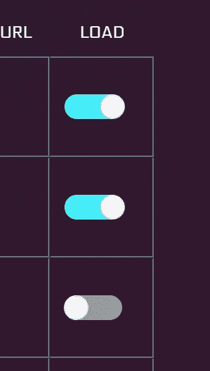
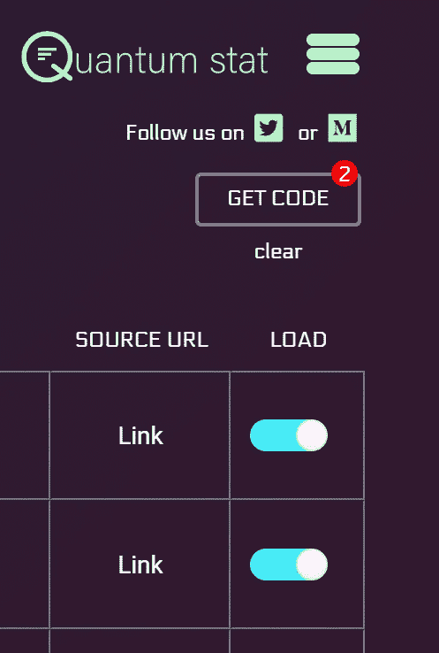
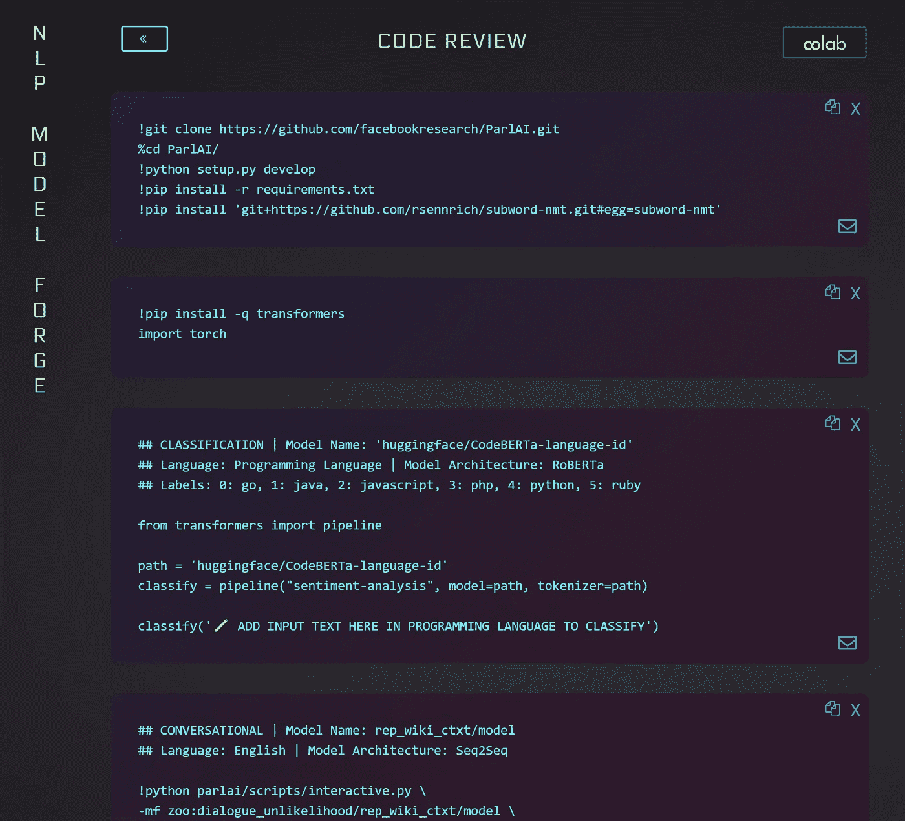

# NLP 模型锻造

> 原文：<https://pub.towardsai.net/the-nlp-model-forge-a46faac7b5b0?source=collection_archive---------2----------------------->

[赫塞·科林斯](https://unsplash.com/@jtc?utm_source=medium&utm_medium=referral)在 [Unsplash](https://unsplash.com?utm_source=medium&utm_medium=referral) 上拍照

## [自然语言处理](https://towardsai.net/p/category/nlp)

## 解锁 1，400 个 NLP 模型的推理

在最新微调的 NLP 模型上简化推理管道是快速原型开发的必要条件。然而，由于有太多不同的模型架构和 NLP 库可供选择，这可能会使原型设计成为一项耗时的任务。因此，我们创建了**NLP 模型锻造**。1，400 个微调模型的数据库/代码生成器，这些模型是由顶级 NLP 研究公司精心策划的，如拥抱脸、脸书(ParlAI)、迪普帕洛夫和 AI2。

Forge 是为您选择的 NLP 模型生成推理代码的目的地。

 [## NLP 模型锻造

### 使用 NLP 中最先进的模型解锁推理

models.quantumstat.com](https://models.quantumstat.com) 

## 熔炉里有什么？

Forge 包含预训练模型的代码，这些代码在从经典文本分类到文本到语音转换和常识推理的几个任务中进行了微调。它允许开发人员一次选择几个模型，其中的一个点击按钮，可以生成代码模板，以准备运行的格式粘贴到 Colab 笔记本中。代码块是用 shell 和 python 编程脚本格式化的，很容易让您开始创建自己的推理 API！**💥**

**当前铁匠铺可用任务**

1.  序列分类|主题分类和情感分析
2.  文本生成
3.  问题回答
4.  令牌分类| NER 和词性
5.  摘要
6.  自然语言推理
7.  对话人工智能
8.  机器翻译
9.  文本到语音转换
10.  常识推理

Forge 最好的特性之一(除了架构、语言和库的多样性之外)是每个模型的元数据描述。不同的任务需要不同的元数据来帮助指导开发人员选择他们的模型。例如，在机器翻译中，我们添加了源语言和目标语言列，对于序列/标记分类/NLI，我们添加了“标签”列来标识模型被训练来推断的标签。

## 好的…那么它是如何工作的呢？

首先，在 Forge 主页中选择一个或多个模型。您可以通过选择“加载”栏中的切换按钮来完成此操作。

当您选择型号时，您会注意到“获取代码”按钮开始与您选择的型号相符。

当您对所选内容满意时，单击“获取代码”按钮。

现在，您已经生成了代码块来对您的模型进行推理！并且它们以编程方式标记有相关的元数据，以提高对每个模型功能的解释。Forge 的伟大之处在于，它已经知道根据您选择的库，它需要哪些导入和依赖项。👇

> *💡*内心独白*💡*
> 
> 我们还突出显示了源语言、添加文本输入的区域和微调解码参数的区域(如果需要)。找表情符号*！*

现在，在这个阶段，你可以做几件事情中的一件。你可以…

✔在网页上编辑代码。(您可以随意删除不需要的代码块或直接在页面中修改代码)

✔点击电子邮件按钮发送代码块给自己或你的朋友。

✔将每个代码块复制到剪贴板，并粘贴到您的本地机器上。

**但是，最强大的选择是点击那个“Colab”按钮。如果你这样做，两件事会同时发生:**

✔ **页面上的所有代码块都将被复制到剪贴板。**

✔ **一个新的 Colab 页面将会打开。**

现在，你所要做的就是在页面上按下“control/command + v ”,所有的代码块就会被粘贴进去！您现在可以运行推理了！

> *💡*内心独白*💡*
> 
> Colab 仍然是 ML 模型原型的强大目的地，因为除了拥有超快的大数据文件下载速度之外，您还可以利用它们的免费 GPU。当模型可能大到 1G 或更大，而您不想在本地下载它们时，这就很方便了。

希望你喜欢穿越铁匠铺！我们希望这个平台不仅能帮助你理解模型架构的变化，还能让你控制自己的推理 API 的开发。

我们将继续改进平台，为您带来世界上最新、最多样化的车型。敬请关注更多更新。如果您在此过程中有任何问题/建议，您可以发送电子邮件至:

quantumstat [dot] com

干杯，

Ricky Costa | Quantum Stat |[www . Quantum Stat . c](http://www.quantumstat.com/)om

**附注:如需更新，您可以关注我们网站上的**[**Twitter**](https://twitter.com/Quantum_Stat)**和我们的时事通讯。**