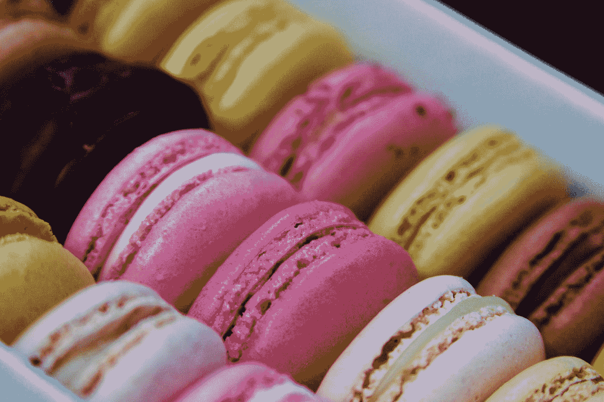
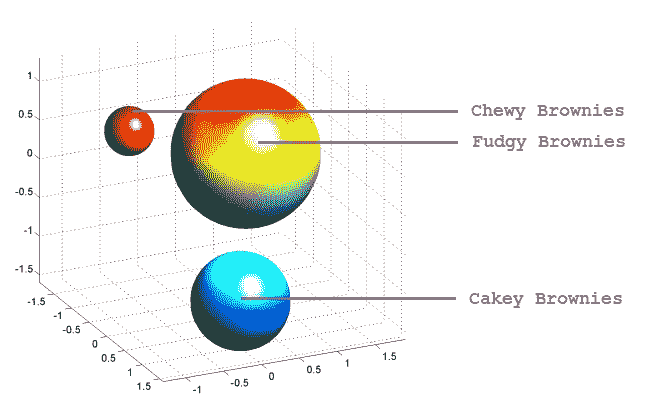
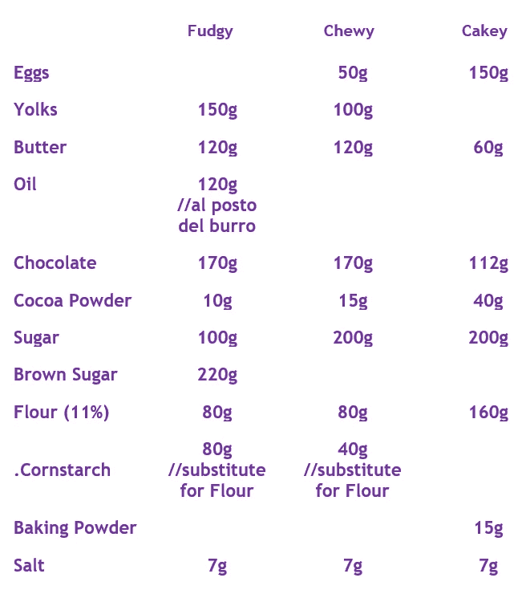
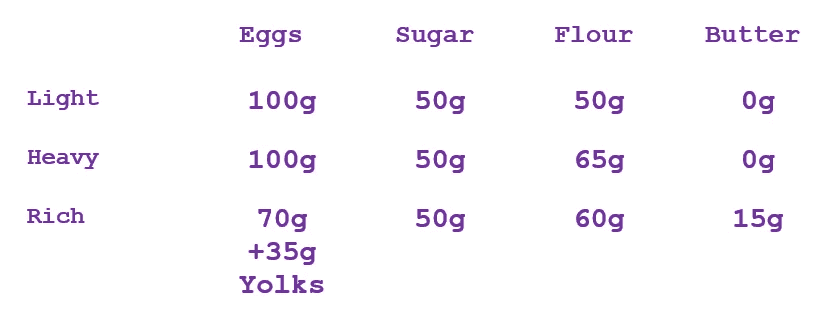
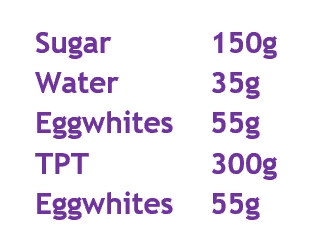
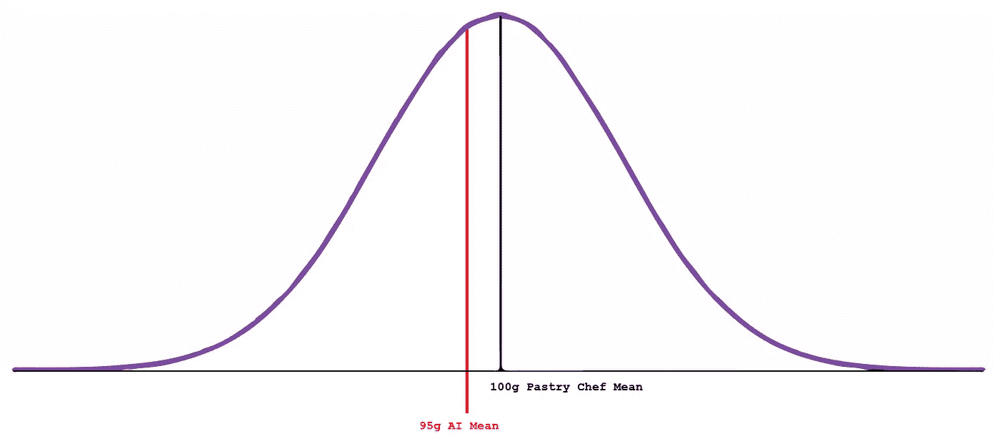

# 人工智能唯一无法破解的领域

> 原文：<https://pub.towardsai.net/the-only-domain-ai-cant-crack-b750e54f74cd?source=collection_archive---------1----------------------->

## [人工智能](https://towardsai.net/p/category/artificial-intelligence)

## 食谱不是一个 AI 能做出来的:数据全错了！

每个人工智能专家都或早或晚地想过开发一种完美的配方来制作饼干、核仁巧克力饼或任何其他类型的甜点。



由[梅勒妮·克鲁兹](https://unsplash.com/@melanie_kreutz?utm_source=medium&utm_medium=referral)在 [Unsplash](https://unsplash.com?utm_source=medium&utm_medium=referral) 上拍摄的照片

让我引导你到一个开发者在任务中会遇到的技术问题。首先，数据很难收集和预处理。

# 标准化的问题

所有的食谱都应该用克来写，而不是用体积，因为体积是一个非常不精确的度量标准。对于每一种成分，我们都需要将它转换成相应的克数，但这种转换不可能 100%准确。

量不仅取决于配料的种类，还取决于配料的使用说明，有时，有太多的解释空间。有时你会发现食谱上写着要用一块黄油；这相当于美国的 115 克，而欧洲只有 100 克。使用汤匙和杯子时，你可能会遇到同样的问题。

## 收集数据

数据收集也需要 API 或 web 抓取算法。要运行人工智能算法，你需要收集足够的数据。不幸的是，我还没有找到一个可以免费下载食谱数据的 API(并进行实验)。网页抓取仍然是一种可能，但就食谱而言，乍一看非常凌乱。

## 我们可以应用什么人工智能算法？

**聚类**绝对是第一候选。我以布朗尼为例。为了发现有多少种核仁巧克力饼(软糖的、耐嚼的、蛋糕的)存在，以及它们成分的变化范围，我们需要大量的统计建模。

我们可以用布朗尼的类别作为标签，将每个食谱包含在一组特征(配料)中。然后，我们可以将数据绘制在多维笛卡尔坐标上，然后估计聚类的大小。对于每个聚类，在定义的空间内的每个食谱可以被分类为定义的布朗尼类。



免责声明:群集不是基于从 MathWorks 检索的真实数据

你在上图中看到的是三个空间，囊括了所有可能的食谱。这个数学空间中的每个配方都是一个点。成千上万的恒星组成了一个巨大的星团，你可以看到它是一个球体。

如果你想知道，如果你选择了一种配料组合，将你的食谱放在聚类之外，会发生什么，这很简单，食谱不会起作用。也许它会变得太液态或太固态，或者太含糖。只有那些定义的域能够表示功能配方。



我制作核仁巧克力饼的平衡公式，是通过对厨师的食谱进行聚类而得到的

到目前为止，这似乎是解决集群问题的一个非常标准的方法，但是这就是事情变得混乱的地方。

# 数据中的根本缺陷

你可以相信一个专家的话:**所有非专业糕点师傅在网络上发布的菜谱都是错的！**

这一严厉声明的原因是基于有经验的糕点师和普通人使用的系统之间存在的差距，他们都决定公布食谱。

## 没有数据！

这是主要问题:如果我丢弃互联网上的所有数据，因为这些数据不是由专业人士发明的，我们最终只会得到数量微不足道的食谱(至少是我们可以收集的食谱)，这些食谱无法向我们讲述糕点厨师使用的功能，至少是使用人工智能。因为每个糕点师都使用一个函数来创建一个食谱，如果我在相同的函数(相同甜点的不同食谱)上使用不同点的插值，我可以导出一个独特的函数，与糕点师使用的相同。从技术上来说，这不是通过使用人工智能获得的。

# 如何制作食谱:专业的方法

食谱不是从零开始或通过尝试发明的。这是无可争议的。至少在烘焙领域，当创造一个食谱时，有几个规则必须遵守。

## 一个例子:基因蛋糕


由[德瓦·威廉森](https://unsplash.com/@biglaughkitchen?utm_source=medium&utm_medium=referral)在 [Unsplash](https://unsplash.com?utm_source=medium&utm_medium=referral) 上拍摄的照片

糕点的基础之一叫做 Genoise。这种蛋糕是热那亚的糕点师在拜访一位著名的西班牙侯爵夫人时偶然发现的。不幸的是，在匆忙中，他惊慌失措，把蛋包了起来，发现了所谓的 Genoise。



意大利糕点师莱昂纳多·迪·卡洛负责制作 Genoise 蛋糕

糕点师，尽管他们很喜欢声称自己拥有非人的创造力，却用这些数字作为基础(用他们自己的方程组来确定每个聚类的边界)。上面的数字代表了 R⁴笛卡尔坐标系中的特定星团。每个聚类代表一类蛋糕。然而，如果我们设置一个自由度范围，我们可以有属于同一个集群的蛋糕的方差。

```
Ligh_Cake_1: 100g Eggs, 45g Sugar, 55g Flour
Ligh_Cake_2: 90g Eggs, 45g Sugar, 65g Flour
Ligh_Cake_3: 85g Eggs, 55g Sugar, 60g Flour, 5g Butter
Ligh_Cake_4: ...
```

## 没有差异的食谱

也有像羊角面包或马卡龙这样的食谱，配料之间几乎没有差异。自从皮埃尔·爱马仕(Pierre Hermè)定义了马卡龙的分类以来，每位糕点师都使用相同的配方制作马卡龙。



马卡龙食谱

聚类近似和真实配方之间的差距将会最大化，从而导致可怕的结果。

# 结论

用 AI 根据菜谱的数据来做菜谱会是错误的，因为数据本身是近似的，有偏差的。如果我们必须将聚类方法获得的数据与大师们(专业定义的聚类)的食谱进行比较，将不会有匹配。



专业组中黄油克数与轻质蛋糕人工智能估计组数的比较，2 倍比例

相反，使用更简单的统计工具将被证明更有效，因为我们已经有了可以从中推导出所有配方的聚类。