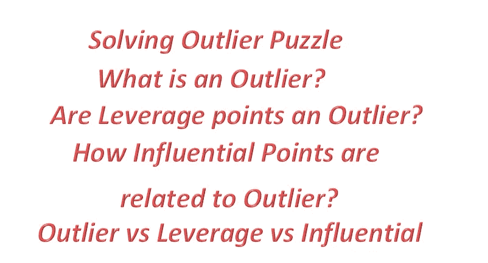
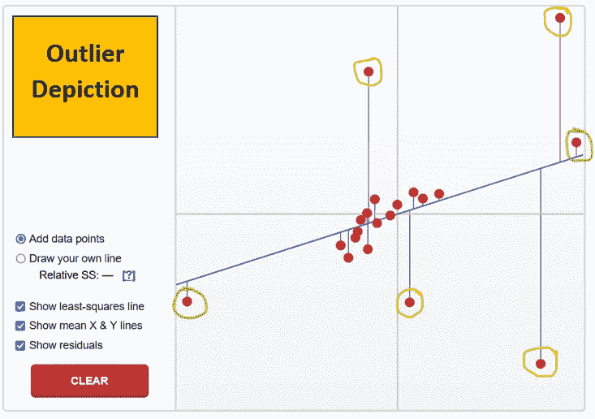
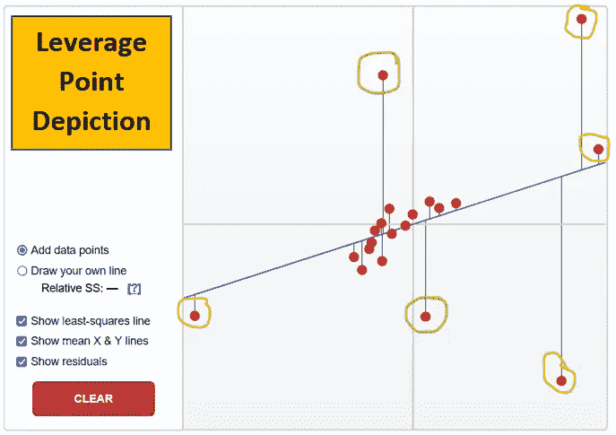
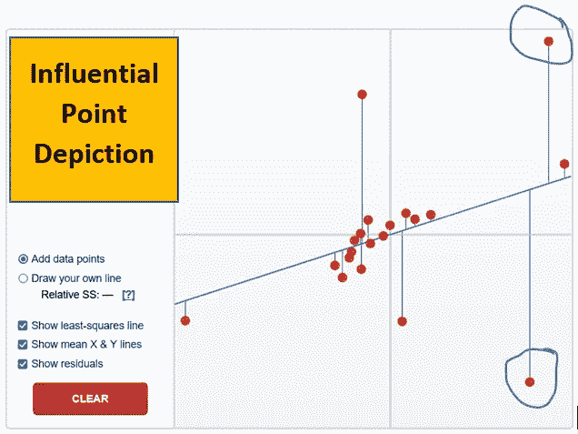
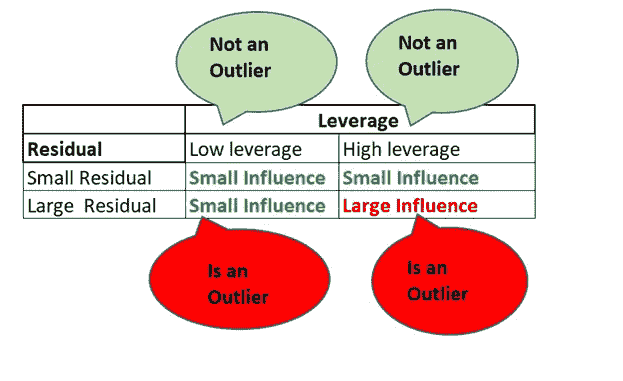

# 离群故事——线性回归中的杠杆和影响点

> 原文：<https://pub.towardsai.net/the-outlier-story-leverage-and-influential-point-in-linear-regression-31517f2ca203?source=collection_archive---------1----------------------->

## [数据科学](https://towardsai.net/p/category/data-science)

图片由 Will Myers 在 unsplash 上提供

为了理解线性回归中的任何异常值和异常观察值，理解线性回归的正式和基本定义是很重要的。

“线性回归是一种对因变量和一个或多个自变量/解释变量之间的关系进行建模的线性方法。它被认为是监督机器学习技术中预测连续值最常用的算法之一”。

图片由 Annie Spratt 在 unsplash 上提供

线性回归方程(描绘拟合的回归线)可以表示为:

**易= β0 + β1X + ε**

其中 **β0** 是截距项，

**β1** 是 Y(因变量/响应变量)和 X(自变量)之间的斜率(也是回归系数)，

**ε** (读作 epsilon)是误差项，表示 y 测量中的误差。

**Yi** 表示 Y 的预测值，是用回归线得到的 Y 值。

**ȳ(y-条)**代表 y 变量即响应变量的数据点的平均值。

**x̅(x-bar)**代表 x 变量即自变量的数据点的平均值。

**残差**从回归线测量 Y 的实际值和 Y 的预测值之间的垂直距离。

换句话说，它测量实际数据点和线上预测点之间的垂直距离。

关于线性回归有了这么多的介绍，让我们转到不寻常的观察。

线性回归中的**异常观测值**通常被认为是**异常值**。

作者图片

**异常值**被定义为远离其余数据的数据点，即关于 x 值或 y 值的异常观察。

与数据集中的其他观测值相比，这种观测值的残差通常较大。这表示 Y(实际值)与模型预测值(即 Yi)相差甚远的观察值。

简而言之，可以说远离拟合回归线的数据点是异常值。

离群值不太适合模型，它们可能会也可能不会对模型产生大的影响。

例如，在下图中，所有用黄色圈出的点都是异常值。

但是绿色圈起来的点呢。它们也远离数据集中的其他观测值，但它们是异常值吗？

不，他们不是严格意义上的离群值。

为什么会这样呢？

是不是所有的离群值都有问题？

是否所有的异常值都会显著影响回归结果？

我们将进一步理解这一点。

图片 1

事实上，当我们进行回归建模时，我们并不总是关心远离其余数据点的少数数据点，直到这些数据点打破模式或不遵循其余数据的一般趋势，即在很大程度上改变斜率(拟合的回归线)和回归系数。

回归系数与拟合回归直线的斜率是一回事。

为了理解有问题的异常值，让我们理解两个更重要的术语。

**1。** **杠杆点**

**2。** **影响点**

我们来正式定义一下杠杆点。

**杠杆点**是一个数据集中的 X 值(独立变量值)与其他观察值的距离。高杠杆点是独立变量的异常值。

因此，杠杆点可能是也可能不是异常值，只取决于 x 值，而不是 y 值。

残差较小的杠杆点通常不会影响斜率，因为它遵循原始数据的线性趋势，不会被视为异常值。

有两种类型的杠杆点。

1.高杠杆点

高杠杆点的性质

a.它会影响拟合的回归线，如果残差很高，有时会非常严重。

b.它可能有也可能没有大量的残余。

2.低杠杆点

低杠杆点的性质

a.它不会对拟合的回归线产生太大的影响。

b.它通常有很高的残留。

例如，在下图中，用绿色圈起来的点是低杠杆点，用黄色圈起来的点是高杠杆点。

图片 2

让我们正式定义影响点。

**影响点**是极大影响回归线斜率的异常值，对回归模型的预测有相对较大的影响。

虽然一个有影响力的点通常具有高杠杆，但高杠杆点不一定是有影响力的点。

例如，在下图中，用蓝色圈出的点是非常有影响力的点。

图片 3

让我把它放在一个表格里，以便清晰地显示出来。

作者图片

现在我想你们都清楚为什么图 1 中用绿色圈起来的点不是异常值了。

这是因为它们虽然远离其余的观测值，但却接近低残差拟合的回归线。因此，它们不会在很大程度上影响斜率和回归系数以及预测，因此不会被标记为异常值。

总结:

**低杠杆，大残差- >小影响**(在一定程度上影响拟合的回归线的斜率)**是一个离群值。**

**高杠杆，小残差- >小影响**(对拟合回归线的斜率影响最小)且**不是异常值。**

**高杠杆、大残差- >大影响**(很大程度上影响斜率、拟合的回归线和进一步的模型预测)和**是异常值。**

可以说，影响较大的异常值最大程度地影响了回归线的斜率和回归模型的预测，在开发回归模型时应该加以注意。

希望这能让你清楚地了解异常值以及线性回归中的杠杆和影响点。

由 Stan B 在 unsplash 上拍摄的图像

你可以在媒体上跟踪我

LinkedIn: [Supriya Ghosh](https://www.linkedin.com/in/supriya-ghosh)

还有推特: [@isupriyaghosh](https://twitter.com/isupriyaghosh)