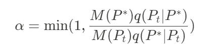
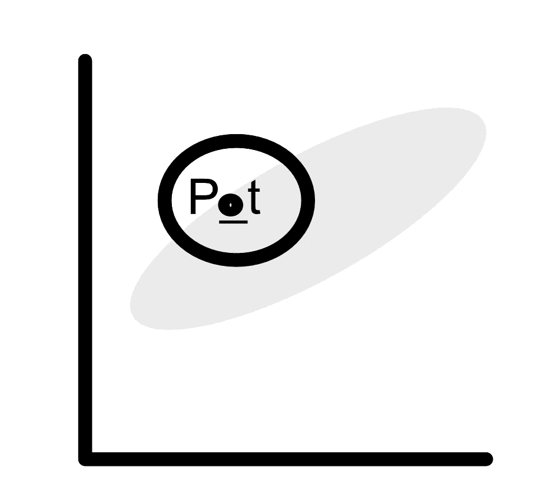
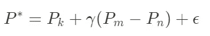
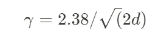
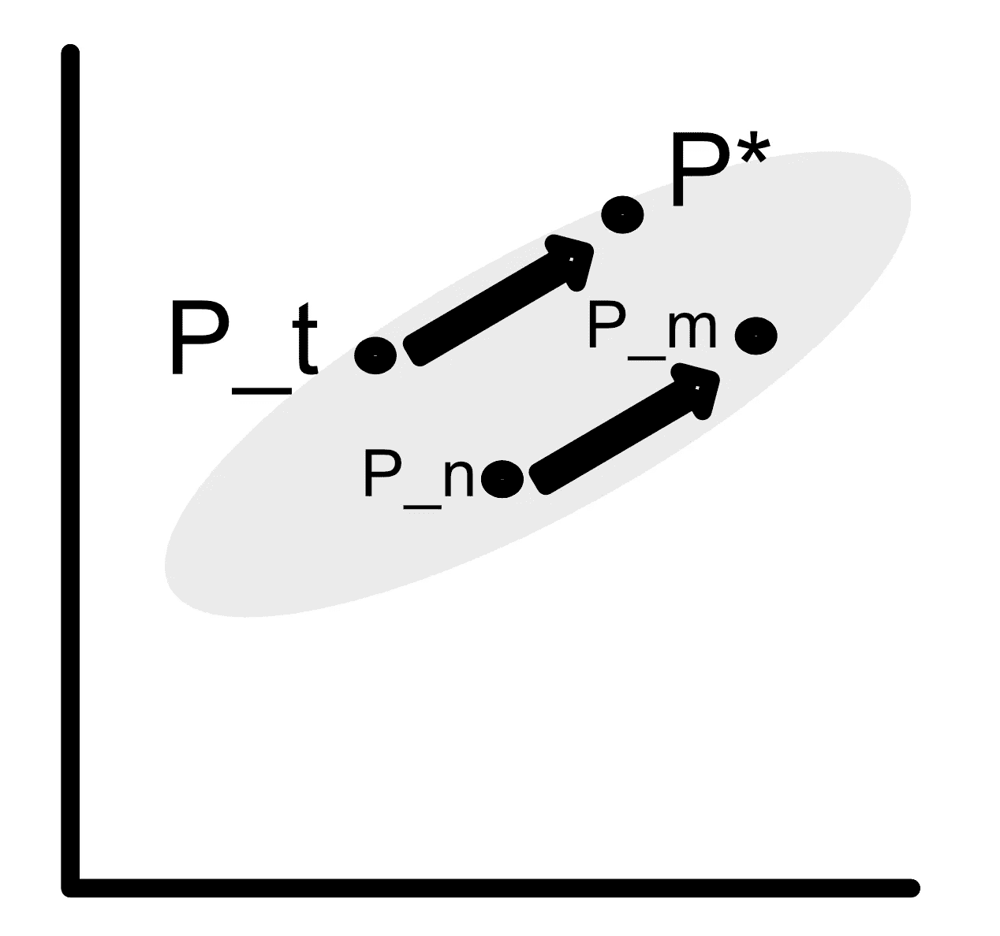
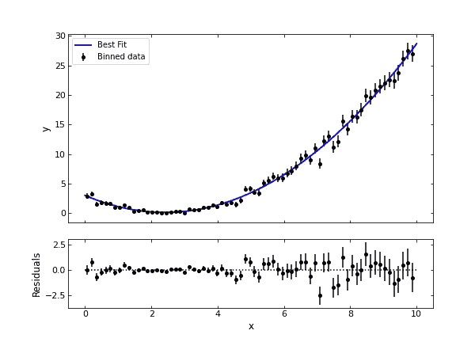

# 你的模型的参数是相关的。现在怎么办？

> 原文：<https://pub.towardsai.net/the-parameters-of-your-model-are-correlated-now-what-3d053f3633f9?source=collection_archive---------2----------------------->

在[稳定扩散](https://huggingface.co/spaces/stabilityai/stable-diffusion)上使用标题作为提示生成的图像

你刚刚得到了一组很好的数据，例如，具有房屋特征的房地产价格。你可以问自己一个问题:我如何根据房子的特点预测它的价格？

想到的第一个模型是以特征为输入的线性模型。假设我们可以访问以下特征:

*   房子的平方英尺
*   卧室数量
*   本地化
*   建造年份

用这样的数据集预测房价的问题已经被深入研究([https://www . ka ggle . com/c/house-prices-advanced-regression-techniques](https://www.kaggle.com/c/house-prices-advanced-regression-techniques))，并且有可能获得精确的模型。我将这个框架作为一个玩具模型来强调参数在一个模型中是多么容易关联。房子的大小和卧室的数量是相关的，但是在估计中，它们中的任何一个都不能真正用来代替另一个，因此，模型参数的估计可能变得困难。特别地，当参数的目标分布未知时，诸如马尔可夫链蒙特卡罗的采样方法可能是低效的。如果这是一个在估计房价时可能不会出现的问题，那么在拟合更复杂的模型时就有必要将它考虑在内。

在这篇文章中，我将描述最常用的抽样方法——马尔可夫链蒙特卡罗(MCMC ),并强调当参数相关时这种方法无效的潜在原因。在第二部分，我将描述一种不受参数间相关性影响的新采样算法，差分进化 MCMC (DE-MCMC)。此外，我将为这两种方法提供一些 Python 代码示例。

# 马尔可夫链蒙特卡罗

MCMC 是一种广泛用于贝叶斯统计的抽样方法，尤其是在估计后验先验时。一句话，MCMC 可以被认为是用于估计目标分布(参数的分布)的随机行走过程。Metropolis-Hastings 是 MCMC 类中使用最多的算法[1]。

让我们 **P** = (p1，p2，…)我们模型的参数向量。然后，该算法挑选参数的初始值 **P1** ，并使用建议分布*P = * K(****【P1】****)*对候选值 **P** *进行采样。一个典型的建议分布通常是以 **P1** 为中心的高斯分布。之后，候选人 **P** *以如下概率被接受:

让我们分解这个公式。*M(****P*****)*代表目标分布。例如，在模型拟合的情况下，目标分布可以是误差函数的指数。使用指数函数可以实现从误差函数到概率分布的转换。*q(****Pt****|****P*****)*代表在 **Pt** 用参数 **P** *评估的提案分布密度。换句话说，它表示如果我们从 **P** *中取样，选择 **Pt** 的可能性有多大。这一项对于算法的平稳性是必要的。

如果建议被接受，那么链的新起点是 **P** *。否则，链条不会移动。这个过程一直持续到达到指定的样本数。该过程可以被解释为收敛到对目标分布进行采样的过程，并且因此估计参数 **P** 。

下面是一个 Python 代码示例，使用包 [mc3](https://mc3.readthedocs.io/en/latest/mcmc_tutorial.html) (根据他们的教程修改)来模拟 MCMC 算法，以拟合二次模型的参数:

现在，如果我们回到一些参数相关的情况。如果建议分布没有明确考虑参数间的相关性，那么许多候选值将不会位于目标分布内。例如，在下图中，灰色云表示两个参数的虚构分布。圆圈代表建议分布。圆的很大一部分位于灰色分布之外。

MCMC 的时间步长。圆圈代表候选分布。(图片由我提供)

这将导致大量的拒绝率，MCMC 将是非常耗时的。因此，使用这种贝叶斯技术来拟合你的模型并不总是合适的。好消息是，有一类算法可以处理高维、高度相关的问题:基于人口的 MCMC。

# 扩散演化马尔可夫链蒙特卡罗

差分进化在 2006 年被引入到 MCMC 算法中[2]。该方法背后的思想如下。它不是为了产生下一步而将噪声添加到当前候选值，而是使用多个交互链来产生候选值。当链具有不同的状态时，它们将被用于为其他链生成新的提议。或者换句话说，一个链的候选值基于其他链的值的某种加权组合。

这些值的组合按以下方式执行。 **P_k** 表示链 k 的当前状态。然后，使用随机选取的两个链的状态之间的差异 **P_m** 和 **P_n** 来生成候选值 **P** *。总之，该过程如下:

其中因子ɣ代表跳跃率。新候选的接受率类似于 MCMC 算法，例如使用 Metropolis-Hastings 规则。使用跳跃率的经验法则是:

其中 d 是参数的维数。DE-MCMC 算法如下图所示:

去 MCMC 步骤示例(图片由我提供)

**为什么 DE-MCMC 在对相关参数进行采样时效率很高？**

不同的 MCMC 链被用于通知一个链中的状态。因此，链之间的相关性(因此样本之间的相关性)被直接用于通知链的状态。使用链之间的差异来生成新的候选值允许以自然的方式考虑参数之间的相关性。此外，链的参数的默认值对于各种问题都很有效，这使得它成为高维问题的良好算法。

通过指定“**demc”**作为 MCMC 的采样算法，可以使用 [MC3](https://mc3.readthedocs.io/en/latest/mcmc_tutorial.html#sampler-algorithm) 包实现 DE-MCMC 算法，其样本代码与前一个类似。这导致先前二次模型的以下拟合:

用 DE-MCMC 拟合二次模型

使用前面的包来执行 MCMC 算法，可以很容易地获得参数的后验分布、成对相关以及更多信息。如果你想更深入地了解它，你可以在[https://mc3 . readthedocs . io/en/latest/MCMC _ tutorial . html # sampler-algorithm](https://mc3.readthedocs.io/en/latest/mcmc_tutorial.html#sampler-algorithm)阅读他们的教程

总之，如果 MCMC 和贝叶斯算法在拟合各种模型的参数方面确实有效，那么高维度和相关性会导致无限的计算时间。这就是进化算法派上用场的时候。利用差分进化 MCMC 算法，不同的链可以相互通知参数相关性，从而使算法的收敛速度更快。所以，下一次当你在你的模型参数之间有关联时，试着把 DE-MCMC 添加到你的贝叶斯工具集中。

# 参考

[1] Nedelman，J.R .书评:“贝叶斯数据分析”，第二版，作者 A. Gelman、J.B. Carlin、H.S. Stern 和 D.B. Rubin Chapman & Hall/CRC，2004 年。*计算统计* **20** ，655–657(2005)。[https://doi.org/10.1007/BF02741321](https://doi.org/10.1007/BF02741321)

[2]布拉克.."遗传算法差分进化的马尔可夫链蒙特卡罗版本:实参数空间的简单贝叶斯计算."*统计与计算*16(2006):239–249。