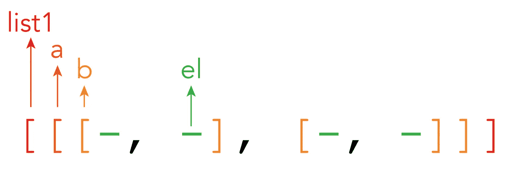
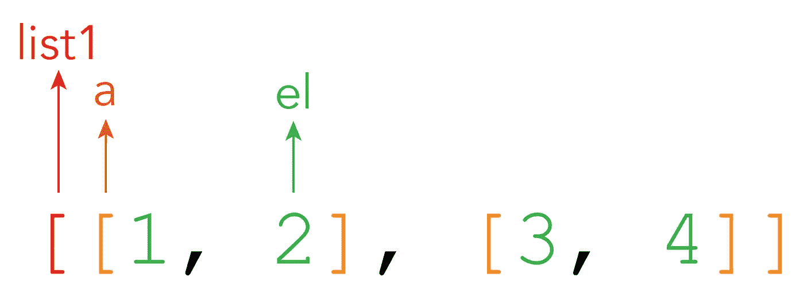
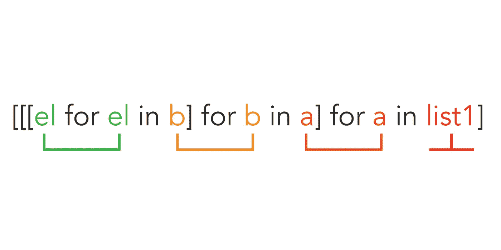

# 列表理解的能力及其在机器学习编程中的相关性

> 原文：<https://pub.towardsai.net/the-power-of-list-comprehensions-and-their-relevance-in-machine-learning-programming-fd0dd6171f61?source=collection_archive---------3----------------------->

## [机器学习](https://towardsai.net/p/category/machine-learning)，[编程](https://towardsai.net/p/category/programming)

## 我对如何正确使用嵌套列表的解释

List comprehensions 是一个编程工具，允许你同时创建和填充列表。然而，我意识到普通程序员并没有像他们应该使用的那样频繁地使用它们。我认为这是因为他们也没有完全理解这背后的力量。

在本文中，我将尝试:

*   向你展示**为什么在一些任务中使用列表理解**，以及当问题足够复杂时，你如何节省数百行代码。
*   向你展示一种在图形工具(我的草图)的帮助下理解和使用 l**is understances**的可理解的方式，就像我通常在我的文章中所做的那样。

## 列表理解的最强大的用途

从我为机器学习模型准备数据(预处理)的过程中发现，它最强大的用途**是允许你编辑嵌套列表，而不用破坏它们并重建它们。**

例如，我们在机器学习中需要面对的一个最常见的问题叫做 one_hot conversions。许多模型只接受二进制编码的数据。

对于[[1，2]，[3，4]]的样本数据集，您需要以二进制 one_hot 编码版本对每个数字进行编码:

```
1 = [1, 0, 0, 0]
2 = [0, 1, 0, 0]
3 = [0, 0, 1, 0]
4 = [0, 0, 0, 1]
```

如果没有列表理解，您将需要分解结构，应用更改，然后重新构建:**没有嵌套列表理解。**

一旦我们知道如何将一个数字转换成 one_hot 格式，我们就可以将该函数应用于列表中的所有元素，而保持其结构不变。

# 理解列表理解



列表理解的每个元素的摘要

我容易理解和使用列表理解的方法很简单，步骤很少:

1.  确定列表中的单个元素(el)
2.  建立列表的外层(列表 1)
3.  命名 list1 和 el 之间的所有其他层。在上面的例子中，有两层:a 和 b

## 例子



在上面的例子中，我有 el 和 list1，它们之间只有一层会调用 a。

## 使用列表理解

所有列表理解都遵循以下结构:



嵌套列表的代码结构

请注意，您必须调用每个层( **el、b 和 a** )两次，与列表图像的顺序相反，而 **list1** 只调用一次。

* * *如果您在没有任何其他实现的情况下使用此代码，该列表将在没有任何更改的情况下重新生成

## 向列表中的每个元素添加一个数字

在制作 one_hot 编码示例之前，让我快速向您展示一些东西，让您了解一个简单的任务:

```
list1 = [[1, 2], [3, 4]][[el+10 for el in a] for a in list1]
\
[[11, 12], [13, 14]]
```

## 把这些数字加在一起

```
list1 = [[1, 2], [3, 4]]def sum_numbers(a):
  return a[0]+a[1][sum_numbers(a) for a in list1]
\
[3, 7]
```

在这种情况下，我对每一个 **a** 都应用了一个函数，因为我想把里面所有的元素都加起来。

## One_hot 编码

我现在将对列表中的每个元素执行 one_hot 编码。它的美妙之处在于**我不需要拆掉重建这个结构。**

```
import numpy as np
list1 = [[1, 2], [3, 4]]#creating set
total_elements = set()
[[total_elements.add(el) for el in a] for a in list1]def encode_number(a):
  vector = np.zeros(len(total_elements))
  vector[a-1] = 1
  return vector#encoded list
[[list(encode_number(el)) for el in a] for a in list1]
\
[[
[1.0, 0.0, 0.0, 0.0], 
[0.0, 1.0, 0.0, 0.0]],  
[[0.0, 0.0, 1.0, 0.0], 
[0.0, 0.0, 0.0, 1.0]]]
```

如你所见，我已经把每个元素都变成了二进制编码的向量。当编辑机器学习模型的数据时，这将被证明是非常有用的，因为大多数神经网络要求数据以非常特定的方式成形(例如，嵌入和 LSTMs)。