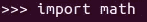
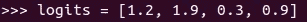
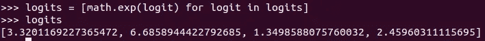
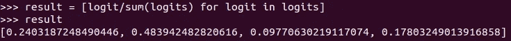
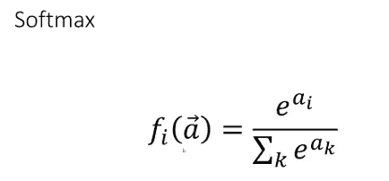

# Softmax 激活功能的问题

> 原文：<https://pub.towardsai.net/the-problem-with-softmax-activation-function-62f01353906f?source=collection_archive---------1----------------------->

## 用 Softmax | [向 AI](https://towardsai.net) 提高预测率

## 如何避免 Softmax 的错误预测

由[何塞·阿尔乔文](https://unsplash.com/@josealjovin?utm_source=unsplash&utm_medium=referral&utm_content=creditCopyText)在 [Unsplash](https://unsplash.com/s/photos/chalkboard?utm_source=unsplash&utm_medium=referral&utm_content=creditCopyText) 上拍摄的照片

Softmax 是目前最常用的激活函数。它通常用于神经网络输出层的任务分类。softmax 实际上做的是将输出(对数)转化为概率。

现在，在我们进入 softmax 的主要问题之前，让我们首先讨论它实际上是如何工作的，并了解什么是逻辑！

这些是由神经网络的最后一层预测的最后的原始分数。这些是我们在激活函数应用到它们之前得到的值。

所以，让我们举个例子-

1.  导入 numpy 或 math 以执行 exp 运算

导入包

2.创建一个 python 列表，并假设这些是输出。

logits 数组

3.取 logits 数组中每个值的指数。

对数指数

4.应用 softmax 函数

softmax 操作

如果我们将上面的概念解码成一个公式，那么它将简单地看起来像这样。

现在，我们来谈谈主要问题。

Softmax 将所有逻辑转换为概率，所有概率的总和将始终为零。这意味着(在图像分类的情况下)即使图像不属于，它仍然会给出一个结果。

让我们通过图像分类的例子来更好地理解这一点。

你已经训练你的神经网络对 MNIST 图像进行分类。如果你不小心给了它一个不属于 MNIST 的图像会怎么样？在这种情况下，神经网络应该给出图像不属于 MNIST 的输出，但是我们的神经网络的输出层有 10 个类，这意味着无论我们给它什么图像，它都会尝试对它进行分类。例如，如果你给它一张大象的图片，它会试着把它归类到 MNIST 最接近的类别。

## **这会导致什么问题？**

假设您为 100 个类部署了一个 CNN 分类器。在测试期间，它给出了一个很好的结果，你部署它。过了一段时间后，你开始抱怨它错误地分类了许多图片。一看，你发现它正在分类的类不被支持。

## **有哪些解决方法？**

我不是专家，但我认为添加一个随机图像的额外类会有所帮助。如果您不想添加新的类，那么在应用 softmax 后检查分数(置信度)可能会有所帮助，即丢弃小于特定阈值的值。甚至可能有其他方法来评估输出。

## **结论**

下一次你做图像分类任务时，想想当图像不属于任何类别时的情况，你将使你的模型为真实世界做好准备，因为它是艰难的。