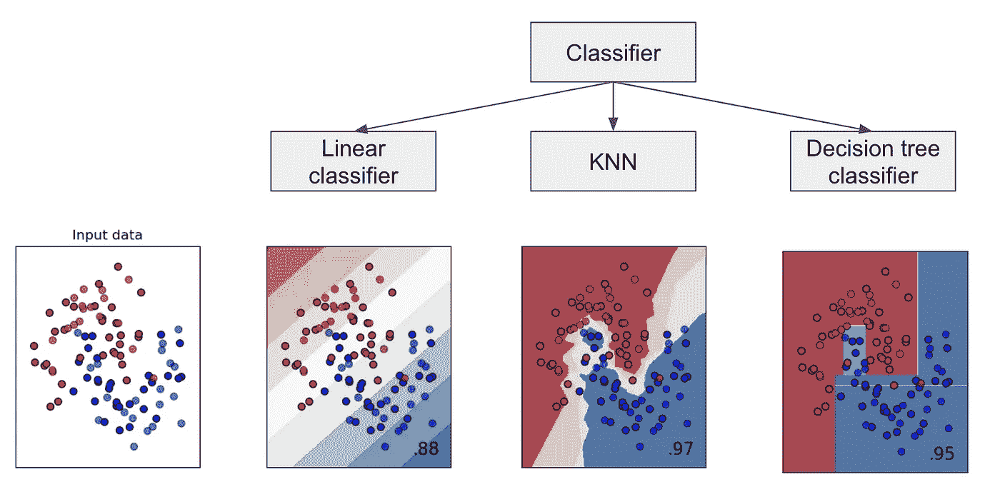
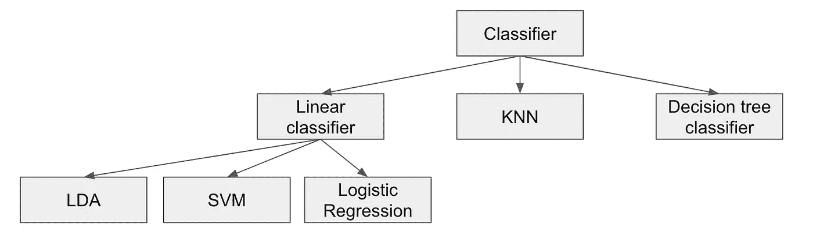
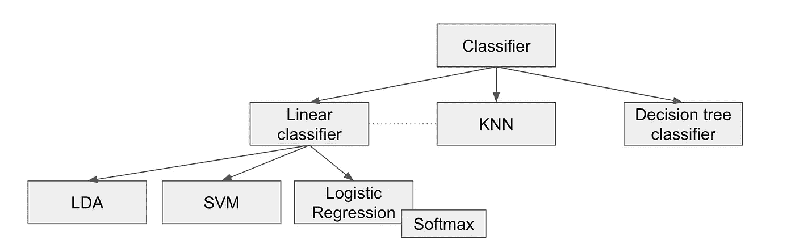
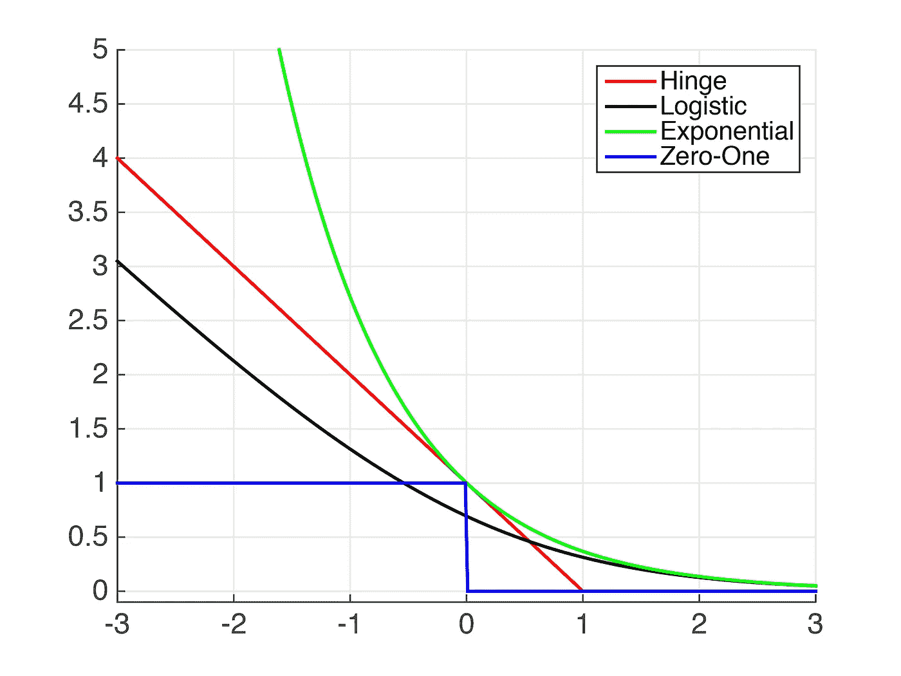
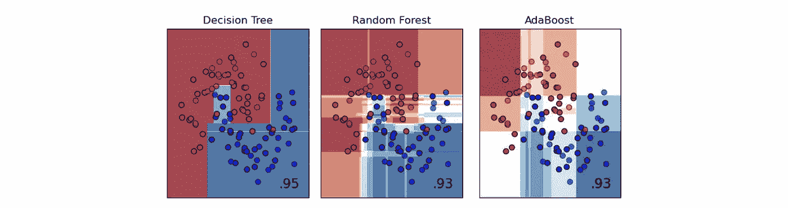
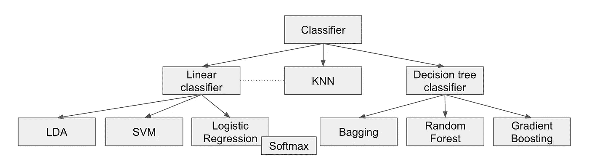
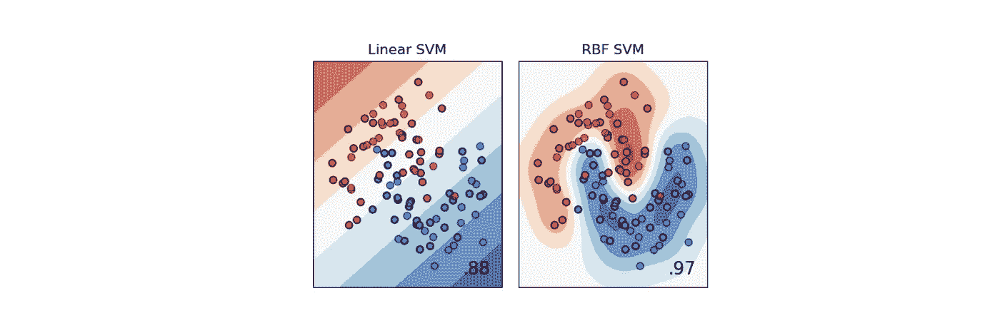
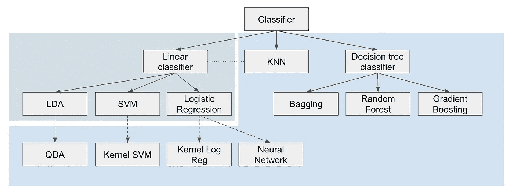

# 金字塔原理在分类算法中的应用

> 原文：<https://pub.towardsai.net/the-pyramid-principle-applied-to-classification-algorithms-b8118e14f405?source=collection_archive---------2----------------------->

## [机器学习](https://towardsai.net/p/category/machine-learning)

## 如何更好地记忆和理解机器学习分类器

明托金字塔原则旨在更好地组织和记忆具有金字塔和等级结构的想法。如果非要回答:有哪些不同的分类算法？你可能会想到，随机森林，KNN，朴素贝叶斯，逻辑回归，等等。但是两者之间有什么关系，又如何给出一个结构化的答案呢？

让我们应用明托金字塔原理。

照片由[菲利普·吉尔达](https://unsplash.com/@filipovsky?utm_source=medium&utm_medium=referral)在 [Unsplash](https://unsplash.com?utm_source=medium&utm_medium=referral) 上拍摄

# 3 种基本方式

3 将数据分类的基本方法有:

*   **线性分类器**具有线性决策边界。或者更准确地说，决策边界是一个超平面。
*   **最近邻居**通过分析 k 个最近观察值(在计算新观察值和所有训练数据之间的距离之后)
*   决策树构造**(超)矩形**通过最小化基尼或熵来重组观察值。

# 线性分类器

构造一个超平面把空间分成 2 个，这就是线性分类器的原理。现在如何构造这个超平面呢？我们有几种不同的方法。

让我们首先考虑二元分类的情况:

*   **逻辑回归**使用逻辑函数将数据转换为 0 类和 1 类。而 0.5 的值会给我们决策边界，这是一个超平面。
*   **SVM** 通过最大化两个类的软边界找到超平面。
*   **线性判别分析**认为两类数据服从多元正态分布。然后利用贝叶斯定理，计算每一类的后验概率。最后，最有可能的类获胜！通过查看空间中每个点的哪个类别获胜，我们得到一个超平面。(有一个条件:协方差矩阵被认为对所有类都是相同的)。

现在进行多类分类

*   对于 SVM，我们通常使用一对休息。所以算法的基本原理是不一样的。
*   对于逻辑回归，我们推广逻辑函数以获得 softmax 函数，然后将分类器称为 softmax 分类器。
*   对于 LDA，通过构造，我们可以通过计算每个类的多元分布来处理多类分类。

SVM 和逻辑回归之间的关系也可以通过它们损失函数的差异来解释:逻辑回归的损失函数为逻辑，SVM 的损失函数为铰链。

## 线性分类器和 KNN

我们还可以通过考虑彼此不同的距离概念来找到所有这些线性分类器和 KNN 之间的关系。对于一个新的观察，KNN 的原理是分析最近邻，我们实际上不需要任何模型。这就是为什么我们说 KNN 是一个基于实例的分类器。

对于其他的，我们考虑一个模型，在线性模型的情况下，这个模型是一个超平面分离器。以及如何对一个新的观察进行分类？我们需要测量新观测值到超平面的距离。

*   对于 **KNN** ，来自训练数据的新观测值的距离就是**欧氏距离**。
*   对于**线性判别分析**，考虑的距离是来自不同类别中心的新观察的 **Mahalanobis 距离**。
*   对于 SVM，我们考虑通过最小化软边所构造的超平面的距离。
*   对于逻辑回归，距离由逻辑函数转换得出。

# 基于树的模型

单个决策树在实践中不是很有效。但是基于这种构造树的原理，我们可以做出很多树。一般决策树中的集成方法。创建森林(由树组成)的不同方式为我们提供了不同的算法:

*   **Bagging** :理论上，我们可以自举——聚合所有的算法，实际上，对于决策树来说确实是这样。
*   **随机森林**:除了装袋，我们还可以随机选择每个节点的变量。而这个原理给了我们 Random Forest(也是商标)。
*   **梯度增强**:梯度增强不是对所有树取平均值，而是通过逐步相加来聚合基于残差构建的树。

# 线性分类器与非线性分类器

通过构造，KNN 和基于树的模型是非线性分类器。如果数据不是线性可分的，它们将比线性分类器更有效。

现在，线性分类器能做什么？可以做几个增强。

*   对于 LDA，协方差矩阵被认为对所有类都是相同的。但是如果我们计算一个不同的协方差矩阵，那么决策边界将不再是线性的。并且我们得到**二次判别分析**。而我们也可以考虑变量是独立的，那么我们得到**(高斯)朴素贝叶斯**。

*   对于 SVM 来说，**内核技巧**用于将数据转换到更高维度的空间，在那里它们将被线性分离。

*   同样的核技巧也可以用于逻辑回归。
*   有了逻辑回归，我们还可以把它组合几次，得到一个**神经网络**。如果你对此不清楚，请阅读[想象神经网络如何从零开始工作](https://towardsdatascience.com/visualize-how-a-neural-network-works-from-scratch-3c04918a278)。

# 分类器的金字塔

最后，我们有了这个金字塔，它是我们在机器学习中用于分类任务的主要分类器。绿色背景下，我们有线性分类器。在蓝色背景中，我们有非线性分类器。

你觉得这个金字塔对你有用吗？如果你认为我应该提到其他算法，请评论。