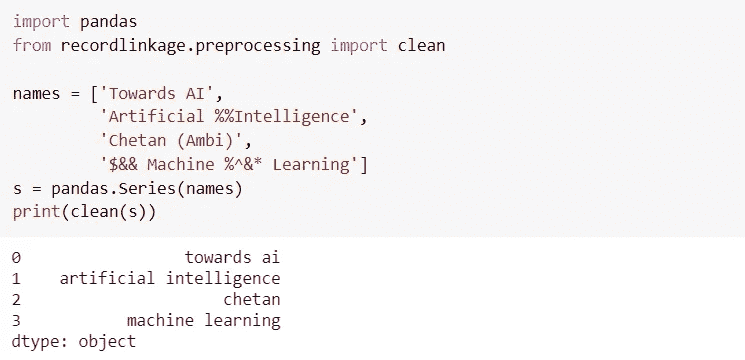
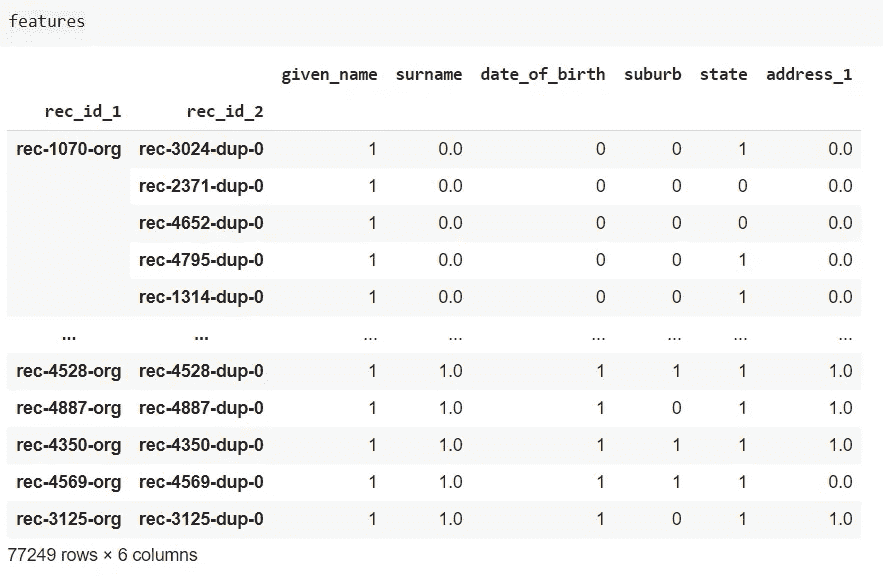
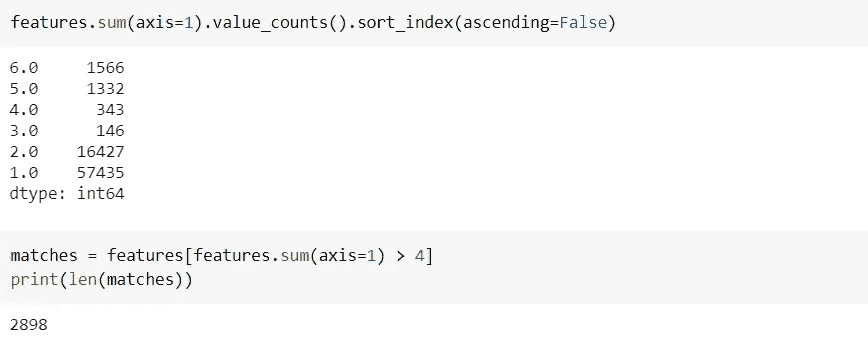
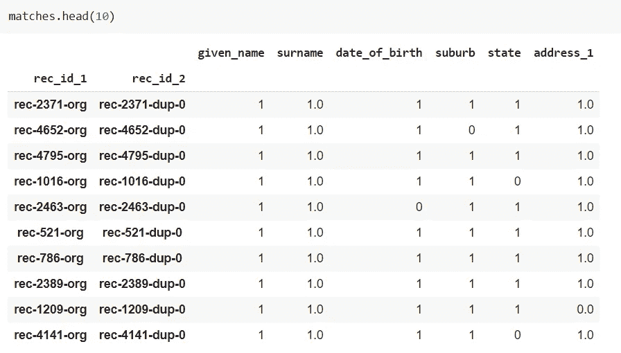
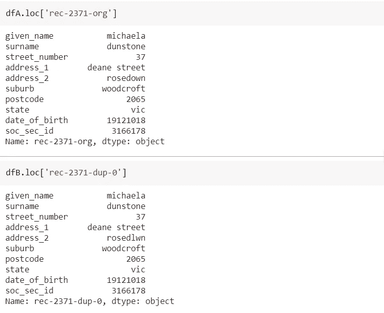

# Python 记录链接工具包

> 原文：<https://pub.towardsai.net/the-python-record-linkage-toolkit-9b1c59fd156a?source=collection_archive---------2----------------------->

## [数据科学](https://towardsai.net/p/category/data-science)，[编程](https://towardsai.net/p/category/programming)

## 用于在数据源之间链接记录的库


来源: [Unsplash](https://unsplash.com/photos/ImcUkZ72oUs)

# 介绍

顾名思义 **Python 记录链接工具包**用于链接同一文件中或不同数据源之间的记录。它提供了许多工具/功能来帮助记录链接和重复数据删除过程。

## 重复数据删除

重复数据删除是从给定数据中消除或删除冗余数据的过程。

## **记录联动**

记录链接是将一个来源的数据与描述同一实体的另一个来源的数据结合起来的过程。例如，我们可以将 file_1 中的记录***Narendra Modi****与 file_2 中的***Narendra Damodardas Modi***进行链接/联接，因为两者都引用同一个实体。*

***考虑一下这个场景**——您从两个不同的来源获得两个文件，其中包含关于同一个实体的信息。假设您的需求是使用这两个文件，并使用公共/相似的列从这两个文件中生成一个报告。如何合并或链接两个文件中的记录？工具箱来拯救你。*

*`recordlinkage`库提供的功能可以大致分为五类。在这篇博客中，我们将只关注预处理、索引和比较。我将在以后的文章中尝试介绍分类和评估。*

*   *预处理*
*   *索引*
*   *比较*
*   *分类*
*   *估价*

*一旦你看完下面的例子，你就会很好地理解什么时候可以使用记录链接工具包。*

# *装置*

```
*pip install recordlinkage*
```

# *使用*

*我们将使用数据集`**load_febrl14**` ，它也是记录链接库附带的数据集之一。*

## *1.预处理*

*顾名思义，如果需要清理文本，如删除空白、无效字符、标准化文本等，就使用这种预处理功能。您可以在下面找到使用预处理的示例代码。有关预处理实用程序的更多高级用法，请参考此处的。*

**

*作者图片*

## *2.索引*

*代码的第一行`recordlinkage.Index()`是一个类，它将用于根据不同的算法创建记录对。目前，集成了三种算法— `full`、`block`和`sortedneighbourhood`。*

***完整** 在下面的例子中，我们使用了`full`索引算法进行索引。然后`indexer.index()`方法将根据选择的算法创建所有可能的记录对。由于我们已经使用了`full`索引，它将创建`n x m`个可能的候选项，可以在接下来的步骤中使用。*

```
*indexer = recordlinkage.Index()
**indexer.full()**
candidates = indexer.index(dfA, dfB)
print("candidate:", len(candidates))
*>> candidate: 25000000**
```

***分块** 在这种方法中，我们选择一列或多列作为比较的索引。这种方法叫做阻塞。因为我们在一个或多个列上达成一致，所以可能的比较次数会少得多，从而减少了计算时间。在下面的例子中，我们使用`given_name`列作为阻塞变量。如您所见，用于比较的可能候选链接的数量显著减少。*

```
*indexer = recordlinkage.Index()
**indexer.block('given_name')**
candidate_links = indexer.index(dfA, dfB)
print("candidate_links:", len(candidate_links))
>>> candidate_links: 77249*
```

## *3.比较*

*一旦我们使用了索引，下一步就是定义如何比较两个文件中的列。Recordlinkage `compare()`方法提供了如何比较`numeric`、`string`、`date`、&、`geo`字段类型的高级用法。例如，您可能希望将两个文件中的“given_name”列作为完全匹配进行比较，将“address”列作为至少 85%匹配，等等。最后，`compute()`方法将计算相似性，结果存储在特征中。*

```
*compare_cl = recordlinkage.Compare()compare_cl.exact('given_name', 'given_name', label='given_name')compare_cl.string('surname', 'surname', method='jarowinkler', threshold=0.85, label='surname')compare_cl.exact('date_of_birth', 'date_of_birth', label='date_of_birth')compare_cl.exact('suburb', 'suburb', label='suburb')compare_cl.exact('state', 'state', label='state')compare_cl.string('address_1', 'address_1', threshold=0.85, label='address_1')features = compare_cl.compute(candidate_links, dfA, dfB)*
```

*   *`**Exact**` 精确比较记录对。如果完全匹配，则相似度为 1，否则为 0。*
*   *`**string**`计算字符串之间的相似度。它使用列表中的不同算法:`jaro`、`jarowinkler`、`levenshtein`、`damerau_levenshtein`、`qgram`或`cosine`。默认为`levenshtein`。*
*   *`**numeric**`用于计算数值之间的相似度。可以从列表中选择不同的算法:`step`、`linear`、`exp`、`gauss`或`squared`。默认为`linear`。*

*接下来，我们需要找出哪些记录属于同一个实体(匹配过程)。下面是比较后的输出。*

**

*作者图片*

*通过简单的逻辑，我们可以筛选出如下相似和不相似的记录。有 6 列/特征，因此过滤匹配记录的一个选项是每行取总和，并根据总和> 3 过滤掉(这意味着至少有 4 列匹配)。同样，sum ≤3 会是非相似记录。*

*下面的代码告诉 dfA 和 dfB 之间有 1566 条记录，其中所有 6 列都匹配/相似，1332 条相似记录，等等。总共有 2898 条记录，其中至少有 4 列匹配。*

**

*作者图片*

*该数据帧显示了 dfA 中的哪个记录与 dfB 中的记录相匹配。*

**

*作者图片*

*下面的屏幕截图显示了上图中第一个匹配记录的 dfA 和 dfB 的单个记录。正如您在这个匹配记录中看到的，所有六列都是匹配的。*

**

*作者图片*

*一旦我们有了相似和不相似的记录，我们就可以实现业务逻辑来处理这些记录以生成报告等。*

# *完整代码*

# *结论*

*`Recordlinkage`是我发现的最好的用于记录链接和重复数据删除的开源库。在本文中，我们研究了记录链接的例子。如果您希望对单个文件进行重复数据删除，请浏览[此](https://recordlinkage.readthedocs.io/en/latest/notebooks/data_deduplication.html#Data-deduplication)链接，并注意它遵循与记录链接几乎相同的流程。*

**阅读更多关于 Python 和数据科学的此类有趣文章，* [***订阅***](https://pythonsimplified.com/) *到我的博客*[***www.pythonsimplified.com***](http://www.pythonsimplified.com)***。*** 你也可以通过 [**LinkedIn**](https://www.linkedin.com/in/chetanambi/) 联系我。*

# *参考*

*[1].[https://recordlinkage.readthedocs.io/en/latest/](https://recordlinkage.readthedocs.io/en/latest/)*

*[2].[https://pbpython.com/record-linking.html](https://pbpython.com/record-linking.html)*