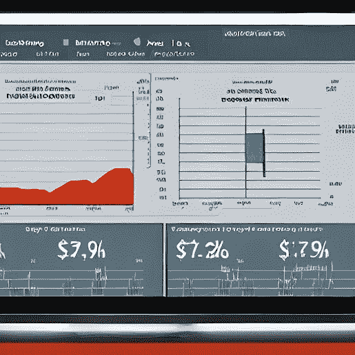

# 当今分析见解与贵公司的相关性:实用指南

> 原文：<https://pub.towardsai.net/the-relevancy-of-analytics-insights-to-your-company-today-a-practical-guide-730f48b02f44?source=collection_archive---------5----------------------->

## ‍Practical 暗示了公司如何设定目标、跟踪影响、投资时间和建立分析能力。

当今的公司在 21 世纪走向繁荣的道路上，面临着持续不断的、突破性的数字和业务挑战风暴。

然而，多个行业都缺乏能够有效利用这一机会的人才。

为了应对这一挑战，当今的公司必须利用数据分析作为其数字和业务战略的基础，因为当今企业的有效分析战略有可能通过基于历史业绩和最佳实践的强大洞察力来推动客户参与和信任。

但是一个组织应该如何设定目标、跟踪影响、投入时间和建立团队呢？今天，我将在这里分享我在惠普、IBM 和沃尔沃集团等大公司的工作经验。但首先，让我们了解一下基本情况:

# 什么是分析？

分析是检查数据以获得可行见解的过程。这是商业智能难题的一个关键部分，但是经常被过度概括。

分析通常是为关键业务决策和洞察力收集和分析数据的起点，但不是商业智能过程的终点。

商业智能是从各种来源提取数据，清理和规范化这些数据，构建分析模型，并将这些见解分发给利益相关者。

分析将数据转化为洞察力，帮助组织做出更好的决策并取得更好的成果。在一个拥有数十亿数据点的世界中，分析可以帮助您理解数据、组织数据，并以可操作的方式交付数据。

一个有效的分析策略将提供您的组织在所有渠道中的全面表现，包括您的网站、社交媒体、电子邮件营销活动等。

# 为什么分析很重要？

分析对于当今的企业至关重要，因为它推动了客户之旅。试图在不了解客户的情况下销售产品或服务的企业努力发展牢固的关系。

客户之旅是复杂的，一路上的每个接触点都是公司建立信任和推动转化的机会。这就是分析发挥作用的地方。

分析客户的旅程将有助于您了解棘手问题、引发购买的因素，以及如何改进产品和服务以增加销售。

此外，分析可以帮助您识别最有价值的客户群，从而洞察您的买家角色。这些信息对于设计有效的营销策略和建立针对客户的相关销售策略至关重要。

# 如何为商业分析计划设定目标

像大多数商业计划一样，分析应该与目标挂钩。因此，审视您的业务目标并将其与您希望通过分析实现的目标联系起来非常重要。

虽然企业应该设定各种各样的目标，但我将其归纳为三个对推动数字分析成功至关重要的目标。

**业务目标:**贵公司的战略目标是什么？分析将如何帮助您实现这些目标？

**客户目标**:你最有价值的客户的目标是什么？分析将如何帮助您实现这些目标？

**组织目标**:作为一个支持业务目标的组织，你的目标是什么？分析将如何帮助您实现这些目标？

这些目标将帮助您将您的分析策略与更大的业务目标保持一致，并为您的分析团队提供一个设定目标的框架。

# 如何建立有效的分析团队

虽然有很多方法可以分割分析这块蛋糕，但我认为只有两种类型的分析对今天的企业很重要:**营销**和**商业分析**。

**营销分析**关注客户旅程，包括人们在哪里点击离开你的网站，他们在销售漏斗中的位置，以及哪些客户正在转化。

因此，**营销分析团队**可以专注于了解您的客户旅程，并通过 SEO/SEM、内容营销、付费广告、电子邮件营销等方式提高您的在线形象。

团队应该专注于通过你的销售漏斗从你的网站获得线索，特别是关注客户在旅程中是如何离开的，或者他们在哪里点击离开你的网站。

**商业分析**关注运营，包括库存管理、现金流、收入和客户服务。

因此，**商业分析团队**应该专注于你的核心数据，包括收入、库存和现金流。这个团队也可以对你的营销分析团队有所帮助，特别是关于你的网站和运营的数据。

# 跟踪业务分析战略的进展

你的分析策略每个月看起来都很不一样。当您努力改进您的分析计划时，您将能够衡量结果，并确定哪些有效，哪些无效。有了这些信息，你可以重复你当前的策略，并随着时间的推移进行调整。

有很多方法可以跟踪你的分析策略的进展。一种方法是跟踪你的核心分析团队每个月关注的活动。您还可以跟踪您正在接收和转换的潜在客户数量、您正在获得的客户数量以及这些客户的保留率。

关键是找到一种方法来跟踪你的进展，这种方法对你的组织有意义，并允许你根据需要进行调整和改变。

# 在数据分析上投入时间，不断迭代

当你努力实现你的商业分析策略时，你会想要花时间提前查看你的核心数据，并测试那些可以被测量的假设。

虽然预先花时间进行适当的分析和设置数据很重要，但您会希望定期查看您的数据并基于新数据测试假设。

当您努力实施您的分析策略时，您需要记住哪些洞察对您的组织最重要，哪些数据最需要收集。确保投资于正确的数据，并定期更新。如果数据对您的组织不重要，就不要收集它。

你收集的每一点数据都在耗费你的金钱。数据分析应该是一个持续的过程，而不仅仅是数据收集工作。这应该是一个每天都在进行的过程。

# 发展包容的文化

数据由每个人生成，而不仅仅是分析团队。为了发展一个有效的分析团队和数据分析的整体文化，你必须确保你的团队成员乐于分享数据。这意味着鼓励所有部门的员工提供可用于您整体分析策略的数据和见解。

要做到这一点，你的团队领导必须对他们正在收集的数据、他们如何使用数据以及如何分发数据保持透明。

他们还必须公开他们如何围绕分析设定目标，团队如何实现这些目标，以及该解决方案使用了哪些数据。

这种透明性与您的团队成员建立了信任，并确保根据对组织最重要的内容从适当的来源收集数据。您可以访问的数据越多，您能够获得的见解就越多，您就能够做出更好的决策。

# 结论

虽然每个企业都有不同的分析策略，但建立一个有效的分析团队至关重要。虽然分析是一个广泛的话题，但如果不专注于正确的事情，你就无法真正擅长分析。

你的分析团队应该专注于你的核心数据，特别是收入、库存和现金流。

你的分析团队也应该关注你的营销分析团队，通过提供可用于运行网站绩效和营销活动的指标数据，帮助他们做得更好。

最后，您的分析团队应该专注于您的业务分析团队，通过提供可用于运营和决策的指标数据来帮助他们做得更好。

# 链接、资源和参考资料

*   如何衡量你的品牌努力的成功？https://better marketing . pub/how-to-measure-the-success of-your-branding-efforts-91 fcda c2805 d
*   如何修补渗漏的销售漏斗——近距离销售博客。【https://blog.close.com/leaky-sales-funnel/ 号
*   仪表板研究者指南。[https://norstat . at/angebot/sample-only/a-researchers-guide-to-dashboards](https://norstat.at/angebot/sample-only/a-researchers-guide-to-dashboards)
*   什么是商业分析|维克森林大学。[https://business . wfu . edu/masters-in-business-analytics/articles/what-is-analytics/](https://business.wfu.edu/masters-in-business-analytics/articles/what-is-analytics/)
*   什么是数据分析| Oracle。[https://www.oracle.com/business-analytics/data-analytics/](https://www.oracle.com/business-analytics/data-analytics/)