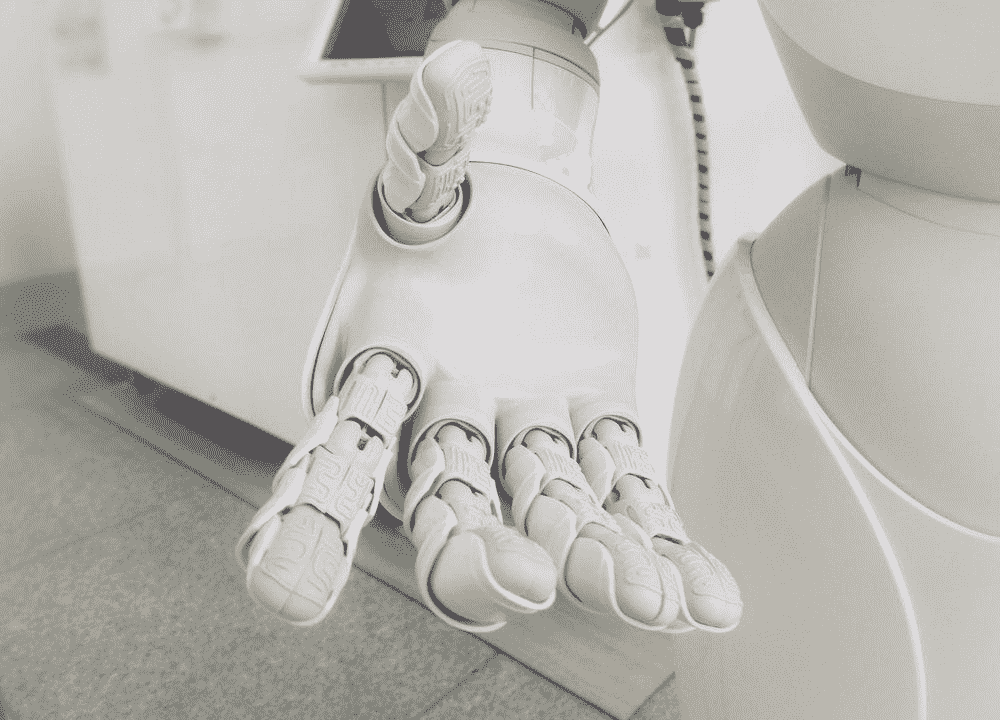

# 人工智能的崛起:2022 年展望

> 原文：<https://pub.towardsai.net/the-rise-of-ai-a-look-at-the-2022-landscape-956e7e3f1839?source=collection_archive---------1----------------------->

## 创新与颠覆:2022 年人工智能的展望

图片由[附身摄影](https://unsplash.com/@possessedphotography)在 unsplash.com 拍摄

十二月为人工智能世界中壮观的一年画上了句号。这篇文章是对一年来令人难以置信的模型和众多人工智能应用的总结。

在过去的五年里，人工智能的研究和应用都出现了爆炸式增长。[Stanford 的报告](https://aiindex.stanford.edu/wp-content/uploads/2022/03/2022-AI-Index-Report_Master.pdf)展示了如何在 10 年内，关于人工智能的科学文章数量翻了一番(并且出版速度似乎在加快)。在[麦肯锡调查](https://www.mckinsey.com/capabilities/quantumblack/our-insights/the-state-of-ai-in-2022-and-a-half-decade-in-review)中，50%的受访者表示他们的组织已经采用了人工智能。此外，投资和专利数年来稳步增长。

这篇文章简要总结了人工智能的创新，已经出现的趋势，以及一些未来的展望。

# 生成人工智能

图片由 [russn_fckr](https://unsplash.com/@russn_fckr) 在 unsplash.com 拍摄

2022 年初， [DALL-E](https://arxiv.org/abs/2102.12092) 凭借简单的文本提示创建图像的能力震惊了世界。看起来这将是很长一段时间内最先进的技术，但在很短的时间内，谷歌发布了两款新机型( [Imagen](https://arxiv.org/pdf/2205.11487.pdf) 、 [Parti](https://arxiv.org/pdf/2206.10789.pdf) )。今天我们可以说真正的游戏规则改变者是稳定扩散。事实上，随着源代码的发布，它已经被集成到了几个应用程序中(甚至 Photoshop 也在上面创建了自己的插件)。

DALL-E 发布后不久，META、Google 和其他公司发布了将文本提示转换成视频的模板。此外，对生殖音乐的研究也在继续。我们可以说，2022 年是生成式 AI 爆发的一年，我们可以期待新的模式(特别是在改进文本到视频和生成式音乐方面)。

 [## 微软的 Museformer:人工智能音乐是新的前沿

### AI 艺术正在爆发，音乐可以是下一个。

medium.com](https://medium.com/mlearning-ai/microsofts-museformer-ai-music-is-the-new-frontier-8dc5cb24459c)  [## 释放生成人工智能的力量:最终列表

### 探索人工智能技术的最新进展，以及它们如何让你受益

medium.com](https://medium.com/mlearning-ai/unleashing-the-power-of-generative-ai-the-definitive-list-13988d422c16) 

# 人工智能和科学

罗马法师在 unsplash.com 拍摄的图片

2022 年，谷歌发布了能够解决科学问题的模型 Minerva。该模型能够回答各种数学、科学、工程和机器学习问题。Meta 也在这个领域进行了投资，与 [Galactica](https://arxiv.org/abs/2211.09085) 合作，我们很可能会看到更多这样的模型。

这些模型能够解决已经解决的问题。提出新的假设要困难得多。因此，DeepMind 的 AlphaTensor 引起了研究人员的关注。DeepMind 的模型通过强化学习取得了成功，五十年来首次提出了一种新的(更快的)矩阵乘法方法。

这项研究不仅仅停留在数学上， [DeepMind 已经与洛桑大学](https://www.nature.com/articles/s41586-021-04301-9.pdf)合作设计了一个模型来帮助稳定核聚变中的等离子体。这表明了人工智能将如何帮助解决复杂的问题，我们可能很快就会有一个人工智能研究助理。

 [## 谷歌的 Minerva，用 AI 解决数学问题

### 定量推理对人类来说很难，对计算机来说也很难。密涅瓦刚刚在解决…

towardsdatascience.com](https://towardsdatascience.com/googles-minerva-solving-math-problems-with-ai-4f0a6aaabaf1)  [## DeepMind 的 AlphaTensor: Deepmind 的 AlphaTensor:正在重塑数学的人工智能

### DeepMind 的最新模型如何能彻底改变数学

pub.towardsai.net](/deepminds-alphatensor-deepmind-s-alphatensor-the-ai-that-is-reinventing-math-4e282e25da35) 

# 人工智能与生物科学

图片由哈尔·盖特伍德在 unsplash.com 拍摄

2021 年，科学家对 AlphaFold2 从其序列预测蛋白质结构的能力感到惊讶。这是一个极其复杂的问题，具有重要的实际意义(医学、药物发现、农业、污染控制等等)。

AlphaFold2 是一个复杂的模型，需要[大量的计算资源](https://towardsdatascience.com/alphafold2-year-1-did-it-change-the-world-499a5a38130a)。META ESMfold 和 Salesforce ( [ProGen2](https://arxiv.org/pdf/2206.13517.pdf) )表明，即使使用语言模型，人们也可以用更少的计算资源在短时间内获得预测。今年和未来几年，我们将看到[这些模型将如何推进研究](https://towardsdatascience.com/alphafold2-year-1-did-it-change-the-world-499a5a38130a)。事实上，今年涌现出许多初创企业，它们致力于从零开始设计蛋白质，利用这些模型改进药物发现，等等(甚至大型制药公司也在投资该领域)。

此外， [OpenCell](https://www.science.org/doi/10.1126/science.abi6983) 展示了人工智能是如何让人们更好地理解蛋白质定位的。另一项有趣的工作是使用机器学习来识别[新的抗菌分子](https://www.science.org/doi/10.1126/science.abg9868)(然而，正如国王学院研究人员所展示的那样，同样的技术可以用于生成[生化武器](https://www.nature.com/articles/s42256-022-00465-9))。所有这些文章都显示了人工智能在生物医学科学中的使用增加(提醒一句，[机器学习并不总是被正确使用](https://towardsdatascience.com/machine-learning-a-friend-or-a-foe-for-science-9c0b421eabd8?gi=3eac64263212&source=your_stories_page-------------------------------------))。

 [## 说生命的语言:AlphaFold2 和公司如何改变生物学

### 人工智能正在重塑生物学研究，并开辟治疗的新领域

towardsdatascience.com](https://towardsdatascience.com/speaking-the-language-of-life-how-alphafold2-and-co-are-changing-biology-97cff7496221)  [## Meta 的 ESM fold:alpahfold 2 的对手

### Meta 使用一种新方法来预测超过 6 亿个蛋白质结构

medium.com](https://medium.com/mlearning-ai/metas-esmfold-the-rival-of-alpahfold2-2223b67f6021) 

# 电子游戏中人工智能应用的新阶段。

图片由 JESHOOTS.COM 在 unsplash.com 拍摄

近年来，DeepMind 展示了智能体如何轻松战胜人类(围棋、国际象棋等)。这不是为了研究而研究；视频游戏为各种任务提供了一个平台，然后这些任务可以转化到现实世界中。

例如， [OpenAI 使用《我的世界》](https://arxiv.org/pdf/2206.11795.pdf)作为一种使用计算机的代理的试验台。此外，META 的 CICERO 不仅证明了它可以玩游戏，还证明了它能够在策略游戏中与人类合作。这项工作展示了一个新的研究阶段，更加面向实际应用，以及这些模型未来用于与人交互的可能性(客户服务，视频游戏中不可玩的角色)。

另一方面，西塞罗也提出了令人不安的道德问题:为了赢得游戏，代理人必须说服其他玩家采取行动，牺牲他们获胜的机会。可以为诈骗和其他危险的应用开发类似的模型。

 [## 梅塔的西塞罗:在外交上击败人类

### 一个能够在信任和背叛的游戏中与你交谈、说服并击败你的模型

medium.com](https://medium.com/mlearning-ai/metas-cicero-beating-humans-at-diplomacy-298fd1b365d7) 

# 代码研究，一个新的前沿

图片由 unsplash.com 的[弗洛里安·奥利佛](https://unsplash.com/@florianolv)拍摄

今年我们看到了 GitHub Copilot 的发布(基于 [OpenAI Codex](https://openai.com/blog/openai-codex/) )。在同一战线上， [DeepMind AlphaCode](https://arxiv.org/pdf/2203.07814.pdf) 在竞争性编程中表现出了类似人类的表现。其他公司也指向相同的方向( [Salesforce 的 CodeGen](https://arxiv.org/pdf/2203.13474.pdf) ，[华为的盘古编码](https://arxiv.org/pdf/2207.11280.pdf))，显示出这一趋势正在增长。此外，最近的 ChatGPT 还能够按需生成代码。

正如一些实验所显示的，这种代码并不总是可靠的。另一方面，编程社区并没有很好地接受这些使用 GitHub 上的代码训练的模型的到来。事实上，针对 GitHub Copilot 的两起[诉讼正在审理中](https://www.infoworld.com/article/3679748/github-faces-lawsuit-over-copilot-coding-tool.html)，其结果可能会产生破坏性影响(毕竟，即使是人工智能艺术模型也是使用从互联网上搜集的艺术家的作品来训练的)。

无论如何，我们可以期待未来有更多这样的模型。很可能，在未来几年内，我们不会看到人工智能成为数据科学家，但未来几年的数据科学家将与人工智能助手一起编写代码。

 [## 人工智能可以成为数据科学家吗？

### OpenAI 的 ChatGPT 让数据科学家们大吃一惊。它会偷走他们的工作吗？

medium.com](https://medium.com/mlearning-ai/can-an-ai-be-a-data-scientist-2d4d9b6c5d5) 

# 机构正在觉醒:AI 法规来了

图片由 Giammarco 在 unsplash.com 拍摄

在美国和欧盟，立法者正朝着监管人工智能的方向前进。欧盟新法预计明年到(虽然今天有草案，可以看方向)。

另一方面，研究机构已经意识到研究掌握在工业[和少数大玩家](https://arxiv.org/pdf/2202.07785.pdf)手中。预计在不久的将来，欧洲和美国的机构将投资于人工智能的大学研究。更不用说[半导体](https://cset.georgetown.edu/publication/sustaining-u-s-competitiveness-in-semiconductor-manufacturing/)、[芯片](https://www.scmp.com/tech/big-tech/article/3192213/tech-war-why-us-nvidia-chip-ban-direct-threat-beijings-artificial)等战略物资还会有新的投资和规定。

此外，当前的地缘政治形势表明，将会有[对人工智能和国防](https://blog.anduril.com/area-i-an-anduril-company-unveils-the-altius-700-2b8e856d48b5)的投资。例如，[北约已经宣布](https://www.nato.int/cps/en/natohq/official_texts_187617.htm)将投资在该领域工作的公司。

 [## 欧盟加快人工智能监管

### 一项新的拟议法案可能允许消费者起诉人工智能公司，但这只是更大监管的一部分

pub.towardsai.net](/eu-accelerates-ai-regulation-4da705fe1ea4)  [## 科学和人工智能中的代码再现性危机

### 萨维艾和科学研究要求我们分享更多

pub.towardsai.net](/code-reproducibility-crisis-in-science-and-ai-fa2f2ec955b4) 

# 安全一直是争论的中心

图片由[麻省理工学院耶尔德勒姆](https://unsplash.com/@umityildirim)在 unsplash.com 拍摄

正如 2021 年末的报告《英国人工智能国家战略》所显示的，安全将是 2022 年和未来几年辩论的中心。在 2022 年的一项调查中，大多数研究人员表示，他们认为人工智能安全是一个严重的问题([69%的受访者](https://aiimpacts.org/what-do-ml-researchers-think-about-ai-in-2022/))。此外，在该领域工作的研究人员数量也有所增长，尽管它目前被投资者所忽视。

这场辩论也触动了几家公司。DeepMind 已经建立了一个模型来测试其他模型，以检查它们是否表现出不安全的行为。另一方面，HuggingFace 投资了联邦学习，这是一个保护数据隐私的系统。其他值得注意的工作集中在强化学习中的代理行为(这里的、这里的和这里的)。

因此，人工智能模型的可解释性变得越来越重要，也成为一个活跃的研究领域。

 [## 数据主权:分享不是关心

### 研究人员正在敦促提高数据透明度，总是授予数据访问权是正确的吗？

medium.com](https://medium.com/mlearning-ai/data-sovereignty-sharing-is-not-caring-f816f77c04fc)  [## 机器遗忘:遗忘的职责

### 从人工智能模型中删除数据点信息的重要性

towardsdatascience.com](https://towardsdatascience.com/machine-unlearning-the-duty-of-forgetting-3666e5b9f6e5) 

# 其他新兴趋势

图片由[格伦·卡斯滕斯·彼得斯](https://unsplash.com/@glenncarstenspeters)在 unsplash.com 拍摄

简而言之，以下是去年其他有趣的趋势和考虑因素:

*   今年是[变形金刚](https://arxiv.org/pdf/2009.06732.pdf)的五年，也是变形金刚在大部分文章和应用中表现出替代 rnn 和 LSTMs 的一年。变压器现在用于许多不同的领域。然而，[卷积神经网络和视觉变压器之间的挑战仍然是开放的](https://arxiv.org/pdf/2201.03545v1.pdf)。
*   扩散模型不仅对于文本到图像的生成来说是有趣的模型，对于其他应用来说也是有趣的模型。
*   多模态模型是一个新的场景:Google、META 和其他公司正在尝试构建可以在不同领域工作的模型。问题是我们是否会使用变压器来完成所有的任务: [DeepMind 和 GATO 都这么认为](https://arxiv.org/pdf/2205.06175.pdf)。
*   语言模型(LLM)赋予机器人执行指令的能力。[谷歌用 PALM 展示了 LLM 如何为机器人产生详细的指令](https://arxiv.org/pdf/2204.01691.pdf)并增加这些动作成功执行的可能性。
*   [OpenAI 比例法则](https://arxiv.org/pdf/2001.08361.pdf)已经过时或者“并不总是越大越好”[deep mind chichi la](https://arxiv.org/pdf/2203.15556.pdf)表明数据质量或许比参数数量更重要。此外，随着参数的增加，出现了未被完全理解并引起关注的新特性(此处[为](https://arxiv.org/pdf/2202.07785.pdf)，此处[为](https://arxiv.org/pdf/2206.07682.pdf)深化)。
*   社区的其余部分比以往任何时候都更加活跃:克隆甚至改进由 DeepMind 或 OpenAI 制作的模型。一个例子是布鲁姆，这是一个机构的努力。
*   年度其他有趣讲座:[机器学习中计算的三个时代](https://arxiv.org/pdf/2202.05924.pdf)，[自举元学习](https://openreview.net/pdf?id=b-ny3x071E5)，[常识知识增强网络](https://ieeexplore.ieee.org/document/9746909)， [LaMDA:对话应用的语言模型](https://arxiv.org/pdf/2201.08239.pdf)，[通向自主机器智能的道路](https://openreview.net/pdf?id=BZ5a1r-kVsf)，[自下而上学习的自我监督](https://iclr.cc/virtual/2021/invited-talk/3720)，[为什么基于树的模型在表格数据上仍然优于深度学习？](https://arxiv.org/pdf/2207.08815.pdf)

 [## AI 新绽放？为什么布鲁姆模式可以改变游戏规则

### 我们现在已经习惯了大型语言模型，为什么这个如此特别呢？

pub.towardsai.net](/a-new-bloom-in-ai-why-the-bloom-model-can-be-a-gamechanger-380a15b1fba7) 

# 结论

在这篇文章中，我试图总结今年出现的一些最有趣的趋势。当然，为了简洁起见，我没有引用其他有趣的文章。你怎么看？还有其他值得一提的作品吗？你注意到其他趋势了吗？请在评论中告诉我。

# 如果你觉得有趣:

你可以寻找我的其他文章，你也可以 [**订阅**](https://salvatore-raieli.medium.com/subscribe) 在我发表文章时得到通知，你也可以在**[**LinkedIn**](https://www.linkedin.com/in/salvatore-raieli/)**上连接或联系我。**感谢您的支持！**

**这是我的 GitHub 知识库的链接，我计划在这里收集代码和许多与机器学习、人工智能等相关的资源。**

** [## GitHub - SalvatoreRa/tutorial:关于机器学习、人工智能、数据科学的教程…

### 关于机器学习、人工智能、数据科学的教程，包括数学解释和可重复使用的代码(python…

github.com](https://github.com/SalvatoreRa/tutorial)**