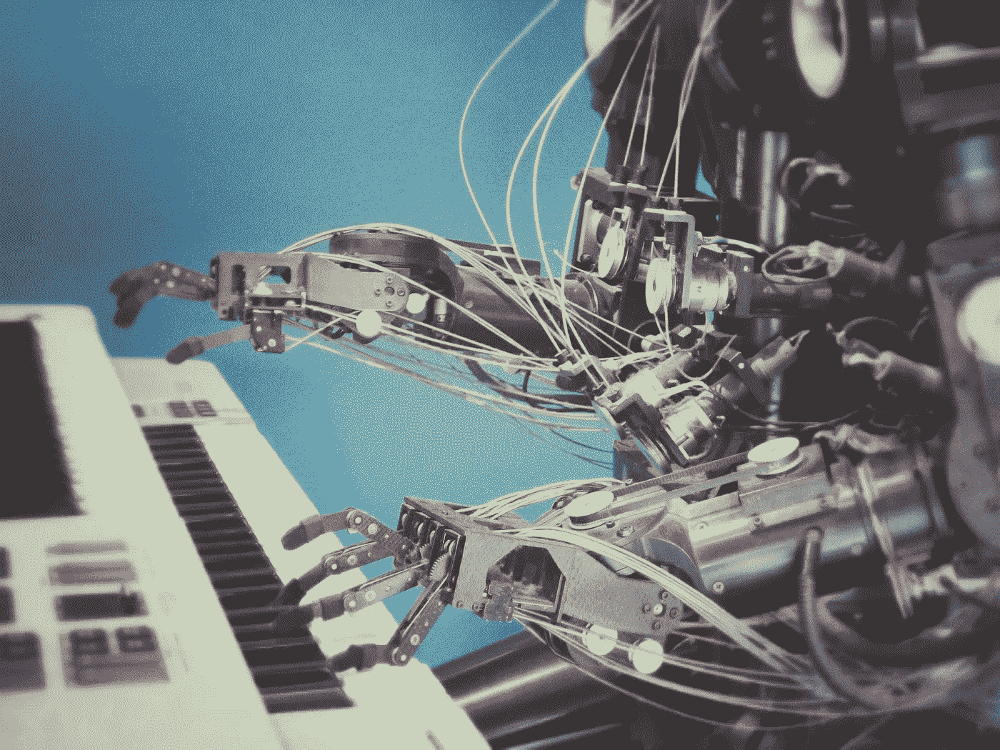
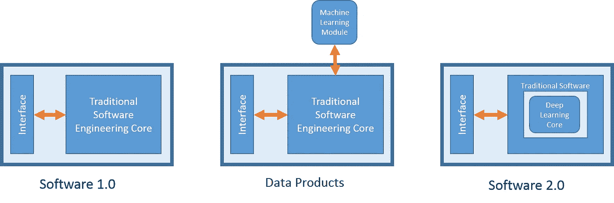

# 软件 2.0 的兴起

> 原文：<https://pub.towardsai.net/the-rise-of-software-2-0-you-dont-want-to-be-left-behind-cbaa75f6d19?source=collection_archive---------1----------------------->

[附身摄影](https://unsplash.com/@possessedphotography?utm_source=unsplash&amp;utm_medium=referral&amp;utm_content=creditCopyText)在 [Unsplash](https://unsplash.com/collections/9496083/future-tech-%26-society?utm_source=unsplash&amp;utm_medium=referral&amp;utm_content=creditCopyText) 上拍照

## [深度学习](https://towardsai.net/p/category/machine-learning/deep-learning)，[软件工程](https://towardsai.net/p/category/software-engineering)

## 深度学习如何重塑软件生产行业

在我研究的某个阶段，我在文献中研究软件工程(SE)和人工智能(AI)之间的相互作用。我路过[埃里克·梅耶尔](https://www.linkedin.com/in/erikmeijer1/)在 FSE 18 大会上的主题演讲。主题演讲的标题是“[每个伟大的深度学习框架背后都有一个更伟大的编程语言概念](https://dl.acm.org/doi/abs/10.1145/3236024.3280855)”。该演讲阐述了可区分编程背后的深层编程语言原则，希望激励工作中的软件 1.0 工程师认真关注软件 2.0 的威胁和机遇。

[Andrej Karpathy](https://medium.com/@karpathy) 对软件 2.0 的定义如下"[软件 2.0](https://medium.com/@karpathy/software-2-0-a64152b37c35) 可以用更抽象、人类**不友好** 的语言编写，比如神经网络的权重。没有人参与编写这个代码，因为有很多权重(典型的网络可能有数百万个)，直接用权重编码有点困难”。

我个人将软件 2.0 视为深度学习对传统软件工程栈的补充，使我们可以构建以前无法构建的复杂软件。我认为，软件生产已经通过一个叫做**数据产品** 的中间状态，从纯粹的软件 1.0 发展到了软件 2.0。当顶级软件公司了解大数据的商业潜力并开始使用机器学习构建数据产品时，这种状态就出现了。下图更能说明我的想法。

软件产品进化的三个阶段。(图片由作者提供)

在下面的部分中，我将通过提及此类产品的特征来支持我的观点，并给出一些真实的例子。请注意，我不会讨论软件 1.0 产品，因为它们已经很成熟了。

**数据产品**

在解释数据科学最近兴起的原因的过程中，Schutt 和 O'Neil 在[做数据科学的书](https://www.oreilly.com/library/view/doing-data-science/9781449363871/)中认为，数据有趣背后的一个主要因素是数据本身成为数据产品的构建块。

在现实生活中，这些产品可以是亚马逊推荐系统，它可以预测你作为客户会对什么感兴趣。提出友谊可能性的脸书推荐系统。网飞电影推荐。还有什么？谷歌搜索查询完成算法。Waze 路由算法。Airbnb 体验背后的排名算法。这样的例子不胜枚举。

我对这些产品的描述如下:

1.  **他们是二级**。这并不是说它们不重要，而是说它们增加了主要软件产品的价值。考虑 Airbnb 体验排名和推荐算法。Airbnb 的主要软件产品是一个平台，人们可以在这里寄宿或租赁住所。在运行该平台多年后，会产生大量数据。像所有企业一样，他们决定将这种潜力付诸行动，并通过向他们推荐他们最感兴趣的东西来增加购买体验的人数。
2.  他们进化了。而传统的软件产品会随着时间的推移而发展。数据产品发展得更快。毫不夸张地说，每一个数据化用户与数据产品的交互都会直接促进产品的发展。当你在网飞上给一部电影评分时，你的行为会稍微影响他们的推荐系统。这种影响是跨用户聚合的。Schutt 和 O'Neil 将其表述为“我们正在见证一个巨大的、文化饱和的反馈循环的开始，我们的行为改变产品，产品改变我们的行为。”
3.  **基于传统 ML** 。这类产品大多是使用传统的机器学习算法构建的，这些算法过去工作得很好，现在仍然在工作。决策树、支持向量机、回归等。
4.  **可解释性问题**。银行家会很高兴有一个决策树模型来预测个人贷款的批准情况。这是因为该模型生成的知识可以被公式化为一组对人类友好的规则。比如“如果这个人很年轻，已婚，有六位数的收入，那么根据训练数据，他/她有 78%的概率会拖欠贷款。”另一方面，祝你成功说服这位银行家使用 X 最先进的基于神经网络的深度学习模型。
5.  **中等 R & D 分数。如果我们认为传统软件更多的是开发而不是研究(从技术角度来看)，也就是说，它位于研发范围的 D 端。那么数据产品位于 R & D 频谱的中心。数据产品的构建周期是不确定的，你不能简单地设定交付期限的里程碑。这是一个反复试验的过程。我们选择了 N 种算法，尝试了 M 个超参数，希望其中一些能够达到 bushiness 的要求。虽然数据生产过程是 R & D 谱的中心，但它倾向于 D，因为它总是适合使用现成的算法。算法创新在大多数情况下并不重要。**

我相信那些真正描述数据产品或者软件 1.0 和软件 2.0 之间的中间状态。如果你还有其他的特点，请在评论区分享。我很高兴听到他们。

**软件 2.0**

软件 2.0 是神经网络。是深度学习。它是连接主义机器学习。这是机器通过聚合简单的计算单元来学习复杂的概念。安德烈·卡帕西描述了这里的。他还描述了它的特点以及它与传统软件的比较。为了避免赘述，我将更多地关注于给出这种软件的真实例子，而不是特性。

我将首先提到一些对比软件 2.0 和数据产品的特征。

1.  **基于深度学习**。很明显。与数据产品不同，软件 2.0 产品基于当代深度学习模型。
2.  **是初级**。与数据产品不同，软件 2.0 不是次要的。它是软件产品的核心组成部分，也是实际的商业价值。
3.  **可解释性不重要**。是的，这是真的。可解释性并不重要。为什么这并不重要，而且有一个研究领域正在致力于使深度学习模型更具可解释性？对于一些安全敏感领域，比如自动驾驶汽车和医疗应用，这确实很重要。但是对于许多其他应用程序来说，却不是这样。只要模型输出的东西符合预期，就会赢得赞誉。这一点将在我下面提到的产品示例中更加明显。
4.  **高 R & D 评分**。软件 2.0 更倾向于 R & D 谱中的 R。对于每一个应用程序，都有一些提示和技巧需要你去创新，以达到比现成模型更好的效果。总会有一些算法创新发生。如果你在一个给定的领域中构建了一个软件 2.0 产品，那么你将自动成为一个开发利基专长的领域专家。

**软件 2.0 示例**

在这里，我将提到一些真实的软件 2.0 示例，以便人们可以直接理解它们。

1.  [**棱镜**](https://prisma-ai.com/)

我想现在很多人都听说过或者用过 Prisma。Prisma 是一个照片编辑移动应用程序，它使用神经网络和人工智能来应用艺术效果来转换图像。这个应用程序是由阿列克谢·莫伊谢恩科夫、奥列格·波亚加诺夫、伊利亚·弗罗洛夫、安德烈·乌索尔采夫和阿拉姆·哈迪开发的。它于 2016 年 6 月作为一款[免费手机应用](https://en.wikipedia.org/wiki/Prisma_(app))推出。Prisma 利用最近的[神经风格转移](https://en.wikipedia.org/wiki/Neural_Style_Transfer)技术，使用另一种图像风格重绘图像。看看 Prisma 是一个基于深度学习的产品，底层模型的可解释性如何不重要，以及它如何肯定有很高的 R & D 分数。这种技术做视频不会很酷吗？[看看这个](https://www.youtube.com/watch?v=Uxax5EKg0zA)。酷哈！

《戴帽子的女人》风格的蒙娜丽莎使用了神经风格转移。(图片来源维基百科)

**2。**[**rose bud . ai**](https://www.rosebud.ai/)

Rosebud 实际上在人工智能生成的媒体的保护伞下提供了多个软件 2.0 产品。它在生成对抗网络 [GANs](https://en.wikipedia.org/wiki/Generative_adversarial_network) 和 [Deepfakes](https://en.wikipedia.org/wiki/Deepfake) 中使用了最新的技术进展。像 [Tokkingheads](https://tokkingheads.com/) 这样的产品，你可以制作一个虚拟形象或真人的脸来表达你的声音或某段文字。[创成式照片](https://app.generative.photos/)在这里你可以改变人类模型的脸、种族和编辑头发。在这里你可以应用新的滤镜到你的脸上，比如改变头发的颜色，卡通化和年龄。可以尝试一些！

deepfake 技术的一个例子:在超人：钢铁之躯的一个场景中，原著中的女演员艾米·亚当斯(左)被修改成了演员尼古拉斯·凯奇(右)的脸(图片来源维基百科)

**3。** [**叶成**](https://lobe.ai/)

Lobe.ai 实际上并不是一个软件 2.0 产品，而是一个构建这类产品的平台。它说下面的“Lobe 是一个免费的私人桌面应用程序，它拥有你从原型到生产的机器学习想法所需的一切。”使用 lobe，训练深度学习模型就像喝[一口水](https://youtu.be/Mdcw3Sb98DA)。注意 lobe 是微软的产品。

**4。** [**Otter.ai**](https://otter.ai)

Otter 是一种基于人工智能的转录服务，可以与 Zoom 等主流视频会议软件一起使用。我试着用它转录了 Hinton(被称为 AI 的上帝之父)[深度学习介绍](https://www.youtube.com/watch?v=GJdWESd543Y)的讲座。你可以在这里找到结果[。](https://otter.ai/u/NWloZiFOHD1YdjOvsvvqzZzKZJY)

**5。** [**语法上**](https://app.grammarly.com/)

我敢打赌，大多数读者已经知道语法。Grammarly 是一款基于人工智能的数字写作辅助应用。这份手稿已经由它校对过了。

我在这里列出了 5 款软件 2.0 产品。如你所见，上述特征适用。在野外发生了很多事情，许多伟大的创业公司正在使用人工智能构建伟大的东西([查看](https://www.businesswire.com/news/home/20190213005463/en/Xnor.ai-Unveils-First-Battery-free-Solar-AI-Technology-Enabling-a-New-Wave-of-Edge-AI-Computing)xnor . AI 已经做了什么！).然而，我选择这 5 个例子是为了简单，因为它们针对的是最终用户，所以读者可以查看它们。如果你知道任何酷软件 2.0 应用程序，请在下面的评论中分享。我想听听这件事。如果你觉得这篇文章有趣，别忘了鼓掌支持(你可以多次鼓掌)

我希望我把软件 2.0 的特征讲得非常清楚。既然你受到了启发，为什么不创建自己的软件 2.0 应用程序呢？你认为使用深度学习可以做什么以前不可能的事情！