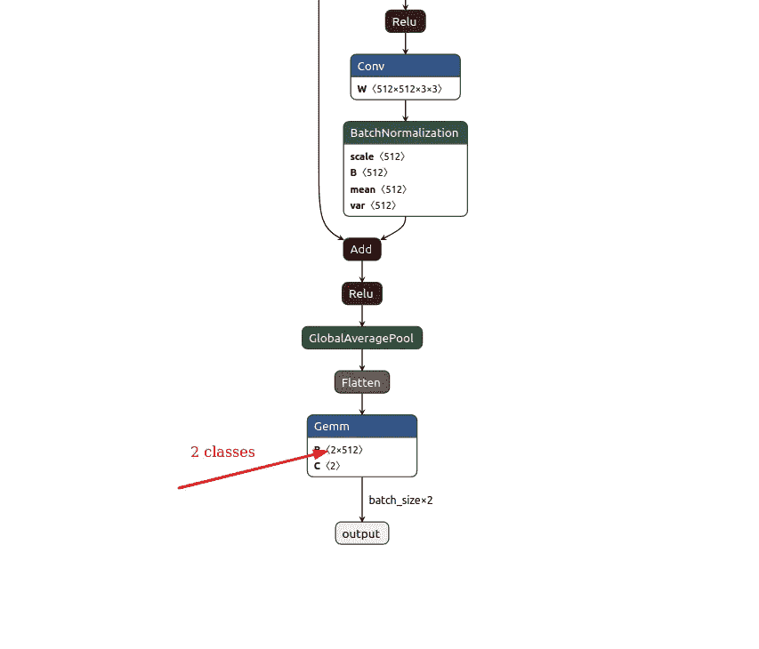

# 数据集类在迁移学习中的作用

> 原文：<https://pub.towardsai.net/the-role-of-dataset-classes-in-transfer-learning-7f5c509939ac?source=collection_archive---------1----------------------->

## 使用 Monk，低代码深度学习工具和计算机视觉的统一包装器，使计算机视觉变得简单


乔希·阿普尔盖特在 [Unsplash](https://unsplash.com/s/photos/blessing?utm_source=unsplash&utm_medium=referral&utm_content=creditCopyText) 上的照片

**你在迁移学习中用深度学习模型做什么？**

> 这些是 pytorch、keras 和 mxnet 的贡献者已经完成的步骤

*   你拿一个深度学习架构，比如 resnet，densenet，甚至 custom network。
*   在 Imagenet、coco 等大型数据集上训练架构。
*   训练好的权重成为你迁移学习的起点。

> 这个预训练模型的最后一层具有多个神经元=大型数据集中的类的数量

> 在迁移学习中

*   你拿着网络，在网络上加载预先训练好的权重。
*   然后移除具有额外(或更少)数量神经元的最后一层。
*   您添加了一个新图层，其神经元数量=自定义数据集中的类数量。
*   您可以选择在新添加的最后一层和旧网络之间添加更多层。

> 现在你的网络中有两个部分

*   一个已经存在的(预训练的，基础网络)。
*   您添加的新子网络或单个层。

> 这里我们可以看到的超参数:**冻结基础网络**

*   冻结基网使基网无法追踪。
*   基本网络现在充当特征提取器，并且仅训练下一半。
*   如果您不冻结基本网络，则整个网络都会被训练。

> 这里我们有两个数据集

*   猫狗数据集有两个类。
*   标志分类有 16 类。

## 创建和管理实验

*   提供项目名称
*   提供实验名称

**这将按照以下结构创建文件和目录**

```
workspace     
  |--Project                                      
       |--study-num-classes                                                                |            |--experiment-state.json                                 |            |--output                                                                        |                 |--logs (All training logs and graphs saved here)                                                                    |                 |--models (all trained models saved here)
```

# 用猫狗数据集设置默认参数

```
gtf.Default(dataset_path="study_classes/dogs_vs_cats", 
            model_name="resnet18", 
            num_epochs=5)
```

# 可视化网络

```
gtf.Visualize_With_Netron(data_shape=(3, 224, 224), port=8081)
```

# 最后一层



# 使用新数据集重置默认参数—徽标分类

```
gtf.Default(dataset_path="study_classes/logos", 
            model_name="resnet18", 
            num_epochs=5)
```

# 可视化网络

```
gtf.Visualize_With_Netron(data_shape=(3, 224, 224), port=8082)
```

# 最后一层


你可以在 Github 上找到完整的 jupyter 笔记本。

如果有任何问题，可以联系[阿布舍克](https://www.linkedin.com/in/abhishek-kumar-annamraju/)和[阿卡什](https://www.linkedin.com/in/akashdeepsingh01/)。请随意联系他们。

我对计算机视觉和深度学习充满热情。我是[和尚](https://github.com/Tessellate-Imaging/Monk_Object_Detection)图书馆的开源贡献者。

你也可以在以下网址看到我的其他作品:

[](https://medium.com/@akulahemanth) [## 阿库拉·赫曼思·库马尔培养基

### 阅读阿库拉·赫曼思·库马尔在媒介上的作品。计算机视觉爱好者。每天，阿库拉·赫曼思·库马尔和…

medium.com](https://medium.com/@akulahemanth)