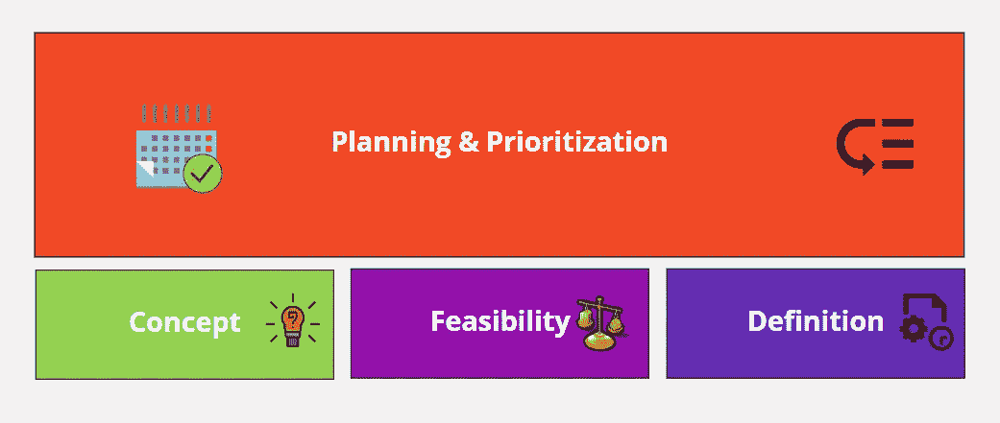
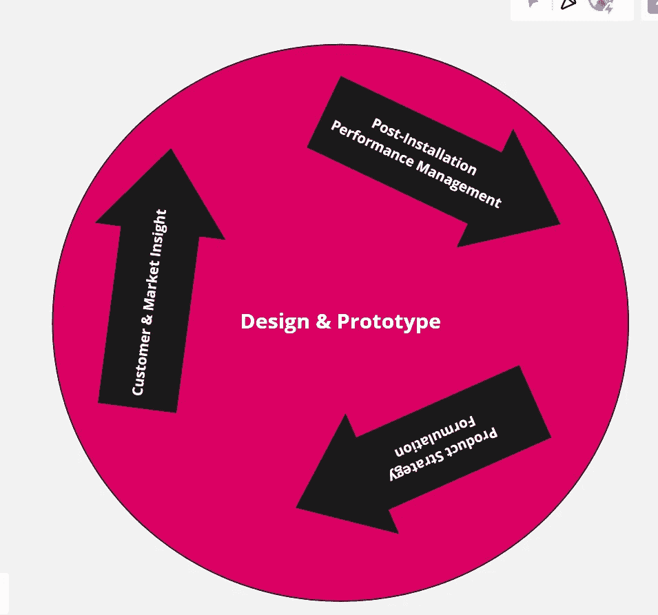

# 产品经理在产品规划中的角色

> 原文：<https://pub.towardsai.net/the-role-of-product-manager-in-product-planning-16a596b963d8?source=collection_archive---------4----------------------->

# 介绍

产品规划和策略制定是任何产品经理描绘他/她对产品的长期愿景的重要视角。此外，以更具创造性和更有效的方式思考和计划如何满足客户需求也很重要。最终目标是帮助产品在竞争激烈的市场中立足于客户需求和市场速度，这更具挑战性和趣味性。vision 的成功取决于产品开发人员、设计师、项目经理等的贡献。它们在加速产品上市和缩短盈利时间方面发挥着重要作用。理解商业模式的方法在产品规划中也起着重要的作用，因为它直接影响收入流、质量问题和项目资金。

图 1:产品生命周期

如上图所示，规划和优先排序很重要，因为它需要更战略性地考虑可能的产品业务，以使其对客户更有价值。原型和设计是向客户展示的最关键的部分，以了解他们感兴趣的客户。

# 规划和优先排序

产品规划和优先化使产品所有者更具战略性地考虑商业价值产生的副产品，并通过增加价值和计划的可交付成果提供改善这一点的机会。这是了解客户需求和兴趣的主要部分。

图 2:规划和优先排序

如今，业界正在实践迭代规划和优先化来处理产品战略和规划。

图 3:迭代产品计划

规划和优先排序的不同方面如下:

## 设计和原型

这对于任何产品负责人来说都是非常重要的一部分，因为他/她的主要目标是吸收客户，并根据客户整合情况捕捉市场洞察力和问题。客户问题和市场洞察力以更简单的方式勾勒出来，使设计和原型制作变得容易。基本上，原型是一个产品的草案版本，它使您能够在花费时间和金钱进行产品开发之前，调查您的想法，并确定功能背后的目的或对客户的整体设计概念。

图 4:设计和原型

设计和原型实现后，将与目标客户共享以获得反馈。然后，处理想法背后的业务逻辑，以查看其可能的发展是否会进一步满足业务的目的。

产品经理必须在设计阶段回答自己提出的问题:

*   客户真的需要这种产品/功能吗，为什么？
*   开发这种产品/功能需要多少努力？
*   我们可以在产品业务问题中进一步阐述这一点吗？
*   设计是否验证或增强了价值陈述？

# 首先考虑客户

提升客户的体验非常重要。产品经理必须在他/她的头脑中激发顾客的思维过程。可能是这样的:

*   考虑顾客的生活方式
*   找出如何与客户进行超越文本或电子邮件的互动。
*   为客户提供注册产品的能力。(谷歌正在做的是通过 GPS 定位器，提供评论，上传照片等。)

客户需要考虑的其他方面:

*   逃避费用
*   感到安全或受到保护
*   节省时间
*   客户会得到什么好处？
*   客户在规定的时间内努力做什么？
*   客户想要达到的目标是什么？
*   提高系统性能和潜力

图 5:首先考虑客户

# 开发和发布计划

每次需要开发新的或增强的产品时，开发人员或工程师都需要了解他们应该开发什么以及何时开发。这就是为什么产品路线图被用来创建主题、史诗、故事、功能等。产品路线图是产品经理提出的愿景、目标和策略的表示。

> 将特性路线图用于发布计划和产品路线图作为战略或业务计划工具是非常好的。

## 发布计划

发布计划应作为暂存。当您将箱子放在一个准确的位置，并计划最终装载到卡车上运往某个地方时，可以使用“分段运输”这个术语。

有了产品特性，产品经理希望能够对要开发的东西进行细分，这样他/她就可以决定他/她能够快速发布什么，以及他/她必须为下游测试或集成到更大的系统中保留什么。通常，产品经理会创建一个大的特性列表，并创建一个 backlog。

发布计划必须包括以下几点:

*   要修复的错误
*   功能或产品的快速发布。
*   用户体验
*   集成挑战和复杂性
*   需要为公司产品组合的主要版本保留的特性。
*   增加客户愿意付费的价值的功能。

图 6:产品发布

# 结论

组织敏捷性是新业务竞争的风格。它要求我们在尽量减少组织干预的情况下更迅速地工作。人们期望它达到从未想象过的生产力水平和最高水平的产品质量，并使团队合作，使企业能够获得竞争优势。对于产品经理和他们的团队来说，能够不断地为客户提供价值并为公司的战略成功做出贡献是至关重要的。