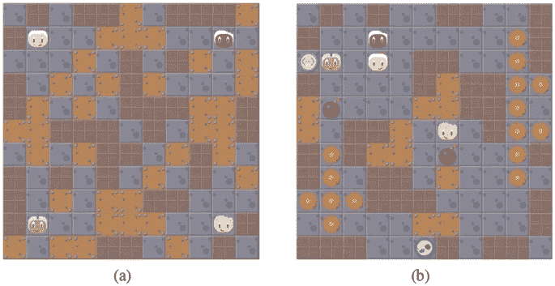
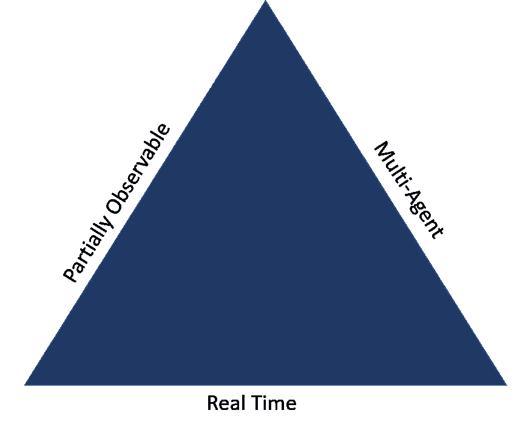
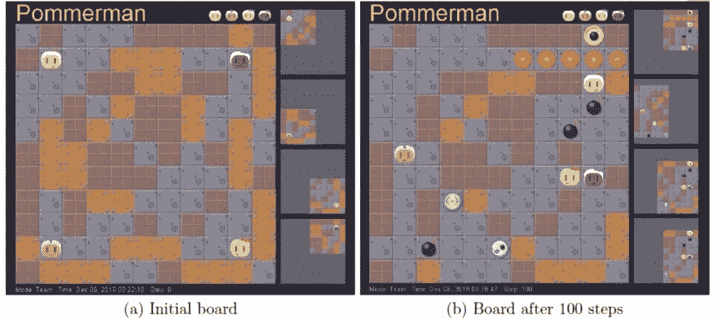
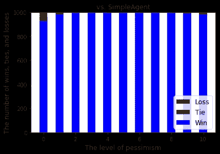

# 通过著名的波莫曼挑战赛的自学模型

> 原文：<https://pub.towardsai.net/the-self-learning-model-that-passed-the-famous-pommerman-challenge-d968dcfcc498?source=collection_archive---------0----------------------->

## IBM 创建了一个自学代理，超越了该领域最重要的基准之一。

来源:[https://link . springer . com/chapter/10.1007/978-3-030-29135-8 _ 2](https://link.springer.com/chapter/10.1007/978-3-030-29135-8_2)

> 我最近创办了一份专注于人工智能的教育时事通讯，已经有超过 125，000 名订户。《序列》是一份无废话(意思是没有炒作，没有新闻等)的 ML 导向时事通讯，需要 5 分钟阅读。目标是让你与机器学习项目、研究论文和概念保持同步。请通过订阅以下内容来尝试一下:

 [## 序列

### 与机器学习、人工智能和数据发展保持同步的最佳资源…

thesequence.substack.com](https://thesequence.substack.com/) 

自动驾驶汽车或无人机等趋势的出现有助于普及一个被称为自主代理的人工智能(AI)研究领域。从概念上讲，自主智能体是一种人工智能，它根据周围环境以及其他智能体的特征实时构建知识。如果我们以自动驾驶汽车为例，自主智能体需要快速适应汽车激光雷达传感器处理的信息，以避免碰撞并执行安全驾驶。自主智能体日益增长的重要性吸引了各大企业人工智能实验室和研究机构的关注。该领域最著名的论文之一来自东京 IBM AI 研究实验室的一个团队，该团队[发表了一篇论文，提出了一种基于悲观场景的树搜索技术](https://www.ibm.com/blogs/research/2019/03/real-time-sequential-decision-making/)，改进了自主代理的实现。提出的方法在自主代理人的 X-Games:[的 Pommerman 挑战](https://www.pommerman.com/)中获得了第一名和第三名。

自主代理的实现之所以如此具有挑战性，不仅是因为知识构建过程的自我学习、实时性，还因为这些代理在多代理、部分可观察的环境中运行。在自主智能体场景中，人工智能模型不仅需要实时处理环境信息，还需要与其他自主智能体进行交互，并从它们的行为中学习。此外，事先并不知道关于环境的全部信息，这需要代理利用记忆技术来构建环境的增量表示。再次，想象一辆自动驾驶汽车在交通堵塞期间(多智能体)在一条它以前从未驾驶过的道路上导航(实时)(部分可观察)。

# 波莫曼挑战赛

自主人工智能代理不仅难以置信地难以构建，而且测试起来也很昂贵。我们不可能每天都在自动驾驶汽车或无人机上测试新模型。为了简化自主人工智能系统的测试和验证，并推进该领域的研究，人工智能社区创建了[Pommerman Challenge](https://www.pommerman.com/)，这是一个多智能体游乐场，用于测试新的自主人工智能系统。

在 Pommerman 游戏中，一个由两个代理人组成的团队与另一个由两个代理人组成的团队在一块 11 x 11 的棋盘上进行比赛。每个代理只能观察棋盘上有限的区域，并且代理之间不能相互通信。一个队的目标是击倒所有的对手。为了实现这个目标，代理放置炸弹来摧毁木墙，并收集可能从这些木墙出现的电力项目，同时避免火焰和攻击对手。

来源:[https://www . IBM . com/blogs/research/2019/03/real-time-sequential-decision-making/](https://www.ibm.com/blogs/research/2019/03/real-time-sequential-decision-making/)

实时决策是让 Pommerman 如此困难的特征之一。在一个典型的游戏中，代理人需要在大约 100 毫秒内做出决定，这限制了计算昂贵的技术(如蒙特卡罗树搜索)的适用性。在 Pommerman 中，每一步的分支因子可以大到 64= 1296，因为每一步有四个智能体同时采取行动，每个智能体有六种可能的行动。代理人应该提前计划，并考虑到炸弹的爆炸来选择行动，炸弹的寿命是 10 步。这一因素通常会对树形搜索技术造成挑战，因为深度小于一定深度的树会忽略炸弹的爆炸，而深度足够的树会因分支因子较大而不可行。

虽然人工智能社区一直在 Pommerman 挑战赛中稳步取得进展，但结果仍然远远低于其他游戏，如雅达利，围棋，甚至扑克。在 Pommerman 挑战赛中，一个成功的自主智能体的关键是推断未来的重大事件。为了应对这一挑战，IBM 决定将实时树搜索与环境的确定性评估相结合。

# 悲观场景下的实时树搜索

正如上一节所讨论的，如果不是因为实时性的限制，Pommerman 对于自主代理来说不会是一个如此具有挑战性的场景。蒙特卡罗树搜索(MCTS)等技术非常适合解决 Pommerman 挑战，只是通常需要很长时间才能找到解决方案。然而，在许多情况下，MCTS 类型的技术仍然是一个可行的解决方案。考虑这样一种情况，其中一个代理只能通过遵循特定的路线生存。鉴于搜索范围的缩小，MCTS 很可能胜过其他选择。

虽然前面的例子告诉我们，Pommerman 挑战的潜在解决方案可以在一定程度上使用传统的搜索技术，然后将它们与推理场景相结合。这正是 IBM 团队遵循的方法。在他们寻求解决 Pommerman 挑战的过程中，IBM 利用了一种方法，这种方法只执行有限深度的树搜索，但搜索树的叶子是在确定性和悲观场景的基础上进行评估的。新方法保持搜索树的大小较小，因为直到有限的深度才有分支。与此同时，新方法可以考虑到未来可能发生的关键事件，因为树叶是用确定性场景评估的，这种场景可能比分支可能出现的场景长得多。

来源:[https://www . IBM . com/blogs/research/2019/03/real-time-sequential-decision-making/](https://www.ibm.com/blogs/research/2019/03/real-time-sequential-decision-making/)

依赖悲观情景的想法基于这样一个事实，即好的行动通常是在悲观情景下表现良好的行动，尤其是在安全是首要考虑的情况下。IBM 树搜索策略的一个关键方面是悲观场景的生成和评估。生成过程针对搜索树中的每个叶子进行。IBM 模型假设环境的状态可以用物体的位置来表示。这些对象中的一些随机地或者根据代理的动作改变它们的位置，这迫使树搜索具有分支。如果一个人能说出一个物体在所有可能性中最差的位置顺序，他就能在悲观的场景中相应地放置和移动那个物体。

在生成不同的悲观场景之后，IBM 代理使用一个分数来评估它们，该分数量化了代理的生存性，该生存性是代理在棋盘序列中可以安全停留的位置数量的指示。直观地说，如果一个代理可以到达许多位置而无需联系其他代理，则该代理被认为具有高生存性。从这个意义上说，IBM 自治代理选择最大化其生存性级别的操作。

IBM 针对最先进的代理评估了新模型，结果非常显著。首先，新代理在蒙特利尔举行的第三十二届神经信息处理系统会议( [NeurIPS 2018](https://neurips.cc/) )上举行的 Pommerman 竞赛中获得了第一名和第三名。最令人印象深刻的发现之一是，代理人游戏的有效性是如何随着悲观程度成比例提高的，如下图所示。

来源:[https://www . IBM . com/blogs/research/2019/03/real-time-sequential-decision-making/](https://www.ibm.com/blogs/research/2019/03/real-time-sequential-decision-making/)

自主代理将是人工智能发展的下一个前沿领域之一。像 IBM 这样的公司正在进行的发展这一领域的工作可以将自动代理的领域从自动驾驶汽车或无人机的非常专业的应用过渡到更主流的场景。