# 七大行星之谜

> 原文：<https://pub.towardsai.net/the-seven-planets-riddle-9f85d1906f8a?source=collection_archive---------1----------------------->

来源:由[杰瑞米·托马斯](https://unsplash.com/photos/E0AHdsENmDg)、[贾斯特斯·门克](https://unsplash.com/photos/YGBYROFge3c)和[西蒙尼·布萨托](https://unsplash.com/photos/WZh1QZFB4kc)在 [Unsplash](https://unsplash.com/) 上衍生而来

## [逻辑](https://towardsai.net/p/category/logic)，[编程](https://towardsai.net/p/category/programming)

## 你能解开七大行星之谜吗？我们为您带来十种不同的解决方案。跳上船，让你的大脑得到锻炼！

**作者:** [普拉蒂克·舒克拉](https://www.linkedin.com/in/pratik-shukla28/)，[德瓦尼·奥扎](https://www.linkedin.com/in/dhvani-oza/)，[罗伯特·伊里翁多](https://mktg.best/vguzs)

 [## 加入我们吧↓ |面向人工智能成员|数据驱动的社区

### 加入人工智能，成为会员，你将不仅支持人工智能，但你将有机会…

members.towardsai.net](https://members.towardsai.net/) 

你听说过七大行星之谜吗？你认为你能解决它吗？在本文中，我们展示了著名的七大行星之谜的不同解决方案。我们将为您带来一些具有挑战性的谜题，以锻炼您的大脑，这就是为什么我们创建了我们的逻辑类别，我们计划很快添加更多！敬请关注。此外，为了让谜语更加有趣，我们添加了一个 Python 编程解决方案，你可以在 [**Github**](https://github.com/towardsai/tutorials/blob/master/logic/seven_planets_riddle.py) 上玩，也可以在 [**Google colab**](https://colab.research.google.com/drive/1iOeJjZV1yAAt2X0AyL3ICcWuhhlvSbS8?usp=sharing) 中作为 jupyter 笔记本来玩。

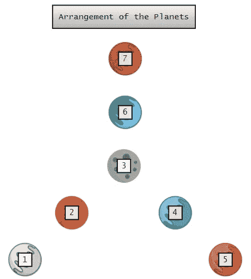

行星排列|作者图片。

## 问题陈述:

想象以下场景:

你在警队工作。你和你的警察小队已经追踪到一群外星人，他们正在从七大行星群中偷窃贵金属。上图显示了行星的排列。我们的任务是在援军到达之前抓住外星人。我们的警察朋友通知我们，增援至少需要 10 个小时才能到达。

所以我们的目标是在 10 小时内捕获外星人。注意，外星人只能移动到邻近的星球，但我们可以在 1 小时内去任何星球。我们应该以什么样的顺序搜索，这样我们才能确定抓住外星人。

## 规则:

1.  外星人可能从七大行星中的任何一个开始。
2.  为了抓住外星人，警察小队可以移动到七个星球中的任何一个。
3.  外星人只能移动到邻近的星球。
4.  外星人每小时都会重新定位。
5.  警察小队必须在 10 步以内找到外星人。
6.  警察小队的路线必须能够在任何可能的情况下找到外星人。

让我们先列出外星人可能走的路线。请注意，外星人只能移动到邻近的星球。一旦我们知道了外星人可以走的所有基本路线，我们就可以创造出这些路线的组合。

## 案例 1:

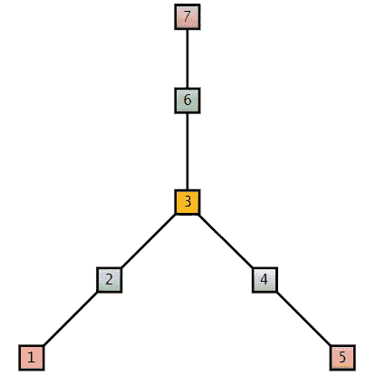

可能路线|作者图片。

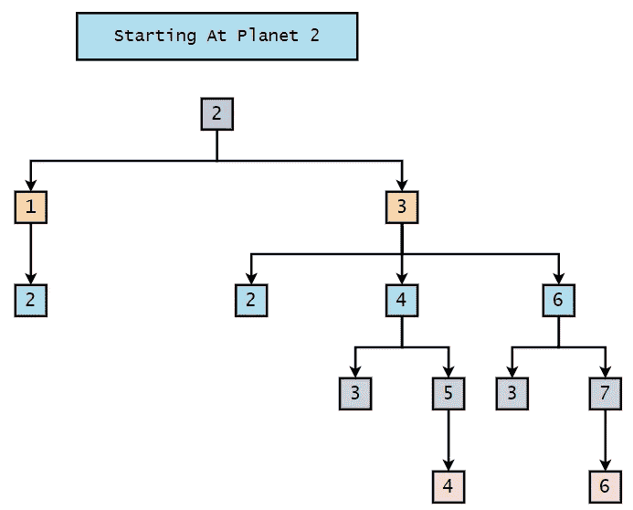

可能的路线从行星 2 开始。

## 可能的路线:

## 1.从 1:

*   1–2

## 2.从 2:

*   2–1–2
*   2–3–2
*   2–3–4–3
*   2–3–4–5–4
*   2–3–6–3
*   2–3–6–7–6

## 3.从 3:

*   3–2
*   3–4–3
*   3–4–5–4
*   3–6–3
*   3–6–7–6

## 4.从 4:

*   4–3
*   4–5–4

## 5.从 5:

*   5–4

## 6.从 6:

*   6–3
*   6–7–6

## 7.从 7:

*   7–6

## 案例 2:

可能路线|作者图片。

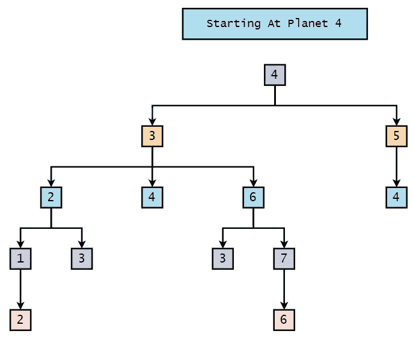

这张图片显示了从行星 4 开始的可能路线。

## 可能的路线:

## 1.从 1:

*   1–2

## 2.从 2:

*   2–1–2
*   2–3

## 3.从 3:

*   3–4
*   3–2–1–2
*   3–2–3
*   3–6–3
*   3–6–7–6

## 4.从 4:

*   4–5–4
*   4–3–4
*   4–3–2–1–2
*   4–3–2–3
*   4–3–6–3
*   4–3–6–7–6

## 5.从 5:

*   5–4

## 6.从 6:

*   6–3
*   6–7–6

## 7.从 7:

*   7–6

## 案例 3

可能路线|作者图片。

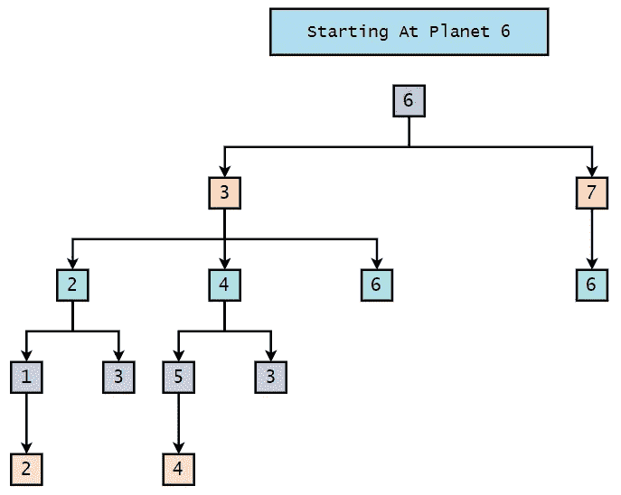

可能的路线从行星 6 开始。

可能的路线:

## 1.从 1:

*   1–2

## 2.从 2:

*   2–1–2
*   2–3

## 3.从 3:

*   3–2–1–2
*   3–2–3
*   3–4–5–4
*   3–6

## 4.从 4:

*   4–5–4

## 5.从 5:

*   5–4

## 6.从 6:

*   6–7–6
*   6–3–2–1–2
*   6–3–2–3
*   6–3–4–5–4
*   6–3–4–3
*   6–3–6

## 7.从 7:

*   7–6

## 案例 4:

可能路线|作者图片。

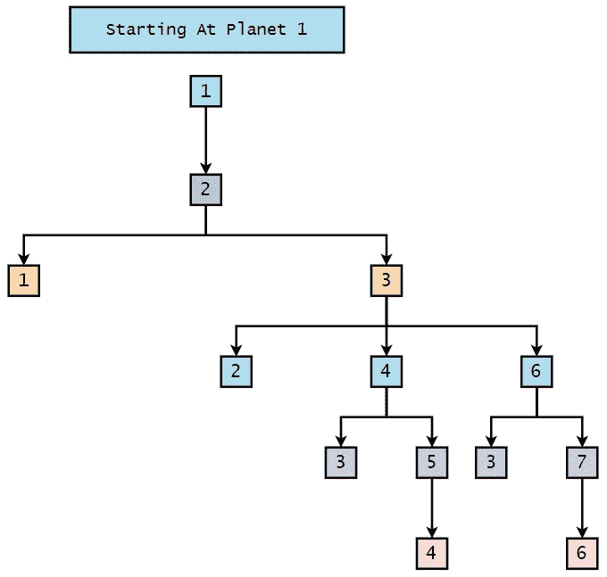

可能的路线从行星 1 开始|图片由作者提供。

## 可能的路线:

## 1.从 1:

*   1–2–1
*   1–2–3–2
*   1–2–3–4–3
*   1–2–3–4–5–4
*   1–2–3–6–3
*   1–2–3–6–7–6

## 2.从 2:

*   2–1
*   2–3–2
*   2–3–4–3
*   2–3–4–5–4
*   2–3–6–3
*   2–3–6–7–6

## 3.从 3:

*   3–2
*   3–4–3
*   3–4–5–4
*   3–6–3
*   3–6–7–6

## 4.从 4:

*   4–3
*   4–5–4

## 5.从 5:

*   5–4

## 6.从 6:

*   6–3
*   6–7–6

## 7.从 7:

*   7–6

## 案例 5:

可能路线|作者图片。

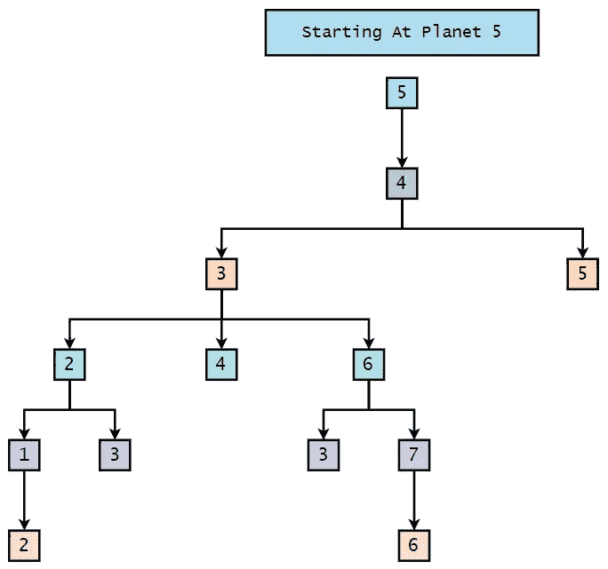

可能的路线从行星 5 开始|图片由作者提供。

## 可能的路线:

## 1.从 1:

*   1–2

## 2.从 2:

*   2–1–2
*   2–3

## 3.从 3:

*   3–2–1–2
*   3–2–3
*   3–4
*   3–6–3
*   3–6–7–6

## 4.从 4:

*   4–5
*   4–3–2–1–2
*   4–3–2–3
*   4–3–4
*   4–3–6–3
*   4–3–6–7–6

## 5.从 5:

*   5–4–5
*   5–4–3–2–1–2
*   5–4–3–2–3
*   5–4–3–4
*   5–4–3–6–3
*   5–4–3–6–7–6

## 6.从 6:

*   6–3
*   6–7–6

## 7.从 7:

*   7–6

## 案例 6:

可能路线|作者图片。

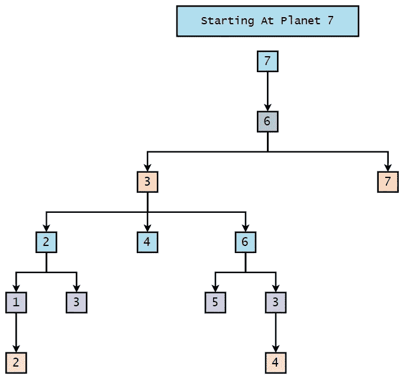

可能的路线从行星 7 开始|图片由作者提供。

## 可能的路线:

## 1.从 1:

*   1–2

## 2.从 2:

*   2–1–2
*   2–3

## 3.从 3:

*   3–2–1–2
*   3–2–3
*   3–4–5–4
*   3–4–3
*   3–6

## 4.从 4:

*   4–3
*   4–5–4

## 5.从 5:

*   5–4

## 6.从 6:

*   6–7
*   6–3–2–1–2
*   6–3–2–3
*   6–3–4–5–4
*   6–3–4–3
*   6–3–6

## 7.从 7:

*   7–6–7
*   7–6–3–2–1–2
*   7–6–3–2–3
*   7–6–3–4–5–4
*   7–6–3–4–3
*   7–6–3–6

## 案例 7:

可能路线|作者图片。

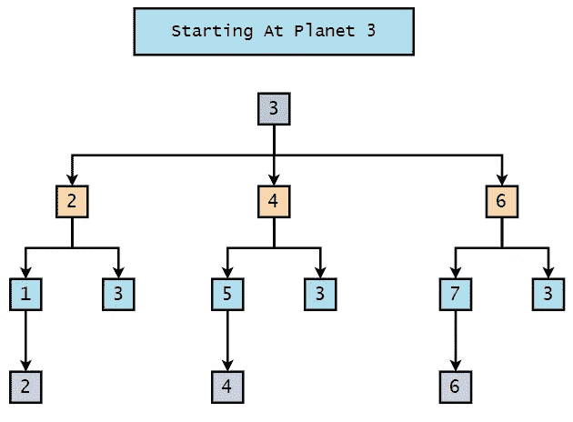

可能的路线从行星 3 开始|图片由作者提供。

## 可能的路线:

## 1.从 1:

*   1–2

## 2.从 2:

*   2–1–2
*   2–3

## 3.从 3:

*   3–2–1–2
*   3–2–3
*   3–4–5–4
*   3–4–3
*   3–6–7–6
*   3–6–3

## 4.从 4:

*   4–3
*   4–5–4

## 5.从 5:

*   5–4

## 6.从 6:

*   6–3
*   6–7–6

## 7.从 7:

*   7–6

## 结论:

1.  如果外星人从偶数行星(2，4，6)开始，那么我们总会在奇数行星(1，3，5，7，9)的运动上找到偶数行星(2，4，6)上的外星人。

**举例:**

*   6–3–4–5–4

2.如果外星人是从偶数行星(2，4，6)开始的，那么我们总会在奇数行星(1，3，5，7)的偶数运动(2，4，6，8)上找到外星人。

**举例:**

*   6–3–4–5–4

3.如果外星人从奇数行星(1，3，5，7)开始，那么我们总是会在奇数行星(1，3，5，7)上找到他们奇数运动的外星人。(2,4,6,8).

**举例:**

*   7–6–3–4–5–4

4.如果外星人从奇数行星(1，3，5，7)开始，那么我们总会在偶数行星(2，4，6)的运动(2，4，6，8)上找到偶数行星上的外星人。

**举例:**

*   7–6–3–4–5–4

## 可能的解决方案:

*   2–3–4–3–6–2–3–4–3–6
*   2–3–6–3–4–2–3–6–3–4
*   4–3–2–3–6–4–3–2–3–6
*   4–3–6–3–2–4–3–6–3–2
*   6–3–2–3–4–6–3–2–3–4
*   6–3–4–3–2–6–3–4–3–2

简而言之，**偶数— 3 —偶数— 3 —偶数— 3 —偶数—偶数— 3 —偶数—3—偶数。**

1.  如果在第一个小时，外星人在一个偶数的星球上，那么我们可以自信地说，如果我们遵循上面提到的任何路线，我们肯定会在 5 个小时内逮捕外星人。
2.  如果在第一个小时，外星人在奇数的星球上，那么我们可以自信地说，如果我们遵循上面提到的任何路线，我们肯定会在 10 个小时内逮捕外星人。

如果外星人从奇数行星出发，那么在第 6 小时，他们将在偶数行星上。这就是为什么我们重复我们的路线，从偶数编号的行星开始，对外星人完美地工作。

**举例:**

7–6–3–4–5–4–5–4–5–4

如果我们在结论上思考一会儿，我们可以看到下面的路线将总是引导我们在十个动作或更少的动作中抓住外星人。如果外星人从偶数编号的行星出发，那么在最坏的情况下，我们将需要五次移动才能抓住他们。如果外星人从奇数编号的行星出发，那么在最坏的情况下，我们将需要十次移动才能抓住他们。这里需要注意的关键是，外星人每小时都会从偶数行星移动到奇数行星，或者从奇数行星移动到偶数行星。请注意，这里我们考虑的是最坏的情况。

现在，让我们验证解决方案路线。

# 从偶数编号的行星开始:

## 解决方案— 1:

我们正在考虑最坏的情况。

在这种情况下，外星人可以从行星 2、行星 4 或行星 6 出发。假设在第一个小时，我们正在访问行星 2，没有发现外星人。这意味着在第一个小时里，他们一定在行星 4 或行星 6 上。这意味着在第二个小时，他们可以移动到行星 3，行星 5，或行星 7。

假设在第二个小时，我们正在访问行星 3，没有发现外星人。这意味着在第二个小时里，外星人一定在 5 号或 7 号行星上。这意味着在第三个小时，他们可以移动到行星 4 或行星 6。假设在第三个小时，我们正在访问行星 4，并没有在那里发现外星人。

这意味着在第三个小时，他们一定在 6 号行星上。这意味着在第四个小时，他们可以移动到行星 3 或行星 7。假设在第四个小时，我们正在访问行星 3，没有发现外星人。这意味着，在第四个小时，他们必须在行星 7。现在，在第五小时，外星人只能移动到行星 6。所以我们可以说外星人走投无路了。因此，如果我们在此时访问行星 6，那么我们将在那里找到它们。

## 耗时:5 小时

可能路线|作者图片。

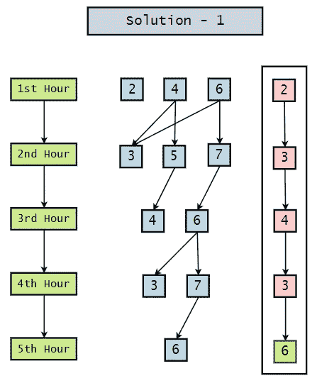

第一解|作者图片。

## 解决方案 2:

我们正在考虑最坏的情况。

在这种情况下，外星人可以从行星 2、行星 4 或行星 6 出发。假设在第一个小时，我们正在访问行星 2，没有发现外星人。这意味着在第一个小时里，他们一定在行星 4 或行星 6 上。这意味着在第二个小时，他们可以移动到行星 3，行星 5，或行星 7。

假设在第二个小时，我们正在访问行星 3，没有发现外星人。这意味着在第二个小时里，外星人一定在 5 号或 7 号行星上。这意味着在第三个小时，他们可以移动到行星 4 或行星 6。假设在第三个小时，我们正在访问行星 6，并没有在那里发现外星人。

这意味着在第三个小时里，他们一定在 4 号行星上。这意味着在第四个小时，他们可以移动到行星 3 或行星 5。假设在第四个小时，我们正在访问行星 3，没有发现外星人。这意味着，在第四个小时，他们必须在行星 5。现在，在第五小时，外星人只能移动到行星 4。所以我们可以说外星人走投无路了。因此，如果我们在此时访问行星 4，那么我们将在那里找到它们。

## 耗时:5 小时

可能路线|作者图片。

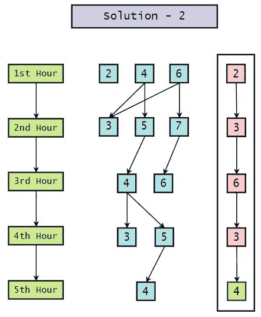

第二种解决方案|作者图片。

## 解决方案— 3:

我们正在考虑最坏的情况。

在这种情况下，外星人可以从行星 2、行星 4 或行星 6 出发。假设在第一个小时，我们正在访问行星 4，没有发现外星人。这意味着在第一个小时，他们一定在行星 2 或行星 6 上。这意味着在第二个小时，他们可以移动到行星 1，行星 3，或行星 7。

假设在第二个小时，我们正在访问行星 3，没有发现外星人。这意味着在第二个小时里，外星人一定在行星 1 或行星 7 上。这意味着在第三个小时，他们可以移动到行星 2 或行星 6。假设在第三个小时，我们正在访问行星 2，没有发现外星人。这意味着在第三个小时，他们一定在 6 号行星上。

这意味着在第四个小时，他们可以移动到行星 3 或行星 7。假设在第四个小时，我们正在访问行星 3，没有发现外星人。这意味着，在第四个小时，他们必须在行星 7。现在，在第五小时，外星人只能移动到行星 6。所以我们可以说外星人走投无路了。因此，如果我们在此时访问行星 6，那么我们肯定会在那里找到它们。

## 耗时:5 小时

可能路线|作者图片。

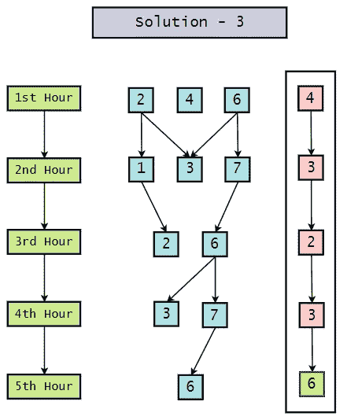

第三种解决方案|作者图片。

## 解决方案— 4:

我们正在考虑最坏的情况。

在这种情况下，外星人可以从行星 2、行星 4 或行星 6 出发。假设在第一个小时，我们正在访问行星 4，没有发现外星人。这意味着在第一个小时，他们一定在行星 2 或行星 6 上。这意味着在第二个小时，他们可以移动到行星 1，行星 3，或行星 7。

假设在第二个小时，我们正在访问行星 3，没有发现外星人。这意味着在第二个小时里，外星人一定在行星 1 或行星 7 上。这意味着在第三个小时，他们可以移动到行星 2 或行星 6。假设在第三个小时，我们正在访问行星 6，并没有在那里发现外星人。这意味着在第三个小时，他们一定在行星 2 上。

这意味着在第四个小时，他们可以移动到行星 1 或行星 3。假设在第四个小时，我们正在访问行星 3，没有发现外星人。这意味着在第四个小时，他们一定在行星 1 上。现在，在第五小时，外星人只能移动到行星 2。所以我们可以说外星人走投无路了。因此，如果我们在此时访问行星 2，那么我们将在那里找到它们。

## 耗时:5 小时

可能路线|作者图片。

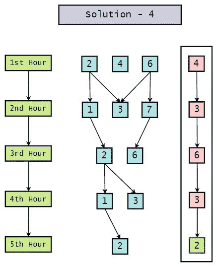

第四种解决方案|作者图片。

## 解决方案— 5:

我们正在考虑最坏的情况。

在这种情况下，外星人可以从行星 2、行星 4 或行星 6 出发。假设在第一个小时，我们正在访问行星 6，没有发现外星人。这意味着在第一个小时，他们一定在行星 2 或行星 4 上。这意味着在第二个小时，他们可以移动到行星 1，行星 3，或行星 5。

假设在第二个小时，我们正在访问行星 3，没有发现外星人。这意味着在第二个小时里，外星人一定在行星 1 或行星 5 上。这意味着在第三个小时，他们可以移动到行星 2 或行星 4。假设在第三个小时，我们正在访问行星 4，并没有在那里发现外星人。这意味着在第三个小时，他们一定在行星 2 上。

这意味着在第 4 小时，他们可以移动到行星 1 或行星 3。假设在第四个小时，我们正在访问行星 3，没有发现外星人。这意味着在第四个小时，他们一定在行星 1 上。现在，在第五小时，外星人只能移动到行星 2。所以我们可以说外星人走投无路了。因此，如果我们在此时访问行星 2，那么我们肯定会在那里找到它们。

## 耗时:5 小时

可能路线|作者图片。

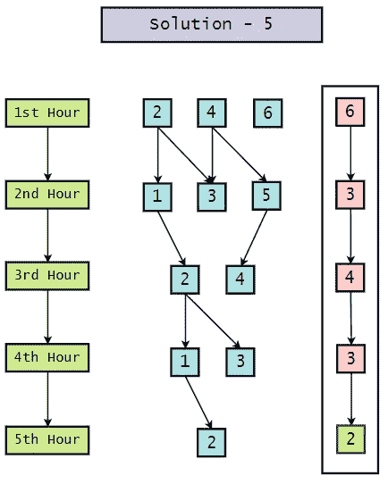

第五解|作者图片。

## 解决方案— 6:

我们正在考虑最坏的情况。

在这种情况下，外星人可以从行星 2、行星 4 或行星 6 出发。假设在第一个小时，我们正在访问行星 6，没有发现外星人。这意味着在第一个小时，他们一定在行星 2 或行星 6 上。这意味着在第二个小时，他们可以移动到行星 1，行星 3，或行星 5。

假设在第二个小时，我们正在访问行星 3，没有发现外星人。这意味着在第二个小时里，外星人一定在行星 1 或行星 5 上。这意味着在第三个小时，他们可以移动到行星 2 或行星 4。假设在第三个小时，我们正在访问行星 2，没有发现外星人。这意味着在第三个小时里，他们一定在 4 号行星上。这意味着在第四个小时，他们可以移动到行星 3 或行星 5。

假设在第四个小时，我们正在访问行星 3，没有发现外星人。这意味着，在第四个小时，他们必须在行星 5。现在，在第五小时，外星人只能移动到行星 4。所以我们可以说外星人走投无路了。因此，如果我们在此时访问行星 4，那么我们将在那里找到它们。

## 耗时:5 小时

可能路线|作者图片。

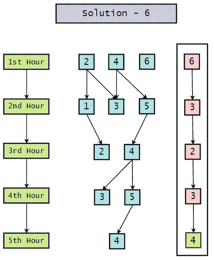

第六解|作者图片。

# 从奇数行星开始:

## 解决方案— 1:

我们正在考虑最坏的情况。

在这种情况下，在第一个小时，外星人可以从行星 1、行星 3、行星 5 或行星 7 出发。假设，在第一个小时，我们正在访问行星-2 并且没有在那里发现外星人。现在，在第二个小时，外星人可以移动到行星 2，行星 4，或行星 6。假设，在第二个小时，我们正在访问行星-3 并且没有在那里发现外星人。现在，在第三个小时，外星人可以移动到行星 1，行星 3，行星 5，或行星 7。假设，在第三个小时，我们正在参观飞机-3 并且没有在那里发现外星人。现在，在第四个小时，外星人可以移动到行星 2，行星 4，或行星 6。

假设，在第四个小时，我们正在访问行星-4 并且没有在那里发现外星人。在第五个小时，外星人可以移动到行星 1、行星 3、行星 5 或行星 7。假设，在第 5 个小时，我们正在访问行星 6，并没有在那里发现外星人。现在，在第六个小时，外星人可以移动到行星 2，行星 4，或行星 6。假设，在第六个小时，我们正在访问行星-2 并且没有在那里发现外星人。这意味着外星人一定去过 4 号行星或 6 号行星。现在，在第七个小时，外星人可以移动到第三部分，第五颗行星，或第七颗行星。

假设，在第 7 个小时，我们正在访问行星-3 并且没有在那里发现外星人。这意味着在第 7 个小时，外星人一定去过行星 5 或行星 7。所以，在第八小时，外星人可以移动到行星 4 或行星 6。假设，在第八个小时，我们正在访问行星-4 并且没有在那里发现外星人。这意味着外星人一定在第八小时到过 6 号行星。现在，在第九个小时，外星人可以移动到行星 3 或行星 7。假设，在第 9 个小时，我们正在访问行星-3 并且没有在那里发现外星人。这意味着在第 9 个小时，外星人一定去过 7 号行星。

所以在第十个小时，外星人只能移动到 6 号星球。所以如果我们在第十个小时拜访行星 6，那么我们将在那里找到他们。

## 耗时:10 小时

可能路线|作者图片。

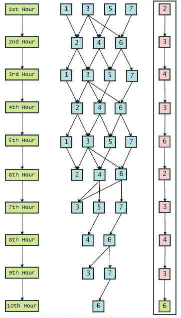

第一解|作者图片。

## 解决方案 2:

我们正在考虑最坏的情况。

在这种情况下，在第一个小时，外星人可以从行星 1、行星 3、行星 5 或行星 7 出发。假设，在第一个小时，我们正在访问行星-2 并且没有在那里发现外星人。现在，在第二个小时，外星人可以移动到行星 2，行星 4，或行星 6。

假设，在第二个小时，我们正在访问行星-3 并且没有在那里发现外星人。现在，在第三个小时，外星人可以移动到行星 1，行星 3，行星 5，或行星 7。假设，在第三个小时，我们正在访问飞机-6，并没有发现那里的外星人。现在，在第四个小时，外星人可以移动到行星 2，行星 4，或行星 6。

假设，在第四个小时，我们正在访问行星-3 并且没有在那里发现外星人。在第五个小时，外星人可以移动到行星 1、行星 3、行星 5 或行星 7。假设，在第 5 个小时，我们正在访问行星-4 并且没有在那里发现外星人。现在，在第六个小时，外星人可以移动到行星 2，行星 4，或行星 6。假设，在第六个小时，我们正在访问行星-2 并且没有在那里发现外星人。这意味着外星人一定去过 4 号行星或 6 号行星。现在，在第七个小时，外星人可以移动到第三部分，第五颗行星，或第七颗行星。假设，在第 7 个小时，我们正在访问行星-3 并且没有在那里发现外星人。这意味着在第 7 个小时，外星人一定去过行星 5 或行星 7。所以，在第八小时，外星人可以移动到行星 4 或行星 6。

假设，在第八个小时，我们正在访问行星-6 并且没有在那里发现外星人。这意味着外星人一定在第八小时到过 4 号行星。现在，在第九个小时，外星人可以移动到行星 3 或行星 5。假设，在第 9 个小时，我们正在访问行星-3 并且没有在那里发现外星人。这意味着在第 9 个小时，外星人一定去过 5 号星球。所以在第十个小时，外星人只能移动到 4 号星球。因此，如果我们在第 10 个小时访问行星 4，那么我们肯定会在那里找到它们。

## 耗时:10 小时

可能路线|作者图片。

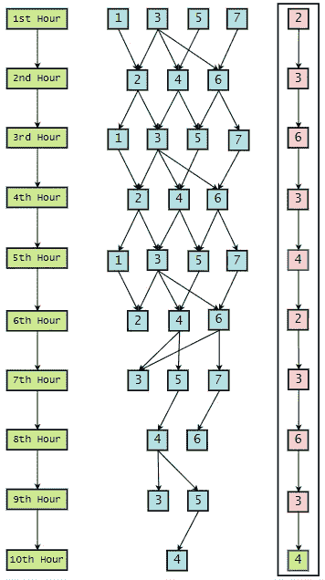

第二种解决方案|作者图片。

## 解决方案— 3:

我们正在考虑最坏的情况。

在这种情况下，在第一个小时，外星人可以从行星 1、行星 3、行星 5 或行星 7 出发。假设，在第一个小时，我们正在访问行星-4 并且没有在那里发现外星人。现在，在第二个小时，外星人可以移动到行星 2，行星 4，或行星 6。假设，在第二个小时，我们正在访问行星-3 并且没有在那里发现外星人。现在，在第三个小时，外星人可以移动到行星 1，行星 3，行星 5，或行星 7。假设，在第三个小时，我们正在访问 plane-2 并且没有在那里发现外星人。现在，在第四个小时，外星人可以移动到行星 2，行星 4，或行星 6。

假设，在第四个小时，我们正在访问行星-3 并且没有在那里发现外星人。在第五个小时，外星人可以移动到行星 1、行星 3、行星 5 或行星 7。假设，在第 5 个小时，我们正在访问行星 6，并没有在那里发现外星人。现在，在第六个小时，外星人可以移动到行星 2，行星 4，或行星 6。假设，在第六个小时，我们正在访问行星-4 并且没有在那里发现外星人。这意味着外星人一定去过行星 2 或行星 6。现在，在第 7 个小时，外星人可以移动到行星 1，行星 3，或行星 7。

假设，在第 7 个小时，我们正在访问行星-3 并且没有在那里发现外星人。这意味着在第 7 个小时，外星人一定去过行星 5 或行星 7。所以，在第八小时，外星人可以移动到行星 2 或行星 6。假设，在第八个小时，我们正在访问行星-2 并且没有在那里发现外星人。这意味着外星人一定在第八小时到过 6 号行星。现在，在第九个小时，外星人可以移动到行星 3 或行星 7。

假设，在第 9 个小时，我们正在访问行星-3 并且没有在那里发现外星人。这意味着在第 9 个小时，外星人一定去过 7 号行星。所以在第十个小时，外星人只能移动到 6 号星球。因此，如果我们在第十个小时访问行星 6，那么我们肯定会在那里找到它们。

## 耗时:10 小时

可能路线|作者图片。

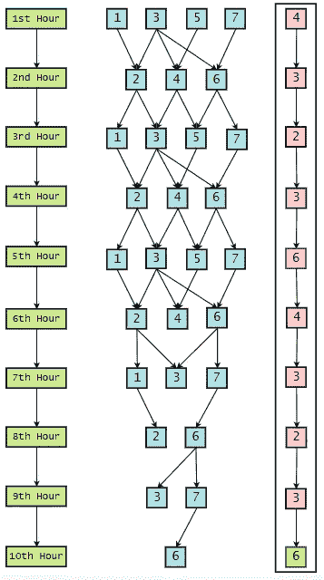

第三种解决方案|作者图片。

## 解决方案— 4:

我们正在考虑最坏的情况。

在这种情况下，在第一个小时，外星人可以从行星 1、行星 3、行星 5 或行星 7 出发。假设，在第一个小时，我们正在访问行星-4 并且没有在那里发现外星人。现在，在第二个小时，外星人可以移动到行星 2，行星 4，或行星 6。

假设，在第二个小时，我们正在访问行星-3 并且没有在那里发现外星人。现在，在第三个小时，外星人可以移动到行星 1，行星 3，行星 5，或行星 7。假设，在第三个小时，我们正在访问飞机-6，并没有发现那里的外星人。现在，在第四个小时，外星人可以移动到行星 2，行星 4，或行星 6。假设，在第四个小时，我们正在访问行星-3 并且没有在那里发现外星人。在第五个小时，外星人可以移动到行星 1、行星 3、行星 5 或行星 7。

假设，在第 5 个小时，我们正在访问行星-2 并且没有在那里发现外星人。现在，在第六个小时，外星人可以移动到行星 2，行星 4，或行星 6。假设，在第六个小时，我们正在访问行星-4 并且没有在那里发现外星人。这意味着外星人一定去过行星 2 或行星 6。现在，在第 7 个小时，外星人可以移动到行星 1，行星 3，或行星 7。假设，在第 7 个小时，我们正在访问行星-3 并且没有在那里发现外星人。这意味着在第 7 个小时，外星人一定去过行星 5 或行星 7。

所以，在第八小时，外星人可以移动到行星 2 或行星 6。假设，在第八个小时，我们正在访问行星-6 并且没有在那里发现外星人。这意味着外星人一定在第八小时到过 2 号行星。现在，在第九个小时，外星人可以移动到行星 1 或行星 3。假设，在第 9 个小时，我们正在访问行星-3 并且没有在那里发现外星人。这意味着在第 9 个小时，外星人一定去过行星 1。所以在第十个小时，外星人只能移动到 2 号星球。所以如果我们在第十个小时拜访行星 2，那么我们会在那里找到他们。

## 耗时:10 小时

可能路线|作者图片。

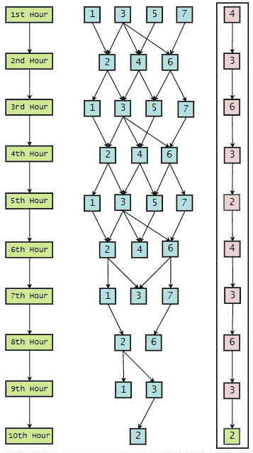

第四种解决方案|作者图片。

## 解决方案— 5:

我们正在考虑最坏的情况。

在这种情况下，在第一个小时，外星人可以从行星 1、行星 3、行星 5 或行星 7 出发。假设，在第一个小时，我们正在访问行星-6 并且没有在那里发现外星人。现在，在第二个小时，外星人可以移动到行星 2，行星 4，或行星 6。假设，在第二个小时，我们正在访问行星-3 并且没有在那里发现外星人。

现在，在第三个小时，外星人可以移动到行星 1，行星 3，行星 5，或行星 7。假设，在第三个小时，我们正在访问 plane-2 并且没有在那里发现外星人。现在，在第四个小时，外星人可以移动到行星 2，行星 4，或行星 6。假设，在第四个小时，我们正在访问行星-3 并且没有在那里发现外星人。在第五个小时，外星人可以移动到行星 1、行星 3、行星 5 或行星 7。

假设，在第 5 个小时，我们正在访问行星-4 并且没有在那里发现外星人。现在，在第六个小时，外星人可以移动到行星 2，行星 4，或行星 6。假设，在第六个小时，我们正在访问行星-6 并且没有在那里发现外星人。这意味着外星人一定去过行星 2 或行星 4。现在，在第 7 个小时，外星人可以移动到行星 1，行星 3，或行星 5。假设，在第 7 个小时，我们正在访问行星-3 并且没有在那里发现外星人。这意味着在第 7 个小时，外星人一定去过行星 1 或行星 5。

所以，在第八小时，外星人可以移动到行星 2 或行星 4。假设，在第八个小时，我们正在访问行星-2 并且没有在那里发现外星人。这意味着外星人一定在第八小时到过 4 号行星。现在，在第九个小时，外星人可以移动到行星 3 或行星 5。假设，在第 9 个小时，我们正在访问行星-3 并且没有在那里发现外星人。这意味着在第 9 个小时，外星人一定去过 5 号星球。所以在第十个小时，外星人只能移动到 4 号星球。因此，如果我们在第 10 个小时访问行星 4，那么我们肯定会在那里找到它们。

## 耗时:10 小时

可能路线|作者图片。

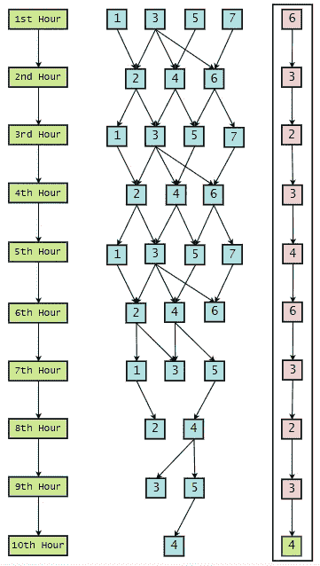

第五解|作者图片。

## 解决方案— 6:

我们正在考虑最坏的情况。

在这种情况下，在第一个小时，外星人可以从行星 1、行星 3、行星 5 或行星 7 出发。假设，在第一个小时，我们正在访问行星-6 并且没有在那里发现外星人。

现在，在第二个小时，外星人可以移动到行星 2，行星 4，或行星 6。假设，在第二个小时，我们正在访问行星-3 并且没有在那里发现外星人。现在，在第三个小时，外星人可以移动到行星 1，行星 3，行星 5，或行星 7。假设，在第三个小时，我们正在参观飞机-4 并且没有在那里发现外星人。现在，在第四个小时，外星人可以移动到行星 2，行星 4，或行星 6。假设，在第四个小时，我们正在访问行星-3 并且没有在那里发现外星人。

在第五个小时，外星人可以移动到行星 1、行星 3、行星 5 或行星 7。在第五个小时，假设我们正在访问行星 2，并且没有在那里发现外星人。现在，在第六个小时，外星人可以移动到行星 2，行星 4，或行星 6。在第六个小时，假设我们正在访问行星-6 并且没有在那里发现外星人。这意味着外星人一定去过行星 2 或行星 4。现在，在第 7 个小时，外星人可以移动到行星 1，行星 3，或行星 5。在第 7 个小时，假设我们正在访问行星 3，并且没有在那里发现外星人。这意味着在第 7 个小时，外星人一定去过行星 1 或行星 5。

所以，在第八小时，外星人可以移动到行星 2 或行星 4。假设，在第八个小时，我们正在访问行星-4 并且没有在那里发现外星人。这意味着外星人一定在第八小时到过 2 号行星。现在，在第九个小时，外星人可以移动到行星 1 或行星 3。在第九个小时，假设我们正在访问行星-3 并且没有在那里发现外星人。这意味着在第 9 个小时，外星人一定去过行星 1。所以在第十个小时，外星人只能移动到 2 号星球。因此，如果我们在第十个小时访问行星 2，那么我们肯定会在那里找到它们。

可能路线|作者图片。

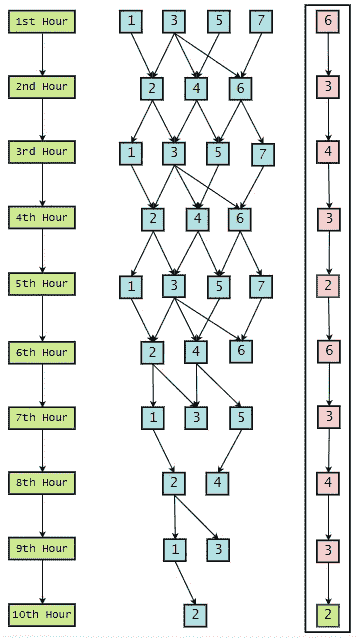

第六解|作者图片。

## Python 实现:

1.  为外星人生成可能的路线:

2.生成可能路线的组合:

3.正好有十个运动的路线:

4.验证解决方案:

5.合并所有列表:

6.验证解决方案路线(通用):

我们希望你喜欢阅读这篇文章，并从中学到一些新的东西。

给普拉蒂克买杯咖啡！

**免责声明:**本文所表达的观点均为作者个人观点，不代表与作者(直接或间接)相关的任何公司的观点。这项工作并不打算成为最终产品，而是当前思想的反映，同时也是讨论和改进的催化剂。

**除非另有说明，所有图片均来自作者。**

经由[发布**走向 AI** 发布](https://towardsai.net/)

## 资源:

 [## 七 _ 行星 _ 谜语/报告

### AI 相关教程。免费访问其中任何一个→https://towardsai.net/editorial-toward sai/教程

github.com](https://github.com/towardsai/tutorials/blob/master/logic/seven_planets_riddle.py)  [## 七大行星之谜——谷歌合作实验室

colab.research.google.com](https://colab.research.google.com/drive/1iOeJjZV1yAAt2X0AyL3ICcWuhhlvSbS8?usp=sharing)