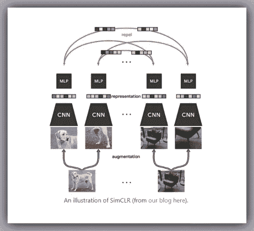
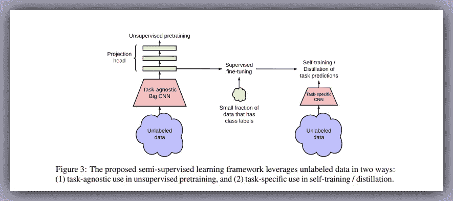
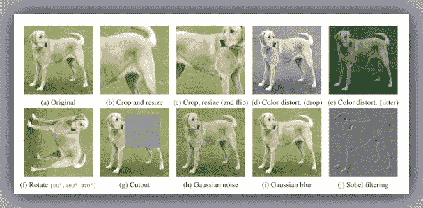
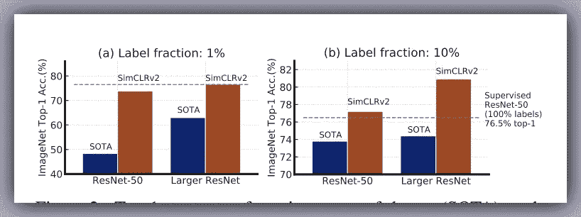
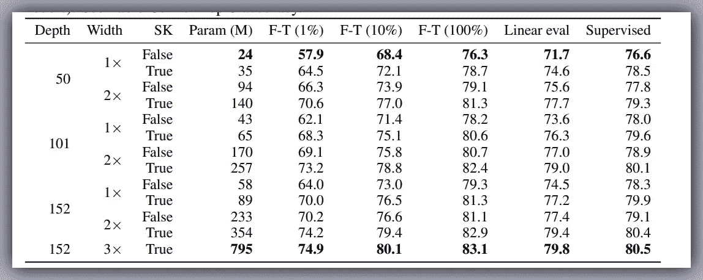
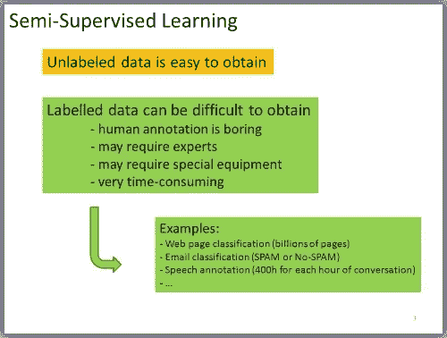
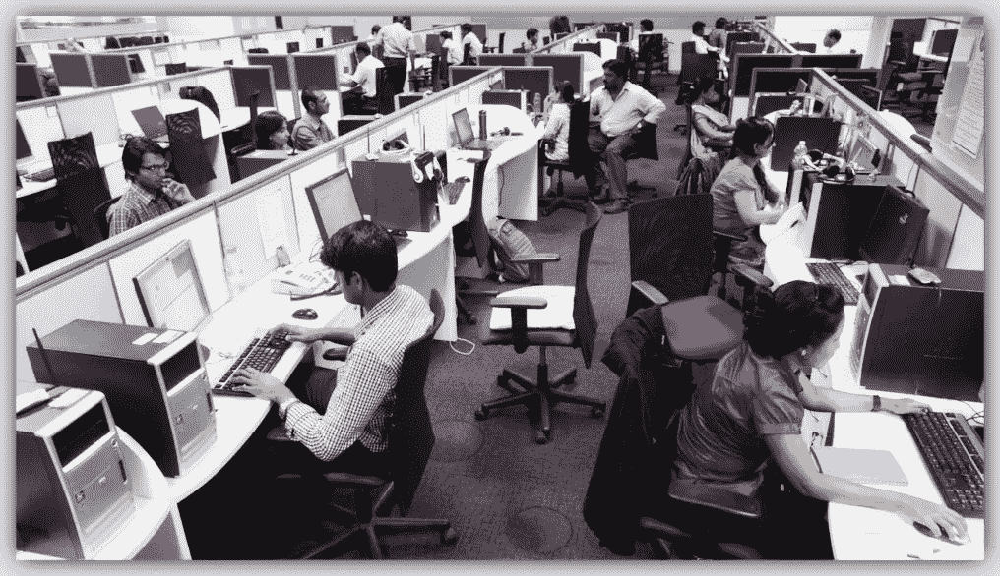

# SimCLRv2 框架

> 原文：<https://pub.towardsai.net/the-simclrv2-framework-6de26606b7ef?source=collection_archive---------0----------------------->

## [机器学习](https://towardsai.net/p/category/machine-learning)

## 一个巨大的自我学习算法通常表现得更好…

[Img_Credit](https://ai.googleblog.com/2020/04/advancing-self-supervised-and-semi.html)

> 巨大的自我监督模型是强有力的半监督学习器..

# 目录:

1.  介绍
2.  关键洞察力
3.  结果
4.  为什么它很重要
5.  我在想

计算机视觉的时代即将来临……|[Img _ Credit](https://www.iotforall.com/wp-content/uploads/2017/08/08.17-Computer-Vision.jpg)

# **简介:**

计算机视觉中长期存在的问题可能即将结束，在这个问题上，模型发现在利用大量未标记数据进行训练的同时，很难在少数有标记的例子上进行学习。

**sim clr 框架**
谷歌研究院的研究人员，由杰弗里·辛顿、陈婷和其他几个人组成的大脑团队构建了 [***SimCLR 框架***](https://github.com/google-research/simclr) 。SimCLR 是视觉表征对比学习的简单框架。SimCLR 首先在未标记的数据集上学习图像的一般表示，然后可以使用少量标记的图像进行微调，以实现给定分类任务的良好性能。

遵循被称为 [***对比学习***](https://ankeshanand.com/blog/2020/01/26/contrative-self-supervised-learning.html) *的方法，通过同时最大化同一图像的不同变换视图之间的一致性和最小化不同图像的变换视图之间的一致性来学习通用表示。*使用该对比目标更新神经网络的参数使得对应视图的表示彼此“吸引”,而不对应视图的表示彼此“排斥”。

之后，SimCLR 使用[全连接网络](https://en.wikipedia.org/wiki/Convolutional_neural_network#Fully_connected)(即 [MLP](https://en.wikipedia.org/wiki/Multilayer_perceptron) )计算图像表示的非线性投影(**投影头**)，这放大了不变特征并最大化了网络识别同一图像的不同变换的能力

**simclrv 2 框架的新特性:**

[Img_Credit](https://arxiv.org/pdf/2006.10029.pdf)

在最近一篇题为 [**“大型自我监督模型是强大的半监督学习器”**](https://arxiv.org/abs/2006.10029) 的论文中，谷歌的这个研究团队提高了最先进的(SOTA)自我监督模型在 ImageNet 数据集上的性能。这一壮举是使用 SimCLRv2 框架实现的，该框架由一个更大的自监督 ResNet 模型组成，构建于早期的 SimCLR 架构之上。因此，[***simclrv 2***](https://arxiv.org/pdf/2006.10029.pdf)是对 SimCLR 框架的改进。

# **关键洞察:**

诸如[***BERT***](https://arxiv.org/abs/1810.04805)之类的自然语言处理模型的最新进展表明，在对较小的已标记数据集进行微调之前，可以通过首先对大的未标记数据集进行预训练来获得良好的结果。然而，现有的图像数据自监督方法复杂且难以采用。SimCLRv2 倾向于简化和改进这一过程，它增强了早先引入的一种叫做 [*对比学习*](https://ankeshanand.com/blog/2020/01/26/contrative-self-supervised-learning.html) 的方法。

**工作原理:**

通过研究 SimCLR 和 SimCLRv2 论文，我们发现这两种方法都使用了第一种方法，即在大型未标记数据集上进行自我监督预训练。这有助于模型通过同时最大化同一图像的不同变换视图之间的一致性和最小化不同图像的变换视图之间的一致性来学习数据的一般表示。

**SimCLRv2 对 SimCLR 框架进行了 3 项新的重大修改，包括:-**

应用随机裁剪加上颜色变形会产生最大的效果…

**第一步:**

在自我监督的预训练阶段，每个图像通过随机裁剪、随机颜色失真和高斯模糊进行增强。大小至关重要，因此 SimCLRv2 使用更深但更窄的 *ResNet-152* 、 *(3x)型号*，以及*选择性内核(SK)* 。而 SimCLR 使用的是 *ResNet-50(4x)* ，型号。

**第二步:**

监督微调是使用几个标记的例子来完成的。SimCLRv2 使用一个更宽的非线性投影头(MLP)，集成到基本编码器中。这种方法相当于从投影头的中间层进行微调，而不是像在 SimCLR 中那样从输入层进行微调。

**第三步:**

再次使用相同的未标记的例子进行自我训练，但是以特定于任务的方式进行。大的、微调的网络被用作教师来估算用于训练学生网络的伪标签。因此，老师可以以最小的准确度损失被[提取到一个更小的学生网络](https://arxiv.org/pdf/2006.10029.pdf)中。

# **结果**:

*   使用 *ResNet-50* 架构，SimCLRv2 在 ImageNet 数据的 1%标签分数上与 SimCLR 抗衡，实现了 73.9%的顶级准确性，比 SOTA 高 53%。
*   在 10%的标记分数下，SimCLRv2 达到了 77.5%的顶级准确率，比 SOTA 高 18%。
*   对于更大的网络，simclrv 2*ResNet-152(3x+SK)*在 1%和 10%的标签分数上分别实现了 76.6%和 80.9%的顶级准确度，比 SimCLR *ResNet-50(4x)* 模型分别高出 22%和 9%。

> 该论文表明，更大的模型倾向于用更少的标签产生更大的改进，并且倾向于随着模型大小和训练时期的增加而持续改进。

名为 [**“大的自监督模型是强的半监督学习器”**](https://arxiv.org/abs/2006.10029) 的论文也展示了以下令人印象深刻的推论…

SimCLRv2 深度为 152 层，宽度为 3 倍，simclrv 2*ResNet-152(3x+SK)*拥有超过****7.95 亿个参数*** ，从上面的图表中可以看出，它在 ImageNet ILSVRC-2012 数据集的 1%、10%和 100%上表现最佳。在线性评估和监督分类任务中也保持了这种优异的性能。*

## *更大的模型更有标签效率。*

*该论文还表明，对于监督和半监督学习，更大的模型更具标签效率，但半监督学习的增益似乎更大。此外，值得指出的是，虽然模型越大越好，但一些模型(例如，使用 SK)比其他模型的参数效率更高*

# ***为什么重要:***

**

*这个世界充满了未标记的数据。因此，本文中的发现可以用来提高任何计算机视觉应用的准确性，在这些应用中，标记额外数据比训练更大的模型(如医学成像)更昂贵或更困难。*

# ***我在想:***

**

*印度人工智能热潮背后的数据标签| [Img_Credit](https://www.google.com/url?sa=i&url=https%3A%2F%2Fwww.dailyo.in%2Ftechnology%2Fdata-labelling-artificial-intelligence-indian-ai-sector-facebook-technology%2Fstory%2F1%2F32396.html&psig=AOvVaw3N9VBb76Tw2xUw5QR8WeJk&ust=1600010608499000&source=images&cd=vfe&ved=0CA0QjhxqFwoTCPCny5v24-sCFQAAAAAdAAAAABAD)*

*针对特定任务进行微调的自我监督模型可以极大地改善计算机视觉应用。但是必须有一个平衡，因为有一个围绕[人类数据标签服务](https://www.google.com/url?sa=i&url=https%3A%2F%2Fwww.dailyo.in%2Ftechnology%2Fdata-labelling-artificial-intelligence-indian-ai-sector-facebook-technology%2Fstory%2F1%2F32396.html&psig=AOvVaw3N9VBb76Tw2xUw5QR8WeJk&ust=1600010608499000&source=images&cd=vfe&ved=0CA0QjhxqFwoTCPCny5v24-sCFQAAAAAdAAAAABAD)建立的整个行业，并且可能减少这些服务需求的技术可能会在这些困难时期导致收入损失。*

***干杯！***

# *关于我:*

*劳伦斯是技术层的数据专家，对公平和可解释的人工智能和数据科学充满热情。我相信分享知识和经验是最好的学习方式。我同时持有 IBM 的 ***数据科学专业*** *和* ***高级数据科学专业*** *证书和 IBM****的*** ***数据科学讲解徽章*** *。我已经使用 ML 和 DL 库进行了几个项目，我喜欢尽可能多地编写我的函数。最后，我从未停止学习和尝试，是的，我已经写了几篇被强烈推荐的文章。**

*请随时在以下网址找到我*

*[Github](https://github.com/Lawrence-Krukrubo)*

*[**领英**](https://www.linkedin.com/in/lawrencekrukrubo/)*

*[**推特**](https://twitter.com/LKrukrubo)*