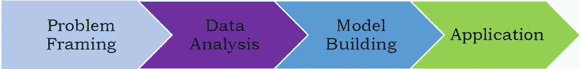
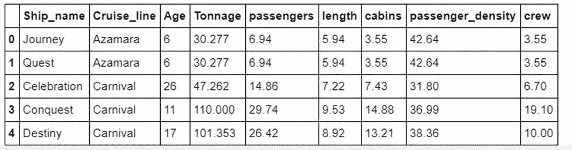
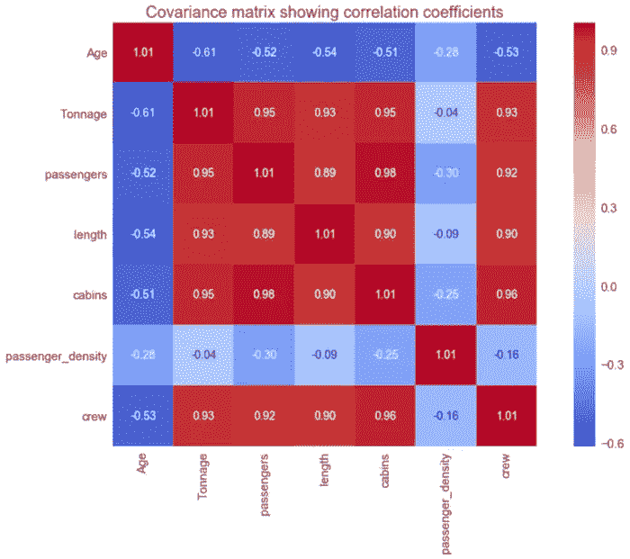
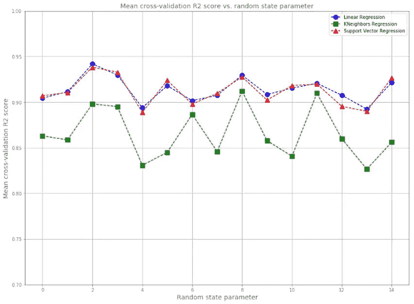

# 数据科学问题的解决方案不是唯一的

> 原文：<https://pub.towardsai.net/the-solution-to-a-data-science-problem-is-not-unique-209b59405f14?source=collection_archive---------3----------------------->

## [数据科学](https://towardsai.net/p/category/data-science)

## 数据科学问题的解决方案取决于数据科学追求者的专业知识和经验，因此没有两个解决方案是相同的


图片来源:Pexels

# 介绍

数据科学项目的范围和复杂性各不相同。有时，项目可能简单到产生汇总统计数据、图表和可视化。它还可能涉及构建回归模型、分类模型或使用时间相关数据集进行预测。该项目也可能非常复杂和困难，对于使用哪种具体类型的模型没有明确的指导。在这种情况下，提出一个最适合实现项目目标的模型是数据科学专业人士的任务。

我认为数据科学项目的解决方案不是唯一的。即使提供了关于要使用的模型类型的明确指导，实施也可能因人而异，取决于他们在数据科学项目上的经验水平。

例如，两个数据科学专业人员可以被分配一个项目，使用同一个数据集构建多元回归模型。由于模型的质量取决于各种因素(见下文)，基于他们处理这些问题的能力，我们预计这两个人的解决方案会有所不同:

*   数据质量(错误数据、缺失数据、数据异常值、数据冗余、数据不平衡、数据缺乏可变性、动态数据、数据大小)
*   特征工程(缩放、转换——PCA、LDA 等)
*   调整模型中的超参数
*   使用不同的算法，例如在集合方法中(例如线性回归、KNN 回归、SVR 等)
*   估计不确定性

在本文中，我们将展示两个来自数据科学工作面试的案例研究(*带回家的挑战练习*)。我们会看到其中一个问题非常直接，而另一个问题似乎没有唯一的解决方案。

# 案例研究 1:推荐游轮船员人数的模型

**说明:**这个编码练习要用 python(团队使用的编程语言)来进行。你可以自由使用互联网和任何其他图书馆。请将您的作品保存在 Jupyter 笔记本中，并通过电子邮件发送给我们进行审核。

数据文件:cruise_ship_info.csv(该文件将通过电子邮件发送给您)

建立一个回归方程，为潜在的船只购买者推荐“船员”的数量。

请执行以下步骤(提示:使用 numpy、scipy、pandas、sklearn 和 matplotlib)

1.  *读取文件并显示列。*
2.  *计算数据的基本统计数据(计数、平均值、标准偏差等)，检查数据并陈述您的观察结果。*
3.  *选择可能对预测“团队”规模很重要的列。*
4.  *如果你删除了栏目，解释一下为什么要删除。*
5.  *对分类特征使用一键编码。*
6.  *创建训练和测试集(将 60%的数据用于训练，其余用于测试)。*
7.  *建立一个机器学习模型来预测“船员”的规模。*
8.  *计算训练集和测试数据集的皮尔逊相关系数。*
9.  *描述您模型中的超参数，以及您将如何更改它们以提高模型的性能。*
10.  *什么是正规化？你的模型中的正则化参数是什么？*
11.  *为测试和训练集绘制正则化参数值与皮尔逊相关性的曲线图，并查看您的模型是否存在偏差问题或方差问题。*

这是一个非常简单的问题的例子。数据集干净小巧(160 行 9 列)，指令非常清晰。因此，所有需要做的就是遵循指令并生成您的代码。还要注意，该指令明确指定 python 必须用作模型构建的编程语言。完成这项编码任务的时间是三天。只需提交最终的 Jupyter 笔记本，不需要正式的项目报告。

# 解决项目 1 的技巧

由于该项目涉及建立机器学习模型，第一步是确保我们理解机器学习过程:



***图 1*** *。说明机器学习过程。Benjamin O. Tayo 拍摄的图片*

**1。问题框架** *定义你的项目目标。你想知道什么？有数据可以分析吗？*

**目标** *:* 这个项目的目标是建立一个回归模型，使用邮轮数据集[**cruise _ ship _ info . CSV**](https://github.com/bot13956/ML_Model_for_Predicting_Ships_Crew_Size)**为潜在的邮轮买家推荐“船员”规模。**

**2。数据分析** *导入并清理数据集，分析特征以选择与目标变量相关的相关特征。*

**2.1 导入数据集并显示特征和目标变量**

```
df = pd.read_csv("cruise_ship_info.csv") df.head()
```



***表 1*** *:显示前 5 行数据集。*

在这个例子中，数据集是干净的，没有丢失任何值。因此，不需要清洁。

**关于数据质量的评论**:数据集的一个主要缺陷是它没有提供特征的单位。比如乘客一栏，并没有说这个栏是以百还是以千为单位。也没有提供客舱长度、乘客密度和乘务人员的单位。*乘客密度*特征似乎是从其他特征派生出来的，但是没有解释它是如何派生出来的。这类问题可以通过联系采访团队询问更多关于数据集的信息来解决。在使用数据构建真实世界的模型之前，理解数据的复杂性非常重要。请记住，糟糕的数据集会导致糟糕的预测模型。

**2.2 计算并可视化协方差矩阵**

协方差矩阵图可用于要素选择和量化要素之间的相关性(多重共线性)。我们从图 2 中观察到，特性之间有很强的相关性。



***图二*** *。协方差矩阵图。Benjamin O. Tayo 拍摄的图片*

**2.3 通过将特征转换到主成分分析(PCA)空间来执行特征工程**

由于协方差矩阵显示多重共线性，因此在训练模型之前将要素转换到 PCA 空间非常重要。这一点非常重要，因为要素之间的多重共线性会导致模型变得复杂且难以解释。PCA 还可以用于变量选择和降维。在这种情况下，只有对总解释方差有显著贡献的构件才能保留并用于建模建筑。

**3。模型构建**

*选择与您的数据和预期结果相匹配的机器学习工具。用可用数据训练模型。*

**3.1 建模和评估**

因为我们的目标是使用回归，所以可以实现不同的回归算法，例如**线性回归(LR)** 、**近邻回归(KNR)** 和**支持向量回归(SVR)** 。数据集必须分为训练集、验证集和测试集。必须使用超参数调整来微调模型，以防止过度拟合。交叉验证对于确保模型在验证集上表现良好至关重要。在微调模型参数之后，模型必须应用于测试数据集。该模型在测试数据集上的性能与使用未知数据进行预测时的预期性能大致相当。

**3.2 不确定性量化**

这可以通过使用训练数据集的不同随机分区来训练模型，然后平均每个随机状态参数的交叉验证分数来完成。



***图 3*** *。不同回归模型的平均交叉验证显示。Benjamin O. Tayo 的图片*

**4。应用程序** *对您的最终模型进行评分，以生成预测。使您的模型可用于生产。根据需要重新训练您的模型。*

在这个阶段，选择最终的机器学习模型并投入生产。该模型在生产环境中进行评估，以评估其性能。从实验模型转换到生产线上的实际性能时遇到的任何错误都必须进行分析。然后，这可以用于微调原始模型。

根据**图 3** 中的平均交叉验证分数，我们观察到线性回归和支持向量回归的表现几乎处于同一水平，并且优于 KNeighbors 回归。因此，最终选择的模型可以是线性回归或支持向量回归。

**关于样例 1 编码练习的完整解决方案，请参见以下链接:** [*样例 1 推荐解决方案*](https://github.com/bot13956/ML_Model_for_Predicting_Ships_Crew_Size) [*机器学习过程教程*](https://medium.com/swlh/machine-learning-process-tutorial-222327f53efb)

**关于样本 1 编码练习的备注**

有时编码练习会要求你只提交一个 Jupyter 笔记本，或者要求一份完整的项目报告。确保你的 Jupyter 笔记本井井有条，以反映机器学习过程的每个阶段。Jupyter 笔记本样本可以在这里找到*:*[ML _ Model _ for _ Predicting _ Ships _ Crew _ Size](https://github.com/bot13956/ML_Model_for_Predicting_Ships_Crew_Size)。

# 案例研究 2:预测贷款状况的模型

**说明:**在这个问题中，你将预测一个贷款组合的结果。每笔贷款计划在 3 年内偿还，结构如下:

*   *首先，借款人收到资金。这一事件被称为起源。*
*   *然后，借款人定期还款，直到发生以下情况之一:*

*(i)借款人在 3 年期限结束前停止付款，通常是由于财务困难。这一事件被称为销账，然后贷款被称为已销账。*

*(ii)借款人继续还款，直到发放日期后 3 年。至此，债务已全部还清。在附加的 CSV 中，每行对应一笔贷款，列的定义如下:*

*   *标题为“自发起以来的天数”的列表示发起和数据收集日期之间经过的天数。*
*   *对于在收集数据之前已注销的贷款，标题为“从发起到注销的天数”的列表示发起和注销之间经过的天数。对于所有其他贷款，此栏为空白。*

*我们希望您估计一下，在所有这些贷款的 3 年期限结束时，这些贷款中有多少会被冲销。请包括你如何得到你的答案的一个严格的解释，并且包括你使用的任何代码。你可以做出简化的假设，但是请明确地陈述这些假设。请随意以您喜欢的任何形式提出您的答案；特别是 PDF 和 Jupyter 笔记本都可以。此外，我们希望这个项目不会占用您超过 3-6 个小时的时间。*

这里的数据集很复杂(有 50，000 行和 2 列，还有很多缺失值)，问题也不是很简单。你必须严格检查数据集，然后决定使用什么模型。这个问题将在一周内解决。它还规定提交一份正式的项目报告和一份 R 脚本或 Jupyter 笔记本文件。

# 解决案例研究 2 的技巧

与示例 1 编码练习一样，在处理这个问题时，您需要遵循机器学习步骤。这个粒子问题没有唯一的解。我试图用基于蒙特卡罗模拟的概率模型来解决这个问题。

有关示例 2 编码练习的完整解决方案，请参见以下链接:

[*样本 2 推荐方案*](https://github.com/bot13956/Monte_Carlo_Simulation_Loan_Status) [*数据科学编码练习 R 脚本*](https://medium.com/towards-artificial-intelligence/r-script-for-data-science-coding-exercise-633800dd63ec) [*数据科学编码练习项目报告*](https://towardsdatascience.com/project-report-for-data-science-coding-exercise-9a9c76a09be8)

**关于样本 2 编码练习的备注**

上述解决方案仅是推荐的解决方案。请记住，数据科学或机器学习项目的解决方案不是唯一的。我建议您在查看示例解决方案之前先解决这些问题。

# 摘要

总之，我们讨论了两个难度不同的数据科学项目案例研究。在案例研究 1 中，目标是建立一个回归模型，根据其他预测变量预测其中一个变量。在案例研究 2 中，我们发现这个问题没有唯一的解决方案。在这种情况下，数据科学申请人需要打破常规，想出一个有意义的解决方案。