# Face2Vec (FaceNet)的优缺点

> 原文：<https://pub.towardsai.net/the-strengths-weaknesses-of-face2vec-facenet-612a28a17826?source=collection_archive---------2----------------------->

## [计算机视觉](https://towardsai.net/p/category/computer-vision)

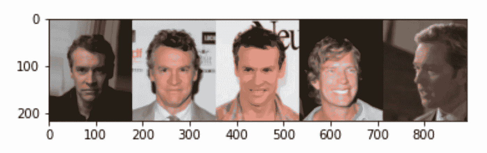

Face2Vec 是识别相同/相似人脸的现代方法。

Face2Vec 指的是将人脸转换为矢量的过程，这个过程被称为矢量化，将对象/图像/文本转换为数字表示(如果你想了解更多，请阅读[这个](https://getvectorai.com/blog/what-are-vectors-the-silent-disrupter/))。

最近，我将 Face2Vec 添加到了 [VectorHub](http://hub.vctr.ai) 资源库(我维护的一个开源资源库，用于托管和共享 ___2Vec 模型)。Face2Vec 是世界上使用最广泛的矢量化工具之一，构成了当今大量应用程序的基础，包括社交媒体过滤器、身份识别和验证。

在本文中，我们探讨了 FaceNet 的优势和劣势——让读者了解该模型在哪些方面表现良好，在哪些方面表现不佳。从那里，我们更深入地了解 FaceNet 的架构及其实现。

我推荐在 VectorHub 上探索这种模式，亲自尝试一下！您可以[用 3 行 Python 代码试用模型](https://hub.getvectorai.com/model/image%2Fface2vec)，并在不到 5 分钟的时间内开始搜索您自己的数据集。

**优势&劣势**

读者注意:优势和劣势是使用 **VectorHub 实现**比较 Face2Vec 模型。不同实施的结果可能会有所不同。使用定制的、随机的和变换的图像进行了一系列实验，以测试该模型在实践中的表现。许多最初的人脸是从 Celeb-A 数据集的一部分中检索出来的(下面引用了大约 5 000 张图片),可以在 Tensorflow 的数据集模块中找到。我们以此为基础来探索我们在 VectorHub 中实现的 Face2Vec 模型的有效性。

然而，在我们的实验中有一些我们想要承认的弱点。还有许多领域有待探索(不同种族/性别如何在面部图像识别中发挥作用，除非数据集中有特定的属性允许我们探索这些——需要考虑确定这些是否是 Face2Vec 实现的边缘情况。下面看到的例子也是精心挑选的，最好地说明了所说的概念，但反映了更广泛的总体趋势。

**优势**

*   能够通过不同的面部表情和角度识别相似的面孔

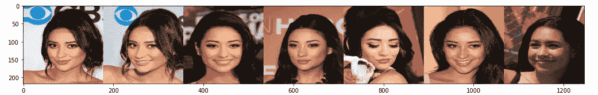

尽管面部表情差异很大，但仍能认出同一个人。(最左边的图像是搜索查询，后面是从最高排名到最低排名的结果。)

*   能够处理不同的照明/变换

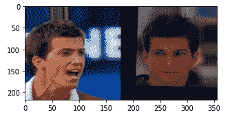

该模型将这两幅图像识别为彼此最相似。(最左边的图像是搜索查询，后面是从最高排名到最低排名的结果。)

*   尽管脸上有标记，但仍能识别同一张脸

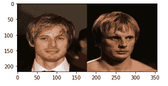

进行了一个有趣的比较，其中个人脸上有血，识别系统仍然设法匹配它们！(最左边的图像是搜索查询，后面是从最高排名到最低排名的结果。)

*   面部差异很大的动作镜头仍然可以匹配！这意味着，在面部表情可能与日常表情明显不同的体育比赛期间拍摄的照片，模型仍然能够识别相似的个人。

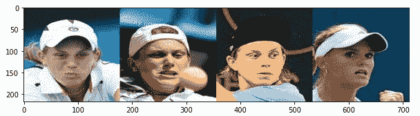

尽管面部前方和动作镜头中间有物体，表情可能会发生显著变化，但 FaceNet 仍然能够确定相同的面部。(最左边的图像是搜索查询，后面是从最高排名到最低排名的结果。)

*   能够处理半张脸。令人惊讶的是——当半边脸被切除时，模型甚至能够正确地确定个体！

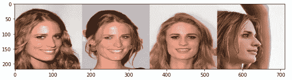

当只向模型显示半张脸时识别个体的例子。(最左边的图像是搜索查询，后面是从最高排名到最低排名的结果。)

**弱点**

*   如果编辑的图像前面有单词，则无法找到好的匹配。

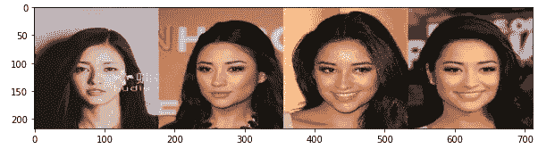

当单词出现在图像中时，匹配可能很差。(最左边的图像是搜索查询，后面是从最高排名到最低排名的结果。)

*   如果个人佩戴眼镜，Face2Vec 过度关注类似的眼镜。

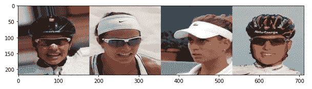

模型在探索中过度关注眼睛的例子！(最左边的图像是搜索查询，后面是从最高排名到最低排名的结果。)

*   然而，该模型也可以在不同种族和肤色之间进行改进。下面是一个执行这种实例的子部分的模型示例。

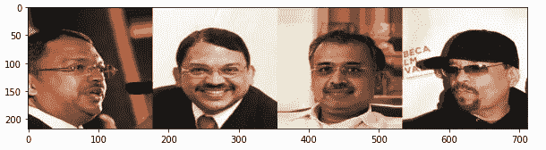

不同种族的个人表现低于标准。(最左边的图像是搜索查询，后面是从最高排名到最低排名的结果。)

总体而言，该模型在许多领域表现良好，但在一些边缘情况下表现不佳。然而，我毫不怀疑，如果该模型用数据集重新训练，该数据集具有更多具有更大种族、眼镜和更大代表性容量的失真的图像，那么它将表现得更好。如果读者知道这些模型，请随时告诉我们，我们很乐意将这些模型添加到 VectorHub 中(或者提交您自己的拉取请求，我们会进行审核！).

在接下来的部分中，我们将详细探讨如何执行它，以及可以在我们的 VectorHub 存储库中找到的两阶段实现过程。

**了解 FaceNet**

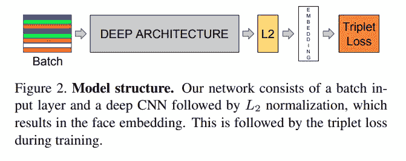

来自官方的 FaceNet 文件(参考下文)

FaceNet 架构很简单(一个标准的 CNN)，但是它的新颖之处在于它使用了**三重损失**。

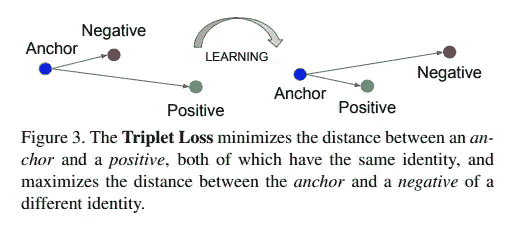

用三重丢失训练的模型找到一个正面例子和一个负面例子。然后对其进行训练，使其更接近正的，而远离负的。

今天的三联体丢失不是什么突破性的事情，现在是被认为是一次性学习的一部分。

**VectorHub 实施**

VectorHub 的实现是一个从照片到人脸提取再到矢量化的两阶段过程。

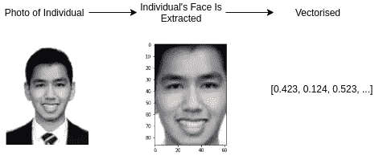

VectorHub Face2Vec 流程

该模型能够检测面部，也能识别面部标志——见下文。由此，我们可以使用向量搜索来抓取在相似地方具有面部标志的个体的照片，从而允许我们搜索具有半张脸/不同角度取向的其他照片。

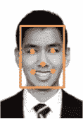

使用 MTCNN 包的面部标志。

如果您希望看到更多这种类型的分析，或者更深入地分析 ____2Vec 模型(除了 Face2Vec)，请为这个故事鼓掌/留下评论，我们可能会将它作为一个系列来介绍，并对它们进行更深入的分析。如果你对测试模型感兴趣，记得去看看 [VectorHub](http://hub.vctr.ai) ！

**引文&致谢**

如果没有研究人员和工程师的大力支持，Face2Vec 的实现是不可能的，他们已经构建了一些令人难以置信的包！

其中包括 Tensorflow Datasets 团队、FaceNet 团队[1]、MTCNN 团队([https://github.com/ipazc/mtcnn](https://github.com/ipazc/mtcnn))和 Celeb A 团队[2]！感谢他们的辛勤工作，允许我们访问 VectorHub 的 FaceNet2Vec 模型实现！

Schroff，Florian 和 Kalenichenko，Dmitry 和 Philbin，James，FaceNet:面部识别和聚类的统一嵌入(2015 年)，CVPR 2015 年

刘、、罗，平、王，肖刚、唐，欧，野外深度学习人脸属性，(2015)，IEEE 计算机学会。