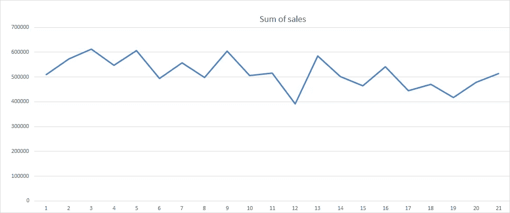
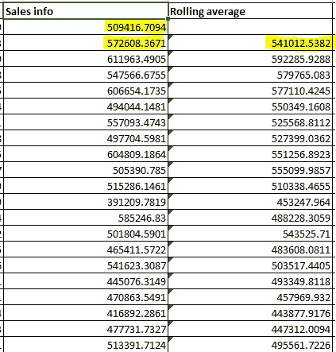
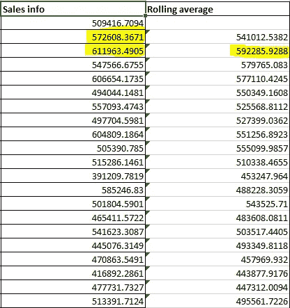
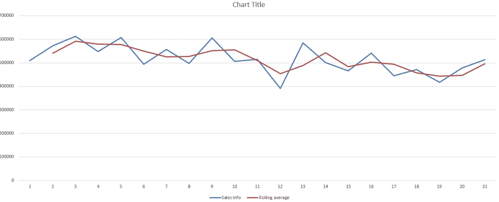
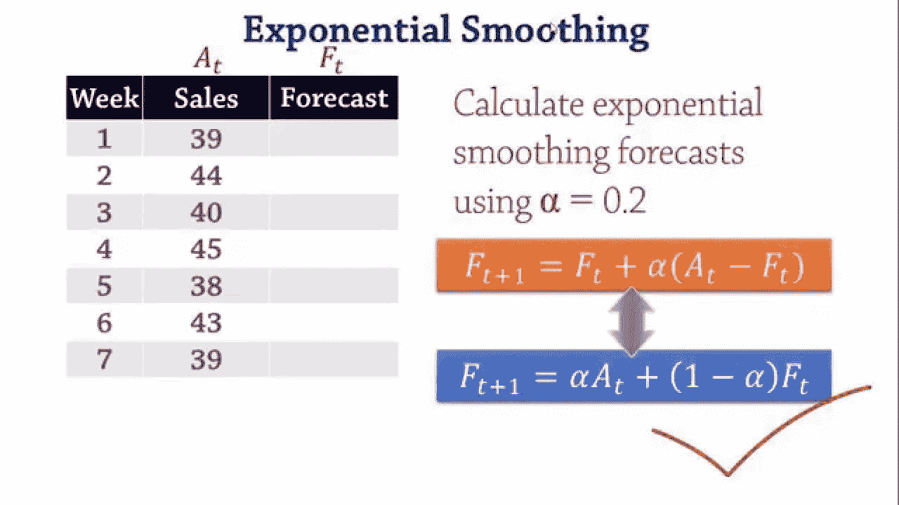
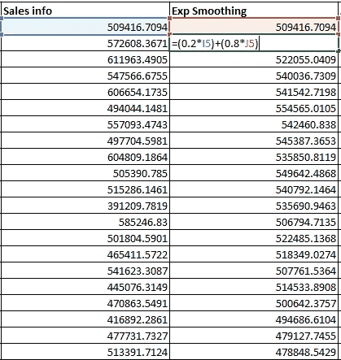
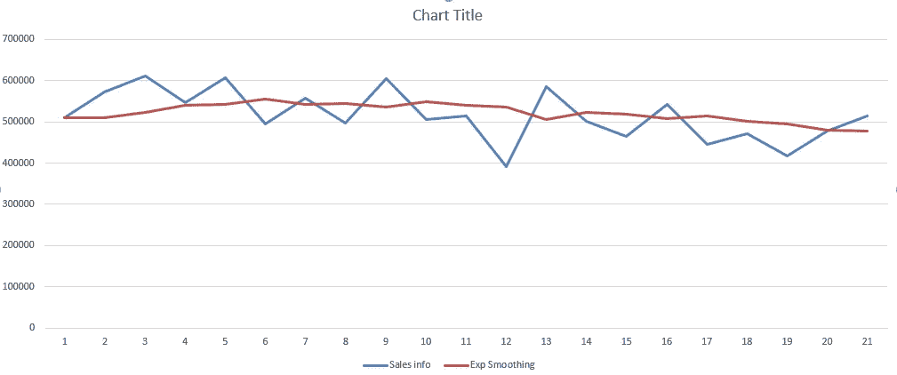
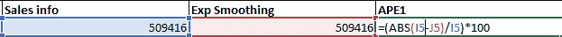
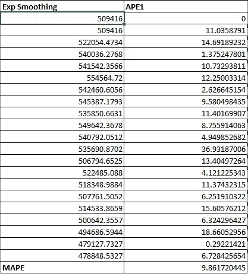
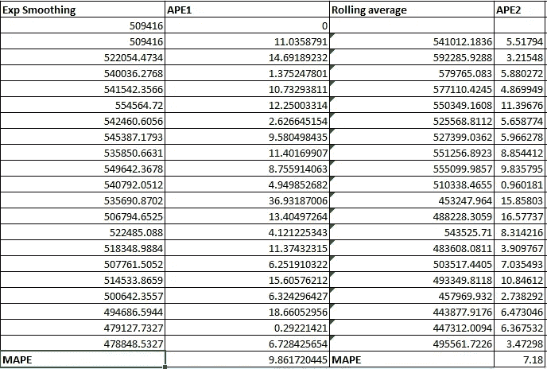

# 时间序列分析中三个必须知道的概念——举例说明

> 原文：<https://pub.towardsai.net/the-three-must-know-concepts-in-time-series-analysis-with-example-20bf40acc522?source=collection_archive---------2----------------------->

## [数据科学](https://towardsai.net/p/category/data-science)

## 时间序列数据是增长最快的数据之一，这就是为什么必须对它有很好的理解

由[马库斯·斯皮斯克](https://unsplash.com/@markusspiske?utm_source=medium&utm_medium=referral)在 [Unsplash](https://unsplash.com?utm_source=medium&utm_medium=referral) 上拍摄的照片

自从我在一家数据科学初创公司获得第一份实习工作以来，学习曲线一直很长，我面临的一系列问题也很多样化。从预处理零售数据到理解预测，这是一个漫长的旅程，而且才刚刚开始。
最近，我有机会研究“时间序列”,简单地说，这是一种捕捉趋势并研究一段时间内数据行为的分析，我想分享一些学到的重要概念和术语。在这篇文章中，我将使用一个虚拟的两年销售信息数据集。我们开始吧

# **滚动平均**

当我们有这样的趋势时:

21 个月期间的销售信息

很容易注意到，在这两年中，销售额的总和具有不稳定和可变的行为，高点和低点分散在图表中。

如果必须做出任何类型的预测，这种类型的行为必须被“消除”,这就是**滚动平均值**出现的原因。

滚动平均的作用是取前两个数字的平均值，然后**用它来求下一个数字的平均值。**我来举例说明一下。下面的列是该公司过去 21 个月的汇总销售信息。

我将使用前两个值来找到我的“第一平均值”，看起来像这样:

然后，我将使用我的**下两个销售值**来计算我的下一个滚动平均值，即:

诸如此类。注意，您可以根据自己的喜好更改**移动窗口**(用于第一次平均的数字数量，本例中为 2)**。**

**现在让我们来看看移动平均和销售的图表，看看移动平均的表现。**

****

**真实数据与滚动平均值**

**“噪音”已经减少了很多，但我们可以做得更好。**

**让我们看看另一种方法，它与“滚动平均”非常相似，可以用来使数据更加平滑。**

# **指数平滑法**

**指数平滑法类似于滚动平均法，但它也将“权重”应用于最近的观察结果，从而更好地捕捉趋势。我这么说是什么意思？让我们来看一个画面。**

****

**图片来自[https://www.youtube.com/watch?v=k_HN0wOKDd0](https://www.youtube.com/watch?v=k_HN0wOKDd0)**

**因此，从上图中可以看出，**的权重 0.2 被分配给我们的“实际”**，而**的权重 0.8 被分配给“预测”值**。让我们在 Excel 中看看这个:**

**Exp 平滑的第一个值将与销售信息列中的第一个值相同。我们将使用这两个值在我们的 Exp 平滑列中找到**的下一个值，它将是 **:******

****

**请注意，我对预测值赋予了 0.8 的权重。为什么？因为我希望“之前的预测值”对之后的值更有意义**

**最后，我们将这个公式复制到整个列，并找出值。注意:重量可以根据你的感觉而改变。**

**让我们看一下销售与出口平滑图:**

****

**真实销售价值与预期平滑**

**指数平滑在平滑数据方面表现更好。**

**图表趋势确实很好地衡量了哪种方法表现得好，但一个数值会更好，这就是 MAPE 的用武之地。**

# ****平均绝对百分比误差(MAPE)****

****平均绝对百分比误差或 MAPE** 是一种用于检查滚动平均值或指数平滑值与数据集真实值的吻合程度的方法。MAPE 越低，计算值越接近真实值。让我们来看看**

****

**为了解释我在上面的视觉效果中所做的事情，我首先取原始销售值和之前计算的相应“Exp smoothing”值之间的差值。然后，我将该值的绝对值除以原始销售值，然后将结果乘以 100，得到**绝对百分比误差(APE)。****

**我将对列中出现的所有值重复这个过程，并找到所有值的“APE”。**

**“APE”的平均值将被称为**平均绝对百分比误差或 MAPE。我们来看看。****

****

**用于指数平滑的 MAPE**

**MAPE 出来是 9.86，这可以说**我们的模型接近 91%的准确性。****

**让我们看看移动平均的 MAPE。**

****

**指数平滑与滚动平均 MAPE**

**在这种情况下，滚动平均给出的 MAPE 比指数平滑法稍好，但这是可以理解的，因为滚动平均比指数平滑法更好地遵循真实的销售值。但同时，Exp 平滑曲线更好地“平滑”了销售数据。**

# ****结论****

**在本文中，我们回顾了一些与时间序列相关的基本概念和术语。时间序列是一个非常深入和详细的主题，不可能在一篇文章中涵盖。我计划接下来写一篇关于 ARIMA、萨里玛和平稳与非平稳时间序列数据的概念的文章。如果你喜欢这篇文章，请鼓掌并与你的同事分享。谢谢你**