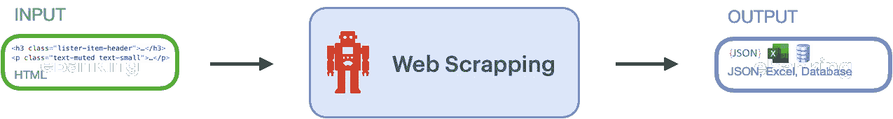
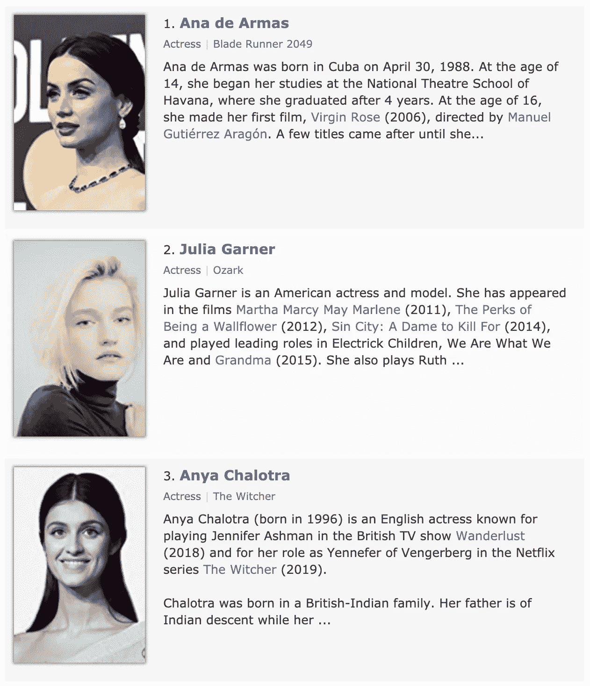
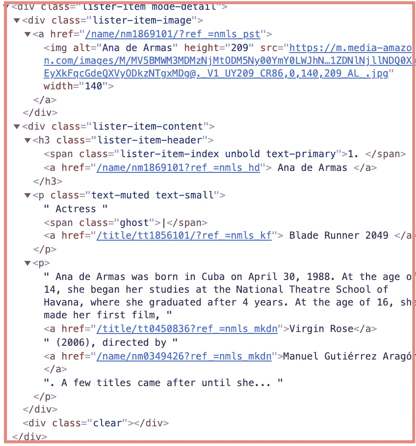
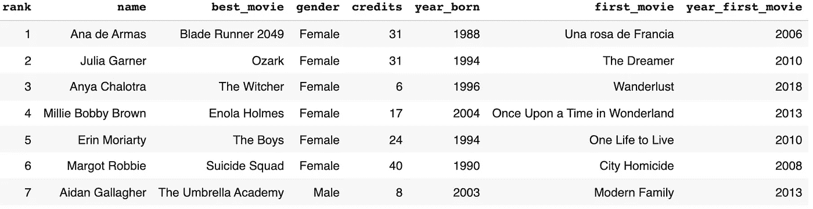
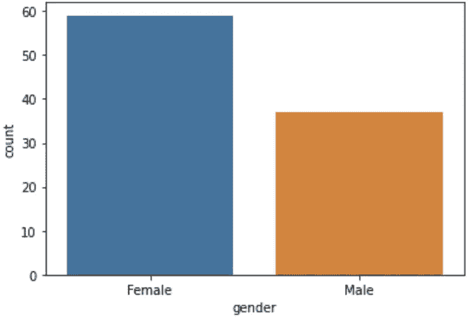
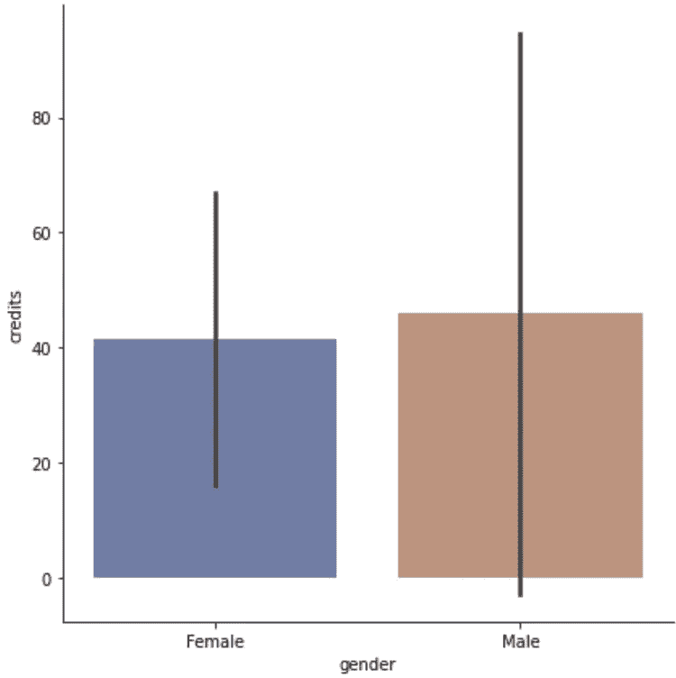
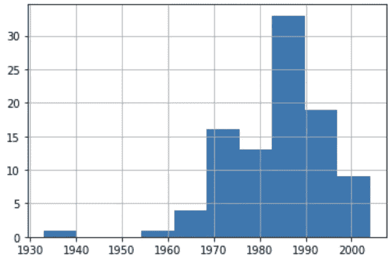

# 网页抓取的最终初学者指南

> 原文：<https://pub.towardsai.net/the-ultimate-beginner-guide-to-web-scraping-64a519f8adce?source=collection_archive---------0----------------------->

## [网页抓取](https://towardsai.net/p/category/web-scraping)

## 一步一步的教程，为傻瓜提供 Python 代码。

约翰·施诺布里奇在 Unsplash 上的照片

在这篇文章中，我将带你了解一些简单的自制工具，它们可以自动阅读网站，并为你总结关于你的名人或其他任何东西的信息:网络抓取。

# 什么是网页抓取？

Web 抓取，也称为 web 采集或 web 数据提取，是一种用于从网站提取数据的技术。你猜对了。谷歌也应用了这项技术，来索引数十亿个网站，并为你的查询提供相关的搜索结果。

> 如果你从网站上抓取公开可用且没有版权的数据供公众消费并用于分析，这是完全合法的。但是，如果你为了利益而抓取机密信息，这是不合法的。[来源](https://medium.com/@tjwaterman99/web-scraping-is-now-legal-6bf0e5730a78)。

你所需要做的就是写一段代码，它会转到目标网页，提取底层的 HTML 代码，理解它的结构，并有目的地以一种有意义的格式存储数据。

来自互联网电影数据库的信息是一个臭名昭著的地方，在那里你会找到，例如 2020 年的前 100 名明星([https://www.imdb.com/list/ls025814950](https://www.imdb.com/list/ls082599715/))。让我们用它来说明网页抓取。

图片来自 IMDb——2020 年最佳电影明星([来源](https://www.imdb.com/list/ls082599715/))

# 如何用 Python 下载一个网页？

当你打开上面的页面时，你的网络浏览器会收到 HTML 代码，它的结构非常好。Web 抓取从自动下载 HTML 代码开始，如下所示。

打印的 HTML 代码告诉我们，2020 年排名第一的女演员是电影《银翼杀手 2049》中的安娜·德·阿玛斯。

每个星号都在一个`
`元素中描述，其 class 属性设置为`lister-item mode-detail`。在该元素中，女演员的名字 Ana 出现在类为`lister-item-header`的元素的`<a>`标签中。

你可能还会注意到安娜名字上的一个链接，这个链接把我们带到了她的个人资料页面([https://www.imdb.com/name/nm1869101/?ref_=nmls_hd](https://www.imdb.com/name/nm1869101/?ref_=nmls_hd))，在那里可以找到关于她的更多信息。

# 如何用 Python 从 HTML 代码中提取数据？

下面的代码在 Python 字典中查找代表明星的所有`
`元素，并返回有价值的信息，如姓名、级别、性别、出生日期、年份和他们第一部电影的标题。

# 如何用 Python 可视化 HTML 数据？

下一步是在一个漂亮的桌子上建造一个所谓的熊猫`DataFrame`，以及用于可视化的`Matplotlib`和`Seaborn`。

网络抓取允许我们进行一些分析，比如有多少演员在 12 岁之前制作了他们的第一部电影，或者有多少演员是演员。

例如，你可以观察 2020 年女性与男性相比是如何处于巅峰的。

该分析揭示了弗雷德·威拉德是历史上 IMDb 2020 年百位明星名单中最受欢迎的演员，有 313 部电影。虽然演员往往更有生产力，但从历史上看，女演员更稳定。男性学分的标准偏差明显大于女性。

下面的柱状图表明，2020 年前 100 名榜单中有三分之一的演员出生于 20 世纪 90 年代。排名前三的女演员安雅·查洛特拉在 2018 年才 22 岁出道。她凭借电视剧《巫师》一跃成为前三名，这是她第四次出现在电影界。

# 结论

在本文中，您了解了从网站上收集数据进行令人信服的分析是多么容易。虽然有一些强大的 web 采集商业解决方案，但是很好地理解页面的当前 HTML 结构和这里提供的 Python 代码是一个很好的开始。

你应该在尊重使用条款和版权的同时负责任地废弃网站。如果 Web 服务器在短时间内从同一来源收到太多请求，它们会变得很慢或没有响应。您可能希望在代码中使用请求之间的延迟。您还可以将结果保存在磁盘上，以避免多次废弃相同的数据。

我最近被一个孩子震惊了，他在这篇文章之后，在这个视频中构建了他的第一个 Python 爬虫。