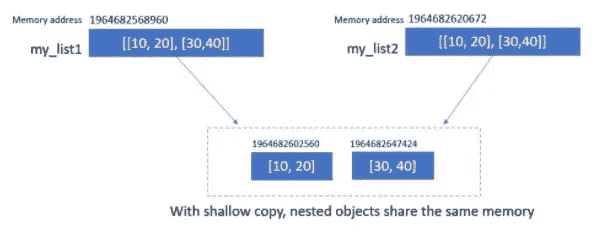
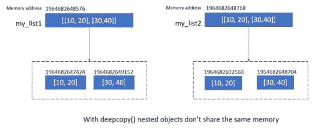

# Python 中浅层复制和深层复制的终极指南

> 原文：<https://pub.towardsai.net/the-ultimate-guide-to-shallow-copy-and-deep-copy-in-python-9cac2ebfe1af?source=collection_archive---------1----------------------->

## [编程](https://towardsai.net/p/category/programming)

## 详细解释了 Python 中的浅层拷贝和深层拷贝


图片由作者提供(根据 Canva 创建)

# 介绍

在编写程序时，我们经常要创建一个对象的副本( *int、float、list、tuple、dictionary 等)。*)。因为我们想在不改变原对象内容的情况下使用复制(新)对象。

在 Python 中有多种方法可以创建对象的副本。**但是，要小心！**这些方法大多会创建一个你不想要的**浅拷贝**。但是在这个场景中你需要的是一个**深度拷贝**。

那么，创建对象副本的不同方法是什么呢？什么是浅抄和深抄？我们将在本文中回答所有这些问题。

让我们先了解一下**赋值操作符(=)** 并不创建复制(新)对象。它只是在复制(新)对象和原始对象之间创建一个绑定(即*两个对象共享同一个内存地址*)。**但是这对于不可变的对象没有影响，比如 int、float、decimal、bool、tuple 等等。因为我们不能修改不可变的对象。**

> 浅层和深层复制仅对复合对象(包含其他对象的对象，如列表、集合、字典或类实例)有意义。

# 浅拷贝

浅层拷贝创建给定复合对象的拷贝，同时插入对原始对象的引用。一旦你读完这一节，你就会理解这个定义。

在 Python 中有很多方法可以创建浅层副本。让我们在下一节看看创建浅层副本的 6 种不同方法——

请注意下面显示的所有方法中两个对象( *my_list1* 和 *my_list2* )的内存位置。可以看到， ***id(my_list1)*** 和 ***id(my_list2)*** 返回两个不同的内存地址。它表示已经创建了一个新对象(副本)。

函数的作用是:返回对象的地址。这里简单介绍了[](https://pythonsimplified.com/mutability-immutability-in-python/#id_function)**如果你想快速看一下。**

***For 循环:***

```
*>>> my_list1 = [10,20,30,40,50]
>>> my_list2 = []
>>> for num in my_list1:
        my_list2.append(num)>>> id(my_list1), id(my_list2)
**1964682668352 1964682820800***
```

***列表理解***

```
*>>> my_list1 = [10,20,30,40,50]
>>> my_list2 = [ num for num in my_list1]
>>> id(my_list1), id(my_list2)
**1964682602752 1964681785728***
```

***复制方法***

```
*>>> my_list1 = [10,20,30,40,50]
>>> my_list2 = my_list1.copy()
>>> id(my_list1), id(my_list2)
**1964682620480, 1964682668352***
```

***切片***

```
*>>> my_list1 = [10,20,30,40,50]
>>> my_list2 = my_list1[:]
>>> id(my_list1), id(my_list2)
**1964682859008 1964682620480***
```

***构造器***

```
*>>> my_list1 = [10,20,30,40,50]
>>> my_list2 = list(mylist_1)
>>> id(my_list1), id(my_list2)
**1964683214656 1964683576832***
```

***复制模块***

```
*>>> import copy
>>> my_list1 = [10,20,30,40,50]
>>> my_list2 = copy.copy(my_list1)
>>> id(my_list1), id(my_list2)
**1964683560512 1964683214784***
```

*在所有这些方法中，如果你试图修改 **my_list1** 或 **my_list2** 中的一个元素，你希望其他列表不会得到更新。这正是正在发生的事情。这是因为我们使用了一个元素不可变的列表。例如，在 **my_list = [10，20，30，40，50]** 中，元素是不可变的。*

```
*>>> my_list1 = [10,20,30,40,50]
>>> my_list2 = [num for num in my_list1]
>>> id(my_list1), id(my_list2)
**1964682380992 1964682885952***
```

*现在，您将 **my_list[0]** 中的值从 10 更改为 100。如你所见，这并没有修改 **my_list1** 。因为 **my_list1** 和 **my_list2** 是两个不同的对象。*

```
*>>> my_list2[0] = 100
>>> print("my_list1:", my_list1)
>>> print("my_list2:", my_list2)
>>> print(id(my_list1), id(my_list2))
**my_list1: [10, 20, 30, 40, 50]
my_list2: [10, 20, 30, 40, 50, 60]
1964682380992 1964682885952***
```

*到目前为止一切顺利。复制操作完全按照我们的预期进行。如果原始对象(例如 list)有一个嵌套结构(列表中的列表),你试图修改这些可变元素？接下来会发生什么？*

*在下面的示例中， **my_list1** 具有嵌套结构。这意味着 **my_list1** 的各个元素也是列表。接下来，假设您使用上述 6 种方法中的任意一种创建了 my_list2。这是它在视觉上的样子。虽然**我的列表 1** 和**我的列表 2** 是两个不同的对象，但是它们的内容共享同一个内存地址。*

**

*浅层拷贝(图片由作者提供)*

*让我们通过编程来确认这一点。 **id()** 函数清楚的表明 **my_list1** 和 **my_list2** 是两个不同的对象。*

```
*>>> my_list1 = [[10,20], [30,40]]
>>> my_list2 = [num for num in my_list1]
>>> id(my_list1), id(my_list2)
**1964682568960 1964682620672***
```

*但是请注意，如果列表的元素是可变的，那么共享相同的内存地址，如下所示。*

```
*>>> print(id(my_list1[0]), id(my_list2[0]))  
>>> print(id(my_list1[1]), id(my_list2[1]))
**1964682602560 1964682647424
1964682602560 1964682647424***
```

*由于它们共享相同的内存地址，如果您修改 **my_list2[0]** 或 **my_list2[1]** ，相同的更改也会反映在 my_list1 中，尽管我们并不打算这样做。但这不是我们想要的。对吗？我们想要一个不影响原件的真正的克隆品或复制品。那么，你是怎么处理的呢？这就是**深度复制**的用武之地。*

```
*>>> my_list2[0][0] = 100
>>> print(my_list1)
>>> print(my_list2)
**[[100, 20], [30, 40]]
[[100, 20], [30, 40]]***
```

# *深层拷贝*

*深度复制创建给定复合对象的副本，同时递归地插入在原始对象中找到的对象的副本。*

*要创建对象的深层副本，需要使用 **copy** 模块中的 **deepcopy()** 方法。让我们举一个同样的例子，我们在浅层复制一节中提到过。*

*正如你从代码输出和图表中看到的，使用 **deepcopy()** 我们能够克服浅层拷贝的问题。请注意，嵌套元素不再共享同一个地址。*

```
*>>> my_list1 = [[10,20], [30,40]]
>>> my_list2 = copy.deepcopy(my_list1)
>>> id(my_list1), id(my_list2)
**1898086629760, 1898086651392**>>> id(my_list1[0])), hex(id(my_list2[0]))
**1964682647424 1964682649152**>>> hex(id(my_list1[1])), hex(id(my_list2[1]))
**1964682602560 1964682648704***
```

**

*深层副本(图片由作者提供)*

# *任意 Python 对象*

*在上述所有方法中，我们都使用了一个列表进行演示。事实上，您可以使用任何可变类型列表、集合、字典或任意 Python 对象。下面我们来看一个任意对象的例子。*

```
*import copyclass MyClass():
    def __init__(self):
        self.x = [[1,2], [3,4]]*
```

***浅拷贝:**在下面的例子中，我们首先创建了 **MyClass** 的对象 **c** ，然后创建了一个浅拷贝 **c1** 。如你所见，尽管 **c** (原始对象 **)** 和浅拷贝对象 **c1** 是不同的对象，但它们的内容共享相同的内存。*

```
*>>> c = MyClass()
>>> c1 = copy.copy(c)
>>> print(c is c1)
>>> print(id(c.x[0]), id(c.x[1]))
>>> print(id(c1.x[0]), id(c1.x[1]))
**False
2709490337928 2709490334920
2709490337928 2709490334920***
```

*由于我们处理的是浅层拷贝，当我们将**【5，6】**追加到原始对象 **c** 时，拷贝对象 **c1** 也按照预期得到了更新。*

```
*>>> c.x.append([5,6])
>>> print(c.x)
>>> print(c1.x)
**[[1, 2], [3, 4], [5, 6]]
[[1, 2], [3, 4], [5, 6]]***
```

***深层拷贝:**继续上面的例子，我们已经创建了对象 **c** 的深层拷贝 **c2** 。原始对象 **c** 和复制对象 **c2** 是两个不同的对象。因为这是一个深层拷贝，所以创建了对象的真实拷贝(克隆),而不是共享相同的内存。如你所见，c 和 c2 中的元素不共享相同的内存。*

```
*>>> c = MyClass()
>>> c2 = copy.deepcopy(c)
>>> c is c2
>>> print(id(c.x[0]), id(c.x[1]))
>>> print(id(c2.x[0]), id(c2.x[1]))
**False
1964683630976 1964682581248
1964682779456 1964683675008***
```

*因此，即使我们改变了`**c**`的内容，它也不会反映在复制对象`**c2**`中。*

```
*>>> c.x.append([5,6])
>>> print(c.x)
>>> print(c2.x)
**[[1, 2], [3, 4], [5, 6]]
[[1, 2], [3, 4]]***
```

# *结论*

*在本文中，我们通过例子了解了 Python 中的浅层复制和深层复制。我们已经经历了 6 种创建浅层拷贝的不同方法。为了创建深层拷贝，我们使用了拷贝模块。在上一节中，我们看到我们也可以在 Python 任意对象上创建浅层拷贝和深层拷贝。*

*希望这回答了你对 Python 中浅拷贝和深拷贝的所有疑惑。如果你有任何问题，请在评论区告诉我们。*

**原载于 2021 年 5 月 31 日*[***pythonsimplified.com***](https://pythonsimplified.com/the-ultimate-guide-to-shallow-copy-and-deep-copy-in-python/)*。**

**阅读更多关于 Python 和数据科学的此类有趣文章，* [***订阅***](https://pythonsimplified.com/) *到我的博客*[***【pythonsimplified.com】***](https://pythonsimplified.com/)***。*** 你也可以通过 [**LinkedIn**](https://www.linkedin.com/in/chetanambi/) 联系我。*

# *进一步阅读*

*   *[Python 中 sort()和 sorted()的区别](https://pythonsimplified.com/difference-between-sort-and-sorted-in-python/)*
*   *[最有争议的 Python 的海象算子](https://pythonsimplified.com/the-most-controversial-python-walrus-operator/)*
*   *[Python 中 a=a+b 和 a+=b 的区别](/the-difference-between-a-a-b-and-a-b-in-python-a7338d96e408)*
*   *[了解 Python 中的索引和切片](https://pythonsimplified.com/understanding-indexing-and-slicing-in-python/)*
*   *[Python 列表 Vs 元组](https://pythonsimplified.com/python-list-vs-tuple/)*

*我希望你喜欢阅读这篇文章。如果你喜欢我的文章并想订阅 Medium，你可以在这里订阅:*

*[](https://chetanambi.medium.com/membership) [## 通过我的推荐链接加入媒体- Chetan Ambi

### 作为一个媒体会员，你的会员费的一部分会给你阅读的作家，你可以完全接触到每一个故事…

chetanambi.medium.com](https://chetanambi.medium.com/membership)* 

# *参考*

*[.][https://docs.python.org/3/library/copy.html](https://docs.python.org/3/library/copy.html)*