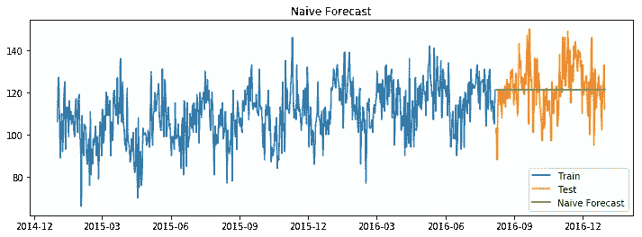
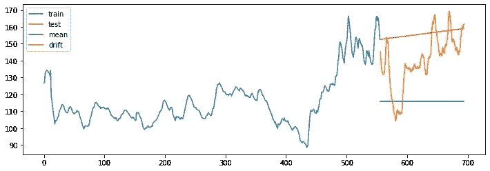
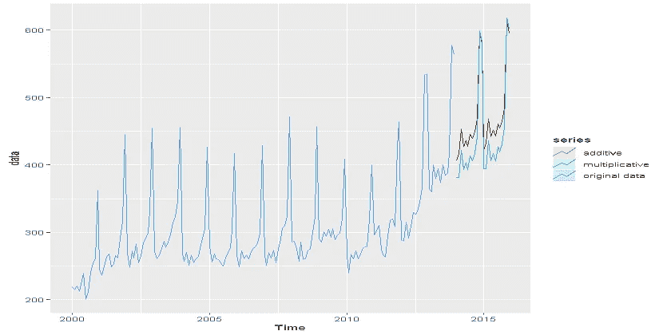
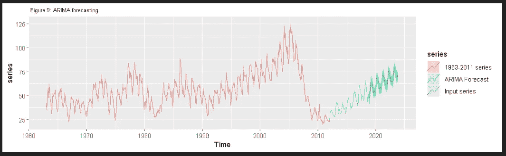
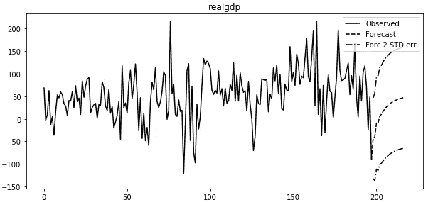
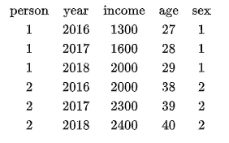
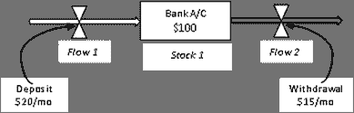
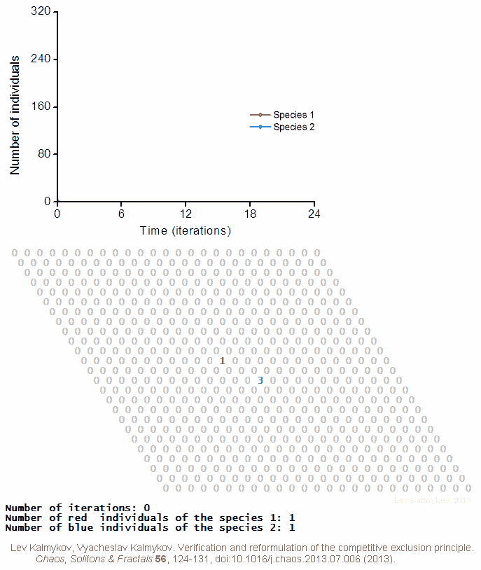

# 时间序列预测技术的宇宙:入门

> 原文：<https://pub.towardsai.net/the-universe-of-time-series-forecasting-techniques-a-primer-f73011e18570?source=collection_archive---------2----------------------->

## 数据科学

由 [Unsplash](https://unsplash.com?utm_source=medium&utm_medium=referral) 上 [Greg Rakozy](https://unsplash.com/@grakozy?utm_source=medium&utm_medium=referral) 拍摄的照片

时间序列预测是数据科学中最热门的话题之一。毫不奇怪，有一个丰富的预测工具箱，有许多不同的选项可供数据科学家选择。可能性是如此之多，以至于他们经常让数据科学家不知所措、困惑，有时甚至彻底糊涂。

通常，这些技术彼此密切相关。一种技术的局限性很可能导致另一种技术的发展。例如，正如我们将在下面看到的，ARIMA 家族中的所有技术(例如 AR、MA、SARIMA、SARIMAX)可能看起来不同，但实际上，它们只是彼此的变体。

所以写这篇文章的动机是把它们放在一起，这样就很容易比较相似和不同之处。我希望，在这篇文章的结尾，读者不要那么困惑，至少对实践中何时(不)使用特定技术有一个肤浅的理解。

我会尽可能简化事情，更多关注广度而不是深度，按照复杂程度递增的顺序呈现。但要明确的是，模型的复杂性本身并不能保证更好的预测；为了获得更好的结果，不仅仅是建立复杂的模型。

# 1.基准预测

这些模型被称为所谓的“基准”或“基线”预测。

正如您将在下面看到的，这些技术很少在实践中应用，但它们有助于建立预测直觉，并在此基础上增加额外的复杂性。

**1.1 天真预测**:

在简单预测中，假设未来值等于过去值。因此，某一特定产品在周三的销量将与周二的销量相似。

天真的预测很像一个 ***零假设*** 用来比较另一个假设——因为这样那样的原因*明天的销售收入会不同*。

作为基准的天真预测“零假设”(来源:作者)

**1.2 季节性天真:**

顾名思义，季节性天真在其预测中考虑了季节性因素。所以在某种程度上，这是对天真预测的改进。12 月份的收入预测将等于前一年 12 月份的收入，因为假期已被考虑在内。

同样，它仍然像 ***零假设*** 一样工作，但认为季节性是其相对于天真预测的关键改进。

**1.3 均值模型**

简单预测采用一个过去的值作为预测值。相比之下，均值模型采用所有过去的观察值，进行平均，并使用该平均值作为预测值。

如果数据是随机分布的，没有清晰的模式和趋势(也称为*白噪声*，均值模型比朴素模型更适合作为基准。

**1.4 漂移模型**

漂移模型是另一种简单预测的变体，有明显的改进。与 Naive 中一样，它采用最后一次观察，然后根据过去值的变化来调整观察。

> 预测值=过去观察值+/-过去观察值的平均变化

关于训练和测试数据的均值和漂移模型(来源:作者)

**1.5 线性趋势**

上述均值模型是一条不随时间变化的水平恒定线，因为它处理的是没有趋势的训练数据。但是，如果检测到趋势，线性模型比均值模型提供更好的预测值。

实际上使用线性趋势预测实际上是下面形式的最佳拟合线(即回归线):

> y(t)=α+β* t

RSME 或 R2 值决定了拟合线的预测效果。

**1.6 随机漫步**

在这种情况下，预测值从其当前值向前“行走”随机一步(类似于[布朗运动](https://en.wikipedia.org/wiki/Brownian_motion#Mathematics))。就像一个蹒跚学步的孩子，下一步可以是任意方向，但不会离上一步太远。

> Y(t+1)=Y(t) +噪声(t)

周三的股价可能会接近周二的收盘价，因此随机漫步可以提供合理的猜测。但是预测太多的时间步是不合适的，因为，嗯，每一步都是随机的。

**1.7 几何随机漫步**

在几何随机游走中，对下一个值的预测将等于上一个值加上一个常数变化(例如，收入每月增长的百分比)。

> ŷ(t)= y(t-1)+α

它也被称为“随机增长模型”长期的股票价格遵循某种几何随机游走模型。

# 2.指数平滑法

如果分解，时间序列将分解成 3 个部分:趋势、季节性和白噪声(即随机数据点)。出于预测的目的，我们可以预测可预测的组成部分(即趋势和季节性)，而不是随机出现的不可预测的条款。指数平滑可以通过消除白噪声来处理序列中的这种可变性。

移动平均值可以平滑训练数据，但它是通过对过去的值取平均值并对它们进行平均加权来实现的。另一方面，在指数平滑中，过去的观察值以指数递减的顺序加权。也就是说，最近的观测值比远处的值具有更高的权重。

指数平滑对于不同的数据类型几乎没有变化。

使用加法和乘法过程的指数平滑预测(来源:作者)

**2.1 简单指数平滑**

简单的指数平滑用于没有明确趋势或季节性的数据。

**2.2 霍尔特线性趋势**

霍尔特的方法类似于简单的指数平滑法，但用于有明确趋势的数据。

**2.3 霍尔特-温特指数平滑**

霍尔特-温特方法适用于既有趋势又有季节性的序列，也就是说，它是前两种方法的结合。Holt-Winter 应用于平稳序列，平滑由加权参数 *alpha* (0~1)控制。

# 3.ARIMA 家族

我称他们为 *ARIMA 家族*，因为他们是一套彼此紧密相关的技术。

**3.1 自回归(AR)**

在进入自回归之前，让我们用一个因变量和一个或多个自变量来刷新线性回归的记忆:

> 销售额= f(客户收入，促销)

自回归也是一种线性回归，但在这种情况下，自变量是序列本身的过去值。

> 周三销售额= f(周二、周一、周日、周六等的销售额)

自回归用 AR( *p* 表示，其中 *p* 决定了用多少过去的值来预测未来。

**3.2 移动平均线(MA)**

移动平均值是通过取任意数量的过去观察值的平均值来计算的。这些平均值随后用于预测未来值。

不仅仅是预测，移动平均线是理解数据的一般模式和趋势的有用工具，尤其是在有噪声的序列中。

移动平均用 MA( *q* )表示，其中 *q* 是过去观察的次数。

**3.3 ARMA**

顾名思义，ARMA 是上述 AR 和 MA 过程的组合:

> Y = c + X + AR 项+ MA 项

用现实世界的话来说:

> 今天的值=均值+噪音+昨天的值+昨天的噪音。

**3.4 ARIMA**

自回归综合移动平均(ARIMA)可以说是最流行和最广泛使用的预测统计技术。顾名思义，ARIMA 有 3 个部分:a)一个*自回归*部分，用于模拟序列与其滞后值之间的关系；b)预测作为滞后预测误差的函数的未来值的*移动平均*分量；以及 c)一个*集成*组件，使该系列静止不动。

使时间序列平稳意味着去除趋势成分。有几种方法可以做到这一点，一种是利用数据和滞后值之间的差异。

ARIMA 模型——表示为 *ARIMA(p，q，d)*——采用以下参数:

*   定义滞后数量的 p；
*   *d* 指定使用的差异数；和
*   *q* 定义移动平均窗口的大小

使用 ARIMA 预测美国新屋销售(来源:作者)

**3.5 萨里玛**

萨里玛只不过是季节性的 ARIMA。

ARIMA 非常适合预测具有趋势的序列，但 SARIMA 更适合预测序列的季节性成分。数学上它表示为:

> 萨里玛(P，D，Q)

其中，( *p，D，q* )分量来自 ARIMA， *(P，D，Q)m* 分量使其成为萨里玛，其中:

*   *P* :季节性 AR 订单
*   *问*:季节性差异订单
*   *D* :季节性 MA 订单
*   *m* :季节周期中的时间步数(例如，一年 12，一个季度周期 4)

**3.6 ARIMAX**

到目前为止，我们已经讨论了用单个变量预测一个序列，并且只使用它过去的观测值。这就像只根据历史人口预测未来人口一样。

> 未来人口= f(过去人口)

但我们知道，过去的人口是决定未来人口的众多因素之一——如出生率、死亡率、教育、收入等。这些因素被称为 e **X** 成因因素或协变量:

> 未来人口= f(过去人口，出生，死亡率，收入…..等等。)

因此，ARIMAX 是 ARIMA 的多变量版本，它基于序列本身的滞后值和外生变量的滞后值进行预测。

# 4.高级模型

**4.1 回归**

回归是一种经过充分研究的技术，它将因变量预测为一个或多个自变量的函数。在这种情况下，自变量必须与被预测的变量有线性关系。例如，如果要预测产品销售的收入，产品价格可以是一个独立变量，因为价格直接影响销售的数量:

> 收入= f(产品价格)

上述模型被称为简单线性回归，因为它只有一个预测因子。它的一个变体——多元线性回归——采用了不止一个预测因子。同样，每个预测器需要与被预测的变量呈线性关系:

> 单位销售额= f(产品价格，客户收入)

**4.2 快速傅立叶变换**

(FFT)最初被开发用于信号处理，但最终被用于时间序列分析和预测。

FFT 预测的应用相当多，产品[需求预测](https://journals.sagepub.com/doi/10.5772/56839)、[财务预测](http://www.math.utah.edu/~gustafso/s2017/2270/projects-2016/williamsBarrett/williamsBarrett-Fast-Fourier-Transform-Predicting-Financial-Securities-Prices.pdf)、[来话预测](https://pdfs.semanticscholar.org/5e59/cde9be82cf3e889b8c66d3b9702d1c383127.pdf)都不多。

FFT 技术在数据科学预测中的应用不如在其他领域广泛，因此可用资源和软件包有限(但参见`[numpy.fft.fft](https://numpy.org/doc/stable/reference/generated/numpy.fft.fft.html)` 和一个[算出的例子](http://www.datascience.uconn.edu/index.php/projects/students-work/item/131-stock-market-predictions-using-fourier-transforms-in-python))。

**4.3 向量自回归模型** ( **VAR)**

VAR 是另一种具有外生变量的多元预测模型。在该模型中，每个变量使用其自身的过去(滞后)值以及外生因素的滞后值进行预测。它只取一个参数， *p:*

> VAR( *p* )，其中 *p* 为滞后数

ARIMAX 和 VAR 之间存在一些理论上的差异，但这需要一个长时间的讨论，我将在以后的文章中介绍。

国内生产总值用几个自变量的 VAR 进行预测(来源:作者)

**4.4 阿奇**

自回归条件异方差(ARCH)——一个满嘴的名字，但是在预测[异方差](http://www.statsmakemecry.com/smmctheblog/confusing-stats-terms-explained-heteroscedasticity-heteroske.html)时间序列时使用了不同类型的模型。

它最常用于波动性、高方差时间序列数据的计量经济学建模。ARCH 用一个参数来形式化:

> ARCH(m)，其中时间 *t* 的方差以过去的 *m* 观察结果为条件

**4.5 深度学习/RNN/LSTM**

长短期记忆(LSTM)，一种常用于深度学习的递归神经网络，也是时间序列预测的有用工具。

LSTM 的主要优势在于它既可用于单变量预测，也可用于多变量预测。

大多数深度学习框架、`PyTorch`、`Tensorflow`和`Keras`都内置了运行时间序列 LSTM 的能力。看看 LSTM 的这个 `[Tensorflow](https://www.tensorflow.org/tutorials/structured_data/time_series)` [实现](https://www.tensorflow.org/tutorials/structured_data/time_series)。

**4.6 面板数据模型**

面板数据是随时间重复测量的多维观察数据。换句话说，这是一个数据集，其中测量了多个变量***——如个人、组织、家庭、城市、国家。***

******

***3 个变量的面板数据示例，在 3 年时间内测量了 2 个个体(来源:作者)***

***三种主要类型的面板数据模型(即估计量)用于时间序列预测:混合 OLS，随机效应模型和固定效应模型。***

*****4.7 系统动力学建模(SD)*****

***系统动力学是一种复杂系统建模的方法，其中一个元素的变化导致其他元素的变化。***

***SD 广泛应用于医疗保健、流行病学、运输、商业管理和收入预测。其中最著名的可以说是罗马俱乐部的增长极限模型。***

***一个系统动态模型代表了一个复杂的系统，通过反馈循环来预测系统的行为。假设一个银行账户有 100 美元的“股票”。每月存入 20 美元(由*流程 1* 表示)，每月提取 15 美元(*流程 2* )。在这个简单的例子中，*流量 1* 的变化将导致*库存 1* 和*流量 2 的变化。*因此，如果我们知道*流量 1* 将如何演变成未来，我们就可以预测*股票 1* 和*流量 2* 。***

****

**SD 建模中的存量、流量和反馈循环(来源:作者)**

****4.8 基于代理的建模(ABM)****

**与 SD 类似，基于主体的模型是用于模拟个体(称为“主体”)的动作或运动及其交互的计算模型。它有一套用于模拟复杂的社会、经济和环境系统的工具和技术。**

**ABMs 已经被频繁地用于预测[股票市场](https://link.springer.com/chapter/10.1007/978-3-642-29356-6_10)走势、[传染病](https://www.sciencedirect.com/science/article/pii/S1755436517300221)预测、物种分布建模，以及对[广泛的](https://www.pnas.org/content/99/suppl_3/7280)经济和环境问题建模。**

****

**基于主体的预测建模。作者列夫·卡尔梅克夫——CC BY-SA 4.0，[https://commons.wikimedia.org/w/index.php?curid=41287917](https://commons.wikimedia.org/w/index.php?curid=41287917)**

# **最后的想法**

**时间序列预测有一套丰富的机器学习工具和技术。这意味着在选择特定的预测技术时很容易迷失方向。在这篇文章中，我概述了每种方法的主要特征，揭示了它们的共性，同时展示了它们的主要区别。正如我所说的，这些技术不是孤立的，而是相互关联的，一种技术的存在是因为另一种技术的局限性。**

**希望这篇文章是有用的，我将在以后的文章中写更多关于这些技术的代码，敬请关注。你可以在 Twitter 上关注我，获取更新和相关新闻。**