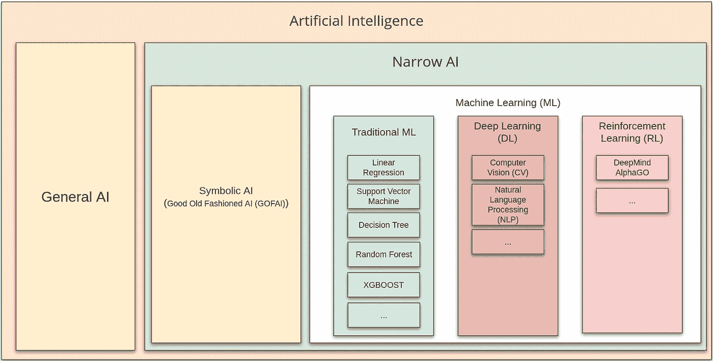
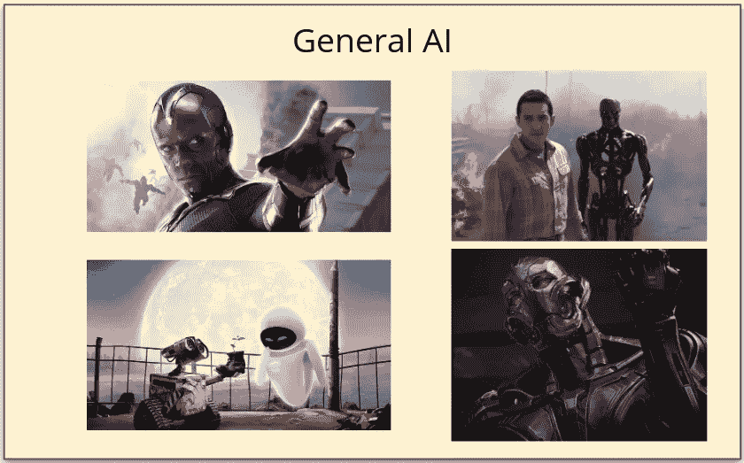
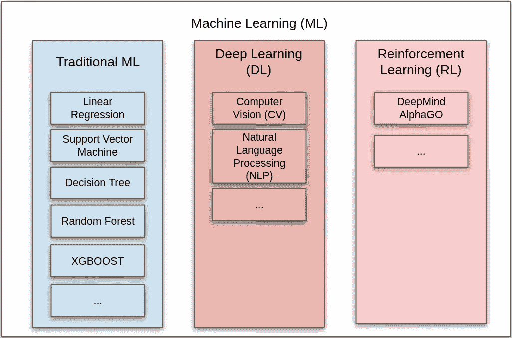
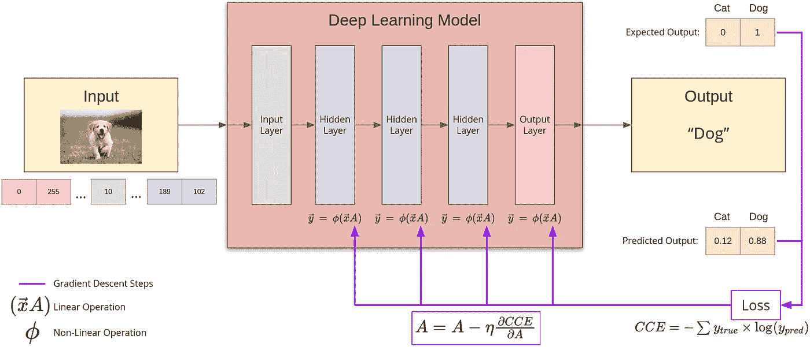

# 各种类型的人工智能技术

> 原文：<https://pub.towardsai.net/the-various-types-of-artificial-intelligence-technologies-8fadd087d02a?source=collection_archive---------2----------------------->

## [人工智能](https://towardsai.net/p/category/artificial-intelligence)，[观点](https://towardsai.net/p/category/opinion)

## 如何用 1000 字以下向你的经理解释

在非常高的“管理”水平上的各种类型的人工智能。[来源](https://www.youtube.com/watch?v=fOHGLWlOEAQ)

> 人工智能是一个宽泛的术语，包含许多技术，所有这些技术都使计算机能够显示类似于我们人类的某种智能水平。

# 艾将军

人工智能最受欢迎的用途是在许多不同任务上类似于超人的机器人。他们可以战斗，飞行，并就几乎任何话题进行深刻而有见地的对话。电影中有很多机器人的例子，有好的也有坏的，像《远见》、《瓦力》、《终结者》、《奥创》等等。虽然这是人工智能研究的圣杯，但我们目前的技术远远没有达到那个人工智能水平，我们称之为 ***通用人工智能*** 。

艾将军。[来源](https://www.youtube.com/watch?v=fOHGLWlOEAQ)

# 狭义人工智能

相反，我们今天拥有的 AI 是人工智能的一个子集，称为 ***狭义 AI*** 。

> 狭义的 AI，不亚于；或者甚至在一项特定任务或几项相关任务上比人类做得更好。

举个例子，几年前，你可能在新闻里看到过，Google 的一个叫 [DeepMind AlphaGO](https://deepmind.com/research/case-studies/alphago-the-story-so-far) 的 AI 程序，非常擅长下围棋，以至于打败了当时的世界冠军！然而，这个程序除了玩“围棋”之外什么也不能做。它不能玩另一个游戏，如 PUBG 或堡垒之夜。它甚至不能告诉你现在是什么时间。

狭义的 AI 有两种类型。我们一个一个来看。

1.  符号人工智能
2.  机器学习

# 符号人工智能

符号人工智能也被称为老式人工智能(GOFAI ),因为它已经存在了几十年。一个人类程序员必须手工编写所有管理符号人工智能系统的规则。因此，很难建立和得到正确的。然而，它仍然被用于一些用例，在这些用例中，我们人类需要理解为什么 AI 程序在给定的环境下做出特定的决定。例如，如果人工智能法官判某人入狱，它必须描述它为什么做出决定。

# 机器学习

ML 相对来说比符号人工智能更新，但是更强大。谷歌 DeepMind 的 AlphaGO 是一种 ML 系统。

> 在 ML 中，人工智能程序使用大量的例子或数据来“学习”我们想要它做的事情，而不是人类程序员手动编写所有的规则。

这类似于人类“学习”新信息的方式。当我们想教一个孩子狗是什么样子的时候，我们不会告诉他/她，如果一个动物很矮，耳朵耷拉着，摇着尾巴，那就是狗。而是我们给孩子看一些“狗”的图片，久而久之孩子自然就明白了什么是狗。ML 程序遵循相同的范例。你可以在我之前的帖子里阅读更多关于 ML 的内容: [***如何向你的经理解释机器学习？***](https://medium.com/towards-artificial-intelligence/how-to-explain-machine-learning-to-your-manager-7b983e7ed3cb?sk=068ae2aba88be9ecfafb14f7561bfe9e)

随着智能手机和传感器的出现，我们每天产生如此多的数据，以至于 ML 方法现在有足够多的数据来进行训练。此外，多核 CPU 和 GPU 等电子芯片的成本近年来已经下降。创造的数据量的爆炸，加上廉价硬件的可用性，是当前人工智能革命的原因。

今天主要有三种类型的机器学习。

机器学习的类型。[来源](https://www.youtube.com/watch?v=fOHGLWlOEAQ)

## 1.传统 ML

传统的 ML 使用基于统计方法的算法来执行 ML。这个领域中一些最著名的算法是线性回归、支持向量机、决策树等。这些技术的大部分数学和统计数据已经有几十年的历史了，并且很容易理解。直到过去十年，它们才被广泛地称为 ML 或 AI。

学习这些算法背后的数学的一个很好的参考是《[统计学习的要素》一书。](https://web.stanford.edu/~hastie/ElemStatLearn/)“Python`[sklearn](https://scikit-learn.org/stable/)`和`[xgboost](https://xgboost.readthedocs.io/en/latest/)`包是你在 Python 中开始学习传统 ML 所需要的所有东西。

## 2.深度学习

DL 已经彻底改变了计算机视觉(CV)和自然语言处理(NLP)领域。

在 DL 中，多层人工神经网络在“深度”网络中的链接可以根据[通用逼近定理](http://neuralnetworksanddeeplearning.com/chap4.html)逼近任意数学函数。人工神经网络中的每一层都由一个线性运算和一个非线性运算组成。

线性运算的参数是通过向算法提供大量关于我们希望它学习的任务的数据来“学习”的。在内部，一种被称为[梯度下降](https://www.kdnuggets.com/2017/04/simple-understand-gradient-descent-algorithm.html)的学习算法被用来逐步调整参数，直到达到最佳精度。

简而言之就是深度学习。[来源](https://www.youtube.com/watch?v=ISiq13AWduY)

目前有两种开发深度学习应用的主流 Python 框架:`[Tensorflow](https://www.tensorflow.org/)`和`[Pytorch](https://pytorch.org/)`

## 3.强化学习

在我看来，强化学习是三种 ML 中最复杂的。击败世界最佳围棋手的谷歌 DeepMind AlphaGO 程序就是一个很好的例子。

在传统的 ML 和 DL 中，人工智能系统从过去的数据中学习，而在 RL 中，人工智能系统通过采取一些行动并测量其回报来学习，类似于训练狗的新技巧。在像“围棋”这样的游戏中，奖励是做出最大化分数的决定。

通过奖励想要的行为来训练狗新的技巧。Andrea Lightfoot 在 [Unsplash](https://unsplash.com?utm_source=medium&utm_medium=referral) 上拍摄的照片

# 如何选择？

最后，有了各种可用的狭义人工智能技术，你如何选择技术来解决你的问题呢？

首先，从商业角度理解问题。然后，尝试各种技术，直到你实现你的业务目标。使用业务 ***可以使用*** 的方法达到 80%的准确率，比使用业务 ***不能使用*** 的方法达到 99.9%的准确率要好！我假设 80%的人工智能项目失败的部分原因是我们，作为开发者，可能会忘记这个简单的范例:

> 生意第一，生意第一，生意第一！！！

这就是我今天给你的全部。感谢您的阅读！