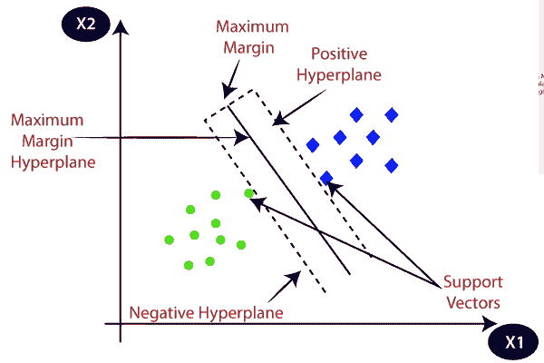
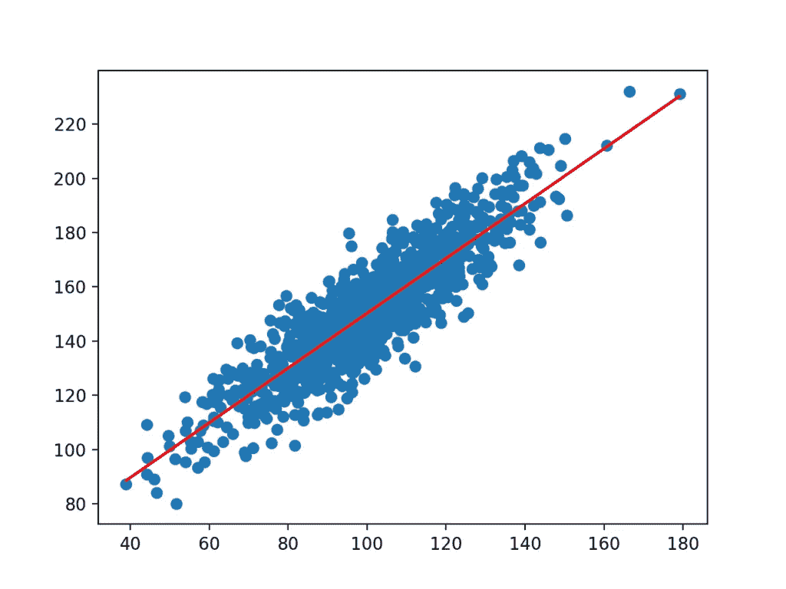
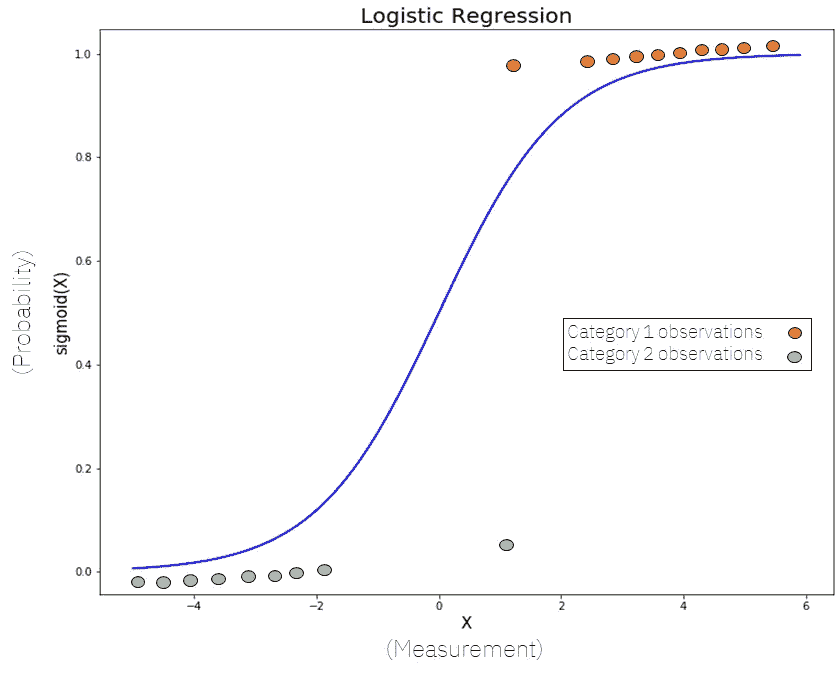
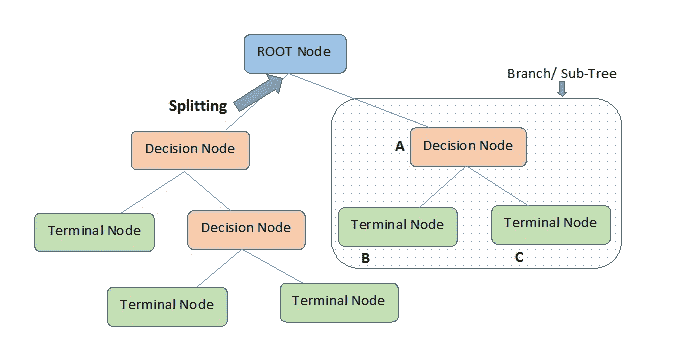
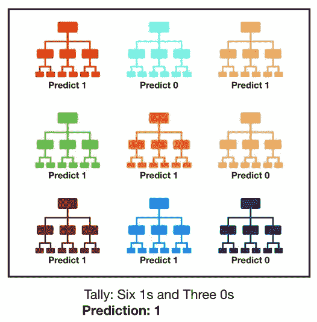
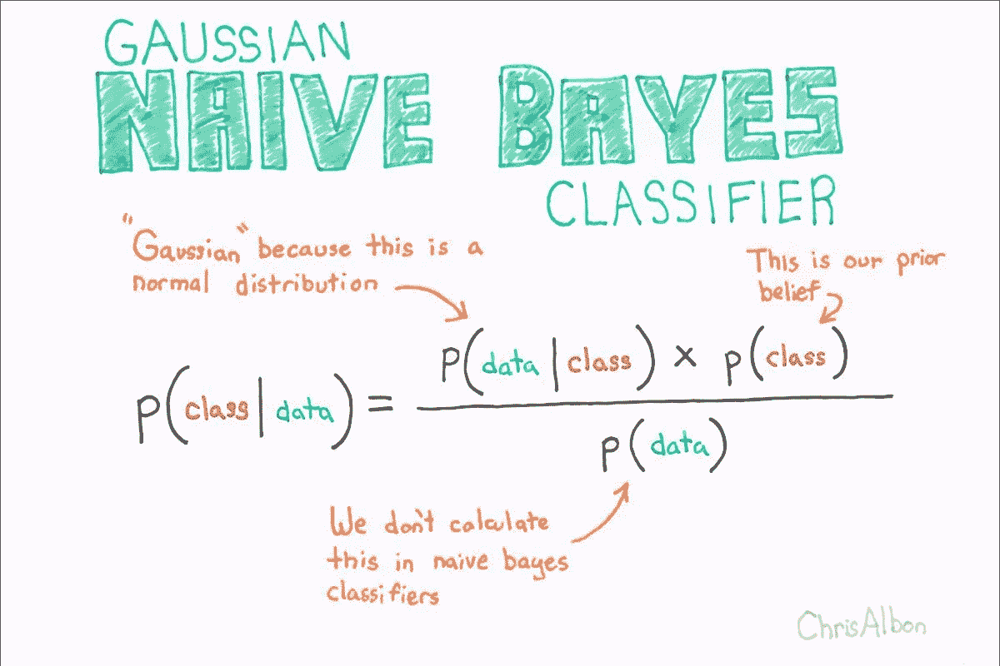
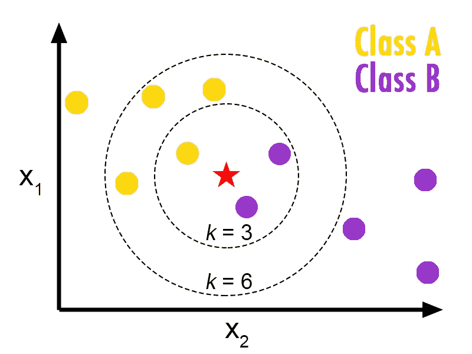
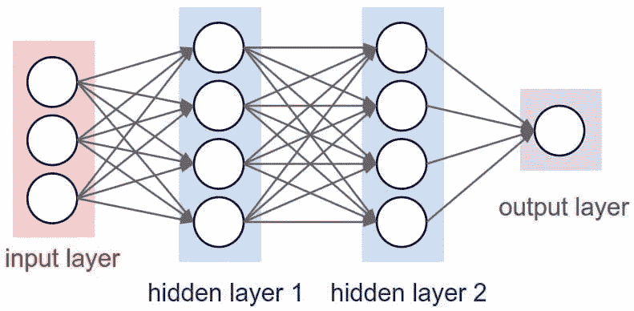

# 如果你和数据打交道，这 10 个算法可以改变你的生活

> 原文：<https://pub.towardsai.net/these-10-algorithms-can-change-your-life-if-you-work-with-data-ff544657922d?source=collection_archive---------0----------------------->

[万花筒](https://unsplash.com/@kaleidico?utm_source=medium&utm_medium=referral)在 [Unsplash](https://unsplash.com?utm_source=medium&utm_medium=referral) 上拍摄的照片

## 这些算法可以帮助您在最重要的业务环境中高效地执行数据科学任务。

数据科学已经成为世界上一些最先进的企业应用程序的基础，并且该领域已经迅速成为市场上最受欢迎的职业之一，全球的跨国公司和小型企业都在寻找数据科学家和熟练的数据专业人员。

在本文中，我列出了任何数据专业人员都应该了解的最流行的数据科学算法，以及一个有助于您更深入了解的链接。

这 10 种数据科学算法可以帮助您执行复杂的数据科学任务，如预测、分类、聚类等。看看吧！

来源:[用零数学直观解释的主成分分析](https://towardsdatascience.com/principal-component-analysis-pca-explained-visually-with-zero-math-1cbf392b9e7d)

# 主成分分析

PCA 是一种统计程序，它允许您使用一组更小的“汇总指数”来汇总大型数据表中的信息，这些指数更易于可视化和分析。

PCA 是一种对数据集进行降维的技术，对方差的影响最小。这意味着去掉不必要的特性，同时保留重要的特性。

您可以通过阅读以下文章了解更多关于 PCA 的信息:

 [## 主成分分析

### 一种选择最重要特征的方法

medium.com](https://medium.com/geekculture/principal-component-analysis-3d2b3a0bb93e) 

来源:S [支持向量机(SVM):分类和回归我都会](https://medium.com/analytics-vidhya/support-vector-machine-svm-i-can-do-both-classification-and-regression-c90235e847df)。

# 支持向量机

支持向量机(SVM)是一种受监督的机器学习模型，它使用分类算法来解决两组分类问题。例如，在为每个类别提供一个带有标签的训练数据集的 SVM 模型后，他们可以对新文本进行分类。

该算法试图绘制两条直线，它们之间有最大可能的边距。接下来，必须在 n 维空间中绘制数据项，其中 n 是输入要素的数量。最后，SVM 算法根据类别标签划分可能的输出。

这里有一篇非常好的文章，你可以从中了解更多关于 SVM 的信息:

 [## 支持向量机(SVM)——概述

### 机器学习涉及预测和分类数据，为此我们采用各种机器学习算法…

towardsdatascience.com](https://towardsdatascience.com/https-medium-com-pupalerushikesh-svm-f4b42800e989) 

来源:S [支持向量机(SVM):分类和回归我都会](https://medium.com/analytics-vidhya/support-vector-machine-svm-i-can-do-both-classification-and-regression-c90235e847df)。

# 线性回归

根据 IBM 的说法，线性回归分析用于根据一个变量的值来预测另一个变量的值。您希望预测的变量称为因变量。用来预测另一个变量的值的变量称为自变量。

线性回归算法主要用于确定输入变量和输出变量之间的线性关系。它被表示为具有一组输入和一个预测输出的线性方程。

这里有一篇很棒的文章，您可以从中了解更多关于线性回归的知识:

 [## 了解线性回归！！！！

### 每个刚接触数据科学或机器学习领域的人，通常都是从学习线性模型开始他们的旅程…

medium.com](https://medium.com/analytics-vidhya/understanding-the-linear-regression-808c1f6941c0) 

来源:[逻辑回归解释](https://towardsdatascience.com/logistic-regression-explained-9ee73cede081)

# 逻辑回归

简单来说，逻辑回归根据给定的独立变量数据集，估计某一事件发生的可能性，如投票或不投票。因为结果是一个概率，因变量的范围从 0 到 1。

逻辑回归主要用于二进制数据点分类。此外，它还执行分类，输出属于两个类别之一(1 或 0)。假设和 Sigmoid 曲线是这些算法的两个最重要的组成部分。

这里有一篇很棒的文章，您可以从中了解更多关于逻辑回归的知识:

 [## 逻辑回归。简化。

### 回归基础之后，是分类基础的时候了。还有什么比物流更简单的呢…

medium.com](https://medium.com/data-science-group-iitr/logistic-regression-simplified-9b4efe801389) 

来源: [K 均值数据聚类](https://towardsdatascience.com/k-means-data-clustering-bce3335d2203)

# k 均值聚类

K-means 聚类是一种简单而广泛使用的无监督机器学习算法。无监督算法通常仅使用输入向量从数据集进行推断，而不参考已知或标记的结果。

K-means 聚类将数据分成 k 个具有相似数据项的组。

这里有一篇很棒的文章，您可以从中了解更多关于 K-means 聚类的信息:

 [## 理解机器学习中的 K-均值聚类

### K-means 聚类是最简单和最流行的无监督机器学习算法之一。

towardsdatascience.com](https://towardsdatascience.com/understanding-k-means-clustering-in-machine-learning-6a6e67336aa1) 

来源:[决策树算法与动手示例](https://medium.datadriveninvestor.com/decision-tree-algorithm-with-hands-on-example-e6c2afb40d38)

# 决策图表

决策树是一种监督学习算法，通常用于问题分类。它对分类变量和连续变量都有效。

机器学习中的决策树算法是数据科学中最流行和最广泛使用的算法之一。

它可以用于决策分析，以直观和明确地表示决策和决策制定。

这里有一篇很棒的文章，您可以从中了解更多关于决策树的知识:

 [## 决策树解释

### 学习机器学习决策树的所有知识

towardsdatascience.com](https://towardsdatascience.com/decision-trees-explained-3ec41632ceb6) 

来源:[了解随机森林](https://towardsdatascience.com/understanding-random-forest-58381e0602d2)

# 随机森林

随机森林算法是由许多决策树组成的分类算法。

随机森林通过克服决策树引起的问题来帮助解决分类和回归问题。它基于集成学习的原理，该原理认为大量弱学习者可以协作进行高度准确的预测。

构建每棵树都采用了装袋和特征随机性来创建一个不相关的树的森林，其委员会的预测比任何单棵树都更准确。

这里有一篇很棒的文章，您可以从中了解关于随机森林的更多信息:

 [## 了解随机森林

### 一次一个算法 Harshdeep Singh

medium.com](https://medium.com/@harshdeepsingh_35448/understanding-random-forests-aa0ccecdbbbb) 

来源:[关于朴素贝叶斯你需要知道的一切](https://medium.com/analytics-vidhya/everything-you-need-to-know-about-na%C3%AFve-bayes-9a97cff1cba3)

# 朴素贝叶斯

朴素贝叶斯方法是一类监督学习算法，在给定类变量值的情况下，应用贝叶斯定理和每对要素之间条件独立性的“朴素”假设。

朴素贝叶斯分类器假定一个类中的特定特征与任何其他特征的存在无关。

即使这些特征都是相关的，当计算特定结果的概率时，该分类器算法也将独立地考虑它们。

这里有一篇很棒的文章，您可以从中了解有关朴素贝叶斯算法的更多信息:

 [## 朴素贝叶斯算法

### 探索朴素贝叶斯:数学，它是如何工作的，利弊和应用

medium.com](https://medium.com/analytics-vidhya/na%C3%AFve-bayes-algorithm-5bf31e9032a2) 

来源: [K 近邻](https://medium.com/@srishtisawla/k-nearest-neighbors-f77f6ee6b7f5)

# KNN

k-最近邻(KNN)算法是一种简单的监督机器学习算法，可用于解决分类和回归问题。

数据科学领域被广泛用于解决分类问题。KNN 算法可用于解决分类和回归问题。这个简单的模型可以存储所有现有案例，并根据 k 个邻居的多数投票对任何新案例进行分类。

这里有一篇很棒的文章，您可以从中了解关于 K-kind Neighbor 算法的更多信息:

 [## k-最近邻

### K-NN 的完整解释

medium.com](https://medium.com/swlh/k-nearest-neighbor-ca2593d7a3c4) 

来源:[关于人工神经网络(ANN)的 A 到 Z(理论 N 动手)](https://medium.com/analytics-vidhya/a-to-z-about-artificial-neural-networks-ann-theory-n-hands-on-713c12f3351e)

# 人工神经网络

人工神经网络，也称为神经网络或神经网络，是受动物大脑中发现的生物神经网络启发的计算系统。人工神经网络是由被称为人工神经元的连接单元或节点的网络构建而成的，松散地模仿人脑中的神经元。

神经网络由几层神经元组成，这些神经元被组织起来以将数据从输入层传输到输出层。例如，感知器是一个简单的神经网络，只有一个隐藏层。

这里有一篇很棒的文章，你可以从中了解更多关于神经网络的知识:

 [## 神经网络入门

### 你将探索神经网络

purnasaigudikandula.medium.com](https://purnasaigudikandula.medium.com/a-beginner-intro-to-neural-networks-543267bda3c8) 

# 结论

数据科学仍然是几乎所有情况下最重要的技术之一，数据专业人员对于最大限度地利用组织的时间、资源和劳动力至关重要。

为了在这个领域出类拔萃，我总是建议有抱负的专业人士学习各种数据科学算法，这将帮助他们轻松高效地执行分析和预测任务。

我希望这篇文章已经阐明了什么是真正重要的学习和理解。

# 你可能想读的其他文章。

*   [**这 9 篇研究论文正在改变我怎么看今年的人工智能**](https://medium.com/illumination/these-9-research-papers-are-changing-how-i-see-artificial-intelligence-this-year-cd8ba548f785) **。**
*   [**我们正在见证人工智能的下一次进化吗？**](/are-we-witnessing-the-next-evolution-of-artificial-intelligence-264f251ea06d)
*   [**给你印象最深的 Youtube 频道学习人工智能、机器学习、数据科学**](https://medium.com/p/486c1b41b92a) **。**
*   [**这些是 Youtube 上最好的频道，你可以在那里免费学习 PowerBI 和数据分析**](https://medium.com/p/8f8eb434b48d) **。**
*   [**正在利用人工智能进行招聘变革的 5 家公司**](https://medium.com/p/9a70986c7a7e) **。**
*   ****必读的 5 本关于人工智能的神奇书籍。****
*   **[**最好的 MIT 在线资源，供你免费学习 A.I .和机器学习**](https://medium.com/p/d3ba1e50f436) **。****

# **链接、资源和参考资料**

*   **神经网络的工作——中级。[https://adwaitkelkar 12 . medium . com/working-of-a-neural-network-6346 ee 137 B2 e](https://adwaitkelkar12.medium.com/working-of-a-neural-network-6346ee137b2e)**
*   **朴素贝叶斯——杰伊·维奈。[https://www.jayvinay.com/post/naive-bayes](https://www.jayvinay.com/post/naive-bayes)**
*   **大数据分析技术在运动训练中的应用。[https://www.hindawi.com/journals/wcmc/2022/3741087/](https://www.hindawi.com/journals/wcmc/2022/3741087/)**
*   **主成分—左提亲[https://zuoti.pro/qaa/1901422/principal-component](https://zuoti.pro/qaa/1901422/principal-component)**

# **如果你坚持到这里，你愿意支持我吗？**

***为了获得无限的故事，你也可以考虑* [*注册*](https://medium.com/@jairribeiro/membership) *成为中等会员，只需 5 美元。此外，如果您使用我的链接注册了* *，我会收到一小笔佣金(无需额外付费)。***

** [## 通过我的推荐链接加入媒体- Jair Ribeiro

### 阅读我分享的每一个故事(以及媒体上成千上万的其他作者)。你的会员费直接支持其他…

medium.com](https://medium.com/@jairribeiro/membership)**