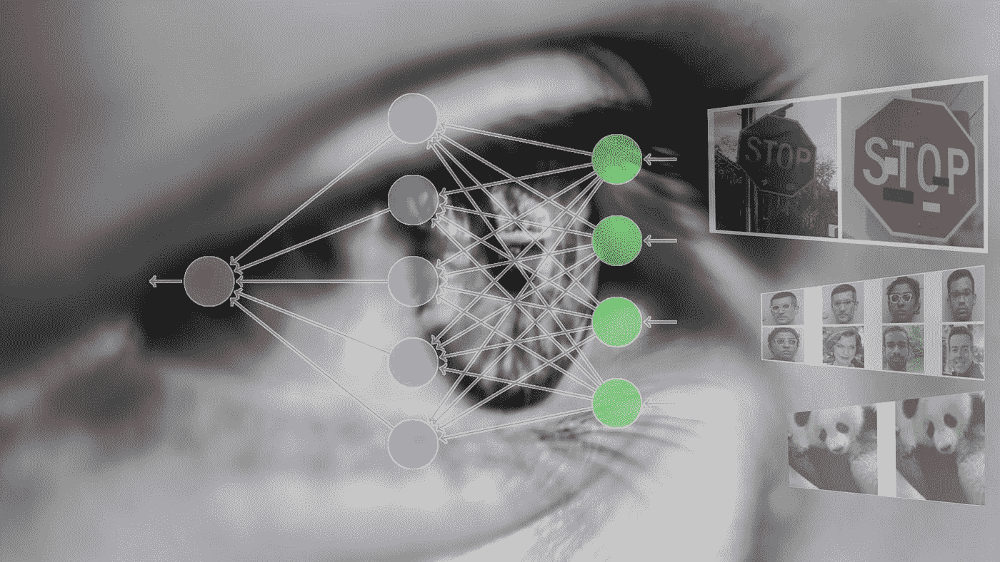
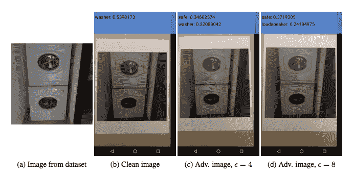
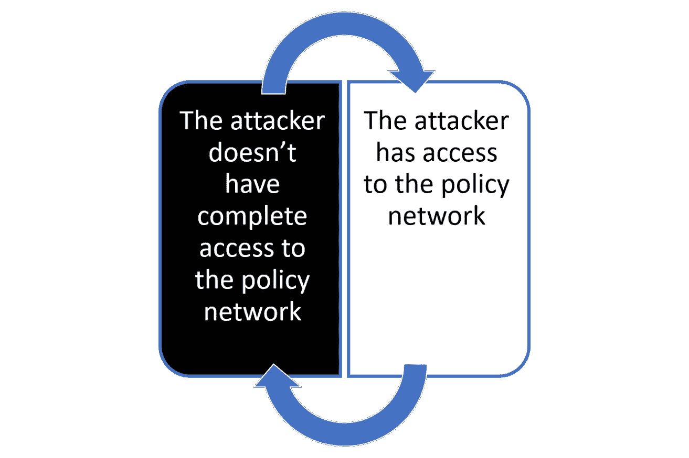

# 这是神经网络中两种主要的对抗性攻击

> 原文：<https://pub.towardsai.net/these-are-the-two-main-types-of-adversarial-attacks-in-neural-networks-91c0954ee747?source=collection_archive---------3----------------------->

## 黑盒和白盒攻击是 ML 工程师应该了解的两种对抗性攻击。

来源:[https://bdtechtalks . com/2020/12/07/von enet-neur science-inspired-deep-learning/](https://bdtechtalks.com/2020/12/07/vonenet-neurscience-inspired-deep-learning/)

> 我最近创办了一份专注于人工智能的教育时事通讯，已经有超过 125，000 名订户。《序列》是一份无废话(意思是没有炒作，没有新闻等)的 ML 导向时事通讯，需要 5 分钟阅读。目标是让你与机器学习项目、研究论文和概念保持同步。请通过订阅以下内容来尝试一下:

 [## 序列

### 与机器学习、人工智能和数据发展保持同步的最佳资源…

thesequence.substack.com](https://thesequence.substack.com/) 

随着人工智能(AI)和深度学习在软件解决方案中变得更加主流，它们将会带动技术领域的其他学科。安全性是需要快速发展以跟上深度学习技术进步的领域之一。虽然我们通常在积极的背景下考虑深度学习，算法试图提高解决方案的智能，但深度学习模型也可以用于策划复杂的安全攻击。更有趣的是，深度学习模型可以用来危及其他智能模型的安全。

深度神经网络攻击其他神经网络的想法似乎是空间进化中不可避免的事实。随着软件变得越来越智能，用于攻击和防御该软件的安全技术可能会自然地利用类似的智能水平。深度学习对安全领域提出了我们以前从未见过的挑战，因为我们可以拥有能够快速适应并产生新形式攻击的软件。深度学习领域包括一个被称为敌对网络的分支学科，该分支学科专注于创建可以破坏其他模型功能的神经网络。虽然敌对网络通常被视为提高深度学习模型鲁棒性的博弈论人工制品，但它们也可以被用来制造安全攻击。

使用对立的例子来扰乱深度学习分类器的最常见的场景之一。对立的例子是另一个网络设计来诱导错误的深度学习模型的输入。在分类模型的上下文中，您可以将对抗性攻击视为深度学习代理的视错觉😊下图显示了输入数据集中的微小变化如何导致模型将洗衣机错误分类为扬声器。

来源:https://openai.com/blog/adversarial-example-research/

如果所有的敌对攻击都像上面的例子一样，它们不会有什么大不了的，但是，想象一下通过使用贴纸或油漆投影停止标志的图像来扰乱自动驾驶汽车的相同技术。深度学习大师 Ina Goodfellow 在几年前发表的一篇题为[针对机器学习的实用黑盒攻击](https://arxiv.org/abs/1602.02697)的研究论文中描述了这种方法。

对抗性攻击在无监督的架构中更有效，如强化学习。与监督学习应用不同，在监督学习应用中，在学习期间处理固定的训练样本数据集，在强化学习(RL)中，这些样本是在整个训练过程中收集的。更简单地说，RL 模型训练一个策略，尽管模型目标是相同的，但是训练策略可以显著不同。从对抗性示例的角度来看，我们可以想象，无论它是否能够访问策略网络，攻击技术都会有很大的不同。使用该标准，深度学习研究人员通常将对抗性攻击分为两大类:黑盒与白盒。

[在另一篇最近的研究论文](http://rll.berkeley.edu/adversarial/arXiv2017_AdversarialAttacks.pdf)中，Ian Goodfellow 和他的同事强调了一系列针对 RL 模型的白盒和黑盒攻击。研究人员对一组知名的 RL 模型进行了对抗性攻击，如 A3C、TRPO 和 DQN，这些模型学习如何玩不同的游戏，如 Atari 2600、Chopper Command、Pong、Seaquest 或 Space Invaders。

# 白盒对抗性攻击

白盒对抗性攻击描述了攻击者能够访问目标模型的底层培训策略网络的场景。研究发现，即使在训练策略中引入小的扰动，也能极大地影响模型的性能。下面的视频展示了这些结果。

来源:[https://www.youtube.com/watch?v=OvQzg4zI2Fs&feature = youtu . be](https://www.youtube.com/watch?v=OvQzg4zI2Fs&feature=youtu.be)

# 黑盒对抗性攻击

黑盒对抗性攻击描述了攻击者无法完全访问策略网络的场景。上面提到的研究将黑盒攻击分为两大类:

1)对手可以访问训练环境，并且知道训练算法和超参数。它知道目标策略网络的神经网络架构，但不知道其随机初始化。他们将这种模式称为跨政策的可转移性。

*2)对手还不知道训练算法或超参数。他们把这个模型称为跨算法的可移植性。*

不足为奇的是，实验表明，我们发现对手对目标策略了解得越少，对抗性例子的效果就越差。跨算法的可转移性在降低代理性能方面不如跨策略的可转移性有效，后者不如白盒攻击有效。