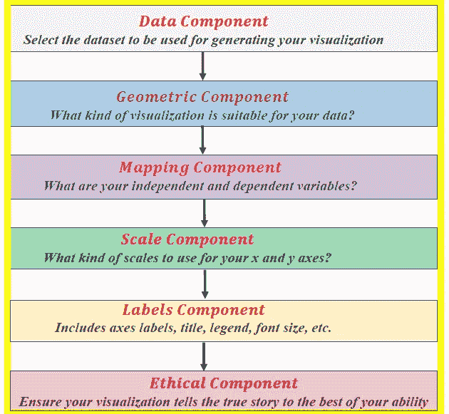

# 这些数据科学技能将成为你的超能力

> 原文：<https://pub.towardsai.net/these-data-science-skills-will-be-your-superpower-7de526c1a8f3?source=collection_archive---------0----------------------->

[阿里·叶海亚](https://unsplash.com/@ayahya09?utm_source=medium&utm_medium=referral)在 [Unsplash](https://unsplash.com?utm_source=medium&utm_medium=referral) 上的照片

## [数据科学](https://towardsai.net/p/category/data-science)

## 使您的数据科学培训完整的硬技能和软技能

# 一.导言

数据科学领域的大多数学术培训项目主要侧重于教授硬技能。一次又一次，行业数据、市场趋势和顶级商业领袖的见解都强调软技能是职场成功的关键因素。本文将讨论在数据科学实践中取得成功的基本硬技能和软技能。

# 二。硬技能

## 1.数学和统计技能

数学技能在数据科学和机器学习中至关重要。有关数据科学和机器学习所需的基本数学技能的更多信息，请参见本文:[数据科学我需要多少数学？](https://medium.com/towards-artificial-intelligence/how-much-math-do-i-need-in-data-science-d05d83f8cb19)

## 2.基本编程技能

编程技能在数据科学中至关重要。因为 Python 和 R 被认为是数据科学中最流行的两种编程语言，所以掌握这两种语言的基本知识至关重要。更多数据科学所需的基本编程技巧，请见本文:[数据科学我需要多少编程](https://medium.com/towards-artificial-intelligence/how-much-programming-do-i-need-in-data-science-64356fdb9ef2)？

## 3.数据争论和预处理技巧

数据是数据科学中任何分析的关键，无论是推理分析、预测分析还是规定分析。模型的预测能力取决于构建模型时所用数据的质量。数据以不同的形式出现，如文本、表格、图像、语音或视频。最常见的情况是，用于分析的数据必须经过挖掘、处理和转换，才能呈现为适合进一步分析的形式。

i) **数据争论**:数据争论的过程对于任何数据科学家来说都是至关重要的一步。在数据科学项目中，很少能够轻松访问数据进行分析。数据更有可能在文件、数据库中，或者从网页、tweets 或 pdf 等文档中提取。知道如何争论和清理数据将使您能够从数据中获得关键的洞察力，否则这些洞察力将被隐藏。

ii) **数据预处理**:关于数据预处理的知识非常重要，包括以下主题:

a)处理缺失数据

b)数据插补

c)处理分类数据

d)为分类问题编码类别标签

e)特征变换和降维技术，例如主成分分析(PCA)和线性判别分析(LDA)。

## 4.数据可视化技能

理解良好数据可视化的基本要素(**见下图**)。能够使用一些数据可视化软件包，如 matplotlib、seaborn 和 ggplot2。

数据可视化项目的典型工作流。Benjamin O. Tayo 的图片

## 5.基本的机器学习技能

机器学习是数据科学的一个非常重要的分支。理解机器学习框架很重要:问题框架；数据分析；模型建立、测试和评估；和模型应用。

机器学习项目的典型工作流程。Benjamin O. Tayo 的图片

从这里了解更多关于机器学习框架的信息:[机器学习过程教程。](https://medium.com/swlh/machine-learning-process-tutorial-222327f53efb)

## 6.来自真实世界顶点数据科学项目的技能

仅仅从课程工作中获得的技能不会让你成为一名数据科学家。合格的数据科学家必须能够证明成功完成了真实世界的数据科学项目，包括数据科学和机器学习过程中的每个阶段，如问题框架、数据采集和分析、模型构建、模型测试、模型评估和部署模型。现实世界的数据科学项目可以在以下项目中找到:

a) Kaggle 项目

b)实习

c)来自访谈

# 三。软技能

## 1.通讯技能

数据科学家需要能够与团队的其他成员或组织中的业务管理员交流他们的想法。良好的沟通技巧将在这里发挥关键作用，能够向很少或根本不了解数据科学技术概念的人传达和展示非常技术性的信息。良好的沟通技巧将有助于培养与其他团队成员(如数据分析师、数据工程师、现场工程师等)团结一致的氛围。

## 2.做一个终身学习者

数据科学是一个不断发展的领域，所以要做好接受和学习新技术的准备。与该领域的发展保持联系的一种方式是与其他数据科学家建立联系。一些促进网络化的平台是 LinkedIn、github 和 medium ( [**面向数据科学**](https://towardsdatascience.com/) 和 [**面向 AI**](https://towardsai.net/) 出版物)。这些平台对于获取该领域最新发展的最新信息非常有用。

## 3.团队合作技能

作为一名数据科学家，你将在一个由数据分析师、工程师和管理员组成的团队中工作，因此你需要良好的沟通技巧。您还需要成为一名优秀的倾听者，尤其是在早期项目开发阶段，您需要依靠工程师或其他人员来设计和构建一个优秀的数据科学项目。成为一名优秀的团队成员有助于你在商业环境中茁壮成长，并与团队中的其他成员以及组织的管理人员或主管保持良好的关系。

## 4.商业敏锐技能

对于实际应用来说，一个非常重要的技能是商业头脑。商业敏锐性是从模型中得出有意义的结论的能力，这些结论可以导致重要的、节省成本的数据驱动的决策。因此，对于实用的数据科学家来说，获得商业敏锐度是至关重要的。

## 5.数据科学中的伦理技能

理解你的项目的含义。对自己诚实。避免操纵数据或使用有意造成结果偏差的方法。从数据收集到分析，再到模型构建、分析、测试和应用，在所有阶段都要遵守道德规范。避免为了误导或操纵你的观众而捏造结果。在解释你的数据科学项目的发现时要合乎道德。

# 四。总结和结论

总之，我们已经讨论了实践数据科学家所需的几项基本技能。虽然学术培训项目在教授硬技能方面做得很好，但软技能对于在现实世界中取得成功至关重要。

# 其他数据科学/机器学习资源

数据科学需要多少数学知识？

[数据科学课程](https://medium.com/towards-artificial-intelligence/data-science-curriculum-bf3bb6805576)

[进入数据科学的 5 个最佳学位](https://towardsdatascience.com/5-best-degrees-for-getting-into-data-science-c3eb067883b1)

[数据科学的理论基础——我应该关心还是仅仅关注实践技能？](https://towardsdatascience.com/theoretical-foundations-of-data-science-should-i-care-or-simply-focus-on-hands-on-skills-c53fb0caba66)

[机器学习项目规划](https://towardsdatascience.com/machine-learning-project-planning-71bdb3a44349)

[如何组织你的数据科学项目](https://towardsdatascience.com/how-to-organize-your-data-science-project-dd6599cf000a)

[大型数据科学项目的生产力工具](https://medium.com/towards-artificial-intelligence/productivity-tools-for-large-scale-data-science-projects-64810dfbb971)

[数据科学作品集比简历更有价值](https://towardsdatascience.com/a-data-science-portfolio-is-more-valuable-than-a-resume-2d031d6ce518)

如有问题和疑问，请发邮件给我:benjaminobi@gmail.com