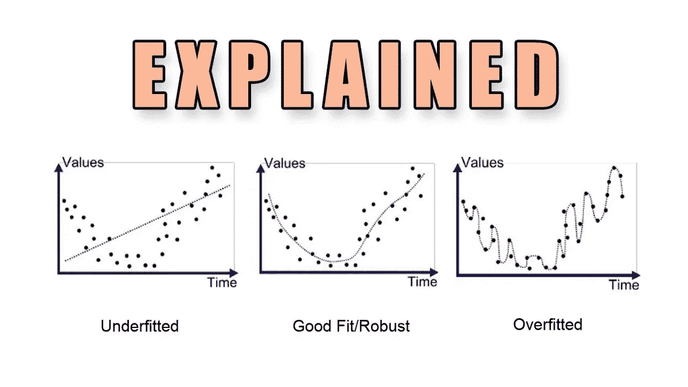
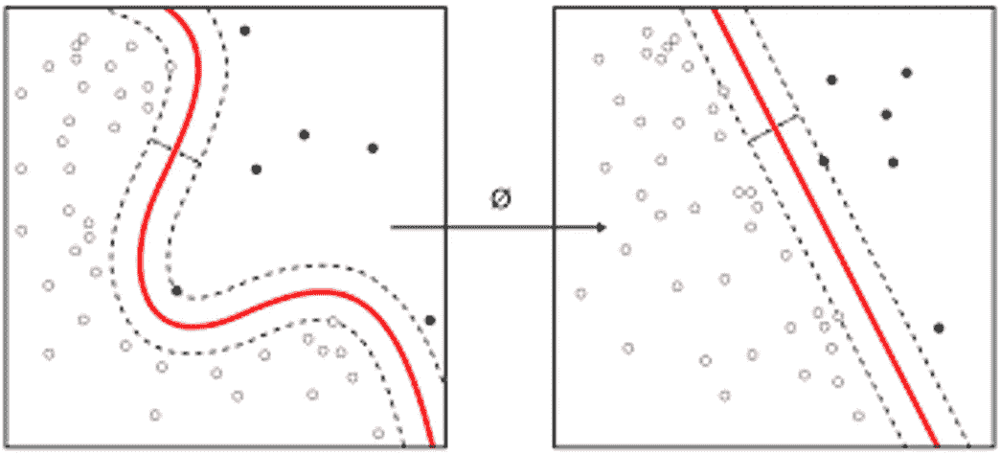
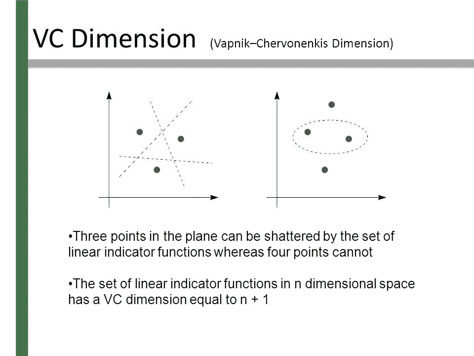
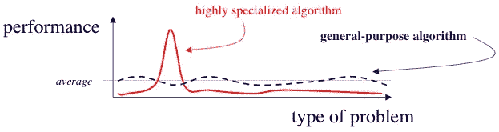

# 这三个理论帮助我们理解机器学习模型中的过拟合和欠拟合

> 原文：<https://pub.towardsai.net/these-three-theories-help-us-understand-overfitting-and-underfitting-in-machine-learning-models-b2e960d17141?source=collection_archive---------0----------------------->

## 奥卡姆剃刀、VC 维度和免费的午餐定理可以帮助我们思考 ML 解决方案中的过度拟合和欠拟合。

来源:[https://medium . com/@ minions . k/under fit-and-over fit-explained-8161559 b 37 db](https://medium.com/@minions.k/underfit-and-overfit-explained-8161559b37db)

> 我最近创办了一份专注于人工智能的教育时事通讯，已经有超过 10 万名订户。《序列》是一份无废话(意思是没有炒作，没有新闻等)的 ML 导向时事通讯，需要 5 分钟阅读。目标是让你与机器学习项目、研究论文和概念保持同步。请通过订阅以下内容来尝试一下:

 [## 序列

### 订阅人工智能世界中最相关的项目和研究论文。受到 120，000+的信任…

thesequence.substack.com](https://thesequence.substack.com/) 

欠拟合和过拟合是现代机器学习(ML)解决方案中普遍存在的挑战。这两个挑战都与机器学习模型基于初始训练样本集构建相关知识的能力有关。从概念上讲，欠拟合与机器学习算法无法从初始训练数据中推断出有效知识有关。与此相反，过度拟合与创建假设的模型相关联，这些假设过于一般化或抽象，无法产生实际结果。简单来说，不适合的模型有点愚蠢，而过度适合的模型容易产生幻觉(想象不存在的东西):)。

量化 ML 模型中过度拟合或欠拟合倾向的最佳方法之一是理解其能力。从概念上讲，容量代表机器学习模型可以选择作为可能解决方案的函数的数量。例如，线性回归模型可以将 y = w*x + b 形式的所有 1 次多项式作为容量(意味着所有潜在的解决方案)。在机器学习模型中，容量是一个非常重要的概念。从技术上讲，当机器学习算法的能力与其任务的复杂性和训练数据集的输入成比例时，它的性能最佳。低容量的机器学习模型在解决复杂任务时不切实际，并且往往不适合。同样，容量高于需求的模型很快就会过度适应。从这个角度来看，容量代表了一种度量，通过这种度量，我们可以估计模型欠拟合或过拟合的倾向。

有几种方法可以帮助我们量化 ML 模型的容量。从哲学/数学的角度来看，我发现有三个理论在考虑欠拟合和过拟合的情况时非常有用。

## ①奥卡姆剃刀

奥卡姆剃刀的原理是当哲学家参与机器学习时会发生什么:)这一古老的哲学理论的起源可以追溯到 1287 年至 1347 年之间，与托勒密等哲学家联系在一起。本质上，奥卡姆剃刀理论指出，如果我们有解释已知观察的竞争性假设，我们应该选择最简单的一个。从夏洛克·福尔摩斯到蒙克，奥卡姆剃刀在世界级的侦探中无处不在，他们经常遵循最简单和最符合逻辑的假设来揭开复杂的谜团。

奥卡姆剃刀是我们日常生活中要遵循的明智的哲学原则，但它在机器学习中的应用充其量只会引起争议。从计算的角度来看，更简单的假设当然是更可取的，因为在这个世界上，算法因耗费资源而臭名昭著。此外，更简单的假设在计算上更容易推广。然而，超简单假设的挑战在于，它们经常导致过于抽象，无法模拟复杂的场景。因此，具有足够大的训练集和适当大小的维数的模型应该选择能够产生低训练误差的足够复杂的假设。否则，它将被提示填充不足。

图片鸣谢:谷歌人工智能

## 2)风险资本维度

奥卡姆剃刀是一个很好的简约原则，但这些抽象的想法不会直接转化为生活在数字宇宙中的机器学习模型。统计理论的创始人 Vapnik 和 Chervonekis(VC)解决了这一挑战，他们提出了一个模型来量化统计算法的能力。这种技术被称为 VC 维，它基于确定最大数 *m* ，从该最大数存在目标机器学习功能可以任意标记的 *m* 个不同的 *x* 个点的训练集。

图片来源:斯坦福大学

VC 维度是统计学习的基石之一，并被用作许多有趣理论的基础。例如，VC 维度有助于解释机器学习模型中泛化误差和训练误差之间的差距随着训练集大小的增加而减小，但随着模型容量的增加，这种差距也会增加。换句话说，拥有大量训练集的模型更有可能选择近似正确的假设，但如果有太多潜在的假设，那么我们很可能以错误的假设告终。

## 3)没有免费的午餐定理

我想用我最喜欢的机器学习原则之一来结束这篇文章，这个原则与过度适应-欠适应问题有关。没有免费的午餐定理表明，平均所有可能的数据生成分布，每个分类算法在分类以前未观察到的点时具有大致相同的错误率。我喜欢把没有免费的午餐定理看作是机器学习算法局限性的数学反理论，这些算法迫使我们使用有限的训练集来概括半绝对的知识。例如，在逻辑学中，从有限的例子中推断普遍规则被认为是“不合逻辑的”。对于机器学习从业者来说，没有免费的午餐定理是另一种说法，即在给定足够多的观察值的情况下，没有算法比其他算法更好。换句话说，机器学习模型的作用不是找到通用的学习函数，而是找到更适合目标场景的假设。

图片鸣谢:谷歌人工智能

过拟合和欠拟合仍然是机器学习应用中最严重的两个挑战。像 VC 维、奥卡姆剃刀和没有免费的午餐定理这样的理论为分析机器学习解决方案中过拟合和欠拟合条件的根源提供了强大的理论基础。理解和量化机器学习模型的能力仍然是理解其过拟合或欠拟合倾向的基本步骤。