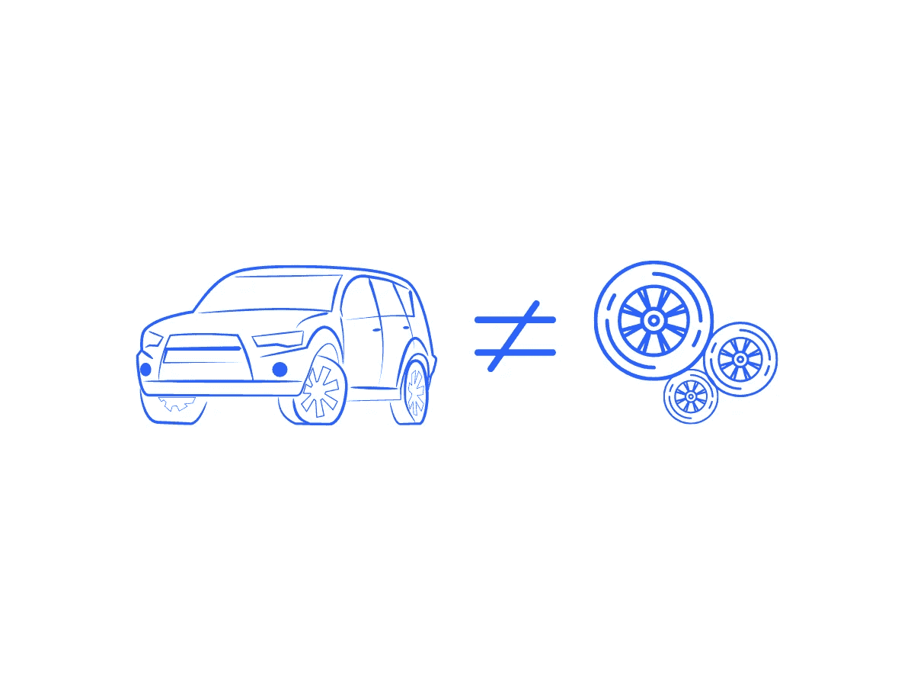
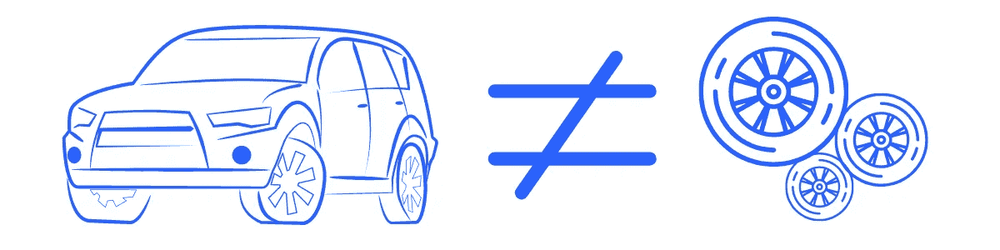
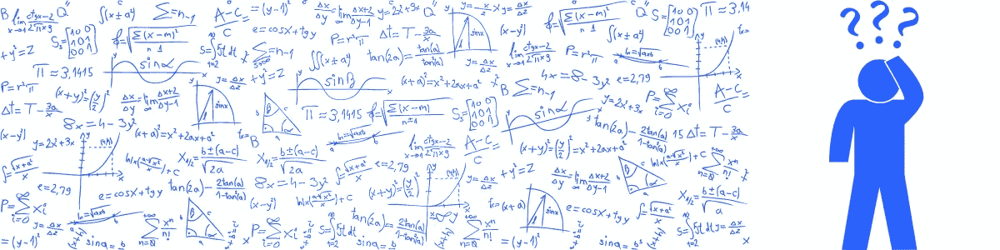

# 数据科学家说的事情，聪明还是不聪明？

> 原文：<https://pub.towardsai.net/things-data-scientists-say-clever-or-not-so-clever-6e57b1232193?source=collection_archive---------3----------------------->

## 以及其他关于我们工作的愚蠢想法

说数据科学家不像数据分析师是跑题了。还有，这有点像说汽车不像轮子。阅读下面的内容，了解数据科学家们有时会说的更多愚蠢的话。

图片来源:作者在 Canva 创作的插图。汽车和轮子是不同的。但是，没有轮子，汽车就不能工作。汽车让轮子延伸轮子的效用。

# 介绍

一位统计学家、一位商业分析师和一位程序员走进一家酒吧。酒保问，“这是某种数据科学玩笑吗？”(笑话出处不详)。

几周前，在我参加的一个 Keras 进修研讨会(现场和面对面)上，一个参与者问“你能……”主持人明智地说，“再多说一点？”演讲者对这个问题不清楚，也没有考虑过这个问题。

> 主持人明智地说“再多说一点？”

在困惑了一会儿之后，演示者打开了一个新的浏览器标签，在谷歌上搜索了参与者的问题。每个人都笑得很开心。那是有趣的一天。

## “谷歌一下”

在我的讨论中，一个常见的重复是“永远不要记住你能查到的任何东西。”我开始这么说是从我的律师同行(在以前的职业生涯中)那里学来的。但是，严肃地说，在线搜索技能是最不受重视的技能之一，任何数据科学专业人员都可以从进一步发展中受益。

> 在困惑了一会儿之后，演示者打开了一个新的浏览器标签，在谷歌上搜索了参与者的问题。

## “数据科学家不同于数据分析师”

嗯，是…也不是。试试这个类比。医生不同于外科医生。事实上，外科医生也是医生。所有的外科医生都是医生。不一定是反过来。

或者这个，汽车不同于轮子。好的，当然。但是，没有轮子，汽车就不能工作。汽车让轮子延伸轮子的效用。

图片来源:作者在 Canva 创作的插图。汽车和轮子是不同的。但是，没有轮子，汽车就不能工作。汽车让轮子延伸轮子的效用。

## “R 优于 Python”

或者 Python 比 r 好或者 AWS 比 Azure 好。或者任何比其他更好的东西。其实这些都不是真的。我也不支持 Python 比 r 更好的说法，那么 Stata、SPSS 和 Matlab 等呢？

比如什么？这些语言中有许多是为不同的目的而生的——但后来发展成了更通用的目的。说一个比另一个好就像说公共汽车比火车好。他们都会带你去一些地方。但是火车和公共汽车有不同的用例。

> "这是某种数据科学玩笑吗？"

## “视情况而定”

并不是说我们想激怒任何问我们问题的人。但是，它通常取决于(许多因素和考虑)。不管那个*是什么*。我给不想疏远任何人的数据科学家的建议是，带着适度的同情心和同理心说这些。

## “我是科学家”

好吧，数据科学家就是科学家——通常是这样。说你是一个科学家而不批判性地思考一个科学家在做什么是有问题的。获得“科学家”的头衔让你有义务去理解是什么让你成为科学家。

## “我不需要数学”

是的。你确实需要数学。

图片来源:作者在 Canva 创作的插图。数据科学家需要数学。

## “我创建了自己的工作描述”

我们很多人都这么认为。

## “我们需要更多数据”

你确定吗？真的吗？你探索过你已经拥有的了吗？

## “我爱数据”

说真的，对于数据在我们的生活和工作中对我们意味着什么，有更好的方式来表达我们的感受。这真的让我想起了我最喜欢的一个迷因…

## “非零”

这是不是过于简单化了？我们从经济学家、计量经济学家和其他有统计学倾向的专业人士那里听到了这个观点。但是说起来也很有趣。

 [## 加入我的介绍链接媒体-亚当罗斯纳尔逊

### 作为一个媒体会员，你的会员费的一部分会给你阅读的作家，你可以完全接触到每一个故事…

adamrossnelson.medium.com](https://adamrossnelson.medium.com/membership) 

# 感谢阅读

你准备好了解更多关于数据科学职业的信息了吗？我进行一对一的职业辅导，并有一份每周电子邮件列表，帮助专业求职者获取数据。联系我了解更多信息。

感谢阅读。把你的想法和主意发给我。你可以写信只是为了说声嗨。如果你真的需要告诉我是怎么错的，我期待着尽快和你聊天。推特:[@ adamrossnelson](https://twitter.com/adamrossnelson)LinkedIn:[亚当罗斯尼尔森](https://www.linkedin.com/in/arnelson/)。