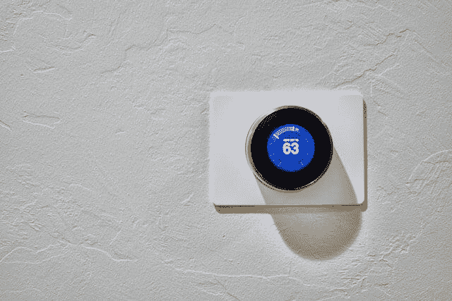
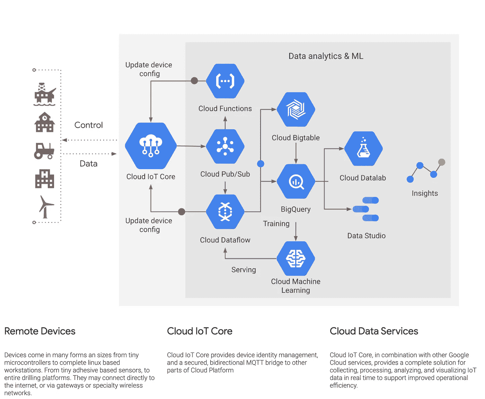

# 物联网

> 原文：<https://pub.towardsai.net/things-to-internet-of-things-iot-1516d7eb4558?source=collection_archive---------4----------------------->

## [物联网](https://towardsai.net/p/category/iot)

## 物联网设备、网关、云以及 MQTT 协议

没有能力直接或间接连接到互联网的物理对象只是东西。如果一个东西连接到其他东西和/或互联网，它就是物联网设备。物联网设备将计算提升到了一个新的水平，虚拟和物理世界融合在一起，产生强大而可操作的东西。

# 物联网

如果上图中的恒温器让你只能从物理设备上控制设置，那么它只是一个东西。如果它连接到您的家庭 wifi 网络，那么它就是一个物联网设备。你在物联网设备上能控制什么或不能控制什么是一个设计问题。

简单来说，任何具有传感器的物理对象都可以与互联网世界进行通信，这就是物联网设备。互连的能力、意图和目的因所解决的业务问题而异。

我们将关注概念层面的高级组件。理解土地的整体布局对于欣赏建筑和它所能产生的潜在价值是至关重要的。

**我们将讨论的四个领域是:**

1.  物联网设备
2.  网关和/或互联网
3.  数据处理—云
4.  消息队列遥测传输(MQTT)协议

## 物联网设备

要成为物联网设备，它必须具备硬件和软件，统称为传感器，使其能够连接到像自己一样的其他设备，并最终直接或通过网关连接到互联网。这些设备需要电力才能运行。它既可以插入主电源，也可以通过电池或太阳能供电。预期用途决定了设备的设计。例如:

*   如果该设备将被安装在车辆上以跟踪运动，它可以使用车辆的电力，并将需要具有实时 GPS 连接。
*   如果目的是收集车辆各部分的健康信息用于预防性维护，那么实时馈送可能是不必要的。
*   如果该设备必须安装在农场上，那么电池或可再生能源可能是唯一可行的选择。

## 网关和/或互联网

物联网设备的传感器具有最低限度的互联网连接能力，例如蓝牙。蓝牙连接可以帮助您与另一台设备配对，但它本身无法连接到互联网。因此，如果您有一个这样的物联网设备集群，这些设备具有有限的连接选项(这种限制是由设计决定的)，网关就会成为将所有这些设备连接到互联网的焦点。

网关允许未直接连接到互联网的物联网设备使用云服务。一群物联网设备可以连接到网关，网关可以处理来自传感器的输入，并将它们中继到云基础设施进行进一步处理。

最常用的网关是将您的家庭或企业连接到互联网的路由器。您家中的路由器可以帮助您将多个设备连接到互联网。每个设备都是按照自己的协议和架构设计的。正是路由器充当设备集群和互联网之间的网络节点，从而赋予每个设备生命，这些设备本身可能具有非常有限的连接性。

## 数据处理—云

单个物联网设备可能不会产生大量数据，但如果您考虑成千上万的此类设备实时传输数据，这将成为一个大数据问题。

云计算提供了从这些物联网设备收集的海量数据中获取、处理和生成可操作见解的可扩展性。

所有主要的云提供商，如 GCP、Azure & AWS，都有额外的云服务，可以与物联网基础设施一起使用。

## MQTT:物联网消息传递的标准

遥测数据是从远程设备收集的测量数据。对于远程设备而言，可靠地传输数据至关重要，这样所生成的洞察才具有可操作性。为了使整个传输管道顺利运行，低网络带宽和轻量级协议在数据收集端点是必不可少的。

[**【MQTT】**](https://mqtt.org/)消息队列遥测传输(MQTT)是物联网的 OASIS 标准消息协议。它被设计为一种极其轻量级的发布/订阅消息传输，非常适合于以较小的代码量和最小的网络带宽连接远程设备。如今，MQTT 广泛应用于各种行业，如汽车、制造、电信、石油和天然气等。

**下面的谷歌云平台(GCP)物联网参考架构描述了从生成数据的远程设备到使数据可操作的洞察的流程。**

[谷歌云解决方案架构参考(物联网 MQTT 桥)](https://gcp.solutions/diagram/iot-mqtt)

## 摘要

从远程物联网设备生成数据、捕获数据、将其与额外信息合并，然后生成有价值的可操作见解的过程是复杂而具有挑战性的。

新兴的物联网特定服务使集成变得容易，并进一步推动了采用。发展我们讨论的四个主要领域中的任何一个领域的技能，以及将它们结合在一起的能力，是通向新兴计算职业的一条道路。

## 参考资料:

1.  [谷歌云解决方案架构参考](https://gcp.solutions/)
2.  [MQTT:物联网消息标准](https://mqtt.org/)

*原载于 2021 年 1 月 22 日*[*https://www . emerging . careers*](https://www.emerging.careers/blog/2021/01/22/things-to-internet-of-things)*。*