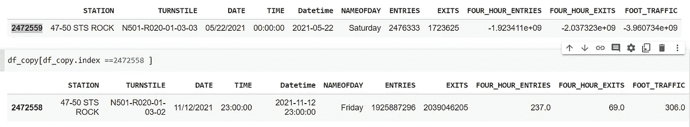
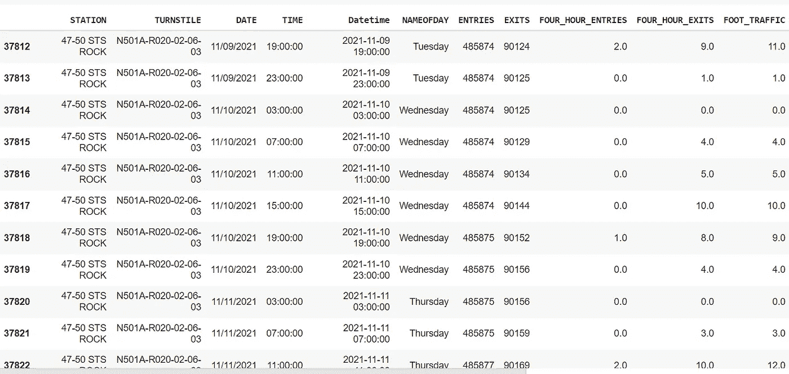
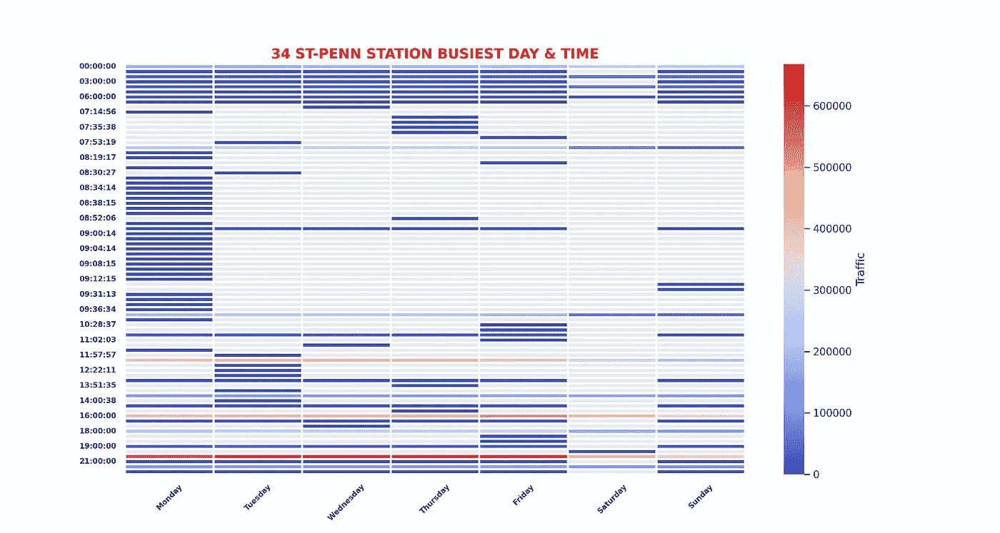
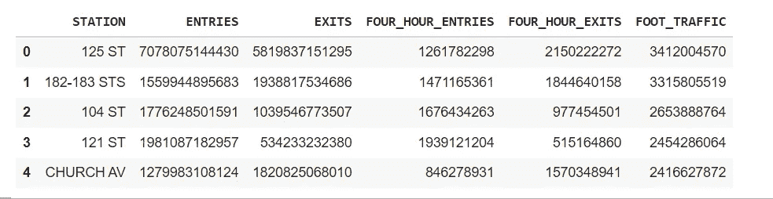
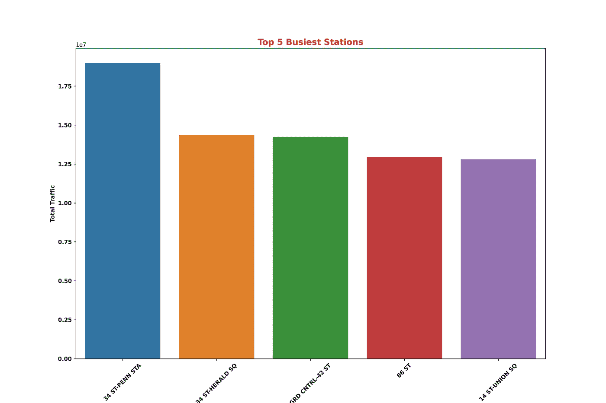

# 在 2022 年使用 MTA 十字转门数据时需要注意的事项

> 原文：<https://pub.towardsai.net/things-to-watch-out-while-working-with-the-mta-turnstile-data-in-2022-e557cfc49472?source=collection_archive---------1----------------------->

## [数据分析](https://towardsai.net/p/category/data-analysis)

无论您是使用纽约大都会运输管理局(MTA)的数据进行专业项目还是与训练营相关的项目，您都需要了解一些事情。我的动机是分析这个数据集，作为在**伊斯坦堡数据科学院**的项目的一部分，用于探索性数据分析( **EDA** )的目的。本项目使用的数据是从**2021 年 5 月到 2021 年 11 月**共 **25 周**和**500 多万行。**

数据相关信息从 MTA 数据字典和其他公开来源收集，总结如下。

**关于数据**

大都会运输管理局是北美最大的运输网络，服务于纽约市周围 5，000 平方英里的旅行区域内的 1，530 万人口，途经长岛、纽约州东南部和康涅狄格州。

MTA 网络包括全国最大的公交车队，比美国所有其他交通系统加起来还多的地铁和通勤列车。MTA 的运营机构是 MTA 纽约市运输公司、MTA 公共汽车公司、长岛铁路公司、地铁-北方铁路公司和 MTA 桥梁与隧道公司。

[**十字转门数据**](http://web.mta.info/developers/turnstile.html) 来源于控制区(车站)的物理设备，用于收集进入系统的费用。收集的数据然后被传输到一个叫做自动售检票系统(AFC)的主机应用程序。

每周在**周六**从中央数据库中提取审计登记数据，用于发布。实际的登记数据每隔 **4 小时**在十字转门设备上生成，此时设备将数据上传到中央数据库。

**四小时间隔将不同于其他站点，因为需要错开，以防止审计读数同时淹没系统**。在全系统范围内，站点已被设置为在 00 至 03 小时之间开始审核传输，然后在一天的第一次审核后每 4 小时进行一次。

数据被分解为每天和每小时的时间段。数据为 **10 位数**和**长，在溢出**时将翻转到零(0)。可能影响数据的其他因素有:

*   需要更换和初始化硬盘的硬件故障。
*   故障设备造成的数据损坏，或十字转门的重击。

**代表“**定期**计划审计事件(通常每 4 小时发生一次)**

*   **由于计划或故障排除活动，审核可能会超过 4 小时。**
*   **此外，可能还有一个**“reco VR AUD”**条目:这是指已恢复的遗漏审计。如果发送了恢复的审计，并且该审计与先前的寄存器读数相同，则该审计将被忽略。**

****入口**和**出口**是设备的累计值。该寄存器在系统设置期间初始化。它是一个 **10 位数的数字**,代表特定设备自开始以来的数值数量。在计数器翻转、擦除包含登记数据的存储设备以及更换旋转门的处理设备时，可以进行其他形式的初始化。**

****探索性数据分析(EDA)****

**数据列:**

```
Index(['C/A', 'UNIT', 'SCP', 'STATION', 'LINENAME', 'DIVISION', 'DATE', 'TIME',
       'DESC', 'ENTRIES', 'EXITS'],
      dtype='object')
```

**行和列的总数:**

```
df_copy**.**shape(5242282, 11)
```

**没有空值:**

```
df_copy**.**isnull()**.**sum()C/A          0
UNIT         0
SCP          0
STATION      0
LINENAME     0
DIVISION     0
DATE         0
TIME         0
DESC         0
ENTRIES      0
EXITS        0
TURNSTILE    0
dtype: int64
```

**零个重复值:**

```
df_copy**.**duplicated()**.**sum()0
```

**有 379 个地铁站:**

```
len(df_copy["STATION"]**.**unique())379
```

**如果您在创建 **4_Hour_Entries** 、 **4_Hour_Exits、**和 **Foot_Traffic** 列之前，按照十字转门和日期时间值从最小值到最大值对值进行排序**

```
df.sort_values([‘TURNSTILE’,’Datetime’], ascending= (True,True) , inplace=True)
```

**我们使用 shift()方法来计算渐变行之间的值**

```
FOUR_HOUR_ENTRIES = df.ENTRIES - df.ENTRIES.shift(1)
df['FOUR_HOUR_ENTRIES'] = FOUR_HOUR_ENTRIES.fillna(0)FOUR_HOUR_EXITS = df.EXITS - df.EXITS.shift(1)
df['FOUR_HOUR_EXITS'] = FOUR_HOUR_EXITS.fillna(0)
```

**尽管我们已经对值进行了排序，但我们仍然得到大量的正数和负数:**

```
df_copy**.**FOUR_HOUR_ENTRIES**.**max()2146993563.0df_copy**.**FOUR_HOUR_ENTRIES**.**min()-2144271150.0df_copy**.**FOUR_HOUR_EXITS**.**max()2133740922.0df_copy**.**FOUR_HOUR_EXITS**.**min()-2133740909.0
```

**当我们深入挖掘数据集时，我们发现当天的进出值比第二天大得多。**

```
df_copy[df_copy['FOOT_TRAFFIC'] == df_copy['FOOT_TRAFFIC'].min()]df_copy[df_copy**.**index **==**2472558 ]
```

****

**对于'**47–50 STS-ROCK**'特定调查，我们可以看到不规则的时间条目。所以对于所有的十字转门来说，4 小时的观察是不一样的。**

```
st = '47-50 STS ROCK'dfx = df_copy[df_copy['STATION']==st].reset_index(drop=True).iloc[10:,:]dfx.plot("Datetime", "FOOT_TRAFFIC")dfx.tail(20)
```

****

**如果你仔细观察数据(在下面的截图中)，你会发现甚至有分钟显示，这是不应该的。这也使得分组非常困难，因为数据收集时间范围是 4 小时。按分钟输入只会使情况变得更糟..**

****

**我想在这里提到的另一件事是，如果我们不对 4_hour_entries 和 4_hour_exits 列设置某个入口级别的限制，正如从下面的截图中可以看到的那样，这些数字会大幅上升。**

```
#Summing up traffic by stationstation_totals = df_copy.groupby('STATION').sum().sort_values('FOOT_TRAFFIC', ascending=False).head(5)station_totals.sort_values(by='FOOT_TRAFFIC', ascending=False, inplace=True)station_totals.reset_index(inplace=True)station_totals['FOUR_HOUR_ENTRIES'] = station_totals['FOUR_HOUR_ENTRIES'].astype('int64')station_totals['FOUR_HOUR_EXITS'] = station_totals['FOUR_HOUR_EXITS'].astype('int64')station_totals['FOOT_TRAFFIC'] = station_totals['FOOT_TRAFFIC'].astype('int64')top_5 = station_totals.head(5)top_5
```

****

**在这里，我借用了 Chris Whong 的方法，显然，他也从别人那里得到了这个方法。但你可以在这里 阅读更多关于他处理这个 [**的方法。它所做的是排除大于 10000 和小于 0 的值，考虑到在审计时间范围内不超过 10000 人不能通过十字转门。**](https://medium.com/qri-io/taming-the-mtas-unruly-turnstile-data-c945f5f96ba0)**

```
df_copy['FOUR_HOUR_ENTRIES'] = df_copy.groupby(['TURNSTILE']).FOUR_HOUR_ENTRIES.transform(lambda x: np.where((x<0)|(x>10000),x.mask((x<0)|(x>10000)).mean(),x))df_copy['FOUR_HOUR_EXITS'] = df_copy.groupby(['TURNSTILE']).FOUR_HOUR_EXITS.transform(lambda x: np.where((x<0)|(x>10000),x.mask((x<0)|(x>10000)).mean(),x))
```

****

**我希望这篇文章足够成功，能够解决您在理解数据时可能面临的一些挑战。我知道在开源项目中没有一种方法。请随时分享您对数据或文章的任何反馈或意见。我希望回到这个项目，如果可能的话，改进它。**