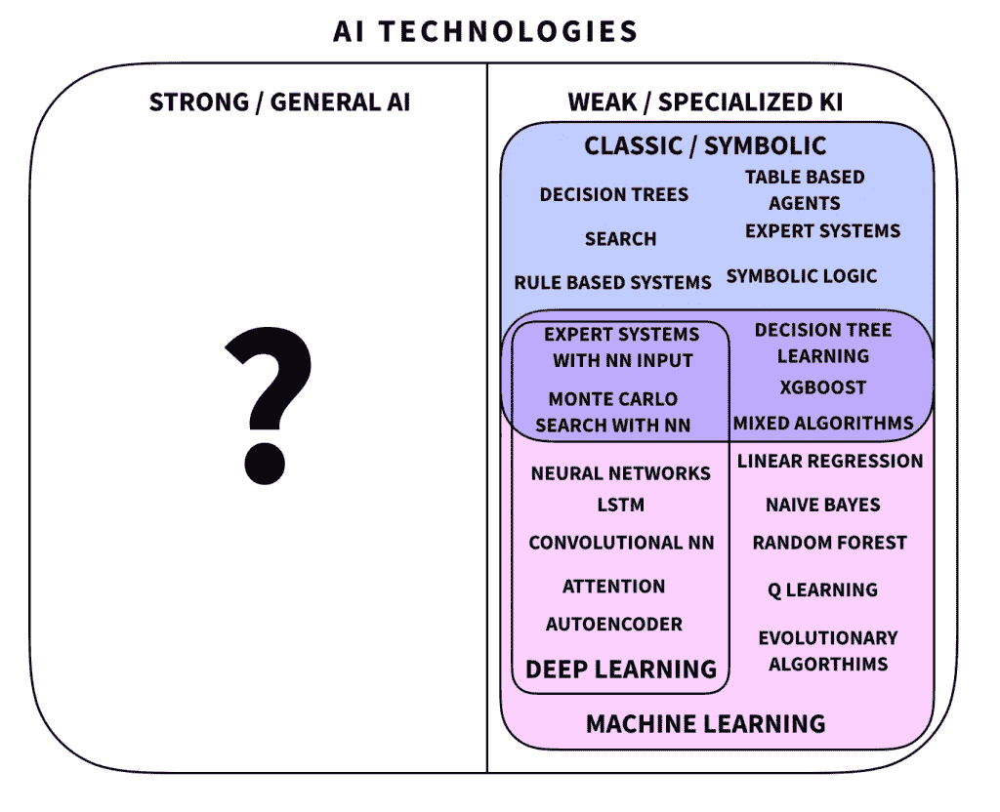
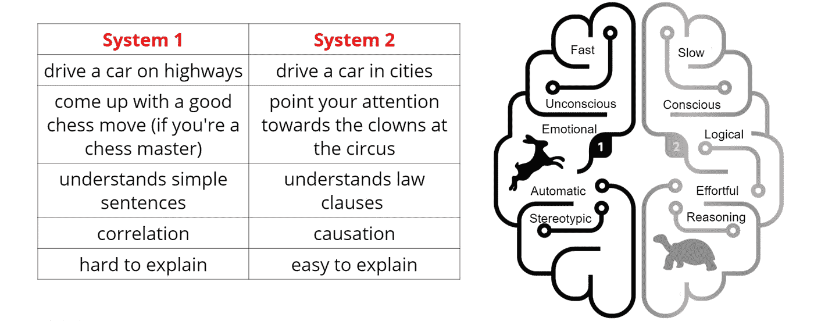
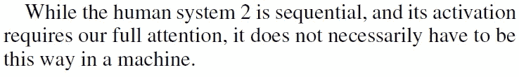
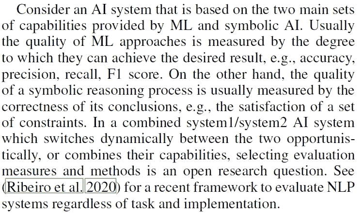
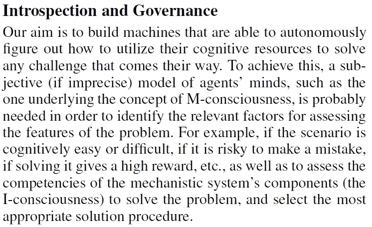
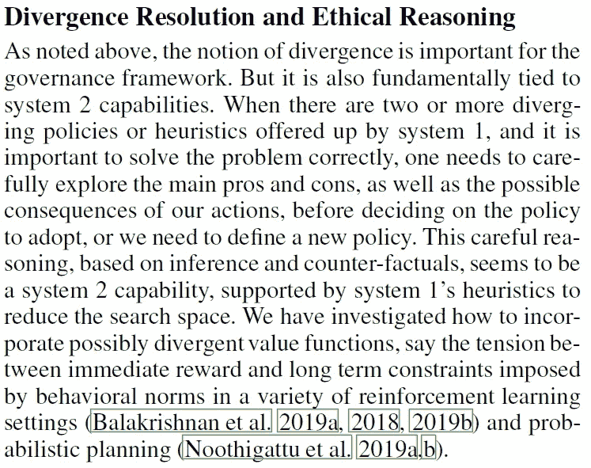
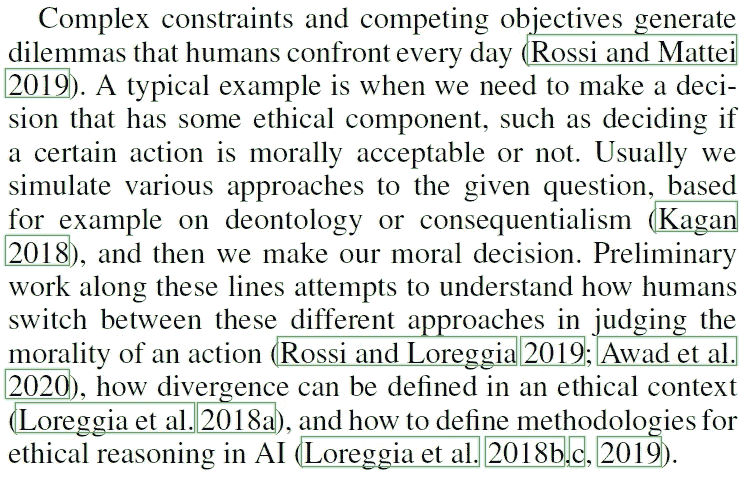
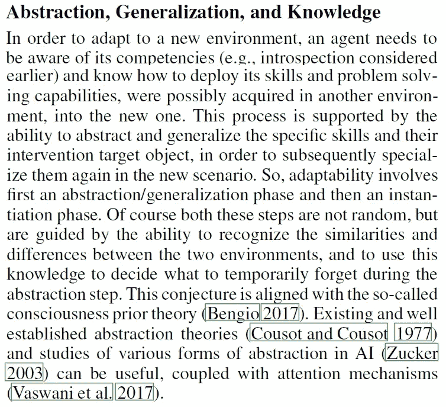
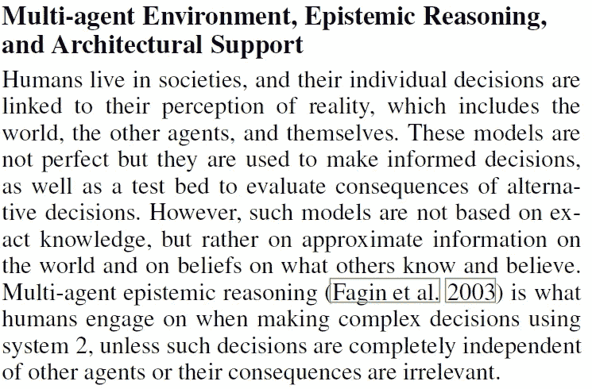
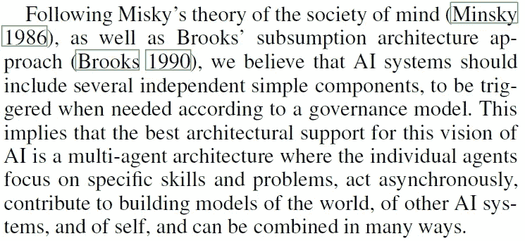

# 思维的快慢与第三次人工智能浪潮

> 原文：<https://pub.towardsai.net/thinking-fast-and-slow-and-the-third-wave-of-ai-79156b5545e8?source=collection_archive---------0----------------------->

## [人工智能](https://towardsai.net/p/category/artificial-intelligence)，[神经科学](https://towardsai.net/p/category/neuroscience)

## 从人类能力中汲取灵感，走向更通用、更可信的人工智能&给人工智能研究界的 10 个问题。

> 最初发表于 [louisbouchard.ai](https://www.louisbouchard.ai/third-wave-of-ai-thinking-fast-and-slow/) ，前两天在[我的博客](https://www.louisbouchard.ai/tag/artificial-intelligence/)上看到的！

# 目录

*   [**走向更通用更值得信赖的 AI**](#9ceb)
*   [**神经符号 AI:第三波**](#87a1)
*   [**思维快慢**](#edfb)
*   [**思维忽快忽慢艾**](#978d)
*   [**给 AI 研究界的 10 个问题**](#992a)
*   [**结论**](#d74f)
*   [**完整视频**](#9d62)
*   [**参考文献**](#263b)

## 走向更通用、更可信的人工智能

我将让弗朗西丝卡·罗西用她在蒙特利尔人工智能组织的人工智能辩论会上的精彩发言来介绍这篇文章:

这就是为什么 Francesca Rossi 和她的 IBM 团队发表了这篇论文，提出了推进人工智能的研究方向。人类决策认知理论的启示。其中的前提是:如果我们获得了人工智能中仍然缺乏的人类能力的洞察力，如适应性、鲁棒性、抽象性、概括能力、常识和因果推理，我们可能会获得与人工智能系统中类似的能力。

## 神经象征人工智能:第三次浪潮

没有人知道人工智能的未来会是什么，是神经网络，还是我们需要将机器学习与基于符号和逻辑的人工智能技术相结合？最新的类似于神经符号学习系统，它整合了智能行为的两个基本现象:推理和从经验中学习的能力。他们认为，“更好地理解人类如何拥有和进化获得这些高级能力，可以激发创新的方法，使人工智能系统具备这些能力”。但没有人比 Luis Lamb 自己更适合解释他最近的论文“神经象征人工智能:第三波”中展示的这种学习系统。

Neurosymbolic 基本上是另一种类型的人工智能系统，它试图使用有根据的知识表示和推理。它将基于神经网络的学习与符号知识表示和逻辑推理相结合，目标是创建一个既可解释又可信任的人工智能系统。这就是弗朗西斯卡·罗西的工作发挥作用的地方，他们的论文名为《人工智能中的快与慢思考》。顾名思义，他们专注于丹尼尔·卡内曼在他的书《思考的快与慢》中解释的关于两个系统的理论，“并试图将它们连接成一个统一的理论，旨在确定(一些)人类所需能力的根源。”

## 快速思考和慢速思考

这里有一个快速摘录，摘自蒙特利尔人工智能组织的人工智能辩论 2，丹尼尔·卡内曼本人清楚地解释了这两个系统及其与人工智能的联系…

简而言之，卡尼曼解释说，人类的决定受两种主要能力或“系统”的指导，他称之为系统 1 和系统 2。第一个系统为我们提供了直觉、快速和无意识决策的工具，这可以被视为“快速思考”，而第二个系统处理复杂的情况，其中我们需要理性思考和逻辑来做出决定。这里被认为是“思考缓慢”。

## 人工智能中的快速思考和慢速思考

如果我们回到人工智能论文中的思维快慢，Francesca Rossi 和她的团队认为，我们可以在这两个系统(1 和 2)之间进行非常松散的比较，以及人工智能中的两条主线，即机器学习和符号逻辑推理。或者说，数据驱动与知识驱动的人工智能系统。卡尼曼的 system one 和机器学习之间的比较是，两者似乎都能够从感官数据(如视觉和阅读)中建立模型。其中系统 1 和机器学习都可能产生不精确和有偏见的结果。事实上，我们所谓的深度学习实际上还没有深到可以解释的程度，类似于系统 1。然而，主要的区别是，与我们的系统 1 相比，当前的机器学习算法缺乏因果关系和常识性推理的基本概念。

我们还可以看到基于逻辑、搜索、优化和规划的系统 2 和人工智能技术之间的比较。不使用深度学习的技术，而是使用显式知识、符号和高级概念来做出决策。这是他们强调的人类决策系统和当前人工智能系统之间的相似性。我想提醒你，正如他们所说，这篇论文的目标主要是“刺激人工智能研究社区定义、尝试和评估新的方法、框架和评估指标，以实现对人类和机器智能的更好理解”。他们打算通过要求人工智能社区研究 10 个重要问题并试图找到适当的答案或至少思考这些问题来做到这一点。

## 人工智能研究社区的 10 个问题

在这里，我只列出这 10 个重要的问题以及来自 IBM 论文“[思考 AI 中的快与慢](https://arxiv.org/abs/2010.06002.)”的语境化。这些问题必须在未来的研究中加以考虑，目标是创造出更通用、更可信的下一代人工智能。请随意阅读[他们的论文](https://arxiv.org/abs/2010.06002)，了解更多关于这些问题的信息，并在评论中讨论。

《思维的快与慢》载艾、布奇等人著，【https://arxiv.org/abs/2010.06002】(2020)。

1 我们是否应该明确识别 AI 系统 1 和系统 2 的能力？

《思维的快与慢》载于艾、布奇等人著(2020)，。

2 系统 2 的顺序性是 bug 还是特性？我们应该把它带到机器上，还是应该利用并行线程执行系统 2 推理？这一点，加上机器比人类更强的计算能力，会弥补人工智能其他能力的不足吗？

3 评价混合系统 1/系统 2(或 ML/ symbolic) AI 系统质量的度量标准是什么？对于不同的任务和组合方法，这些度量应该是不同的吗？

《思维的快与慢》，载于艾、布奇等人著，(2020)。

4 我们如何用 I-意识和 M-意识来定义 AI 的内省？

5-我们如何在人工智能中对系统 1 和系统 2 的治理建模？我们什么时候转换或合并它们？哪些因素引发了这种转变？

《思维的快与慢》，载于艾·布奇等人，(2020)，。

6 当我们有相互竞争的优先级时，我们如何利用基于人工智能系统 1 和系统 2 的模型来理解和推理复杂的环境？

《思维的快与慢》载艾、布奇等人著，【https://arxiv.org/abs/2010.06002】(2020)。

进行各种形式的道德判断和决策需要哪些能力？我们如何在人工智能中建模和部署可能冲突的规范伦理理论？各种伦理理论与系统 1 或系统 2 有联系吗？

《思维的快与慢》载于艾、布奇等人著(2020)，。

8 在抽象步骤中，我们如何从输入数据中知道要忘记什么？我们应该在不同的抽象层次上保存知识，还是仅仅保存原始数据和完全显式的高级知识？

《思维的快与慢》，载于艾、布奇等人著，(2020)。

9 从多智能体的角度来看，几个人工智能系统相互交流和学习，如何利用/适应当前认知推理的结果，并计划建立/学习世界和其他人的模型？

《思维的快与慢》，载于艾、布奇等人著，(2020)。

10 最后，什么样的架构选择最能支持上述人工智能未来的愿景？

## 结论

欢迎在评论中讨论这些问题，或者亲自给我发消息！我很想听听你对这些问题的看法，并就它们展开辩论。如果你想了解更多关于这个理论的信息，我肯定会邀请你去读读艾论文中的《思考的快与慢》和丹尼尔·卡内曼的书《思考，快与慢》。如果你对这个话题感兴趣，我也强烈推荐你去关注约舒阿·本吉奥关于意识先验的研究。非常感谢蒙特利尔人工智能组织了这次人工智能辩论，为人工智能社区提供了许多有价值的信息！本视频中讨论的所有文档都链接在下面的参考资料中。

## **观看完整视频**:

如果你喜欢我的工作，并想了解最新的人工智能技术，你绝对应该在我的社交媒体频道上关注我。

*   订阅我的 [**YouTube 频道**](https://www.youtube.com/channel/UCUzGQrN-lyyc0BWTYoJM_Sg) 。
*   关注我的项目上 [**LinkedIn**](https://www.linkedin.com/in/whats-ai/) 和这里上[**中**](https://whats-ai.medium.com/) **。**
*   一起学习 AI，加入我们的 [**不和谐社区**](https://discord.gg/learnaitogether) ，*分享你的项目、论文、最佳课程，寻找 Kaggle 队友，等等！*

## 参考

《思考的快与慢》(书)，作者:https://amzn.to/2XHehG1(2013 年)[。
神经符号人工智能:第三波，加西亚等，(2020)，](https://amzn.to/2XHehG1)[https://arxiv.org/pdf/2012.05876.pdf](https://arxiv.org/pdf/2012.05876.pdf)。
思维的快与慢见于艾、布奇等人，(2020)。
AI 辩论 2 由蒙特利尔 AI(2020)[https://youtu.be/VOI3Bb3p4GM](https://youtu.be/VOI3Bb3p4GM)。