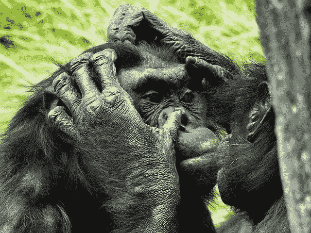

# 关于人工亲密的十三个惊人事实

> 原文：<https://pub.towardsai.net/thirteen-surprising-facts-about-artificial-intimacy-d314cfb467c9?source=collection_archive---------2----------------------->

## [未来](https://towardsai.net/p/category/future)

## 人工智能劫持我们情感生活的一些方式

人造亲密封面的细节。图片由 NewSouth books 和作者提供。

当我们进化的人类思维和老式文化遇到 21 世纪的技术时会发生什么？具体来说。我指的是虚拟现实、机器人技术，以及——迄今为止最重要的——人工智能。

这是我在新书《人工亲密:虚拟朋友、数字恋人和算法媒人 中考虑的问题，该书将在澳大利亚和新西兰上市。其他地方的读者将不得不等到北方的春天，但现在可以预订。

“人工亲密”这个术语已经在[流传了](https://theeducationshop.com.au/downloads/metro-and-screen-education-articles/screen-education-articles/artificial-intimacy-technology-and-human-connection-in-her/)[一段时间](https://csreports.aspeninstitute.org/documents/AI2020.pdf)，概括地描述了人工智能机器如何进入人类的情感生活。我区分了三种技术:**虚拟朋友**，包括像 Siri 和 Alexa 这样的人工智能助手，它们利用了我们的交友能力。**数字爱好者**——像智能性玩具和[性爱机器人](https://medium.com/illumination-curated/could-a-sex-robot-make-you-jealous-c11d741afbd4)——提供性刺激。还有**算法媒人**——想想 Tinder 或 Grindr，还有 YouTube 和脸书——为我们找到新的合作伙伴、关系或媒体。

现在的这些技术正在用人工的亲密来模仿我们的关系。在不久的将来，预计他们会搬进来，如果我们不小心，接管。我希望这本书能引起人们对人造亲密关系带来的机遇和严重威胁的关注。

正如人工智能的科学教授托比·沃尔什所写的:

> 正如布鲁克斯正确预测的那样，我们需要害怕的人工智能是人工亲密关系，而不是人工智能。为机器劫持我们的情感生活做好准备。事实上，看看他们是如何开始这样做的。

为了提供这本书范围的预览，我准备了几个亮点。

# **1。人类驯服的第一个物种是我们自己**

在我们驯服[狗](https://www.smithsonianmag.com/science-nature/how-wolves-really-became-dogs-180970014/)，或羊，或鸡之前，在我们驯化产生农业的农作物之前，人们慢慢地[把彼此](https://www.sciencemag.org/news/2019/12/early-humans-domesticated-themselves-new-genetic-evidence-suggests)变成更好、更合群、更有爱心、以家庭为导向的动物。

# **2。机器正在接管人类的驯服吗？**

人工智能机器可以模仿人们用来驯服彼此以及把狼变成狗的过程。我们倾向于认为我们按下了电脑的按钮，但是它们开始按下我们的按钮了吗？

# **3。在开始破坏人类的工作之前，机器不需要像人类一样好**

社交媒体模仿我们交朋友的方式，它吞噬了我们在现实生活关系中花费的时间。由智能算法提供的越来越引人注目的色情作品，消耗了人们原本用于寻找关系对象的时间和精力。

# **4。虚拟现实可能彻底改变性爱**

虚拟现实，加上让我们传递类似触觉的触觉技术，将使异地恋变得更加性感。类似 Tinder 的匹配算法将使安全无缝的虚拟现实连接成为可能。所有这一切都可能使虚拟现实性工作行业蓬勃发展。

# **5。性爱机器人并不都那么好。但是他们会变得更好**

现在，大多数性爱机器人都是机器人动作受限的性爱娃娃，还有笨拙的聊天机器人个性。他们目前远远没有达到我称之为“玩偶机器人”的标准。但是人们已经准备好为它们花钱，你可以肯定它们会变得更加逼真和刺激。

# **6。社交媒体正在排挤现实生活中的友谊**

猿和猴子醒着的时候大约有 20%的时间用来梳理它们的朋友。人类也是，但是我们*八卦*而不是寻找体外寄生虫。我们现在在社交媒体上做了很多这样的修饰，典型的社交媒体用户花费 80%的时间在社交媒体上。这消耗了人们的时间和睡眠，占据了我们很多的空间。结果，人们过着风险更小的生活，但是他们也更不快乐。

倭黑猩猩美容。图片来自 Pixabay 的 [NauticalVoyager](https://pixabay.com/users/nauticalvoyager-1310087/?utm_source=link-attribution&amp;utm_medium=referral&amp;utm_campaign=image&amp;utm_content=2368873)

# **7。人机亲密已经开始了**

人们很容易把包括聊天机器人在内的计算机当成人来对待。变得亲密的过程包括向彼此透露我们内心最深处的想法和私人细节，从小事开始，但转移到我们脆弱的地方。亲密关系的建立是机器模仿的完美过程。

# **8。性、生殖和长期关系需要合作，但它们也充满了冲突**

不管是谁告诉你性涉及“延续物种”，他只是想避免尴尬的对话。动物的性行为充满了冲突，从水黾互相贿赂进行性行为，到慈鲷鱼展开监护权之战，将成长中的后代安全地放在嘴里。人类也一样，彼此操纵、剥削和欺骗。我们爱的能力允许我们做一些理性动物不会做的事情:信任一个陌生人足够长的时间去怀一个孩子并抚养他。

# **9。一些人为的亲密关系将是有害的**

除了 Tinder 等方便的匹配算法、Messenger 等消息服务以及帮助我们找到浪漫之路的工具，你可以用你所有的比特币打赌，影子人物将使用人工智能使浪漫欺诈更难被发现，使跟踪者成为可能，并操纵人们发生性关系。不管是为了征服还是为了利益，人为的亲密关系很有可能扰乱我们的思维。

# **10。虚拟情人可以拯救世界**

更自由、更轻松的性行为是减少人际关系中以及男性之间暴力的关键。纵观历史，每当技术改变了性别，它就产生了积极和消极的混合效应。像虚拟现实性爱和性机器人这样的数字爱好者可能会延长始于工业化、避孕药和色情的性放松。总的来说，我认为这可能是一件好事。

# **11。预计社会保守派和一些女权主义者会加入同一批挥舞干草叉的暴徒**

在 20 世纪 80 年代的“色情战争”中，激进女权主义者的某个子集发现自己与爱情婚姻社会保守派站在了同一战线。同一个不太可能的联盟已经在试图[禁止数字爱好者](https://campaignagainstsexrobots.org/)，让互联网成为[远不那么性感的地方](https://whyy.org/segments/fosta-sesta-was-supposed-to-thwart-sex-trafficking-instead-its-sparked-a-movement/)。重要的是他们不能赢。

# 12。女性机器人军队可以平息因塞尔起义

大量性受挫的男性意味着麻烦。看看 lone Incels 或美国国会大厦暴乱者造成的破坏。数码爱好者们，在适当的照顾下，可以驱散他们沮丧的愤怒，拯救社会。

# **13。谁拥有这些数据将会有很大的不同**

人工智能通过从数据中学习来编织它的魔法。智能手机、社交媒体、可穿戴设备和信息产生了海量数据，机器学习算法正在从中发现人工亲密关系是如何工作的。如果任由他们自己的设备发展，像脸书、谷歌、亚马逊和 PornHub 这样的公司，加上明天的人工亲密巨头，将利用他们积累的数据让我们滚动，并向我们出售广告。

那可能不会有好结果。

*请* [*加入我的邮件列表*](https://landing.mailerlite.com/webforms/landing/v1p6x1) *获取每月更新，包括出版新闻和赠品。*

*我已经* [*整理了一页*](https://www.robbrooks.net/rob-brooks/3014) *来提供更多关于这本书的消息，书评家在说什么，以及在哪里订购一本。*