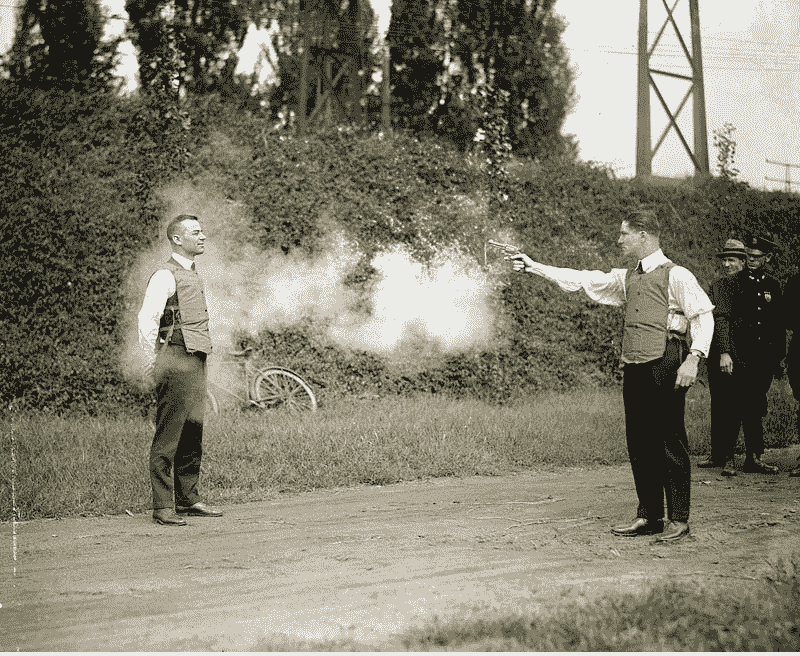
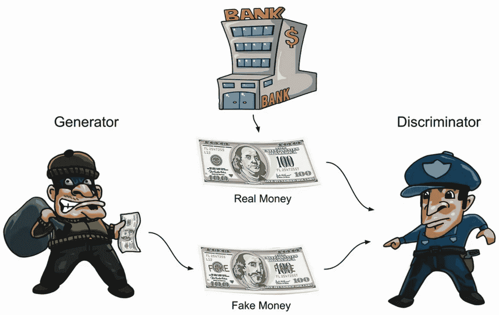
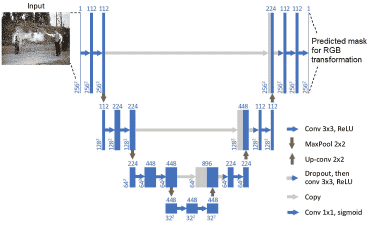
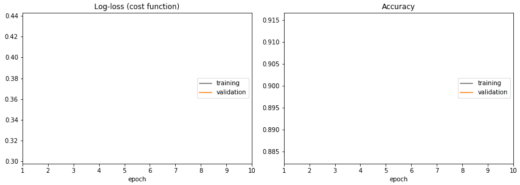
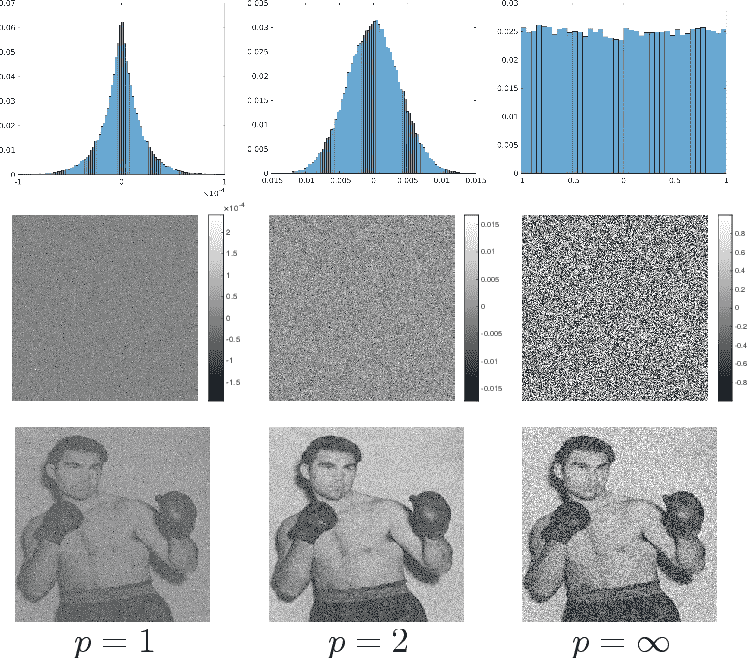
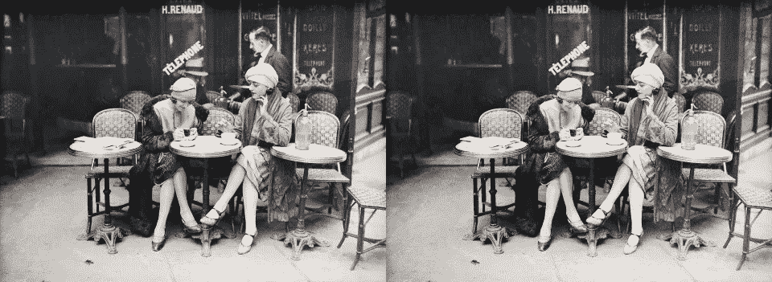

# 这个人工智能可以为你的黑白照片着色，呈现出真实的照片效果！(解密)

> 原文：<https://pub.towardsai.net/this-ai-can-colorize-your-black-white-photos-with-full-photorealistic-renders-deoldify-bf1eed5cb02a?source=collection_archive---------0----------------------->

## [深度学习](https://towardsai.net/p/category/machine-learning/deep-learning)

## 这种方法被称为 DeOldify，几乎适用于任何图片。如果你不相信我，你甚至可以免费亲自尝试一下，正如我将在本文中展示的那样。

> 原载于 [louisbouchard.ai](https://www.louisbouchard.ai/deoldify/) ，前两天在[我的博客](https://www.louisbouchard.ai/tag/artificial-intelligence/)上看到的！

DeOldify 是一种彩色化和恢复旧黑白图像甚至电影胶片的技术。它是由一个人 Jason Antic 开发并更新的。这是现在最先进的黑白图像彩色化方法，一切都是开源的，但是我们一会儿会回到这个话题。

首先，让我们看看他是如何做到的。它使用一种称为 NoGAN 的新型 GAN 训练方法，这种方法是他自己开发的，用于解决使用由鉴别器和生成器组成的普通对抗网络架构进行训练时出现的主要问题。通常，GAN 训练通过同时训练鉴别器和发生器来工作，其中发生器从完全随机开始，并随着时间的推移而改进，以欺骗鉴别器，鉴别器试图判断图像是生成的还是真实的。如果这对你来说完全是抽象的，我邀请你看我做的关于甘斯的视频:

他的新方法，他称之为“NoGan ”,提供了这种通常的 Gan 训练的相同好处，同时必须花费更少的时间来训练 GAN 架构，这通常在计算时间上相当繁重。相反，他使用常规损失函数对发电机进行预训练，使其更加强大、快速和可靠。

这是通过像常规深度网络的架构(如 ResNet)一样训练生成器来完成的。通过这种方式，在训练完整的 g an 架构之前，该模型已经非常擅长为图像着色。然后，它只需要少量的这种典型的生成器-鉴别器 GAN 训练来优化所生成的图片的“真实性”。

高斯噪声也随机应用于图像，以在训练期间产生假噪声。

这是一种可以在训练图像上执行的数据扩充类型，以改善结果和对噪声输入的抵抗力，使用与样式转移相同的技术，其中噪声将是我们想要复制的图像的样式，并且可以或多或少地应用于变换。

整个架构在 U-Net 上使用一个基本的 ResNet 主干。其中 GAN 培训中的发电机网络是 U-Net 架构。目前，还没有完整的解释这是如何工作的，但作者目前正在撰写一篇关于 DeOldify 的论文，他将进一步研究为什么以及如何他的技术，以前只有通过试验和错误才能找到工作。

**如果您想了解更多结果和使用方法，请观看此视频:**

你可以在下面的参考资料中找到三样东西。首先，有一个 GitHub 链接，里面有完整详细的技术说明，甚至还有 google colab 教程供你自己使用。然后，你可以使用 DeOldify 在 DeepAI 上找到一个免费的 API，你可以简单地点击并自己尝试。最后，第三个链接是 DeOldify 的最高级版本，如果你正在寻找最好的结果。它在 MyHeritage 的网站上，是有偿使用的。

如果你喜欢我的工作并想支持我，我会非常感谢你在我的社交媒体频道上关注我:

*   支持我的最好方式就是跟随我上**。**
*   **订阅我 [**YouTube 频道**](https://www.youtube.com/channel/UCUzGQrN-lyyc0BWTYoJM_Sg) 。**
*   **在 [**LinkedIn**](https://www.linkedin.com/company/what-is-artificial-intelligence) 上关注我的项目**
*   **一起学 AI，加入我们的 [**Discord 社区**](https://discord.gg/SVse4Sr) ，*分享你的项目、论文、最佳课程，寻找 Kaggle 队友，等等！***

****参考文献:****

**GitHub，带完整代码，深度讲解，还有 Colabs:[https://github.com/jantic/DeOldify](https://github.com/jantic/DeOldify)
免费 DeepAI 图像着色 API 使用 DeOldify:[https://deepai.org/machine-learning-model/colorizer](https://deepai.org/machine-learning-model/colorizer)
my heritage 着色工具(deol dify 可用的最好版本，已付费):[https://www.myheritage.com/incolor](https://www.myheritage.com/incolor)**