# 这个人工智能可以使用 GPT 模型生成另一半图片

> 原文：<https://pub.towardsai.net/this-ai-can-generate-the-pixels-of-half-of-a-picture-from-nothing-using-a-nlp-model-7d7ba14b5522?source=collection_archive---------0----------------------->

## [自然语言处理](https://towardsai.net/p/category/nlp)

## 一个好的人工智能，如 Gmail 中使用的人工智能，可以生成连贯的文本并完成你的短语。这一个使用相同的原则为了完成一幅图像！所有这些都是在无人监督的训练中完成的，根本不需要任何标签！

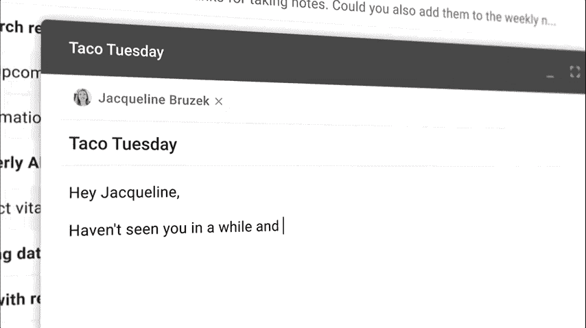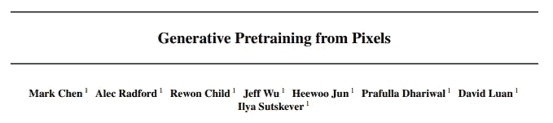

OpenAI 最近分享了一篇名为“从像素生成预训练”的新论文，该论文用于预测像素，而不需要结合二维图像结构的知识。他们想看看主要用于自然语言处理的架构是否也可以用于图片来“重建”图像。就像 Gmail 预测你邮件的结尾一样，这个 AI 可以预测一个图像的结尾！

他们使用谷歌开发的用于自然语言处理预训练的流行的来自变压器的双向编码器表示(BERT)技术。应用 GPT-2 序列转换器架构来预测像素而不是语言标记。伯特和 GPT-2 这两种变换器模型是领域不可知的，这意味着它们可以直接应用于任何形式的一维序列，例如像素序列而不是单词和字母。他们发现该模型甚至可以理解二维图像特征，如物体外观和类别！

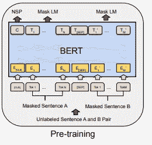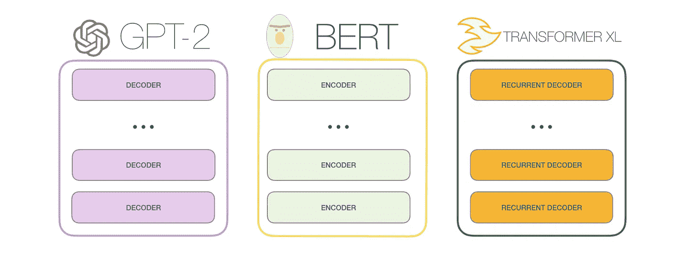

如果你想了解这两个重要概念的更多信息，我在下面链接了伯特和 GPT-2 的论文。

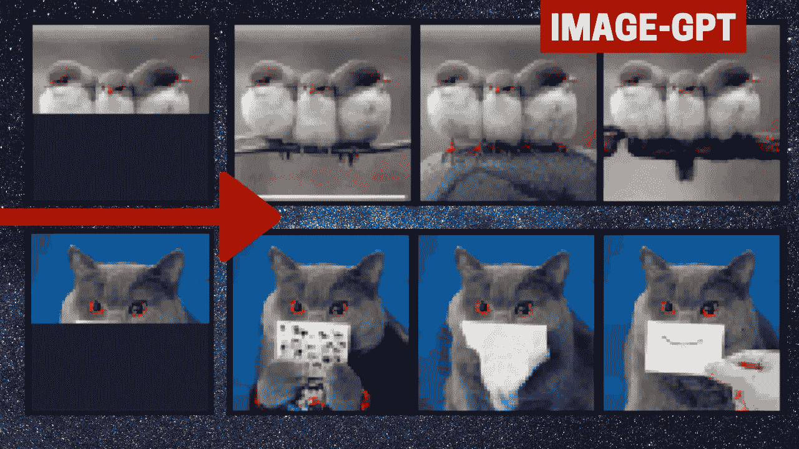

这里的挑战是，在自然语言处理中，单词序列遵循语法规则，这有助于网络预测接下来会发生什么。例如，一个问题之后肯定会有答案。相比之下，像素序列并不清楚地包含它们所属图像的标签。让他们认为在图像上使用 GPT-2 可以工作的是，如果你使用足够大的变压器，训练下一个像素预测，最终可以学习生成不同的现实样本。
然后，通过优化 GPT-2 模型的生成能力，他们可以实现它。

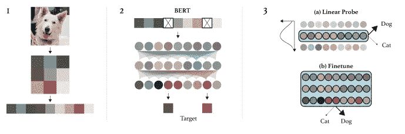

让我们再多谈谈这种方法。预训练模型经常用于支持训练的初始化。他们使用这个 BERT 预训练模型作为特征提取器，使用给定的 X 和 Y，其中 X 是图像，Y 是标签，它产生特征 fx，然后将其发送到使用这些特征(fx)和它们的标签(Y)训练的线性分类器，而不使用图像(X)本身。这种线性探测抓住了直觉，即好的特征应该线性地将类分开。然后，变形金刚解码器出场。它用于线性探头的微调和特征提取。提取用于线性探测的固定特征遵循类似于微调的过程，除了平均汇集不总是在最终层。

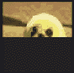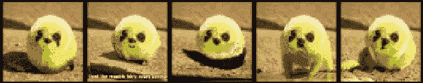

虽然它在向网络提供如此少的信息的情况下显示了惊人的结果，但它仍然有一些局限性。他们说，这需要大量的计算，大约是 ImageNet 分类挑战中最先进的检测/分割算法的 40 倍。

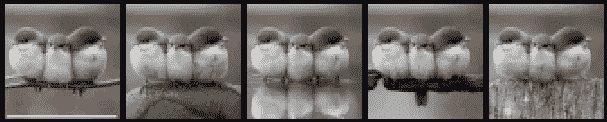

但是，他们的主要目标是对基于大型转换器的语言模型在新领域中学习无监督表示的能力进行概念证明，如本例中的无监督图像分类，而不需要硬编码的领域知识。然而，他们认为基于卷积神经网络的方法在视觉领域的实际应用中更实用。

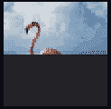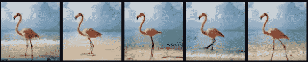

我还是觉得这篇论文挺有意思的，和我们平时看到的不太一样。他们尝试了一种不同的方法，并测量发生了什么，这是我认为更多的人应该做的，而不是简单地微调最先进的方法，以获得小的改善。

**查看视频中更多例子:**

如果你喜欢我的工作并想支持我，我会非常感谢你在我的社交媒体频道上关注我:

*   支持我的最好方式就是跟随我上**。**
*   **订阅我 [**YouTube 频道**](https://www.youtube.com/channel/UCUzGQrN-lyyc0BWTYoJM_Sg) 。**
*   **在 [**LinkedIn**](https://www.linkedin.com/company/what-is-artificial-intelligence) 上关注我的项目**
*   **一起学 AI，加入我们的 [**Discord 社区**](https://discord.gg/SVse4Sr) ，*分享你的项目、论文、最佳课程，寻找 Kaggle 队友，等等！***

****参考文献****

**项目:[https://openai.com/blog/image-gpt/](https://openai.com/blog/image-gpt/)
伯特:[https://arxiv.org/abs/1810.04805](https://arxiv.org/abs/1810.04805)
GPT-2:[https://D4 mucfpksywv . cloudfront . net/better-language-models/language-models . pdf](https://d4mucfpksywv.cloudfront.net/better-language-models/language-models.pdf)**