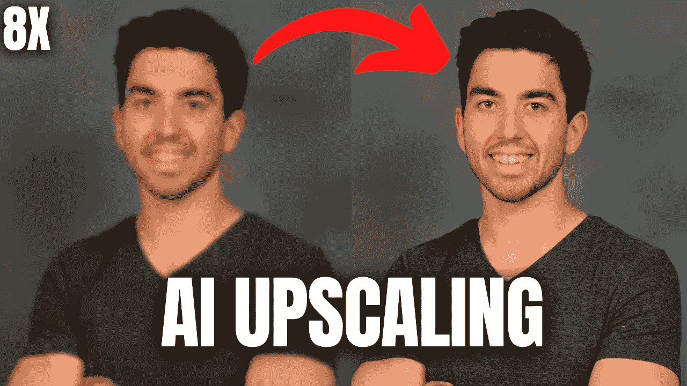
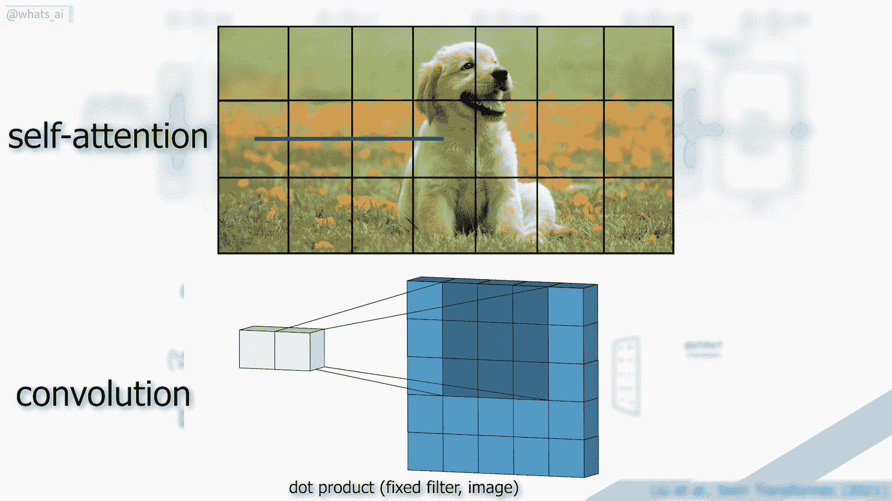
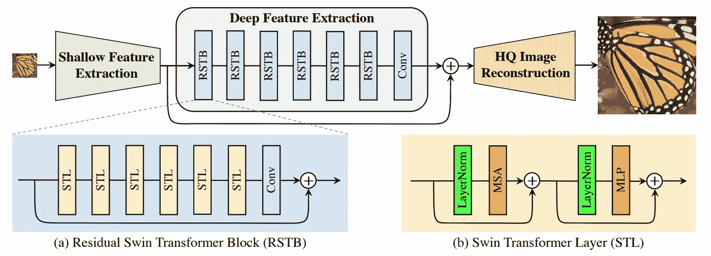
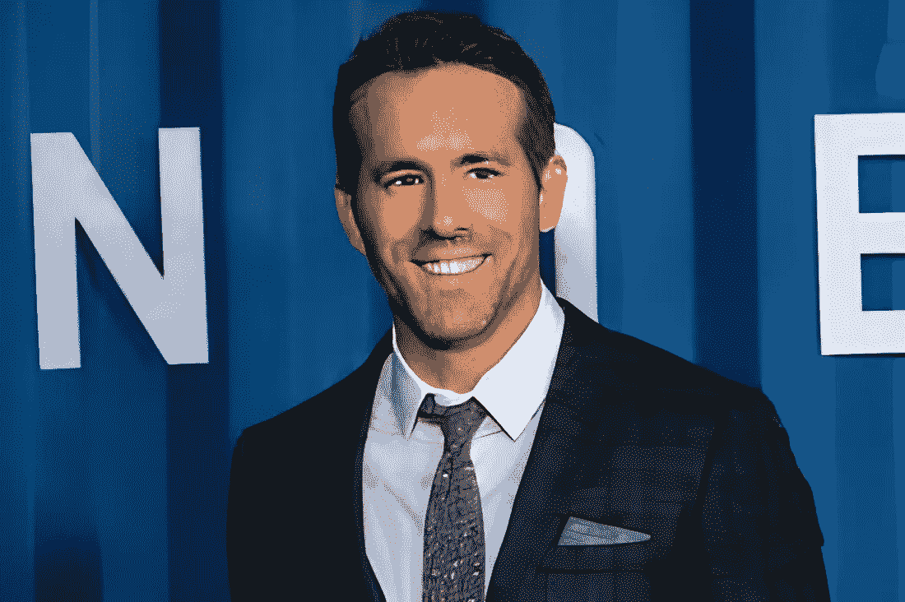

# 这个人工智能使模糊的脸看起来清晰 8 倍！SwinIR:照片上采样

> 原文：<https://pub.towardsai.net/this-ai-makes-blurry-faces-look-8-times-sharper-swinir-photo-upsampling-b41d394b41e9?source=collection_archive---------1----------------------->

## [人工智能](https://towardsai.net/p/category/artificial-intelligence)

## 用 AI 把你的小 512 像素大图转换成 4k！

> 原载于 [louisbouchard.ai](https://www.louisbouchard.ai/swinir/) ，前两天在[我的博客](https://www.louisbouchard.ai/swinir/)上看到的！

## 看视频！

你是否曾经有过一个你非常喜欢的图像，但只能找到一个小版本，看起来像上面左边的这个图像？如果你能把这张图片放大两倍，那该有多酷？这很棒，但是如果你能把它的清晰度提高四到八倍呢？现在我们在谈话，看看那个。在这里，我们将图像的分辨率提高了四倍，这意味着我们有四倍多的高度和宽度像素来获得更多的细节，使它看起来更加平滑。最棒的是，这是在几秒钟内完成的，完全自动，几乎可以处理任何图像。哦，你甚至可以在他们提供的演示中使用它，我们将在视频中看到。

## 图像上采样

在进入这个令人惊叹的模型之前，我们必须介绍照片上采样或图像超分辨率的概念。这里的目标是从相应的低分辨率输入图像构建高分辨率图像，在本例中是人脸，但它可以是任何物体、动物或风景。低分辨率将是 512 像素或更小，没有那么模糊，但当你全屏显示时，它显然不是高清的。

低清晰度图像示例。

只要花几秒钟看一看，你就会看到那些艺术品。我们把这张低清晰度的图像转换成一张高清晰度的图像，使脸部更加清晰。在这种情况下，一个 2048 像素的正方形图像的高清度提高了四倍:

使用 SwinIR 放大图像。

为了实现这一点，我们通常有一个典型的类似 UNet 的卷积神经网络架构，我在以前的许多文章中都提到过，如果您想了解更多关于它们如何工作的信息，我邀请您阅读。主要的缺点是，CNN 很难适应极其广泛的数据集，因为它们对所有图像使用相同的核，这使得它们对于局部结果和泛化很好，但当我们想要每个单独图像的最佳结果时，对于整体结果却不太强大。

《变形金刚》中的卷积与自我关注。

另一方面，由于自注意机制捕捉每个图像的上下文之间的全局交互，变压器是有前途的架构，但是具有不适用于图像的繁重计算。

在这里，他们没有使用 CNN 或变压器，而是创建了相同的类似 UNet 的架构，同时具有卷积和注意力机制。或者更准确地说，使用 Swin 变压器。Swin transformer 令人惊叹，因为它具有 CNN 的优势，可以处理更大尺寸的图像，并为注意力机制做好准备。这些注意力机制将会建立远程连接，这样模型最终会更好地理解整体图像，并以更好的方式重建图像。我不会进入 Swin transformer 的细节，因为我已经在几个月前讨论过这个架构，并解释了它与自然语言处理中使用的 CNN 和经典 transformer 架构的区别。
如果你想了解更多关于它以及研究人员如何将变形金刚应用于视觉的信息，请查看[我关于“走向人工智能”](/will-transformers-replace-cnns-in-computer-vision-55657a196833)的文章，并回来解释这个上采样模型！

## 斯温尼尔

该模型被称为 SwinIR，可以完成许多任务，包括图像上采样。正如我所说，它使用卷积来支持更大的图像。更准确地说，他们使用卷积层来减小图像的大小，你可以在这里看到。

用于图像恢复的 SwinIR 的体系结构。图片来自 [SwinIR [1]](https://arxiv.org/pdf/2108.10257.pdf) 。

该简化的图像被发送到模型中，并且还被直接传递到重建模块，以向模型提供关于图像的一般信息。这种表示基本上看起来像图像的许多奇怪的模糊版本，为向上缩放模块提供了关于整体图像应该看起来如何的有价值的信息。然后，我们看到 Swin 变压器层与卷积耦合。这是为了进一步压缩图像，并且总是提取关于风格和细节的更有价值的精确信息，而忘记整体图像。这就是为什么我们然后添加回错综复杂的图像，以给出我们通过跳过连接所缺少的整体信息。

所有这些最终被发送到一个名为子像素的重建模块，它看起来像这样，并使用我们刚刚创建的较大的一般特征和较小的细节特征来重建更高清晰度的图像。你可以把它看作是一个卷积神经网络，但反过来，或者简单地说是一个解码器，提取我们拥有的压缩特征，并从中重建一个更大的图像。同样，如果你想了解更多关于 CNN 和解码器的知识，你应该看看我写的一些关于它们的文章。

因此，你基本上是在 CNN 中发送你的图像，获得这个新的表示，保存它供以后使用，同时在 Swin transformer 架构中发送它，以进一步压缩信息，并了解要重建的最重要的特征。然后，你将这些新功能与保存的功能结合起来，使用解码器来重建高清版本。

瞧！

现在你只需要足够的数据，就会有这样的结果(见[视频](https://youtu.be/GFm3RfrtDoU)！).

当然，和所有的研究一样，也有一些局限性。
在这种情况下，可能是由于最初的卷积层，它对 200 像素以下的非常小的图像不太适用。您可能会看到像这样的伪像和奇怪的结果:

带有 SwinIR 的 175 x 183 图像的升级版本。

看起来你也可以使用更大的升级器来消除皱纹，如果你想这么做，这可能是一个有用的神器。除此之外，结果是相当疯狂的，因为在过去几天里玩了很多，四倍的升级是令人难以置信的。

你也可以玩它！他们让每个人都可以使用 GitHub repo，有预先训练好的模型，甚至有无需任何代码就可以立即使用的演示。当然，这只是对这个令人惊叹的新模型的概述，我强烈邀请您阅读他们的论文以获得更深入的技术理解。所有的链接都在下面的参考文献中。让我知道你的想法，我希望你喜欢这篇文章！

再次感谢[重量&偏见](https://wandb.ai/site)赞助视频和文章，以及任何还在阅读的人！

下周带着另一篇激动人心的论文再见！

如果你喜欢我的工作，并想与人工智能保持同步，你绝对应该关注我的其他社交媒体账户( [LinkedIn](https://www.linkedin.com/in/whats-ai/) 、 [Twitter](https://twitter.com/Whats_AI) )并订阅我的每周人工智能 [**简讯**](http://eepurl.com/huGLT5) ！

## 支持我:

*   支持我的最好方式是成为这个网站的成员，或者如果你喜欢视频格式，在 **YouTube** 上订阅我的频道。
*   跟我来这里上 [**中**](https://whats-ai.medium.com/)
*   想进入 AI 或者提升技能，[看这个](https://www.louisbouchard.ai/learnai/)！

## 参考

*   梁军，曹军，孙，张，范古尔和，2021。SwinIR:使用 swin transformer 进行图像恢复。IEEE/CVF 国际计算机视觉会议论文集(第 1833-1844 页)。
*   代号:[https://github.com/JingyunLiang/SwinIR](https://github.com/JingyunLiang/SwinIR)
*   演示:【https://replicate.ai/jingyunliang/swinir 