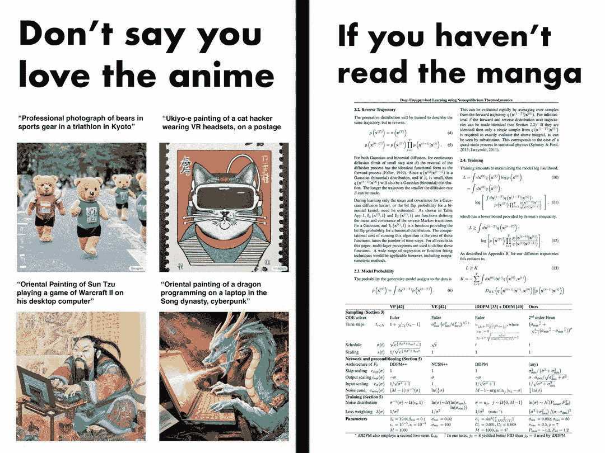

# 这份人工智能时事通讯是你所需要的| #1

> 原文：<https://pub.towardsai.net/this-ai-newsletter-is-all-you-need-1-52ec5a07d290?source=collection_archive---------0----------------------->

从今天起，我们正在将我们的时事通讯改造成每周一期的新格式，与我们的 26，000 名成员一起学习人工智能不和谐社区([加入此处](http://ws.towardsai.net/discord))和我们的 2，000 名人工智能撰稿人更加紧密地联系在一起。我们的目标是为人工智能社区创建一个有用的、有趣的、吸引人的时事通讯，在那里我们将展示过去一周一些最重要的新闻和论文，以及我们社区中发生的一些讨论。我们还将每周从我们的“走向人工智能贡献者”社区中选出我们最喜欢的文章——我们的编辑团队现在每周从我们的贡献者那里发布 20-30 篇文章，我们希望通过向我们在“走向人工智能”的 300，000 名粉丝提供更多曝光来奖励最好的帖子。我们的格式是一项正在进行的工作，所以请随时在我们网站的评论中留下任何反馈或就我们的不和谐之处联系我们！

# 这个星期在 AI 发生了什么

我们本周的人工智能亮点是 DALL E mini 模型(现已更名为 craiyon ),该模型因其从文本输入中生成令人惊叹的图像而获得了病毒般的势头。该模型是一个免费的开源模型，灵感来自 Open AI 的 DALL E 模型。我们认为这是一个很好的展示，展示了 ML 现在即使使用免费模型也可以在图像生成方面取得的成就，并有助于向公众展示 AI 有趣的一面。Craiyon 与 DALL E 非常相似，都使用了语言模块和图像模块，只是使用了不同的架构和训练数据。它使用 BART 语言模型将文本输入转换成下一个模型可以理解的语言。然后，它使用名为 VQGAN 的图像解码器来使用编码映射，并从中生成图像。在这里查看 [**DALL E Mini**](https://www.louisbouchard.ai/dalle-mini/) 更详细的解释。

感谢 Anyscale 为您带来这一期:

你知道谷歌、Meta、IBM、优步等公司的团队正在使用 Ray 来扩展关键的人工智能计划吗？或者卡塔尔计算研究所正在使用强化学习和 Ray RLlib 在 2022 年 FIFA 世界杯上控制拥塞和促进移动性？来 [**雷** **峰会**](http://ws.towardsai.net/j22-anyscale) 亲眼看看吧。[**立即注册**](http://ws.towardsai.net/j22-anyscale) 享受早鸟优惠，并使用代码 Ray20 获得额外的 20%优惠！早鸟登记将于 6 月 30 日结束。

## 最热门新闻

1.  一项新的人工智能薪酬调查显示，人工智能经理的薪酬现在高达 30 万美元对 1，841 名专业人士的调查显示，人工智能专业人士的平均基本工资从 10%增加到 13%。我想这对我们所有人来说都是好消息！
2.  [**英特尔与抱抱脸合作伙伴共同推进机器学习硬件加速的民主化**](https://huggingface.co/blog/intel) 利用英特尔的最优开源库，这两家科技巨头正在联手打造新颖的硬件加速，以利用变形金刚进行训练、微调和预测。随着模型优化工具的不断进步，用户很快就能在英特尔平台上实现卓越的性能！
3.  [**来自英伟达的全新 AI 精华！**](https://nvda.ws/3tEpdF4) 想进入这个领域还是想让你的工作更上一层楼？NVIDIA 发布了一些很棒的新材料，用于开始人工智能职业生涯。

## 本周最有趣的报纸

1.  [**使用感知者 AR 的通用、长上下文自回归建模**](https://arxiv.org/pdf/2202.07765.pdf)Google Research 和 DeepMind 之间的合作:一种自回归架构(感知者 AR)，它能够生成长达 65k 令牌的高质量样本——相当于几分钟的音乐，或完整的作品！
2.  [**VoxGRAF:使用稀疏体素网格的快速 3D 感知图像合成**](https://arxiv.org/abs/2206.07695) 稀疏体素网格已被证明对加速新视图合成非常有用:受此启发，他们的工作使用稀疏体素网格表示进行快速和 3D 一致的生成建模，并“允许从任意视点进行有效渲染，同时产生具有高视觉保真度的 3D 一致结果。”
3.  [**视频预训练(VPT):通过观看未标记的在线视频学习行动**](https://arxiv.org/abs/2206.11795) 利用少量已标记的数据，我们可以训练一个逆动力学模型，其精确度足以标记一个巨大的未标记的在线数据来源——这里是扮演《我的世界》的人的在线视频——然后我们可以从中训练一个一般的行为先验。

喜欢这些论文和新闻摘要吗？**在你的收件箱里获得每日回顾！**

# *一起学习人工智能社区部分！*

## *本周迷因！*

**

*如果你没看过这部漫画，不要说你喜欢它|来源:Meme by [David Ha](https://www.facebook.com/groups/1638417209555402/user/619740832/?__cft__[0]=AZWTQV2ieA95WLQ0amDsq2rjQZW5rOBI1BLItYfhB54_D3BrwiWyYePpuDc-t3hXKsPLgE9-YE_viWvBhPO01UfbGwRueq1oH0NQcrl0R5JY1z8awKui1y-0JQ30Wlm84rUpWZ5CphJlO-7J-bxDJU71fD2VLF_bFe-TbzYKVV0mwt0odJIyWLq2VkxXYnLdvCBTbZ0lg1Yz0fYYtNS9pibo&__tn__=-UC*F) 。*

## *来自 Discord 的特色社区帖子*

*我们的一个成员刚刚[通过了 Azure AI 基础考试](https://www.linkedin.com/posts/solakunmi-oyedele-3580541a1_azure-ai-ai-900-certification-activity-6947152968311795712-W6ef/?utm_source=linkedin_share&utm_medium=member_desktop_web)！
祝贺 Jatamer！*

> *“这次考试是一个展示机器学习(ML)和人工智能(AI)概念以及相关微软 Azure 服务知识的机会。参加该考试的考生应熟悉考试 AI-900 的自定进度或教师指导的学习材料。*
> 
> *该考试面向具有技术和非技术背景的考生。不要求数据科学和软件工程经验；然而，了解云基础知识和客户端-服务器应用程序是有益的。"*

## *本周最佳人工智能投票！*

**

*让我们知道你最喜欢哪个人工智能时事通讯，为什么。[加入关于不和的讨论](https://discord.com/channels/702624558536065165/833660976196354079)*

# *泰策展组*

## *本周文章*

*[条件概率和贝叶斯定理简单解释了一下](/conditional-probability-and-bayes-theorem-simply-explained-788a6361f333):每一个 AI 爱好者在人生的某个时刻都曾与统计数据斗争过。本文对条件概率和贝叶斯定理给出了最直白直观的解释，是任何一个 AI 工程师必备的知识。到本文结束时，你会非常熟悉各种概率和贝叶斯定理。*

*如果你有兴趣在《走向人工智能》为我们写作，请[在这里注册](https://contribute.towardsai.net/)，如果你的博客符合我们的[编辑政策](/submit-your-medium-story-to-towards-ai-a4fa7e8b141d)和标准，我们将把它发布到我们的网络上。*

## ***劳伦对 Dall-E Mini 的道德观点***

*最近我们已经看到了 DALL E Mini/craiyon 的一些非常有创意的用法，其中许多很搞笑，有些则整理了 AI 中不那么美味的部分。在某些代中可以看到算法偏见的元素，例如，一个“正常女人”的关键字条目只产生白人妇女的描述。对于图像生成人工智能来说，这不是一个新问题，这在很大程度上是它接受训练的数据的反映。重要的是要认识到缺陷是存在的，这种认识可以帮助我们学会更好地缓解问题。*

*更令人振奋的是，DALL E Mini/craiyon 通过模因带来了如此多的快乐，这是一项重大的道德利益！让人工智能变得可访问是我们所支持的，这有助于以一种幽默的方式实现这一点。在 [Discord](http://ws.towardsai.net/discord) 上和我们分享你最好的人工智能迷因吧！*

## *本周特色工作*

*[**高级 ML 工程师— Algolia AI @ Algolia** (混动遥控)](http://ws.towardsai.net/j22-job1)*

*[**高级 ML 工程师—语义搜索@ Algolia** (混合远程)](http://ws.towardsai.net/j22-job2)*

*[**机器学习工程师@ Gather AI** (远程—印度)](http://ws.towardsai.net/j22-jobs7)*

*[**深度学习工程师(R & D —工程)@权重&偏差**(远程)](http://ws.towardsai.net/j22-jobs5)*

*[**机器学习实习生@ Weights &偏见**(远程——美国)](http://ws.towardsai.net/j22-jobs6)*

*[**机器学习工程师—预测@ Zoox** (加拿大福斯特市)](http://ws.towardsai.net/j22-jobs3)*

*[**软件工程师—机器学习@ Zoox** (加拿大福斯特市)](http://ws.towardsai.net/j22-jobs4)*