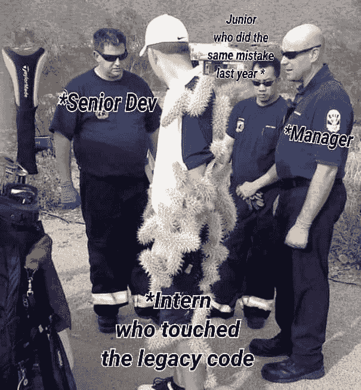
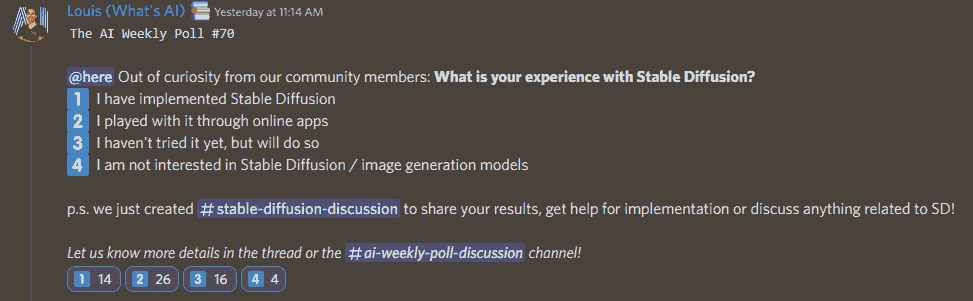

# 这份人工智能时事通讯是你所需要的#10

> 原文：<https://pub.towardsai.net/this-ai-newsletter-is-all-you-need-10-d31fc1058243?source=collection_archive---------5----------------------->

# 这个星期在 AI 发生了什么

本周，我们的注意力仍然转向[稳定扩散](https://github.com/CompVis/stable-diffusion)。我们不得不再一次用更好的消息来报道它，作为 AI 社区的重要一步。[稳定扩散](/latent-diffusion-models-the-architecture-behind-stable-diffusion-434ba7d91108)是一个奇妙的倡议，它是由一个名叫艾玛德的了不起的人带给我们的(在 [Yannic 的视频](https://youtu.be/YQ2QtKcK2dA)中了解更多关于艾玛德的信息！)和他的公司，[稳定。Ai](https://stability.ai/) 。稳定人工智能背后的想法是在与大公司的直接竞争中，从社区创造并公开重要的人工智能成果。

扩散模型最近在大多数图像任务中取得了最先进的结果，包括使用 DALLE 的文本到图像，以及许多其他与图像生成相关的任务，如图像修补、样式转换或图像超分辨率。稳定扩散基于相同的原理，但在潜在空间内，这使得我们普通人所需的计算完全不同。如果你仍然不知道什么是稳定扩散，或者潜在扩散一般是如何工作的，我们推荐[这篇文章](/latent-diffusion-models-the-architecture-behind-stable-diffusion-434ba7d91108)来更好地理解这个模型。

## 最热门新闻

1.  [一个 GitHub 知识库，里面装满了预先训练好的扩散器模型！](https://github.com/huggingface/diffusers) 感谢 HuggingFace，🤗[扩散器](https://github.com/huggingface/diffusers)提供跨多种形式(如视觉和音频)的预训练扩散模型，并作为推理和训练扩散模型的模块化工具箱。
2.  稳定扩散 API 出来了，可以用了！
    由 Stability、LAION 和 EleutherAI 合作的[稳定扩散模型](https://github.com/CompVis/stable-diffusion?utm_campaign=Your%20Daily%20AI%20Research%20tl%3Bdr&utm_medium=email&utm_source=Revue%20newsletter)已经开源发布，可以在 HuggingFace 上获得！[现在就试试](https://huggingface.co/spaces/stabilityai/stable-diffusion?utm_campaign=Your%20Daily%20AI%20Research%20tl%3Bdr&utm_medium=email&utm_source=Revue%20newsletter):)
3.  这是一个免费的人工智能写作助手，建立在 OpenAI 的 GPT-3
    之上，该工具由 ParagraphAI 开发，能够生成文章、散文和其他原文，并在[谷歌 chrome 应用商店](https://chrome.google.com/webstore/detail/paragraphai/ieidddkeimflpkghaodhddcmlclcliaa/?utm_campaign=Your%20Daily%20AI%20Research%20tl%3Bdr&utm_medium=email&utm_source=Revue%20newsletter)免费提供。

## 本周最有趣的报纸

1.  [DreamBooth:微调文本到图像的扩散模型，用于主题驱动的生成](https://arxiv.org/pdf/2208.12242.pdf?utm_campaign=Your%20Daily%20AI%20Research%20tl%3Bdr&utm_medium=email&utm_source=Revue%20newsletter) “只需一个主题的几张图像(通常为 3-5 张)(左)，我们的人工智能照片亭 DreamBooth 可以在不同的上下文中生成该主题的大量图像(右)，使用文本提示的指导。”
2.  [Z-Code++为抽象摘要优化的预训练语言模型](https://arxiv.org/pdf/2208.09770.pdf?utm_campaign=Your%20Daily%20AI%20Research%20tl%3Bdr&utm_medium=email&utm_source=Revue%20newsletter) 如题，Z-Code++是“一种新的为抽象文本摘要优化的预训练语言模型。”
    **想知道什么是抽象文本摘要吗？**
    “抽象摘要器以一种新的形式诠释了源文档的思想，并且具有生成更简洁和连贯的摘要的潜力。”
3.  [为 3D 人类恢复而战](https://arxiv.org/pdf/2110.07588.pdf?utm_campaign=Your%20Daily%20AI%20Research%20tl%3Bdr&utm_medium=email&utm_source=Revue%20newsletter) 他们引入了 GTA-Human，“一个用 GTA-V 游戏引擎生成的大规模 3D 人类数据集，具有高度多样化的主题、动作和场景集。更重要的是，[他们]研究游戏数据的使用，并获得五大洞见……”。获取[代码](https://github.com/open-mmlab/mmhuman3d/tree/main/configs/gta_human?utm_campaign=Your%20Daily%20AI%20Research%20tl%3Bdr&utm_medium=email&utm_source=Revue%20newsletter)。

*享受这些论文和新闻摘要？* [*在你的收件箱里获得每日回顾*](https://www.linkedin.com/newsletters/what-s-ai-daily-research-tl-dr-6935956459641876480/) *！*

# 我们将参加 2022 年 ECCV 奥运会——来见我们吧！

感谢我们在 Qwak 的朋友和他们的帮助，我们的社区负责人 Louis Bouchard 将参加在特拉维夫举行的 2022 年 ECCV T2 大会(10 月 23 日至 27 日)。如果你认为你会出席，并且想在那里喝杯咖啡或聊聊天，请随时联系[！](mailto:louis@towardsai.net)

# 一起学习人工智能社区部分！

## 本周迷因！

每次实习都会这样！由 [dimkiriakos#2286](https://discord.com/channels/702624558536065165/830572933197201459/1011401720766676993) 分享的 Meme。

## 来自 Discord 的特色社区帖子

[altryne#7376](https://discord.com/channels/702624558536065165/983037843532308500/1012158467236171808) 创建了一个[令人敬畏的图像合成资源列表(aiArt)](https://discord.com/channels/702624558536065165/983037843532308500/1012158467236171808) 。Altryne 重新组合了不同的文本到图像模型，提示工程资源，有趣的社区和许多有用的工具给任何对人工智能艺术感兴趣的人。

[看看吧！](https://github.com/altryne/awesome-ai-art-image-synthesis)

## 本周最佳人工智能投票！

[加入不和谐的讨论](https://discord.com/channels/702624558536065165/833660976196354079)！

# 泰策展组

## 本周文章

[为什么 Adam Optimizer 不应该是默认的学习算法？](/why-adam-optimizer-should-not-be-the-default-learning-algorithm-a2b8d019eaa0)由于训练时间快，越来越多的深度学习实践者正在用自适应梯度方法训练他们的模型。特别是 Adam，已经成为许多深度学习框架中使用的默认算法。众所周知，这些自适应优化方法的泛化能力很差。作者理解的实证研究结果进行了深思自适应梯度方法的边际价值。

如果你有兴趣在《走向人工智能》为我们写作，请在这里注册，如果你的博客符合我们的编辑政策和标准，我们将把它发布到我们的网络上。[https://contribute.towardsai.net/](https://contribute.towardsai.net/)

## 劳伦对推特告密者的道德评价

本周我想重点报道的新闻是关于 Twitter 告密者 PE ITER“mud ge”Zeiko 最近的指控[关于严重的数据管理不善、安全弱点、对机器人跟踪不力、易受外国情报攻击以及可能违反 FTC。我们以前见过大的技术告密者，由于新闻周期或对技术应该如何在社会中运作的愤世嫉俗的看法，一些人已经变得麻木不仁或听天由命。新闻周期的最初高峰，关于大事件发生的谈论以及炒作的最终平息无助于无常的感觉。然而，有些东西告诉我，这个故事将在这里停留。](https://www.cnn.com/2022/08/24/tech/twitter-whistleblower-takeaways/index.html)

事实上，所有这些指控都是如此令人震惊，如果属实，情况的严重性可能会证明，由此产生的处罚可能会产生严重的生死后果，而不仅仅是警告。监管可能在科技方面进展缓慢，但它可能是强有力的。随着时间的推移，脆弱且变得越来越脆弱的多种基本缺陷的暴露，表明了快速建设和规模扩大的成本，以至于没有人知道会发生什么。Twitter 的命运可能是一个非常重要的教训，说明建立一个不可持续的在线社区的危险。不仅仅是指控被证明是真是假，还有监管者和用户将如何处理它们。这将是未来几个月的一个重要事件，我期待着我们从这次经历中学到的真知灼见。

## 本周特色工作

[**计算机视觉科学家——感知 AI** (加州圣克拉拉)](http://ws.towardsai.net/august-22-4-job-1)

[**研究科学家——机器学习@ DeepMind** (英国伦敦)](http://ws.towardsai.net/august-4-job-1)

[**高级数据科学家@ EvolutionIQ** (远程)](http://ws.towardsai.net/august-4-job-2)

[**高级 ML 工程师— Algolia AI @ Algolia** (混合遥控)](http://ws.towardsai.net/july-22-1-job-1)

[**高级 ML 工程师—语义搜索@ Algolia** (混合远程)](http://ws.towardsai.net/july-22-1-job-2)

有兴趣在这里分享工作机会吗？联系 sponsors@towardsai.net 或在我们的 [*【招聘频道】发布机会不和谐*](http://ws.towardsai.net/lat-hiring-channel) *！*

*如果你正在准备你的下一次机器学习面试，不要犹豫，来看看我们领先的面试准备网站，* [*纸屑*](http://ws.towardsai.net/confetti-ai) *！*