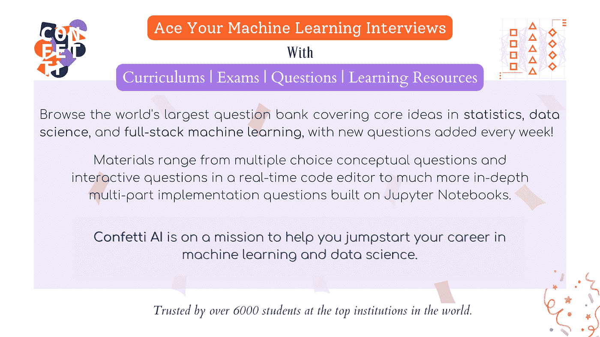
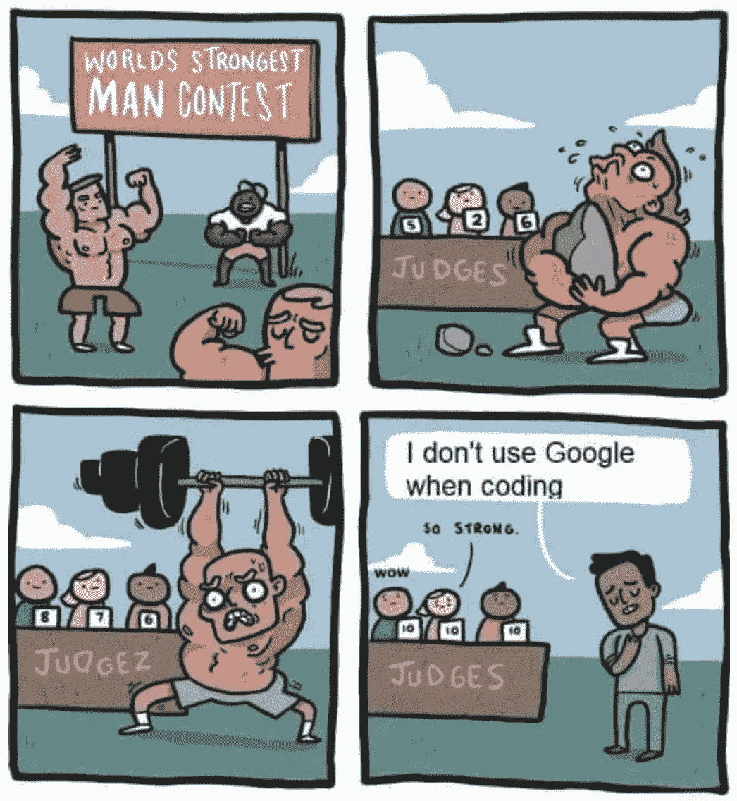
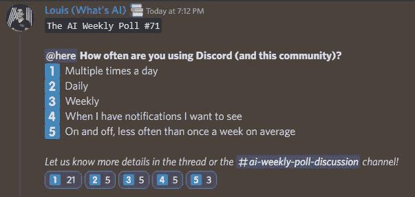

# 这份人工智能时事通讯是你所需要的#11

> 原文：<https://pub.towardsai.net/this-ai-newsletter-is-all-you-need-11-dfc9d1e3bf2e?source=collection_archive---------1----------------------->

# 这个星期在 AI 发生了什么

[稳定扩散](/latent-diffusion-models-the-architecture-behind-stable-diffusion-434ba7d91108)再次吸引了我们的注意力，但更准确地说，是“稳定扩散倡议”对新研究和推进该领域的影响。开源这样一个强大的模型真是太酷了。我们在图像生成领域的大多数朋友目前都在夜以继日地玩和实现它的各种版本。我们发现其中一个非常有趣和有前途的是一篇名为“[一张图片抵得上一句话](/personalizing-stable-diffusion-with-your-images-2535d30638ee)”的新论文

“一个图像抵得上一个单词”允许您使用自己的对象图像，在很短的训练时间内(约 2 小时)个性化预训练文本到图像模型的结果，如稳定扩散。它从 3-5 幅图像中学习概念，并将其公式化为他们所说的“伪词”，然后您可以在您的提示生成中使用它。它非常酷，具有惊人的改变游戏规则的产品的不可思议的潜力，这只是一个新的研究，这要归功于许多稳定的扩散，甚至更多的未来。对于图像生成行业来说，我们正生活在令人兴奋的日子里，我们将与走向人工智能团队为您密切关注它！

## 最热门新闻

1.  [DALL E:介绍 Outpainting](https://openai.com/blog/dall-e-introducing-outpainting/?utm_campaign=Your%20Daily%20AI%20Research%20tl%3Bdr&utm_medium=email&utm_source=Revue%20newsletter) OpenAI 刚刚向 DALL E 介绍了 Outpainting！Outpainting 可以扩展原始图像，以任何纵横比创建大比例图像(参见本期时事通讯迭代的封面图像)。它考虑到图像的现有视觉元素，以保持原始图像的上下文，并可以用文本来添加特定元素。
2.  [2023 年前在 Twitter 上关注的前 22 名人工智能影响者](https://bytescout.com/blog/ai-influencers-to-follow-on-twitter.html?utm_campaign=Your%20Daily%20AI%20Research%20tl%3Bdr&utm_medium=email&utm_source=Revue%20newsletter) 我们不确定是如何关注的，但我们的联合创始人兼社区负责人 Louis Bouchard 在 Bytescout 上发表了这篇题为“2023 年前关注的前 22 名人工智能影响者”的文章！我们认识这份名单上的大多数人，路易斯是其中的一员，我们非常感激和激动。看看吧，关注一下那里的其他了不起的人！
3.  [你们都听说过，也尝试过稳定扩散，但到底是什么呢？](/latent-diffusion-models-the-architecture-behind-stable-diffusion-434ba7d91108) 最近像 DALLE、Imagen、Midjourney 这些超级强大的形象模特有什么共同点？除了它们高昂的计算成本、巨大的训练时间和共享的炒作之外，它们都基于同一个机制:扩散。扩散模型最近在大多数图像任务中取得了最先进的结果，包括使用 DALLE 的文本到图像，以及许多其他与图像生成相关的任务，如图像修补、风格转换或图像超分辨率。但是什么是扩散，它是如何工作的？文章中了解更多。

## 本周最有趣的报纸

1.  [使用扩散模型从笔画和草图自适应生成逼真的图像](https://arxiv.org/pdf/2208.12675.pdf?utm_campaign=Your%20Daily%20AI%20Research%20tl%3Bdr&utm_medium=email&utm_source=Revue%20newsletter) “一个统一的框架，支持对基于扩散模型从草图和笔画合成的图像进行三维控制[利用该框架，用户可以]不仅决定输入笔画和草图的忠实度，还决定逼真度。”
2.  [自然会话语音的话轮预测](https://arxiv.org/pdf/2208.13321.pdf?utm_campaign=Your%20Daily%20AI%20Research%20tl%3Bdr&utm_medium=email&utm_source=Revue%20newsletter) 虽然流式语音助理系统已经在许多应用中使用，但它对于单向讨论和基本的问答非自然交互来说仅仅是强大的。如你所知，如果你停下来思考或者不小心重复单词，效果会很差。他们提出了一个建立在端到端(E2E)语音识别器之上的话轮预测器，以帮助流畅、“真实”的讨论。
3.  [花木兰:音乐音频和自然语言的联合嵌入](https://arxiv.org/pdf/2208.12415.pdf?utm_campaign=Your%20Daily%20AI%20Research%20tl%3Bdr&utm_medium=email&utm_source=Revue%20newsletter) 花木兰:“首次尝试将音乐音频直接链接到不受约束的自然语言音乐描述的新一代声学模型。”“人类听众更喜欢经过 MSG 后处理的低音和鼓的源估计。”

*享受这些论文和新闻摘要？* [*在你的收件箱里获取每日回顾*](https://www.linkedin.com/newsletters/what-s-ai-daily-research-tl-dr-6935956459641876480/) *！*

## **准备数据科学或机器学习的面试？结账走向艾的面试备考平台** [**纸屑艾**](http://ws.towardsai.net/confetti-ai) **:**

# 一起学习人工智能社区部分！

## 本周迷因！

太强了。😂由 [dimkiriakos#2286](https://discord.com/channels/702624558536065165/830572933197201459/1011401720766676993) 分享的 Meme。

## 来自 Discord 的特色社区帖子

“一起学习人工智能”的成员之一， [Ravioli#7085](https://ws.towardsai.net/discord) ，发表了他们的第一份独立研究和预印本！恭喜 Arav，我们很高兴看到下一个出版物(我有一些见解，还有一些即将推出！)🔥🎉[阅读 Arav 出版物](https://independent.academia.edu/AravKumar9)。

如果你已经有或者即将有一些出版物，请在服务器上与我们[分享！](https://ws.towardsai.net/discord)

## 本周最佳人工智能投票！

[加入关于不和的讨论。](https://discord.com/channels/702624558536065165/833660976196354079)

# 泰策展组

## 本周文章

[**模型复杂性和偏差-方差困境之间的数学关系**](/the-mathematical-relationship-between-model-complexity-and-bias-variance-dilemma-c2c713dbe495) **:** 大多数数据科学爱好者都会同意“偏差-方差困境”遭受分析瘫痪，因为有大量关于偏差-方差、其分解、推导以及与模型复杂性的联系的文献。作者展示了为什么，尽管我们尽了最大努力，简单的模型显示出明显的偏差，而复杂的模型显示出最小的偏差。

如果你有兴趣在《走向人工智能》为我们写作，请在这里注册，如果你的博客符合我们的编辑政策和标准，我们将把它发布到我们的网络上。[https://contribute.towardsai.net/](https://contribute.towardsai.net/)

## 劳伦对 LLMs 未来的伦理观点

我想写一篇来自麻省理工科技评论的很棒的文章，这篇文章强调了大量大型语言模型的伦理观点以及我们对它们的未来。通过提出这个问题，[GPT-3“知道”我什么？作者 Melissa Heikkilä从个人角度讲述了一个巨大的现象。从她自己的信息开始，并扩展到其他人，她检查了 LLMs 给出的准确和不准确反应(被称为“幻觉”)之间惊人的不一致。](https://www.technologyreview.com/2022/08/31/1058800/what-does-gpt-3-know-about-me/)

有必要探索这种信息无处不在的未来，因为我们拥有的所有模型都不会很快消失，还会有更多的模型出现。规模和能力的增加自然伴随着脆弱性的增加。虽然我们有非常不同的概念和实施隐私标准的方式(就像[关于 Meta](https://www-politico-eu.cdn.ampproject.org/c/s/www.politico.eu/article/instagram-fined-e405m-for-violating-kids-privacy/amp/) 的这个大故事)，但降低风险将需要我们继续创新，以实现隐私的道德保护。许多人支持这样一种观点，即所有的公共信息都是公平的游戏，这种观点不再适用于大规模的隐私问题。

我很高兴看到这种保护的未来将带我们走向何方，以及我们如何选择前进的方向。个人、地区或文化差异会影响我们对隐私的理解以及如何保护隐私。我鼓励你自己检查一下那看起来像什么！

# 工作机会

[**高级 ML 工程师@安全保安**(远程)](http://ws.towardsai.net/4a1)

[**研究科学家—语音识别@ bridge**(远程)](http://ws.towardsai.net/6l8)

[**计算机视觉科学家@ Percipient AI** (加州圣克拉拉)](http://ws.towardsai.net/august-22-4-job-1)

[**研究科学家——机器学习@ DeepMind** (英国伦敦)](http://ws.towardsai.net/august-4-job-1)

[**资深数据科学家@ EvolutionIQ** (远程)](http://ws.towardsai.net/august-4-job-2)

[**高级 ML 工程师—语义搜索@ Algolia** (混合远程)](http://ws.towardsai.net/july-22-1-job-2)

有兴趣分享这里的工作机会吗？联系 sponsors@towardsai.net 或者在我们的[*#招聘频道上发布【不和】*](http://ws.towardsai.net/lat-hiring-channel) *！*

*如果你正在准备你的下一次机器学习面试，不要犹豫，来看看我们领先的面试准备平台，* [*五彩纸屑*](http://ws.towardsai.net/confetti-ai) *！*