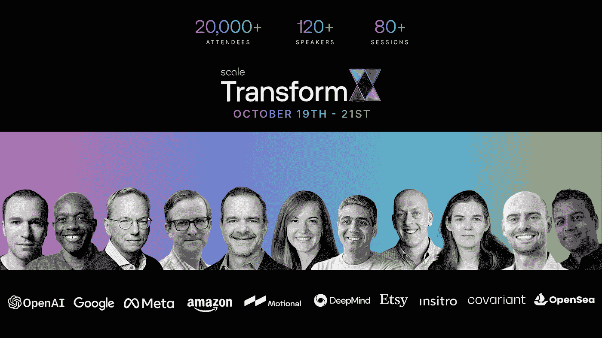
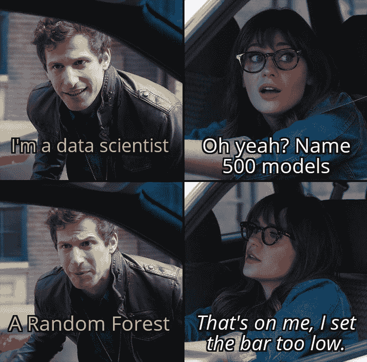
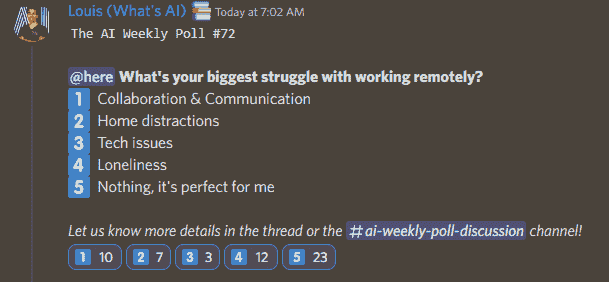

# 这份人工智能时事通讯是你需要的全部#12

> 原文：<https://pub.towardsai.net/this-ai-newsletter-is-all-you-need-12-c859b60b95d1?source=collection_archive---------0----------------------->

## 感谢 Scale AI 为您带来这一期:

AI 社区，[邀请您参加 10 月 19 日—21 日](http://ws.towardsai.net/transformx-2022)的 TransformX。TransformX 是今年最大的人工智能活动，有超过 2 万名参与者，80 场会议和 100 多名演讲人。聆听来自 Meta、Google、Covariant、DeepMind、Open AI 等公司的人工智能和人工智能专家的演讲。参加实践研讨会，参加专家小组讨论，聆听主题演讲。注册是免费的，你可以访问所有的录音！

> [现在报名](http://ws.towardsai.net/transformx-2022)。

# 这个星期在 AI 发生了什么

## 最热门新闻

1.  [一位艺术家用人工智能赢得了一场艺术比赛！](https://www.pcgamer.com/human-uses-ai-to-win-art-competition-other-humans-angry/?utm_campaign=Your%20Daily%20AI%20Research%20tl%3Bdr&utm_medium=email&utm_source=Revue%20newsletter) 这给 AI 和艺术领域都带来了很多争议。很多人觉得这很神奇，也有很多人认为这是欺骗([甚至到了发恐吓信的地步……](https://www.pcgamer.com/ai-artist-who-won-competition-says-art-world-is-in-denial-about-the-tech/?utm_campaign=Your%20Daily%20AI%20Research%20tl%3Bdr&utm_medium=email&utm_source=Revue%20newsletter))。老实说，当看到稳定的扩散和装饰效果，以及一些艺术家使用 Photoshop 对这些生成的图像进行处理以进一步提高真实感和结果质量时，我并不感到惊讶。此外，许多艺术家必须学习如何编码，他们中的大多数人不仅使用 DALLE。他们必须接入多个网络，比如上采样器模型和一些 SOTA 模型。那本身就是一门艺术！
    你怎么看？
2.  [英伟达 RTX 3080Ti 赠品！](https://youtu.be/seb4lmVPEe8?utm_campaign=Your%20Daily%20AI%20Research%20tl%3Bdr&utm_medium=email&utm_source=Revue%20newsletter) 再一次，许多 YouTubers，包括 Yannic Kilcher 和我自己(什么是 AI)都在与 NVIDIA 合作他们的 GTC 活动中赠送显卡。是的，这是您赢取英伟达 RTX 3080Ti 的又一次机会！此外，与英伟达合作的 GTC 活动！了解更多关于赠品以及如何参与[我的视频](https://youtu.be/seb4lmVPEe8?utm_campaign=Your%20Daily%20AI%20Research%20tl%3Bdr&utm_medium=email&utm_source=Revue%20newsletter):)
3.  职业人工智能密语者已经推出了一个 DALL-E 提示市场
    是的，这是真的。您现在可以购买“保证”良好结果的提示…
    “prompt base 是新的以旧换新提示的核心，用于从图像生成器生成特定的图像，这是一种元艺术市场。[……]该平台让“提示工程师”出售在特定人工智能平台上可靠地产生某种艺术风格或主题的文本描述。”
    你觉得这个怎么样？老实说，我认为在一些非常狭窄的用例中，这可能是值得的，在这些用例中，您确实想要一种特定的风格，并且已经尝试了所有的方法，但都没有成功。我不知道。你怎么想呢?—我很想知道。

## 本周最有趣的报纸

1.  [MotionDiffuse:带扩散模型的文本驱动人体运动生成](https://arxiv.org/pdf/2208.15001.pdf?utm_campaign=Your%20Daily%20AI%20Research%20tl%3Bdr&utm_medium=email&utm_source=Revue%20newsletter) 首个基于扩散模型的文本驱动运动生成框架，响应身体部位上的细粒度指令，带时变文本提示的任意长度运动合成。
2.  [FETA:面向专家任务应用的专门化基础模型](https://arxiv.org/pdf/2209.03648.pdf?utm_campaign=Your%20Daily%20AI%20Research%20tl%3Bdr&utm_medium=email&utm_source=Revue%20newsletter) FETA，一种用于评估和改进基础(V & L)模型在专家数据任务上的性能的新型基准(通过学习将图形插图与相应的语言描述相匹配，理解技术文档)。
3.  [在《与人工智能的对话:使语言模型与人类价值观一致》中【deep mind】](https://arxiv.org/pdf/2209.00731.pdf?utm_campaign=Your%20Daily%20AI%20Research%20tl%3Bdr&utm_medium=email&utm_source=Revue%20newsletter) 这篇论文对一些常见问题提出了有趣的答案，这些问题涉及一个智能体与人类的讨论，以及如何使这些智能体与我们一致(伦理上、社会上……):讨论的一些问题是:使对话智能体与人类规范或价值观一致意味着什么？它们应该与哪些规范或价值观保持一致？如何实现这一点？

*享受这些论文和新闻摘要？***】在你的收件箱里获得每日回顾！**

# *一起学习人工智能社区部分！*

*终于到了……[我们与 NVIDIA 合作的 RTX 3080Ti 赠品的时间了！](https://discord.com/channels/702624558536065165/702625484441124954)*

*我们再一次将一台英伟达 RTX 3080Ti 赠送给与英伟达合作的“一起学习人工智能”( Learn AI Together)社区的一名幸运成员！*

*我们还向社区提供了 10 个深度学习研究所(DLI)代码！*

*了解更多关于赠品的信息，以及如何参与最近在 [🧠weekly-ai-news-video 频道](https://discord.com/channels/702624558536065165/742365473655750656)分享的帖子🙂*

*NVIDIA GTC 的第二次 2022 年大会将于 9 月 19 日至 22 日在**举行。***

*参加一个或多个讲座，给我发截图进入赠品。查看 [ai-events 频道](https://discord.com/channels/702624558536065165/869624390478860319)，在那里我们分享了这个社区最有趣的话题。*

> ***TL；博士:***
> 
> *只有两个步骤:*
> 
> *1.成为[一起学 AI 不和谐社区](https://community.towardsai.net/)的一员。*
> 
> *2.报名参加 GTC 的免费活动，别忘了在你决定参加的讲座期间把你的截图发给我(路易·布沙尔)(不是现在，必须是在现场直播的时候！)!*

## *本周迷因！*

**

*我们神奇的 [Roberto](https://community.towardsai.net) 分享的 Meme，来自《走向人工智能》团队。*

## *来自 Discord 的特色社区帖子*

*我们喜欢你分享研究成果，无论是你自己的还是简单有趣的论文、博客帖子或你看过的代码。本周，我个人感谢闪电与社区分享了一篇非常有趣的论文！特别感谢 [sin yee#3513](https://discord.com/channels/702624558536065165/702624694104227880/1006187168022134844) 也分享了另一篇关于 NLP 的非常有趣的论文[！](https://discord.com/channels/702624558536065165/702624694104227880/1006187168022134844)*

> *将图画转换成真人的图像。很酷的东西。[https://eladrich.github.io/pixel2style2pixel/](https://eladrich.github.io/pixel2style2pixel/)*
> 
> *闪电——2022 年 8 月 9 日*

## *本周最佳人工智能投票！*

**

*[加入关于不和的讨论](https://community.towardsai.net)*

# *泰策展组*

## *本周文章*

*[**利用 BERT 模型 Python 的假新闻检测**](/fake-news-detection-using-bert-model-python-de005c5809ed) **:** 社交媒体的兴起加大了假新闻对我们文化的影响。人们经常相信他们读到或听到的是真的，这在政治和经济上对全球产生了巨大的影响。在这篇文章中，作者使用 Python 开发了一个 BERT 分类模型来检测假新闻，采用了一步一步的方法、良好的模型架构和指导性的图形。*

*如果你有兴趣为《走向人工智能》写稿，请在这里注册，如果你的博客符合我们的编辑政策和标准，我们将把它发布到我们的网络上。[https://contribute.towardsai.net/](https://contribute.towardsai.net/)*

## ***劳伦关于“与人工智能对话:让语言模型与人类价值观一致”的伦理观点***

*我们喜欢看道德论文！我非常喜欢 DeepMind 的作者 Atoosa Kasirzadeh 和 Iason Gabriel 进行这种分析的方法。通过关注演讲制作目标的语言学基础，并将伦理与这些情况和结果联系起来，它真正强调了将伦理应用于不同环境所需的细微差别。一个模型的概括能力在很多情况下是值得称赞的，但并不是每种情况都是如此——有些情况下需要非常具体才能成功。除此之外，确定讲话的价值对接受者的影响程度和影响。话语的类型只会增加这种复杂性。*

*为什么这种语言焦点如此重要？通过从基于智能体与人类互动的理想中得出结论，演讲的目标自动变得更加现实和可复制。这是开发的必要基础，因为语言模型通常是以复制人与人之间的对话为成功条件建立的，而这可能是无法实现的，或者基于聊天机器人的目标而受到限制。进化我们的伦理应用和伦理本身一样重要，因为没有什么是在真空中发生的——尤其是应用人工智能伦理！*

*下周和我一起深入探讨这篇论文的伦理含义吧！*

## *工作机会*

*[**高级软件工程师@ Captur** (远程，+/- 2 小时英国时间)](http://ws.towardsai.net/6cs)*

*[**高级 ML 工程师@安全保安**(远程)](http://ws.towardsai.net/4a1)*

*[**ML/算法工程师@ Aurora Insight** (混合远程)](http://ws.towardsai.net/qi0)*

*[**资深参谋数据科学家@一关注**(远程)](https://ws.towardsai.net/zhr)*

*[**研究科学家——语音识别@ bridge**(远程)](http://ws.towardsai.net/6l8)*

*[**计算机视觉科学家@ Percipient AI** (加州圣克拉拉)](http://ws.towardsai.net/august-22-4-job-1)*

*[**研究科学家——机器学习@ DeepMind** (英国伦敦)](http://ws.towardsai.net/august-4-job-1)*

*[**高级数据科学家@ EvolutionIQ** (远程)](http://ws.towardsai.net/august-4-job-2)*

*有兴趣在这里分享工作机会吗？联系 sponsors@towardsai.net 或在我们的[*#招聘频道上发布机会不和谐*](http://ws.towardsai.net/lat-hiring-channel) *！**

**如果你正在准备你的下一次机器学习面试，不要犹豫，来看看我们领先的面试准备平台，* [*五彩纸屑*](http://ws.towardsai.net/confetti-ai) *！**