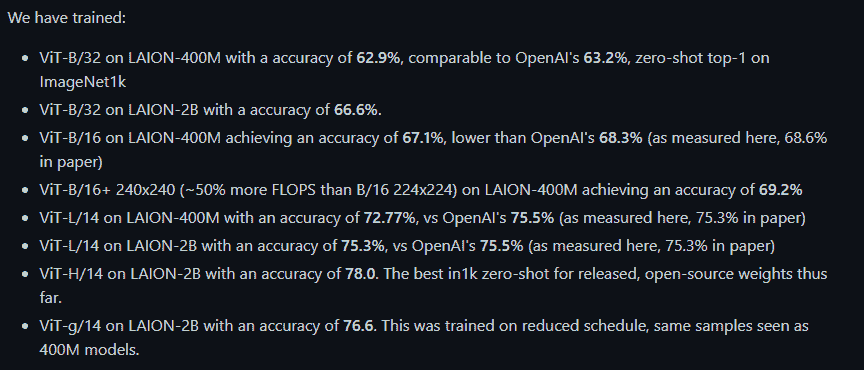
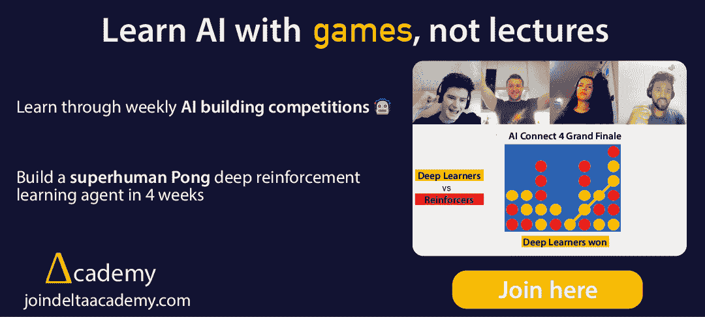
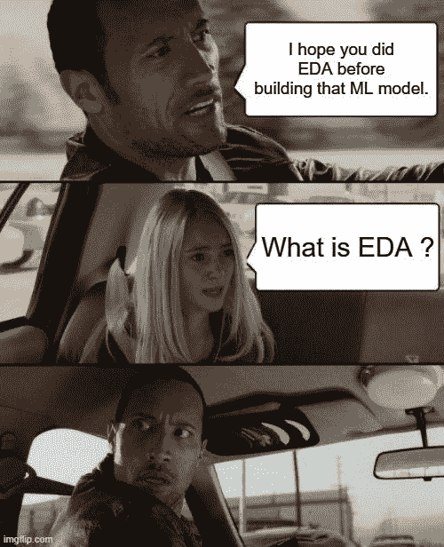
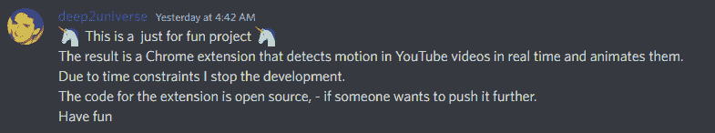
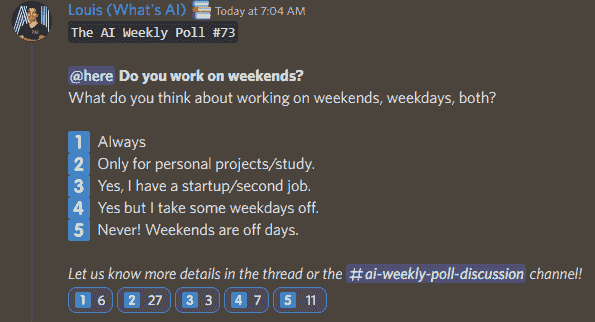

# 这份人工智能时事通讯是你所需要的#13

> 原文：<https://pub.towardsai.net/this-ai-newsletter-is-all-you-need-13-839bbe1aa38e?source=collection_archive---------2----------------------->

# 这个星期在 AI 发生了什么

本周，我的注意力集中在艾玛德和他的团队所做的令人惊叹的工作上。本周，艾玛德[宣布了 OpenCLIP](https://twitter.com/emostaque/status/1570501470751174656) ，这是一个开源版本的 CLIP，它击败了最先进的 CLIP 结果，改进了文本-图像编码对，这对当前的研究产生了巨大的影响，因为这样一个预先训练的开源模型将被数千名研究人员用来创建涉及图像和文本的惊人的新应用程序和模型。

[OpenCLIP](https://laion.ai/blog/large-openclip/) 到底是什么？OpenCLIP 是 OpenAI 的 CLIP(对比语言-图像预训练)的开源实现。他们到底带来了什么？为什么这很酷？这很酷，因为，作为稳定扩散，他们的目标是把 CLIP 带给你，普通的研究人员(就计算资源而言，而不是就技能而言，如果你正在阅读这篇文章，你肯定比普通的研究人员强！😉).这意味着他们希望能够训练/促进具有对比图像-文本监督的模型的研究。正如他们提到的，“我们的出发点是 CLIP 的实现，当在相同的数据集上训练时，它与原始剪辑模型的准确性相匹配。”这意味着他们带来了许多新的 SOTA 预训练模型，由于更有效的实现和开源代码，您可以实现这些模型(见下文)。查看[他们的知识库](https://github.com/mlfoundations/open_clip)以了解更多并实现他们的模型！

## 最热门新闻

1.  [扩散蜂，一款稳定的 M1 MAC 的扩散 GUI App！](https://github.com/divamgupta/diffusionbee-stable-diffusion-ui) “Diffusion Bee 是在您的 M1 Mac 上运行稳定扩散的最简单方法。附带一键安装程序。不需要依赖或技术知识。”
2.  麻省理工学院的研究人员让 DALL-E 更有创意！正如这篇文章所强调的，研究人员开发了一种新方法，使用多个模型来创建更复杂的图像，以便更好地理解。这种方法称为可组合扩散，通过使用一组扩散模型生成图像来获得更好的结果，每个模型负责对图像的特定组件进行建模。
3.  我在 2022 年的《正午》节目中获得提名！
    如果你能在那里支持我，并为我喜欢的作品投票，我将不胜感激！(科技 YouTube 和数据科学时事通讯都有)。提前感谢这个神奇的社区！😊🙏
    YT:[https://www . noon ies . tech/2022/emerging-tech/2022-top-tech-youtuber](https://www.noonies.tech/2022/emerging-tech/2022-top-tech-youtuber) 快讯:[https://www . noon ies . tech/2022/emerging-tech/2022-best-data-science-Newsletter](https://www.noonies.tech/2022/emerging-tech/2022-best-data-science-newsletter)

感谢[三角洲学院](https://ws.towardsai.net/ywu)为您带来这一期:

## 本周最有趣的报纸

1.  [im 2 nerf:Image to Neural Radiance Field in the Wild](https://arxiv.org/pdf/2209.04061.pdf) 一种学习框架，在给定野外单个输入图像的情况下，预测连续的神经对象表示，仅由现有识别方法的分割输出进行监督。
2.  [视觉语言模型中零镜头泛化的测试时提示调优](https://arxiv.org/pdf/2209.07511.pdf) 测试时提示调优(TPT):一种可以用单个测试样本动态学习自适应提示的方法。
3.  [StoryDALL-E:为故事延续调整预训练的文本到图像转换器](https://arxiv.org/pdf/2209.06192.pdf) “我们首先提出故事延续的任务，其中生成的视觉故事以源图像为条件，允许更好地推广到具有新角色的叙事。[……]我们的工作表明，预训练的文本到图像合成模型可以适用于复杂和低资源的任务，如故事延续。”

喜欢这些论文和新闻摘要吗？ [*在你的收件箱*](https://www.linkedin.com/newsletters/what-s-ai-daily-research-tl-dr-6935956459641876480/) *中获取每日回顾！*

# 一起学习人工智能社区部分！

## 本周迷因！

哦不…

EDA 代表探索性数据分析，是在考虑应用哪个模型之前调查将在 ML 模型中使用的数据的过程。

[friedliver#0614](https://discord.com/channels/702624558536065165/830572933197201459/1019761572110934067) 分享的 Meme。

## 来自 Discord 的特色社区帖子

来自 Learn AI 社区的 deep2universe#6939 的一个很酷的[项目。该算法将在任何 YouTube 视频上运行，并对视频中的人进行姿势和运动检测。相当酷！正如他提到的，不幸的是，作者不得不停止扩展的开发，但开源代码供进一步使用。我们强烈鼓励任何希望解决一个有趣项目的人联系 deep2universe on discord，接受他的工作。对于对计算机视觉感兴趣的人来说，这是一个非常棒的项目，尤其是运动或姿态检测。](https://discord.com/channels/702624558536065165/702632051018301561/1020978060469743710)

观看更多演示视频:

下载[的 Chrome 扩展](https://chrome.google.com/webstore/detail/youtube-motion-tracking/cpjloofnnmchhbdbdchjnhfoclnjliga)。

查看代码:

 [## GitHub-deep 2 universe/YouTube-运动跟踪:用于运动跟踪的 YouTube AI 扩展

### 这个视频源的一些例子标志是由一个 3 岁的女孩设计的。YouTube 运动跟踪是一个 Chrome…

github.com](https://github.com/deep2universe/YouTube-Motion-Tracking) 

## 本周最佳人工智能投票！

你认为周末、工作日或两者都工作怎么样？[加入关于不和的讨论](https://discord.com/channels/702624558536065165/833660976196354079)。

# 泰策展组

## 本周文章

[**规范化与标准化的区别**](/difference-between-normalization-and-standardization-745030eaf96f) 由[车谈安比](https://chetanambi.medium.com/)。
机器学习管道中的一个关键过程是特征缩放。标准化和规范化是特征缩放的两种常用方法。但是它们的区别是什么，什么时候使用？这是刚开始数据科学之旅的人很常见的问题。作者用公式、可视化和代码很好地解释了不同之处。

## 我们的必读文章

[Edoardo Bianchi](/improve-your-classification-models-with-threshold-tuning-bb69fca15114)[通过阈值调整](https://medium.com/@edoardobianchi98)改进您的分类模型

[不平衡数据—实时投标](/imbalanced-data-real-time-bidding-6ee9c4ef957c)由 [Snehal Nair](https://medium.com/@snehal.1409)

如果你对《走向人工智能》感兴趣，请查看我们的指南并注册。如果您的作品符合我们的编辑政策和标准，我们会将其发布到我们的网络上。

## **劳伦关于增加黛尔创造力的道德观点**

我认为这太不可思议了，这个模型能够坚持自然语言提示，这要感谢麻省理工学院的研究人员！但是，我不太同意一般的说法，这种能力增加了模型的创造力。这种提高似乎更多地集中在准确性上，而作为一个概念，创造性并不总是与准确性相关联。艺术往往需要打破规则或意外地工作，而这种“错误”是创作过程的一部分，往往使艺术如其本来一样令人惊叹。增加模型在线条上着色的能力并不遵循这个原则。同样，复杂性的增加也不一定与创造力的增加相关联——极其简单的事情也可能具有惊人的创造力。

与我的第一个观点相反的观点可能是，在自然语言的限制下锻炼能力实际上是一种创造性的练习，而不是允许脱离脚本。然而，我要重申，打破参数比在参数范围内工作更有创造性。DALLE 创作的第一波浪潮之所以如此有影响力，部分原因是缺乏对基于语言的先入为主的观念的关注(当然，除了它所接受的训练之外！).通过这种方式优化准确性，我们可能会失去一些创造性的印象。无论我们选择哪个方向，都将继续塑造我们培养创造力的尝试和人工智能数字艺术工具的未来！

## 工作机会

*   [**高级软件工程师@ Captur** (远程，±2 小时英国时间)](http://ws.towardsai.net/6cs)
*   [**高级 ML 工程师@安全保安**(远程)](http://ws.towardsai.net/4a1)
*   [**ML/算法工程师@ Aurora Insight** (混合远程)](http://ws.towardsai.net/qi0)
*   [**数据科学家@伊莱克特**(远程)](http://ws.towardsai.net/6p6)
*   [**ML 研究实习生@ Genesis Therapeutics** (加州伯林盖姆)](http://ws.towardsai.net/0s4)
*   [**资深参谋数据科学家@一关注**(远程)](https://ws.towardsai.net/zhr)
*   [**研究科学家—语音识别@ bridge**(远程)](http://ws.towardsai.net/6l8)
*   [**计算机视觉科学家@ Percipient AI** (加州圣克拉拉)](http://ws.towardsai.net/august-22-4-job-1)
*   [**EvolutionIQentist @ EvolutionIQ**(远程)](http://ws.towardsai.net/august-4-job-2)的高级数据科学家职位申请

*有兴趣在此分享工作机会吗？联系 sponsors@towardsai.net 或在我们的* [*【招聘频道】发布招聘机会*](http://ws.towardsai.net/lat-hiring-channel) *！*

