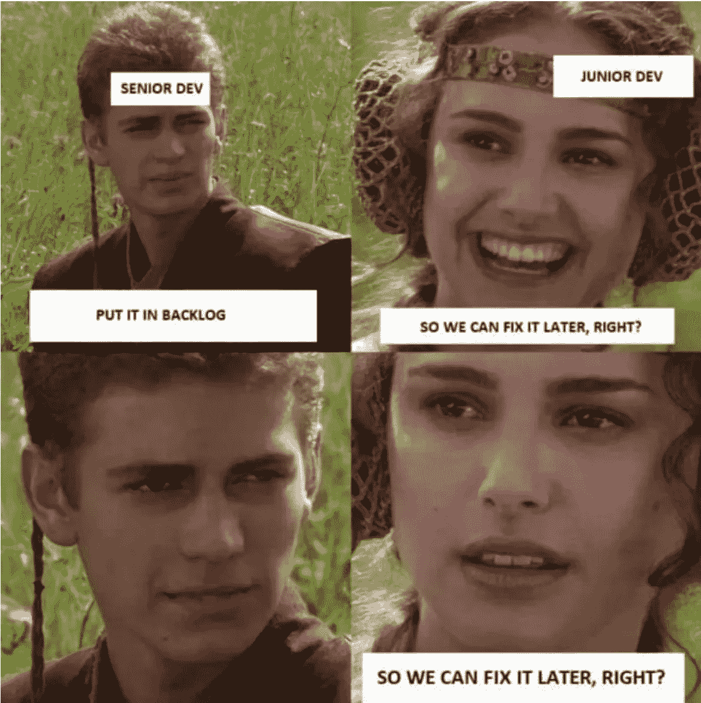
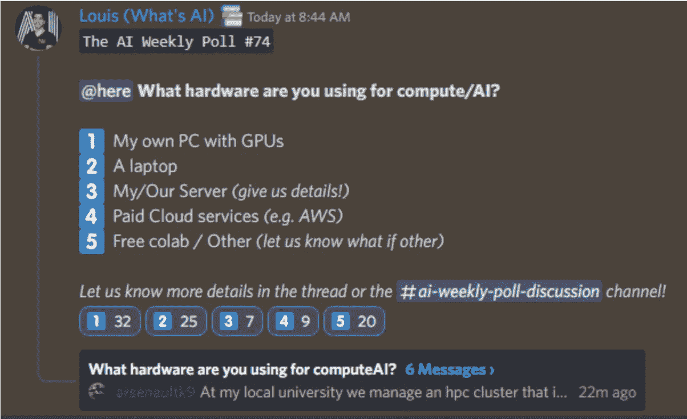

# 这份人工智能时事通讯是你所需要的#14

> 原文：<https://pub.towardsai.net/this-ai-newsletter-is-all-you-need-14-84643b1f557?source=collection_archive---------0----------------------->

# **本周在 AI 发生了什么由路易**

本周我们看到一些有趣的人工智能新闻，再次涉及稳定的扩散型模型: [Getty Images 禁止人工智能生成的内容](https://www.theverge.com/2022/9/21/23364696/getty-images-ai-ban-generated-artwork-illustration-copyright?utm_campaign=Your%20Daily%20AI%20Research%20tl%3Bdr&utm_medium=email&utm_source=Revue%20newsletter)。如果你卖的是人工智能生成的内容，那就要小心了！

事实上，由于担心版权问题，Getty Images 已经禁止上传和销售使用 DALL-E、Midjourney 和 Stable Diffusion 等人工智能艺术工具生成的插图。

"这些模型输出的版权问题确实令人担忧."我同意这一点。在弄清楚谁是这样一件作品的真正创作者，谁可以声称是作者和销售，甚至不谈论版权问题方面，存在着真正的担忧。这类似于所有新领域和应用，如互联网的开始:我们需要找到这些问题的法律答案，特别是(但很少可能)在这些问题出现之前，即使这似乎更像是一个灰色区域，而不是明确的“可概述”规则。

你怎么看待这些深网的版权问题？我们能卖掉它制作的艺术品吗？我们已经看到人工智能艺术赢得比赛的争议，现在人们从中赚钱。

最重要的问题是，谁应该从中获利？应该是算法的创造者，训练中使用的数百万张图像的创造者，托管和开发模型的公司(如 OpenAI)，还是产生结果的模型用户和提示工程师？

# 最热门新闻

1.  在神奇宝贝上微调的稳定扩散演示！
    一个非常酷的稳定扩散演示，在神奇宝贝上微调以生成新的神奇宝贝(非常有趣的，见封面图片！).试试这里的[或者这里](https://replicate.com/lambdal/text-to-pokemon?utm_campaign=Your%20Daily%20AI%20Research%20tl%3Bdr&utm_medium=email&utm_source=Revue%20newsletter)的谷歌可乐。贾斯汀·平克尼制作。Justin 甚至出版了一本指南,介绍如何微调稳定扩散以供自己使用。
2.  [使用 Tensorflow 和 Keras 实现稳定扩散！](https://github.com/divamgupta/stable-diffusion-tensorflow?utm_campaign=Your%20Daily%20AI%20Research%20tl%3Bdr&utm_medium=email&utm_source=Revue%20newsletter) Keras 的创作者评论，[Fran ois Chollet](https://twitter.com/fchollet?utm_campaign=Your%20Daily%20AI%20Research%20tl%3Bdr&utm_medium=email&utm_source=Revue%20newsletter):“更快，更简洁，代码优雅。您可以在一行代码中添加 TPU 和多 GPU 推理。您可以将模型导出到 TF.js 或 TFLite，以便在设备上进行推断。Tensorflow 实现的快速总结:转换的预训练模型、易于理解的代码和最小的代码占用空间。[代码](https://github.com/divamgupta/stable-diffusion-tensorflow?utm_campaign=Your%20Daily%20AI%20Research%20tl%3Bdr&utm_medium=email&utm_source=Revue%20newsletter)， [Colab](https://colab.research.google.com/drive/1fBlfPsL5DEscub0O_3oJNnJbON4w3EKq?usp=sharing&utm_campaign=Your%20Daily%20AI%20Research%20tl%3Bdr&utm_medium=email&utm_source=Revue%20newsletter)
3.  ECCV 在一个月后……我会去那里的！如果你对去 ECCV 犹豫不决，那就去吧！借此机会学习和扩展你的专业/研究网络(和我见面！).如果你要去，请告诉我。我很想和你聊天！今年，ECCV 在特拉维夫。我会在那里参加活动并多呆几天，所以如果你也在特拉维夫或附近，请联系我！

# 本周最有趣的报纸

1.  [VToonify:可控高分辨率人像视频风格转换](https://arxiv.org/pdf/2209.11224.pdf) 一个可控的高分辨率人像视频风格转换框架。
2.  [I2DFormer:学习图像以记录零镜头图像分类的注意力](https://arxiv.org/pdf/2209.10304.pdf) I2DFormer 是一种新颖的基于转换器的零镜头学习(ZSL)框架，它通过在共享嵌入空间中对齐两种模态来联合学习编码图像和文档(来自维基百科)。
3.  [【NVIDIA】NeuralMarker:一个学习一般标记对应关系的框架](https://arxiv.org/pdf/2209.08896.pdf) “我们提出了一个新的框架 neural Marker，训练一个神经网络在各种挑战性条件下估计密集的标记对应关系，如标记变形、强光等。”

*享受这些论文和新闻摘要？* [*在你的收件箱里获取每日回顾*](https://www.linkedin.com/newsletters/what-s-ai-daily-research-tl-dr-6935956459641876480/) *！*

# **一起学习人工智能社区版块！**

## 本周迷因！

当然，它会被修复… [由 Brooke#5801](https://discord.com/channels/702624558536065165/830572933197201459/1023919199803944970) 分享的 Meme。

## 来自 Discord 的特色社区帖子

我们的一个成员提出了一个非常酷的倡议 arsenaultk9 #2059:

“如果你有兴趣了解如何使用机器学习来生成音乐，我已经发布了这篇文章，包括生成 midi 的代码:[https://medium . com/@ arsenaultk 9/artificial-intelligence-music-generation-melody-harmonization-pt1-CB 3 e 92 c 9 a 0 ca](https://medium.com/@arsenaultk9/artificial-intelligence-music-generation-melody-harmonization-pt1-cb3e92c9a0ca)”

arsenaultk9，2022 年 9 月 20 日

## 本周最佳人工智能投票！

加入关于不和的讨论。

# 泰策展组

## 本周文章

[**停止使用网格搜索！由**](/keras-tuner-tutorial-hyperparameter-optimization-tensorflow-keras-computer-vision-example-c9abbdad9887) **[Poulinakis Kon](https://medium.com/@poulinakis.kon) 编写的关于 Keras 调谐器**T3 的完整实用教程

即使是专家也经常陷入试错程序的兔子洞，直到他们为自己的神经网络找到一个好的超参数组合。Keras-Tuner 是一个工具，它将帮助您优化您的神经网络，并找到一个接近最佳的超参数集。在本文中，您不仅将学习如何使用 KerasTuner，还将学习一些独特的技巧，比如单独调整每一层中的参数，或者与优化器一起调整学习速率。

## 我们的必读文章

[Pablo Monte agudo](/a-gentle-introduction-to-automatic-differentiation-74e7eb9a75af)[对自动微分](https://medium.com/@pablo.monteagudo.lago)的简要介绍

[这就是你如何使用由](/this-is-how-you-can-build-a-churn-prediction-model-using-spark-e187b7eca339) [Paul Iusztin](https://medium.com/@p.e.iusztin) 开发的 Spark 构建一个客户流失预测模型

如果你有兴趣在《走向人工智能》上发表文章，[查看我们的指南并注册](https://contribute.towardsai.net/)。如果您的作品符合我们的编辑政策和标准，我们会将其发布到我们的网络上。

## **伦理视角下的艾艺术《经济责任的鸿沟》作者劳伦**

我将尝试回答路易斯的百万美元问题！所有权和收益权如何适用于 AI 生成的艺术？我们可以借鉴人工智能思想的另一个领域:罗伯特·斯派洛 2007 年题为[黑仔机器人](https://onlinelibrary.wiley.com/doi/full/10.1111/j.1468-5930.2007.00346.x)的论文中的责任差距。问题不在于获利权，而在于战时法(T21)，这是正义战争的一个条件，在这种战争中，某人可以对死亡负责；自主武器系统无法满足其非点开发过程的条件。我们的系统只允许一个来源，而 AI 是多个来源的产物，那么哪个来源才是真正的来源呢？甚至在许多年后，我们仍在以各种形式与这一灰色地带作斗争。

回到人工智能生成的艺术，我们需要立法来告诉我们前进到这个新的未知领域的最佳方式，为道德行为提供一个问责框架。但是我们如何形成这种结构呢？对于这个问题，有必要把视觉艺术社区和经济作为一个整体来看待。人工智能艺术的存在和利润会加剧哪些问题？谁在这个空间内有不公平的优势或劣势？这些问题将揭示薄弱点在哪里，并告知哪些领域最需要未来立法的支持。就目前而言，谨慎行事并制定可持续的长期多层面方法是最佳的前进方式。

# 工作机会

[**高级软件工程师@ Captur** (远程，英国时间+/- 2 小时)](http://ws.towardsai.net/6cs)

[**机器学习学徒@ HingeHealth** (远程](https://jobs.lever.co/hingehealth/e41242af-b19e-4943-941d-b85ae2a2f934?utm_source=found.dev))

[**高级 ML 运营工程师@ BenchSi** (远程)](https://jobs.lever.co/benchsci/8e32e23b-ce68-4534-bc82-c75f964c7b54?utm_source=found.dev)

[**ML/算法工程师@ Aurora Insight** (混合远程)](http://ws.towardsai.net/qi0)

[**数据科学家@伊莱克特**(远程)](http://ws.towardsai.net/6p6)

[**ML 研究实习生@ Genesis Therapeutics** (加州伯林盖姆)](http://ws.towardsai.net/0s4)

[**资深参谋数据科学家@一关注**(远程)](https://ws.towardsai.net/zhr)

有兴趣在这里分享工作机会吗？联系 sponsors@towardsai.net 或在我们的[*#招聘频道上发布机会不和谐*](http://ws.towardsai.net/lat-hiring-channel) *！*

*如果你正在准备你的下一次机器学习面试，不要犹豫，去看看我们领先的面试准备网站，* [*五彩纸屑*](http://ws.towardsai.net/confetti-ai) *！*

