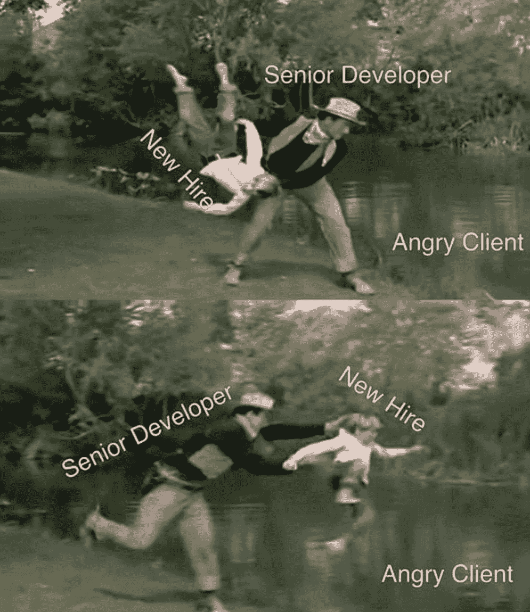
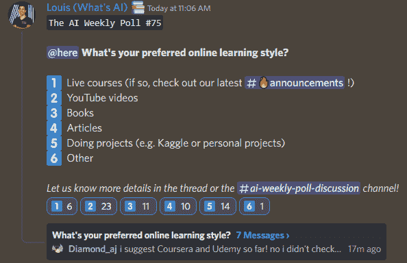

# 这份人工智能时事通讯是你所需要的全部#15

> 原文：<https://pub.towardsai.net/this-ai-newsletter-is-all-you-need-15-700c1238e2ba?source=collection_archive---------0----------------------->

# 《人工智能》本周发生了什么

由于 ICLR 2023 的论文提交截止日期，大量新的研究正在发布。接下来几天还有很多人要来，敬请关注。下面我要强调的一个是 [DreamBooth](https://arxiv.org/pdf/2208.12242.pdf?utm_campaign=Your%20Daily%20AI%20Research%20tl%3Bdr&utm_medium=email&utm_source=Revue%20newsletter) ，这是一种将文本到图像模型应用于特定主题的奇妙方法。另一个是 [DreamFusion](https://dreamfusion3d.github.io/) ，一种文本到 3D 的方法，比文本到图像多了一个维度，增加了一个坐标，增加了问题的复杂性。这与 Meta 最近的出版物[制作视频](https://www.louisbouchard.ai/make-a-video/)非常相似，也是在上周发布的，这是一种文本到视频的方法，也是三维的。这两种方法尽管非常不同，但都严重依赖于 2D 扩散，并将其适应于另一个维度，使用另一个空间维度来实现 3D 效果，或者使用时间维度来实现视频。我已经在一篇关于《走向人工智能》的文章中介绍了制作视频，并希望我能尽快介绍 DreamBooth 和 DreamFusion。

你期待已久的即将到来。我刚刚给 NVIDIA Deep Learning Institute 礼品卡的 10 名幸运获奖者发了一条私人消息，作为我们的赠品！GPU 冠军将在与 NVIDIA 合作的下一期[我的个人简讯](https://www.louisbouchard.ai/newsletter/)中公布！

## 最热门新闻

1.  [特斯拉 AI Day 2022 是上周五！如果你错过了或者无法在那里呆上 3 个小时，不要担心；](https://youtu.be/ODSJsviD_SU?utm_campaign=Your%20Daily%20AI%20Research%20tl%3Bdr&utm_medium=email&utm_source=Revue%20newsletter)[我们社区](https://www.discord.gg/learnaitogether?utm_campaign=Your%20Daily%20AI%20Research%20tl%3Bdr&utm_medium=email&utm_source=Revue%20newsletter)的一位了不起的成员， [tomi.in.ai](https://discord.com/channels/702624558536065165/704089125552259163/1025853669398294709?utm_campaign=Your%20Daily%20AI%20Research%20tl%3Bdr&utm_medium=email&utm_source=Revue%20newsletter) ，在下面的社区版块为我们写了一篇总结！
2.  OpenAI 删除了 DALL E 的等待列表！注册并开始创作！
    由于稳定扩散等其他替代方案越来越好，OpenAI 可能已经感觉到一些压力，或者他们最终足够自信，结果不会伤害任何人。不管怎样，他们决定继续前进，删除 DALL E 图像生成模型的等待列表。您现在可以马上使用它！
3.  [一个从文本生成视频的 AI！Meta AI 制作视频](https://www.louisbouchard.ai/make-a-video/?utm_campaign=Your%20Daily%20AI%20Research%20tl%3Bdr&utm_medium=email&utm_source=Revue%20newsletter) Meta AI 的新模型 Make-A-Video 问世了，只需一句话:它从文本中生成视频。它不仅能够生成视频，而且是新的最先进的方法，比以往任何时候都能够生成更高质量和更连贯的视频！[了解更多。](https://www.louisbouchard.ai/make-a-video/?utm_campaign=Your%20Daily%20AI%20Research%20tl%3Bdr&utm_medium=email&utm_source=Revue%20newsletter)

## 本周最有趣的报纸

1.  [DreamBooth:微调主题驱动生成的文本到图像扩散模型](https://arxiv.org/pdf/2208.12242.pdf?utm_campaign=Your%20Daily%20AI%20Research%20tl%3Bdr&utm_medium=email&utm_source=Revue%20newsletter) 一种文本到图像扩散模型“个性化”的新方法(根据用户需求对其进行特殊化),通过微调预先训练的文本到图像模型，使其学习将唯一标识符与特定主题绑定。
2.  [通过有针对性的人工判断提高对话代理的一致性](https://arxiv.org/pdf/2209.14375.pdf?utm_campaign=Your%20Daily%20AI%20Research%20tl%3Bdr&utm_medium=email&utm_source=Revue%20newsletter) 一种信息搜索对话代理，经过强化学习(来自人工反馈)训练，与提示语言模型基线相比，更有帮助、更正确且无害。
3.  [EMB-加姆:使用预训练语言模型的可解释且高效的预测器](https://arxiv.org/pdf/2209.11799.pdf?utm_campaign=Your%20Daily%20AI%20Research%20tl%3Bdr&utm_medium=email&utm_source=Revue%20newsletter) 他们使用预训练语言模型来提取每个输入的嵌入，然后在嵌入空间中学习线性模型(广义加性模型(GAM)，其输入特征和特征交互的透明且可解释的线性函数)。

喜欢这些论文和新闻摘要吗？**！**

# *一起学习人工智能社区部分！*

## *本周迷因！*

**

*发生在我们所有人身上😂😅。由 [friedliver#0614](https://discord.com/channels/702624558536065165/830572933197201459/1025802161872973906) 分享的 Meme。*

## *来自 Discord 的特色社区帖子*

*正如你们大多数人已经知道的那样，上周五是特斯拉 2022 年人工智能日，这是特斯拉新年度活动的第二次迭代，展示了特斯拉过去和现在正在进行的进步和项目以及问答，所有这些都由埃隆·马斯克和他的团队主持。如果你不能参加，你可以看再扩散，但是它有 3.5 小时长。幸运的是，我们社区的一位了不起的成员， [tomi.in.ai](https://discord.com/channels/702624558536065165/704089125552259163/1025853669398294709?utm_campaign=Your%20Daily%20AI%20Research%20tl%3Bdr&utm_medium=email&utm_source=Revue%20newsletter) ，为我们写了一份总结:*

***特斯拉人形机器人——擎天柱***

*Optimus 的成本不到 20，000 美元，原型在一年内“从技术上”被开发出来。它有 11 个自由度，手可以提 20 磅(9 公斤)的包，很容易被人制服。它的愿景基于特斯拉 autopilot 中使用的类似技术，并具有类似于特斯拉汽车碰撞结构的损坏控制系统(如果它面朝下倒下)。*

***全自动驾驶/自动驾驶***

*消防处的客户群在 2021 年至 2022 年间从 2000 人增加到 16 万人。*

*模型训练中心由 3 台超级计算机组成，每台都有 14，000 个 GPU(4，000 个 GPU 用于自动标记，10，000 个 GPU 用于训练)。特斯拉已经培训了 75，777 个模型，并发运了 281 个。它使用 PyTorch 扩展来加速视频库，使训练速度提高了 30%。由多次行程重建提供支持的自动化 3D 标记取代了 500 万小时的手动标记，在 10，000 次行程的聚类上使用了 12 个小时。数据引擎识别错误预测(例如，它认为将要穿过十字路口的停放的汽车)，纠正标签并将剪辑分类到评估集中。到目前为止，已有 13，900 个片段被重新标记，从而保持了数据的动态性。dojo 系统处理器相当先进，不幸的是我不能总结，因为我对此了解甚少。您可能需要查看演示文稿的这一部分以了解上下文。*

***马斯克在 Q 期间的一些言论&答:***

*“擎天柱将在 5 年内变得不可思议，10 年内将令人惊叹……我真的很有兴趣看到这一切发生，我希望你也是。”*

*“我们会做很多事情，那会很酷，而且不会很容易。但如果你是一名超级有才华的工程师，你的才华将比在任何地方都得到更大程度的利用。”*

## *本周最佳人工智能投票！*

**

*你喜欢的学习方式是什么？[加入不和](https://discord.com/channels/702624558536065165/833660976196354079)的讨论。*

# *泰策展组*

## *本周文章*

*[**洛伯特深度解说:第一部**](/logbert-explained-in-depth-part-i-771463d7beda) 作者[大卫·希夫](https://medium.com/@davidschiff_35251)*

*在这篇文章中，作者解释和简化了检测日志序列异常的 LogBERT 方法。本文对 BERT 的主要部分——变压器模块进行了剖析。首先是嵌入层，其次是位置编码，自我关注，最后是多头关注。由于有图形表示、数学方程和适当的例子，对数伯特的理解相对简单。*

## *我们的必读文章*

*[AWS ML 相关服务简介——AWS 情感分析](/sentiment-analysis-with-aws-a-gentle-intro-to-aws-ml-related-services-e975a5592950)作者 [Kaan Boke 博士](https://medium.com/@kaanboke)*

*[一个代码行数最少的聊天机器人](/a-chatbot-with-the-least-number-of-lines-of-code-a42e3ba9d974)作者 [Chinmay Bhalerao](https://medium.com/@BH_Chinmay)*

*如果你对《走向人工智能》感兴趣，请查看我们的指南并注册。如果您的作品符合我们的编辑政策和标准，我们会将其发布到我们的网络上。*

## ***劳伦对梅塔对莫莉·拉塞尔之死的贡献的伦理观点***

*如果不提及最近科技伦理领域的最大新闻，那将是我的失职:最近[英国裁定 Meta 在 2017 年 14 岁的 Molly Russell 死亡中的责任](https://www.nytimes.com/2022/10/01/business/instagram-suicide-ruling-britain.html)。这项裁决只与莫莉的死因有关，莫莉的家人希望通过这项裁决来提高人们对儿童互联网安全的毁灭性缺陷的认识。主持此案的验尸官得出结论，Meta 和其他社交媒体公司对她的死亡负有责任，这可能是第一次将死亡的法律责任归咎于社交媒体公司。*

*这一案件为其他孩子类似死亡的家庭以及未来的儿童保护立法树立了一个重要的法律先例。作为一个社会，这是一个非常困难和敏感的领域，我们不得不探索——什么可以展示，什么不应该展示，如何让孩子做自己并保护他们的安全。回答这些问题需要对我们留给下一代的世界给予极大的关心和诚实。它要求我们不要回避年轻人在没有足够保护的平台上不断遭受的恐怖，这种恐怖使法庭上的成年人沦为眼泪和噩梦。快速移动和打破东西是有后果的，这个悲剧是许多悲剧中的一个。作为 Instagram 上的一名前少女，我感谢所有在网上倡导增加青年权利和保护的人，并期待着未来的进步。*

## *工作机会*

*[**气候建模领域的研究科学家@艾伦人工智能研究所**(混合远程)](http://ws.towardsai.net/z8n)*

*[**高级 AI 软件工程师@ Spot AI** (远程)](http://ws.towardsai.net/uyt)*

*[**Copilot @ Github 的高级机器学习研究员**(远程)](http://ws.towardsai.net/nqe)*

*[**高级软件工程师@ Captur** (远程，英国时间+/- 2 小时)](http://ws.towardsai.net/6cs)*

*[**机器学习学徒@ HingeHealth** (远程](http://ws.towardsai.net/5pk))*

*[**高级 ML 运营工程师@ BenchSi** (远程)](http://ws.towardsai.net/fad)*

*[**ML 研究实习生@ Genesis Therapeutics** (加州伯林盖姆)](http://ws.towardsai.net/0s4)*

*有兴趣在此分享工作机会吗？联系 sponsors@towardsai.net 或在我们的[*#招聘频道上发布机会不和谐*](http://ws.towardsai.net/lat-hiring-channel) *！**

**如果你正在准备你的下一次机器学习面试，不要犹豫，来看看我们领先的面试准备网站，* [*五彩纸屑*](http://ws.towardsai.net/confetti-ai) *！**

**