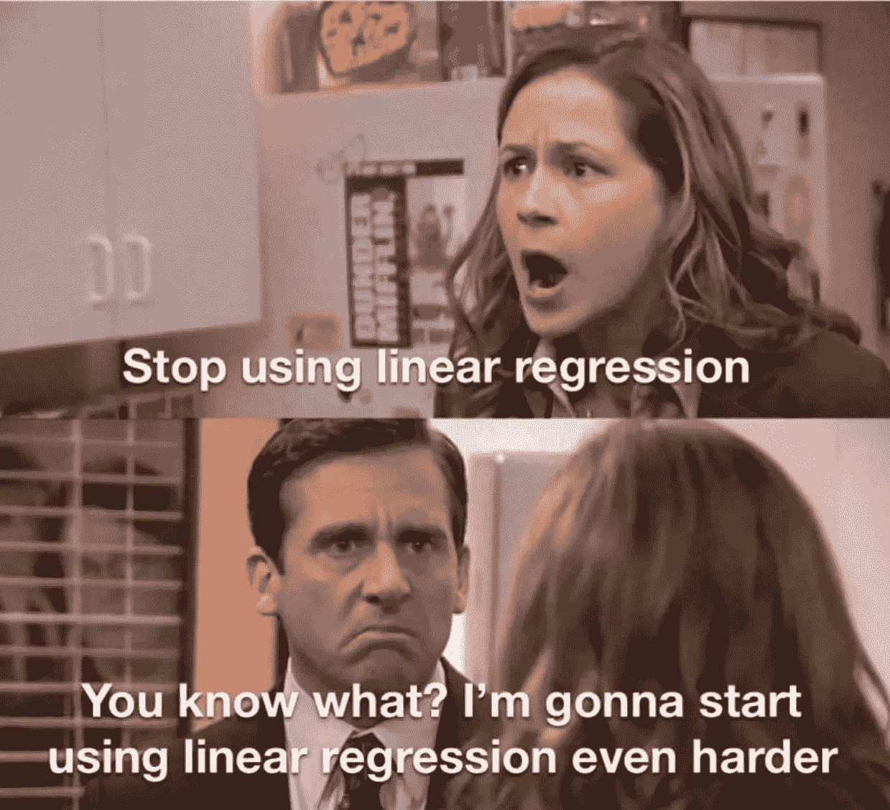
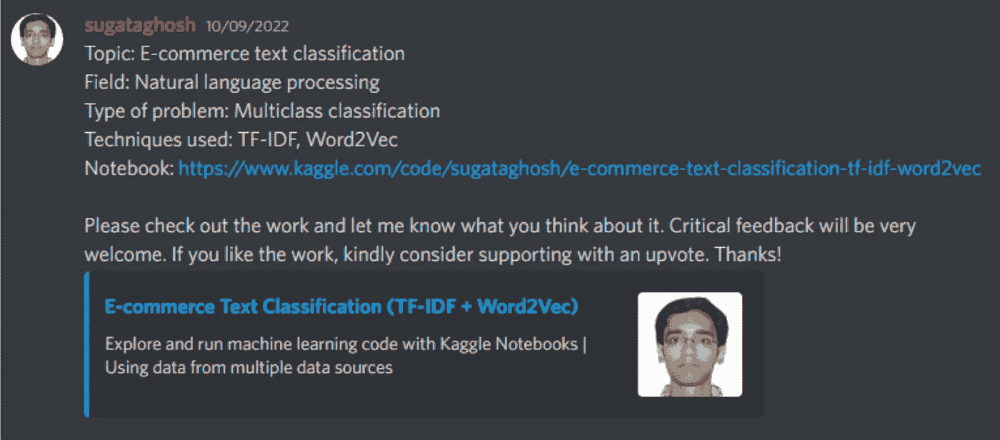
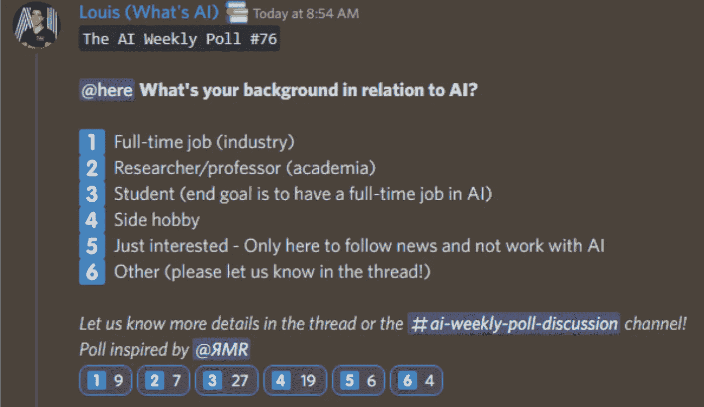

# 这份人工智能时事通讯是你所需要的#16

> 原文：<https://pub.towardsai.net/this-ai-newsletter-is-all-you-need-16-4941e8edac15?source=collection_archive---------0----------------------->

# 《人工智能》本周发生了什么

扩散被用于各种用途:图像、视频、3D 模型和音频，这都要归功于 StabilityAI，stability Diffusion 背后的公司。StabilityAI 宣布了一个基于“舞蹈扩散”模型的“AI 音乐生成器”，名为 [Harmonai](https://www.harmonai.org/?utm_campaign=Your%20Daily%20AI%20Research%20tl%3Bdr&utm_medium=email&utm_source=Revue%20newsletter) ，这基本上是一个稳定的扩散模型，用于生成声音而不是图像。基于扩散的模型无疑正在取代卷积和视觉转换器，尽管它们使用了一些相同的原理。我们相信他们将会在这里呆上一段时间，并且绝对值得学习更多的东西，因为他们才刚刚起步，这个领域仍然处于这种架构的第一个实验阶段。我们在德尔塔学院的朋友，也就是我们的合作伙伴，可能正在建立一个完整的、真正创新的扩散模型课程。它可以让你了解这些模型，并通过与你的同龄人在游戏比赛中竞争来实现它们。如果这听起来很有趣，请继续关注，因为我们将在[不和谐频道](https://discord.com/channels/702624558536065165/702625484441124954)上发布公告！如果你想了解更多关于扩散模型的知识，看看这篇关于走向人工智能的文章。

## 最热门新闻

*   [Deepmind 利用 AlphaTensor](https://www.deepmind.com/blog/discovering-novel-algorithms-with-alphatensor?utm_campaign=Your%20Daily%20AI%20Research%20tl%3Bdr&utm_medium=email&utm_source=Revue%20newsletter) 解决算法发现问题正如我在下面的第二篇论文中提到的，Deepmind 发表了“利用强化学习发现更快的矩阵乘法算法”，其中他们利用深度强化学习解决了发现新算法的任务，以允许更快和独特地发现新算法。在他们的博客文章中，他们提到这是 AlphaZero 应用于数学的首次扩展，已经为研究打开了新的可能性！请阅读他们的[博客文章](https://www.deepmind.com/blog/discovering-novel-algorithms-with-alphatensor?utm_campaign=Your%20Daily%20AI%20Research%20tl%3Bdr&utm_medium=email&utm_source=Revue%20newsletter)。
*   [“人工智能权利法案蓝图”](https://www.whitehouse.gov/ostp/ai-bill-of-rights/?utm_campaign=Your%20Daily%20AI%20Research%20tl%3Bdr&utm_medium=email&utm_source=Revue%20newsletter) 白宫科学办公室&技术政策发布了一份建议清单，开发者、企业、用户和立法者可以遵循这些建议来减少人工智能的潜在危害！它有很多细节，涵盖了建议背后的所有内容、原因和方式。[看看！](https://www.whitehouse.gov/ostp/ai-bill-of-rights/?utm_campaign=Your%20Daily%20AI%20Research%20tl%3Bdr&utm_medium=email&utm_source=Revue%20newsletter)
*   [Activeloop 发布 Deep Lake，深度学习的数据湖](https://www.activeloop.ai/resources/introducing-deep-lake-the-data-lake-for-deep-learning/?utm_campaign=Your%20Daily%20AI%20Research%20tl%3Bdr&utm_medium=email&utm_source=Revue%20newsletter) Deep Lake 以张量的形式存储复杂数据，如图像、视频、注释、嵌入和表格数据，并通过网络快速将数据流式传输到张量查询语言、浏览器内可视化引擎和深度学习框架，而不会牺牲 GPU 的利用率。Deep Lake 在各种场景下的表现都优于所有开源数据加载器(Webdataset、PyTorch、Torchdata、& others)。[阅读公告贴](https://www.activeloop.ai/resources/introducing-deep-lake-the-data-lake-for-deep-learning/?utm_campaign=Your%20Daily%20AI%20Research%20tl%3Bdr&utm_medium=email&utm_source=Revue%20newsletter)，[下载白皮书](http://deeplake.ai/?utm_campaign=Your%20Daily%20AI%20Research%20tl%3Bdr&utm_medium=email&utm_source=Revue%20newsletter)，或者[观看演示](https://www.youtube.com/watch?utm_campaign=Your%20Daily%20AI%20Research%20tl%3Bdr&utm_medium=email&utm_source=Revue%20newsletter&v=SxsofpSIw3k)。

## 本周最有趣的报纸

*   [通过折叠扩散生成蛋白质结构](https://arxiv.org/pdf/2209.15611.pdf?utm_campaign=Your%20Daily%20AI%20Research%20tl%3Bdr&utm_medium=email&utm_source=Revue%20newsletter) 一种新的基于扩散的生成模型，通过反映天然折叠过程的程序设计蛋白质骨架结构(“我们将蛋白质骨架结构描述为一系列连续的角度，捕捉组成氨基酸残基的相对方向，并通过从随机、未折叠状态向稳定的折叠结构去噪来生成新结构。”).
*   [利用强化学习发现更快的矩阵乘法算法](https://www.nature.com/articles/s41586-022-05172-4) “我们报告了一种基于 AlphaZero 的深度强化学习方法，用于发现高效且可证明正确的任意矩阵乘法算法。”
*   [具有扩散模型的新颖视图合成](https://3d-diffusion.github.io/static/paper.pdf) 3DiM:用于从少至单个图像进行 3D 新颖视图合成的扩散模型。

# 一起学习人工智能社区部分！

## 本周迷因！

Meme 再次被 [friedliver#0614](https://discord.com/channels/702624558536065165/830572933197201459/1025802161872973906) 分享。在[模因频道](https://discord.com/channels/702624558536065165/830572933197201459)与我们分享你的模因吧！

# 来自 Discord 的特色社区帖子

一个电子商务文本分类笔记本！

[我们的成员之一 Sugata Ghosh 的这个笔记本](https://discord.com/channels/702624558536065165/702632051018301561/1028589523556372531)使用 TF-IDF 和 Word2Vec 对电子商务文本进行分类。这是彻底的，很好的解释，非常专业。产品分类和处理文本数据的绝佳资源。看看吧，让 Sugata 知道你的想法和反馈！

# 本周最佳人工智能投票！

[加入关于不和](https://discord.com/channels/702624558536065165/833660976196354079)的讨论。

# 泰策展组

# 本周文章

[**从零开始构建前馈神经网络**](/building-feedforward-neural-networks-from-scratch-c5a5cf23b97b) 由 [Nicolò Tognoni](https://medium.com/@nicolotognoni)

深度学习技术基于神经网络，通常称为人工神经网络(ann)，是机器学习的一个子集。在本文中，您将学习更多关于前馈神经网络的知识，从基础知识开始，比如什么是感知器，然后逐步学习反向传播。通过互动图片的使用，作者巧妙地解决了所有的关键点，同时牢记文章的长度。

# 我们的必读文章

[时间序列预测的自适应学习](/adaptive-learning-for-time-series-forecasting-b34e640b865b)由 [Reza Yazdanfar](https://rezayazdanfar.medium.com/)

[构建端到端关联数据工程项目](/building-an-end-to-end-linked-data-engineering-project-b146149df38e)作者 [Edoardo Bianchi](https://medium.com/@edoardobianchi98)

如果你对《走向人工智能》感兴趣，请查阅我们的指南并注册。如果您的作品符合我们的编辑政策和标准，我们会将其发布到我们的网络上。

# 工作机会

[**气候建模领域的研究科学家@艾伦人工智能研究所**(混合远程)](http://ws.towardsai.net/z8n)

[**高级 AI 软件工程师@ Spot AI** (远程)](http://ws.towardsai.net/uyt)

[**Copilot @ Github 的高级机器学习研究员**(远程)](http://ws.towardsai.net/nqe)

[**高级软件工程师@ Captur** (远程，+/- 2 小时英国时间)](http://ws.towardsai.net/6cs)

[**机器学习学徒@ HingeHealth** (远程](http://ws.towardsai.net/5pk))

[**高级 ML 运营工程师@ BenchSi** (远程)](http://ws.towardsai.net/fad)

[**ML 研究实习生@ Genesis Therapeutics** (加州伯林盖姆)](http://ws.towardsai.net/0s4)

有兴趣在这里分享工作机会吗？联系 sponsors@towardsai.net 或在我们的[*#招聘频道上发布机会不和谐*](http://ws.towardsai.net/lat-hiring-channel) *！*

*如果你正在准备你的下一次机器学习面试，不要犹豫，去看看我们领先的面试准备网站，* [*五彩纸屑*](http://ws.towardsai.net/confetti-ai) *！*

