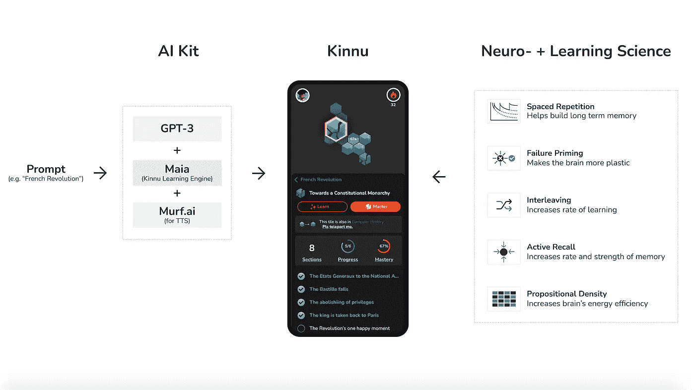
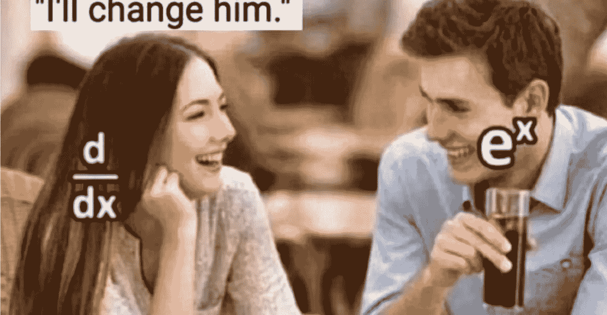
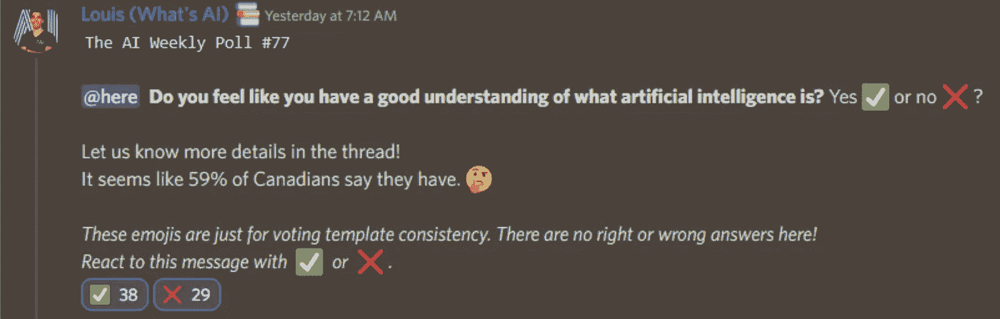

# 这份人工智能时事通讯是你所需要的#17

> 原文：<https://pub.towardsai.net/this-ai-newsletter-is-all-you-need-17-61e63730f7bc?source=collection_archive---------2----------------------->

# 《人工智能》本周发生了什么

本周公布了设计师。微软的 DALLE-powered 产品，用于在 AI 的帮助下创建设计。这是一个与 Canva 类似的平台，但使用更多的人工智能来生成定制图像，而不是预先提供的图像。我相信这只是许多在产品中使用生殖人工智能的第一家，就像所有基于 GPT 3 的公司一样。

[设计者](https://www.theverge.com/2022/10/12/23400270/ai-generated-art-dall-e-microsoft-designer-app-office-365-suite)的要旨是一代又一代地发送垃圾邮件，直到你得到正确的，因为结果并不完美，尤其是在第一次运行时，这是人工智能设计公司的一种方法。另一种选择是在使用它之前等待完美的结果，这样用户就不必工作了。

我很想知道你创作基于人工智能的内容的首选方法。您是否介意在得到好东西之前点击几次刷新，或者您是否愿意无限期地等待每次都能提供好看结果的模型？另一个问题是:你是愿意拥有一个你可以几代人发送垃圾邮件的人工智能，还是只让几代人得到真正的/可信任的设计师/艺术家的“认可”，让你相信这一代人确实看起来很棒？我知道我们中的一些人(比如我)对设计质量有着可怜的眼光。

## **最热门新闻**

1.  [一个基于扩散的 AI 音乐生成器！](https://mpost.io/stabilityai-announced-ai-music-generator-harmonai-based-on-dance-diffusion-model) StabilityAI，stability Diffusion 背后的公司，基于“舞蹈扩散”模型公布了一款名为 Harmonai 的“AI 音乐生成器”，这基本上是一个生成声音而不是图像的稳定扩散模型。
2.  由 OpenAI 的 DALL-E 2
    支持的微软人工智能设计应用程序 Designer 是的，微软正在向等候名单上的用户免费开放类似 Canva 的网络应用程序。只要键入你想要的图像的文本描述，人工智能就会生成例子，它们可以添加到你的设计中。这对 Canva 和 Adobe 来说是相当可怕的消息！
3.  [完全由人工智能生成的播客](https://podcast.ai/?utm_campaign=Your%20Daily%20AI%20Research%20tl%3Bdr&utm_medium=email&utm_source=Revue%20newsletter) “每周，我们都会深入探索一个新的话题，听众可以[为未来的剧集建议话题甚至嘉宾和主持人](https://podcastio.canny.io/episode-ideas)。无论你是一个机器学习爱好者，只是想以一种新的方式听到你最喜欢的话题，甚至只是想听听从过去带回生活的声音，这都是为你准备的播客。”

## 本周最有趣的报纸

1.  [EVA3D:来自 2D 图像集的合成 3D 人类生成](https://arxiv.org/pdf/2210.04888.pdf) “EVA3D，从 2D 图像集学习的无条件 3D 人类生成模型，只能采样具有详细几何形状的 3D 人类，并渲染高质量的图像(高达 512×256)，而没有花哨的功能(例如超分辨率)。”
2.  [用大型语言模型理解 HTML](https://arxiv.org/pdf/2210.03945.pdf) “我们发现，在标准自然语言语料库上训练的逻辑模型非常适合 HTML 理解任务。”
3.  [从单目视频重建个性化语义人脸神经网络模型](https://arxiv.org/pdf/2210.06108.pdf) 一种新的用神经辐射场定义的人体头部语义模型。3D 一致的头部模型由一组解开的和可解释的基础组成，并且可以由低维表达系数驱动。

*享受这些论文和新闻摘要？***】在你的收件箱里获得每日回顾！**

*本周我们将重点介绍一个来自 Kinnu 朋友的令人兴奋的新人工智能应用:*

*一家新创业公司正在与 Deepmind 的产品负责人合作，使用人工智能来增加人类的智能。*

*一家名为 [Kinnu](http://ws.towardsai.net/6b6) 的新学习初创公司正在实施人工智能，以寻找“认知捷径”，提高人类学习的有效性。他们认为加速学习的未来是神经科学和人工智能的融合。他们正在用一门关于人工智能的免费课程来测试这种方法，这门课程是与 Deepmind 自己的产品负责人共同编写的。Kinnu 也在试验完全由人工智能生成的学习材料(看看法国大革命课程，看看是什么样子)。这是教育的未来吗，像学习内容的 Dall-E？*

**

# ***一起学习人工智能社区版块！***

## *本周迷因！*

**

*😂😂由[罗比诺> Toi#0475](https://discord.com/channels/702624558536065165/830572933197201459/1030821225183850526) 分享的迷因。*

## *来自 Discord 的特色社区帖子*

*我们的一个成员刚刚开始了一个我绝对支持的个人项目:写作！*

*问题中的用户 friscons93 # 3360(或称 Davide)刚刚发表了他有史以来的第一篇文章:
“我只是想和你分享我的第一篇关于 medium 的数据科学文章:是关于利用机器学习和 PCA 进行药物水溶性预测的。”[看大卫的文章](https://medium.com/@davideluise/predicting-water-solubility-from-smiles-72929c369200)！*

## *本周最佳人工智能投票！*

**

*[加入关于不和的讨论](https://discord.com/channels/702624558536065165/833660976196354079)*

# ***泰始乱终弃节***

## *本周文章*

*[由](/outline-a-smaller-class-with-the-custom-loss-function-94ff00359698)[康斯坦丁·普鲁申尼科夫](https://medium.com/@kplz)用自定义损失函数勾勒出一个较小的类*

*准确性度量可能不总是足以产生期望的结果。我们可能希望降低假阳性或假阴性的比率。当数据集不平衡时，我们要寻找的答案属于一个更窄的类别，这可能是有用的。作者概述了在处理不平衡数据集时如何最大化分类。*

## *我们的必读文章*

*[如何使用 Keras 创建一个暹罗网络来比较图像](/how-to-create-a-siamese-network-with-keras-to-compare-images-5713b3ee7a28)作者 [Pere Martra](https://medium.com/@peremartra)*

*[一个简单的调整改善了任何分类器的分布外检测](/a-simple-adjustment-improves-out-of-distribution-detection-for-any-classifier-5e96bbb2d627)由[乌利亚纳·特卡琴科](https://medium.com/@uly.)*

*[DeepMind 的 AlphaTensor: Deepmind 的 AlphaTensor:正在重塑数学的人工智能](/deepminds-alphatensor-deepmind-s-alphatensor-the-ai-that-is-reinventing-math-4e282e25da35)作者[萨尔瓦托·雷埃利](https://salvatore-raieli.medium.com/)*

*如果你对《走向人工智能》，[感兴趣，查看我们的指南并注册](https://contribute.towardsai.net/)。如果您的作品符合我们的编辑政策和标准，我们会将其发布到我们的网络上。*

## *劳伦对人工智能在劳动力市场中角色的伦理审视*

*我们经常提到新的人工智能技术如何对工人产生破坏性影响，例如图像生成工具可能会扰乱视觉艺术工作者的工作，如平面设计师、摄影师或画家。但值得注意的是，许多劳动力市场在历史上随着新的人工智能进步而适应(从美国的角度来说)。许多人认为 Photoshop 是平面设计的终结，然后平面设计师成为了这方面的专家。如果你是一名与设计师和艺术家一起工作的工程师，你就会知道艺术品在通过美和讲故事将代码带入生活中是多么的无价。作为一名编辑，语法上肯定没有让我失业！好消息是，有一个完整的人工智能伦理学领域研究人工智能对各种劳动力市场的影响，这让我们对将改变的工作，将创造的工作，以及新人工智能带来的经济和社会影响有了难以置信的洞察力。*

## *工作机会*

*[**机器学习工程师@ Weights and bias**(远程)](http://ws.towardsai.net/qrw)*

*[**高级/职员机器学习工程师，基础设施&收入**](http://ws.towardsai.net/1n5) (远程)*

*[**气候建模领域的研究科学家@艾伦人工智能研究所**(混合远程)](http://ws.towardsai.net/z8n)*

*[**高级 AI 软件工程师@ Spot AI** (远程)](http://ws.towardsai.net/uyt)*

*[**高级机器学习研究员为 Copilot @ Github** (远程)](http://ws.towardsai.net/nqe)*

*[**高级软件工程师@ Captur** (远程，±2 小时英国时间)](http://ws.towardsai.net/6cs)*

*有兴趣分享这里的工作机会吗？联系 sponsors@towardsai.net 或者在我们的[*#招聘频道上发布【不和】*](http://ws.towardsai.net/lat-hiring-channel) *！**

**如果你正在准备你的下一次机器学习面试，不要犹豫，来看看我们领先的面试准备网站，* [*五彩纸屑*](http://ws.towardsai.net/confetti-ai) *！**

**