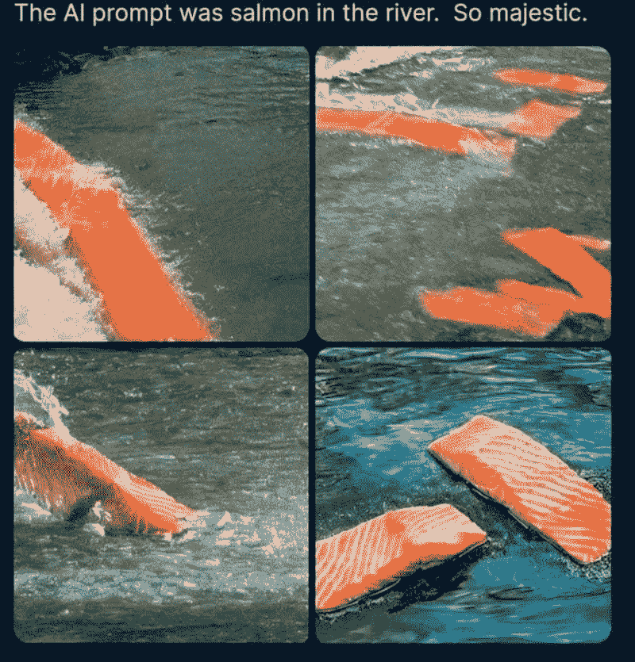

# 这份人工智能时事通讯是你所需要的#18

> 原文：<https://pub.towardsai.net/this-ai-newsletter-is-all-you-need-18-be0c188ddc82?source=collection_archive---------2----------------------->

# **本周在 AI 发生了什么由路易**

你一定听说过 Stability AI 及其最近为开源人工智能提供的[1.01 亿美元资金](https://stability.ai/press-blog/stability-ai-announces-101-million-in-funding-for-open-source-artificial-intelligence)，这对我们人工智能界来说是个好消息。令人兴奋的是，这显示了开源的力量有多大，以及基于开源的公司有多有前途。我希望这种新闻将推动我们领域的开源之路，我也深深希望大公司将遵循这条道路。我相信，对于一个公司来说，最终(免费)提供知识要比销售你一个人贡献的产品更有价值，因为开源社区最终会赶上你，迫使你不断迭代和竞争。在当今世界，你可以从任何人、任何地方获得帮助，为什么不这样做呢？为什么不通过让成千上万的人参与到你的工作中来帮助科学进步，让你的产品变得更好，就像 Stability AI 对 Stability Diffusion 所做的那样？看看它做了什么。稳定扩散甚至比 DALLE 现在更好更受欢迎。

说到这里，现在比开源获得资金和支持更令人兴奋的是[基于扩散的模型](https://www.louisbouchard.ai/latent-diffusion-models/)。每天都有新的论文使用这样的扩散模型来[生成图像](https://www.louisbouchard.ai/latent-diffusion-models/)、[生成 3D 模型](https://www.louisbouchard.ai/dreamfusion/)、[生成视频](https://www.louisbouchard.ai/make-a-video/)、[编辑来自草图的图像](https://www.louisbouchard.ai/imageworthoneword/)或来自文本的等等。它简直不可思议，已经完全取代了 GANs 或 transformers，但是它们可扩展吗？我很想知道你们的想法。扩散会一直持续下去并在此基础上发展吗？或者它只是在几个月内朝着更好的方法又迈进了一步？

## 最热门新闻

1.  谷歌的新人工智能可以听到歌曲的片段，然后继续播放
    这项新技术基于一篇名为 AudioLM 的论文和框架，用于长期一致性的高质量音频生成。它将输入音频映射到一系列离散的标记，并将音频生成转换为这个表示空间中的语言建模任务！
2.  [58.5 亿个剪辑过滤图文对的数据集！](https://laion.ai/blog/laion-5b/?utm_campaign=Your%20Daily%20AI%20Research%20tl%3Bdr&utm_medium=email&utm_source=Revue%20newsletter) LAION-5B 的数据集比 LAION-400M 大 14 倍，LAION-400m 是此前世界上最大的公开可访问的图文数据集。
3.  [德勤第五版《企业中的人工智能状况研究报告》出炉了！](https://www2.deloitte.com/us/en/pages/about-deloitte/articles/press-releases/deloitte-state-of-ai-fifth-edition-report.html?utm_campaign=Your%20Daily%20AI%20Research%20tl%3Bdr&utm_medium=email&utm_source=Revue%20newsletter) 德勤“就企业和行业如何部署和扩展人工智能(AI)项目，调查了超过 2600 名全球高管。最值得注意的是，德勤的报告发现，尽管人工智能继续向企业的核心靠拢——94%的商业领袖同意人工智能对未来五年的成功至关重要——但对一些人来说，结果似乎滞后了。”

## 本周最有趣的报纸

1.  [用于高效视频理解的压缩视觉](https://arxiv.org/pdf/2210.02995.pdf) “我们提出了一个框架，能够利用现在可以处理秒长视频的相同硬件来研究一小时长的视频。”
2.  [令牌合并:您的 VIT 更快](https://arxiv.org/pdf/2210.09461.pdf?utm_campaign=Your%20Daily%20AI%20Research%20tl%3Bdr&utm_medium=email&utm_source=Revue%20newsletter) 一种无需培训即可提高现有 ViT (visison transformer)型号吞吐量的简单方法。
3.  [Museformer:具有针对音乐生成的细粒度和粗粒度关注的变压器](https://arxiv.org/abs/2210.10349) 一种具有针对音乐生成的新颖的细粒度和粗粒度关注的变压器。Transformer 对音乐生成有新颖的细粒度和粗粒度关注。

喜欢这些论文和新闻摘要吗？**在你的收件箱里获得每日回顾！**

# *一起学习人工智能社区部分！*

## *本周迷因！*

**

*这简直是人工智能的惊人之作——这就是我所说的新鲜生鱼片！由 [dimkiriakos#2286](https://discord.com/channels/702624558536065165/830572933197201459/1033325720505692191) 分享的 Meme。*

## *来自 Discord 的特色社区帖子*

**

*Shubham Trivedi 刚刚分享了一本关于市场细分的笔记本，正在寻求您的反馈！如果你有几分钟的时间，请[看一下](https://www.kaggle.com/code/shubhamptrivedi/market-segmentation-for-online-healthcare-provider)并让他知道你的想法。特里维迪#1648 不和谐)！*

* [## 在线医疗保健提供商的市场细分

### 使用 Kaggle 笔记本探索和运行机器学习代码|使用 2011 年印度人口普查数据

www.kaggle.com](https://www.kaggle.com/code/shubhamptrivedi/market-segmentation-for-online-healthcare-provider) 

## 本周最佳人工智能投票！

[加入关于不和的讨论。](https://discord.com/channels/702624558536065165/833660976196354079)

# **泰始乱终弃节**

## 走向人工智能教程

在《走向人工智能》,我们是教程和实用内容的忠实粉丝，这些内容包含代码和示例，有助于学习、理解和实现人工智能和机器学习模型及应用。为了实现这个目标，我们已经委托我们的技术编辑 [Pratik Shukla](https://www.linkedin.com/in/pratik-shukla28/) 撰写了一系列关于各种机器学习算法和主题的博客文章(附带 Python 代码和 Google Colab 文件)。这是(众多)迷你系列中的第一个，重点关注梯度下降算法，从基本原理到变体与 Python 中精心编写的代码示例的比较:

1.  [梯度下降算法](https://towardsai.net/p/tutorials/the-gradient-descent-algorithm)
2.  [梯度下降算法背后的数学直觉](https://towardsai.net/p/tutorials/mathematical-intuition-behind-the-gradient-descent-algorithm)
3.  [梯度下降算法&及其变种](https://towardsai.net/p/tutorials/the-gradient-descent-algorithm-and-its-variants)

我们还在我们的网站上建立了一个新的[教程&实践页面](https://towardsai.net/ai/tutorials)，我们将在那里托管这类内容，既有我们自己的编辑团队发布的，也有我们的贡献者提交的，并努力改进其组织和可访问性。我们还希望为作者和读者提供一个更好的论坛，让他们就这些内容进行互动，并让读者在完成项目时提出问题或提供帮助。因此，我们也正在我们的共同学习人工智能社区中建立一个新的人工智能教程和实践论坛。所以有问题请加入，我们一起学习吧！

## 本周文章

[梯度下降优化](/gradient-descent-optimization-15ee38e75e12)由[罗汉·贾格塔普](https://rojagtap.medium.com/)

对于梯度下降的另一个观点，本周我们的一个投稿人偶然发表了另一个教程，以及在 TensorFlow 中实现梯度下降优化器。

## 我们的必读文章

[GELU:高斯误差线性单位码(Python，TF，Torch)](/gelu-gaussian-error-linear-unit-code-python-tf-torch-neural-network-bert-de539517edef)by[Poulinakis Kon](https://medium.com/@poulinakis.kon)

[计算机视觉任务概述&应用](/overview-of-the-computer-vision-tasks-applications-647f63e66e9f)作者[优素福·胡斯尼](https://youssefraafat57.medium.com/)

[为什么欧几里德距离不应该是默认的距离度量？](/why-should-euclidean-distance-not-be-the-default-distance-measure-e55d72bd16e2)作者[哈尔乔特·考尔](https://harjot-dadhwal.medium.com/)

如果你有兴趣在《走向人工智能》上发表文章，[查看我们的指南并注册](https://contribute.towardsai.net/)。如果您的作品符合我们的编辑政策和标准，我们会将其发布到我们的网络上。

## 工作机会

[**机器学习工程师，Copilot Model Improvements @ Github(远程，美国)**](http://ws.towardsai.net/zpe)

**Splic.com(美国偏远地区)市场和商品销售高级数据科学家**

**[**机器学习工程经理@ Verana Health(远程)**](http://ws.towardsai.net/n8s)**

**[**AI 实施经理(医疗)@ ClosedLoop(远程)**](http://ws.towardsai.net/nr9)**

**[**机器学习工程师，探索性项目，信息抽象@ Cohere(柔性)**](http://ws.towardsai.net/pi1)**

**[**机器学习工程师@ Weights and Biases(远程)**](http://ws.towardsai.net/qrw)**

**[**高级/职员机器学习工程师，基础设施&收入**](http://ws.towardsai.net/1n5) (远程)**

**有兴趣在此分享工作机会吗？联系 sponsors@towardsai.net 或者在我们的[*#招聘频道上发布机会*](http://ws.towardsai.net/lat-hiring-channel) *！***

***如果你正在准备你的下一次机器学习面试，不要犹豫，去看看我们领先的面试准备网站，* [*五彩纸屑*](http://ws.towardsai.net/confetti-ai) *！***

*****